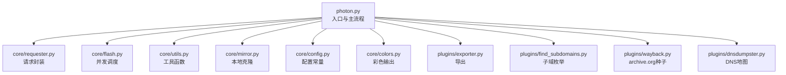
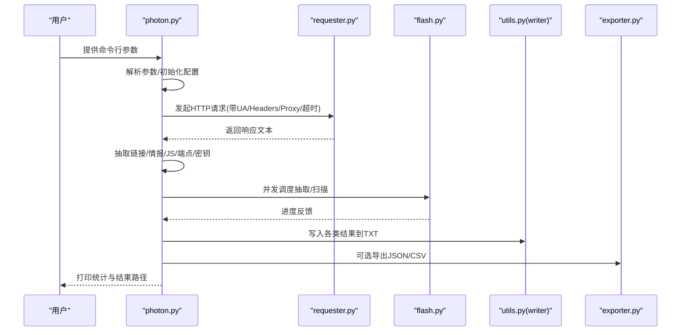
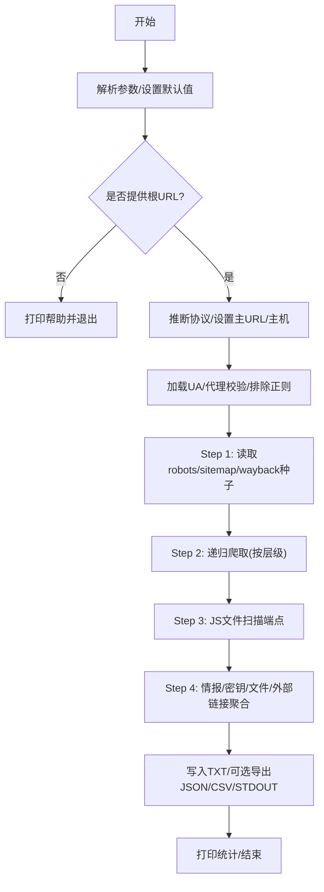
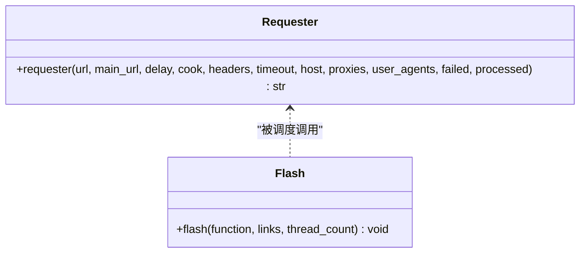
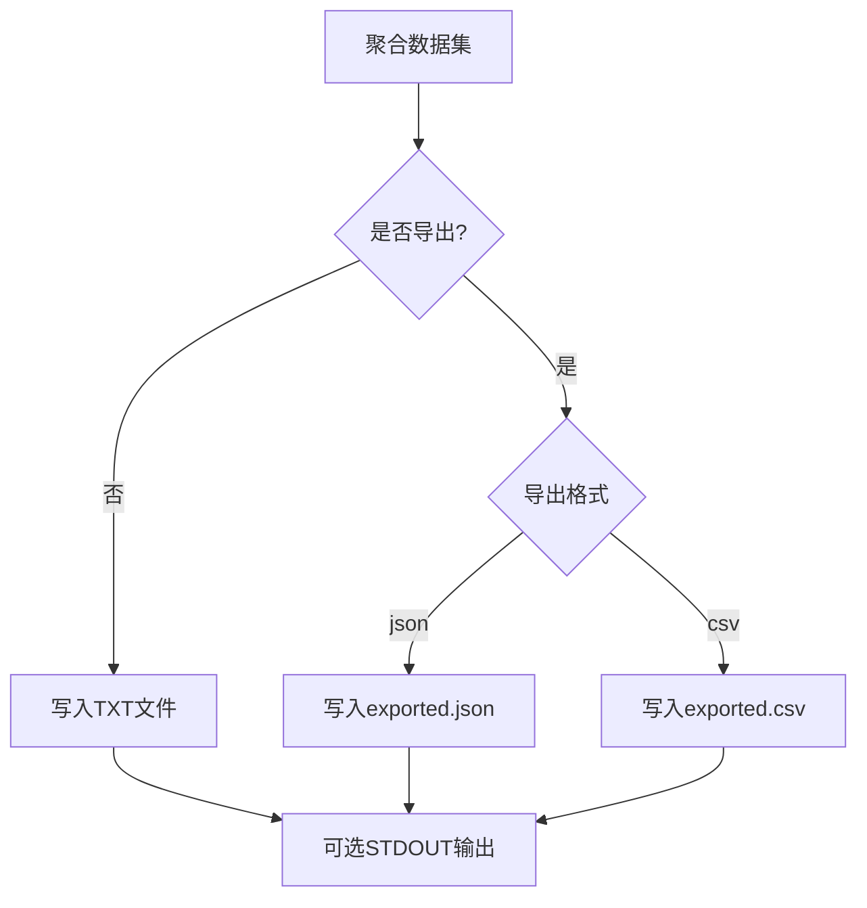
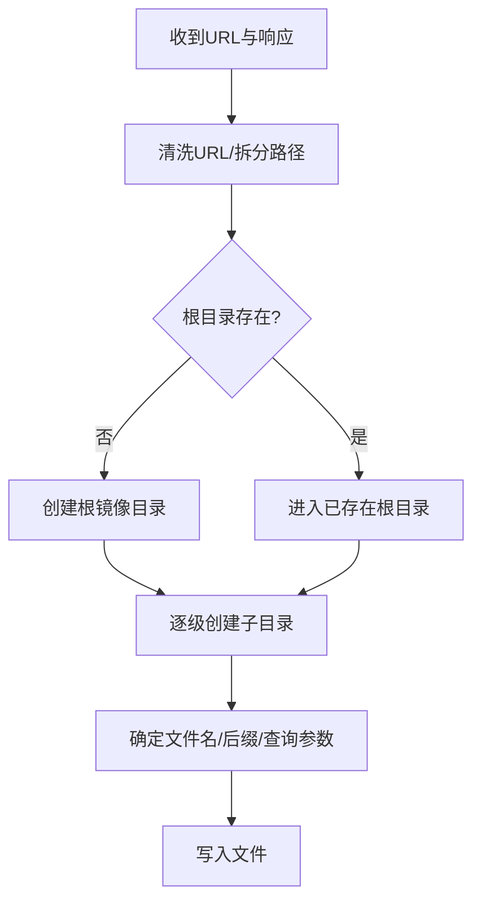
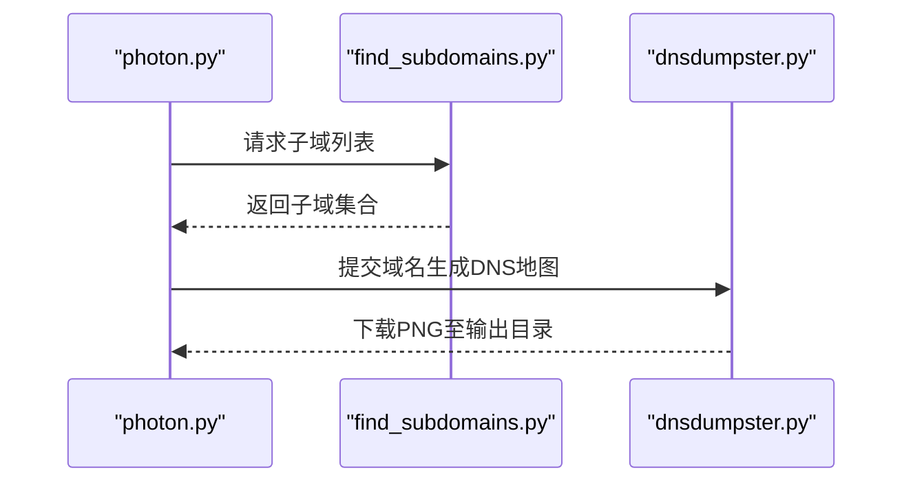
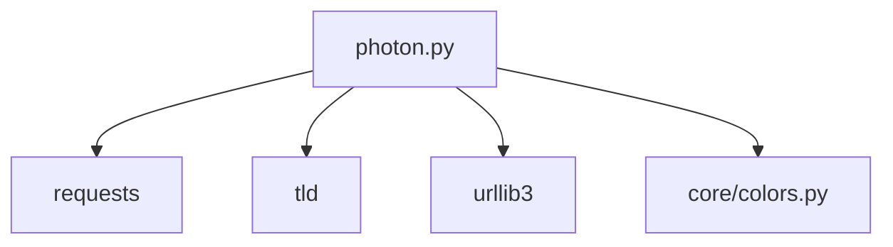

# 使用示例

<cite>
**本文引用的文件**
- [photon.py](file://photon.py)
- [README.md](file://README.md)
- [requirements.txt](file://requirements.txt)
- [core/requester.py](file://core/requester.py)
- [core/utils.py](file://core/utils.py)
- [core/flash.py](file://core/flash.py)
- [core/mirror.py](file://core/mirror.py)
- [core/config.py](file://core/config.py)
- [core/colors.py](file://core/colors.py)
- [plugins/exporter.py](file://plugins/exporter.py)
- [plugins/find_subdomains.py](file://plugins/find_subdomains.py)
- [plugins/wayback.py](file://plugins/wayback.py)
- [plugins/dnsdumpster.py](file://plugins/dnsdumpster.py)
</cite>

## 目录
1. [简介](#简介)
2. [项目结构](#项目结构)
3. [核心组件](#核心组件)
4. [架构总览](#架构总览)
5. [详细组件分析](#详细组件分析)
6. [依赖分析](#依赖分析)
7. [性能考虑](#性能考虑)
8. [故障排除指南](#故障排除指南)
9. [结论](#结论)
10. [附录：命令行使用示例](#附录命令行使用示例)

## 简介
本文件面向不同经验水平的用户，提供从入门到进阶的命令行使用示例与最佳实践，涵盖基础爬取、批量操作、特殊配置、参数组合效果与适用场景。内容基于项目源码与官方说明文档整理，帮助您快速上手并高效完成信息收集任务。

## 项目结构
- 入口脚本负责解析命令行参数、初始化配置、调度爬取流程与结果导出。
- 核心模块提供请求封装、并发调度、数据写入、代理校验、熵值检测等能力。
- 插件模块扩展子域名枚举、快照生成、归档种子、导出格式等功能。

图表来源
- [photon.py:57-99](file://photon.py#L57-L99)
- [core/requester.py:11-73](file://core/requester.py#L11-L73)
- [core/flash.py:6-18](file://core/flash.py#L6-L18)
- [core/utils.py:78-87](file://core/utils.py#L78-L87)
- [core/mirror.py:4-40](file://core/mirror.py#L4-L40)
- [core/config.py:3-28](file://core/config.py#L3-L28)
- [core/colors.py:4-19](file://core/colors.py#L4-L19)
- [plugins/exporter.py:6-25](file://plugins/exporter.py#L6-L25)
- [plugins/find_subdomains.py:7-15](file://plugins/find_subdomains.py#L7-L15)
- [plugins/wayback.py:8-23](file://plugins/wayback.py#L8-L23)
- [plugins/dnsdumpster.py:7-23](file://plugins/dnsdumpster.py#L7-L23)

章节来源
- [photon.py:108-117](file://photon.py#L108-L117)
- [README.md:36-67](file://README.md#L36-L67)

## 核心组件
- 命令行参数解析：支持目标URL、Cookie、正则、导出格式、输出目录、层级、线程数、延迟、详细输出、额外种子、标准输出、自定义UA、排除正则、超时、代理、开关类选项（克隆、头、DNS、密钥、更新、仅URL、wayback）等。
- 请求器：统一处理会话、随机UA、Cookie、Headers、超时、代理轮换、重定向限制、响应类型过滤。
- 并发调度：基于线程池执行抽取与扫描任务，打印进度。
- 工具函数：正则提取、链接过滤、写入文件、计时统计、熵值计算、头部解析、顶级域名提取、代理格式校验与可用性测试、Luhn校验等。
- 结果写入：按类别保存为文本文件；可选导出JSON或CSV；可将指定类别输出到标准输出。
- 本地克隆：根据URL结构在本地重建目录与页面文件。
- 插件生态：子域枚举、DNS地图、Wayback种子、导出。

章节来源
- [photon.py:57-99](file://photon.py#L57-L99)
- [core/requester.py:11-73](file://core/requester.py#L11-L73)
- [core/flash.py:6-18](file://core/flash.py#L6-L18)
- [core/utils.py:15-87](file://core/utils.py#L15-L87)
- [core/utils.py:101-137](file://core/utils.py#L101-L137)
- [core/utils.py:164-180](file://core/utils.py#L164-L180)
- [core/utils.py:197-207](file://core/utils.py#L197-L207)
- [core/mirror.py:4-40](file://core/mirror.py#L4-L40)
- [plugins/exporter.py:6-25](file://plugins/exporter.py#L6-L25)
- [plugins/find_subdomains.py:7-15](file://plugins/find_subdomains.py#L7-L15)
- [plugins/wayback.py:8-23](file://plugins/wayback.py#L8-L23)
- [plugins/dnsdumpster.py:7-23](file://plugins/dnsdumpster.py#L7-L23)

## 架构总览
下图展示了从命令行输入到数据产出的整体流程，包括参数解析、请求、抽取、并发调度、结果写入与导出。

图表来源
- [photon.py:241-288](file://photon.py#L241-L288)
- [photon.py:327-342](file://photon.py#L327-L342)
- [photon.py:380-421](file://photon.py#L380-L421)
- [core/requester.py:11-73](file://core/requester.py#L11-L73)
- [core/flash.py:6-18](file://core/flash.py#L6-L18)
- [core/utils.py:78-87](file://core/utils.py#L78-L87)
- [plugins/exporter.py:6-25](file://plugins/exporter.py#L6-L25)

## 详细组件分析

### 命令行参数与控制流
- 参数解析与默认值：如层级、线程数、延迟、超时、仅URL模式、排除正则、种子、导出格式、输出目录、标准输出选择等。
- 开关行为：如克隆、头交互、DNS枚举、密钥提取、更新、wayback种子。
- 控制流要点：先处理更新，再判断是否提供根URL；随后进行协议推断、主机解析、UA加载、代理校验、排除规则应用、递归爬取、JS端点扫描、情报聚合、统计输出与结果写入。

图表来源
- [photon.py:108-117](file://photon.py#L108-L117)
- [photon.py:177-184](file://photon.py#L177-L184)
- [photon.py:309-342](file://photon.py#L309-L342)
- [photon.py:377-421](file://photon.py#L377-L421)

章节来源
- [photon.py:57-99](file://photon.py#L57-L99)
- [photon.py:108-117](file://photon.py#L108-L117)
- [photon.py:309-342](file://photon.py#L309-L342)

### 请求器与并发调度
- 请求器职责：统一会话、随机UA、可选Cookie与Headers、超时、代理轮换、重定向限制、响应类型过滤。
- 并发调度：线程池提交任务，实时打印进度，避免阻塞。

图表来源
- [core/requester.py:11-73](file://core/requester.py#L11-L73)
- [core/flash.py:6-18](file://core/flash.py#L6-L18)

章节来源
- [core/requester.py:11-73](file://core/requester.py#L11-L73)
- [core/flash.py:6-18](file://core/flash.py#L6-L18)

### 数据写入与导出
- 写入：按类别生成TXT文件；导出：支持JSON与CSV两种格式；STDOUT：将指定类别输出到标准输出。
- 导出格式：JSON以字典形式保存所有类别列表；CSV每行包含类别名与对应值列表。

图表来源
- [photon.py:380-421](file://photon.py#L380-L421)
- [core/utils.py:78-87](file://core/utils.py#L78-L87)
- [plugins/exporter.py:6-25](file://plugins/exporter.py#L6-L25)

章节来源
- [core/utils.py:78-87](file://core/utils.py#L78-L87)
- [plugins/exporter.py:6-25](file://plugins/exporter.py#L6-L25)

### 本地克隆镜像
- 功能：根据URL重建目录结构与页面文件，便于离线分析。
- 行为：去除协议与尾部斜杠，按层级创建目录，命名index.html或保留原名，处理查询参数。

图表来源
- [core/mirror.py:4-40](file://core/mirror.py#L4-L40)

章节来源
- [core/mirror.py:4-40](file://core/mirror.py#L4-L40)

### 子域枚举与DNS地图
- 子域枚举：调用第三方接口抓取子域列表。
- DNS地图：生成并下载PNG图片到输出目录。

图表来源
- [photon.py:405-415](file://photon.py#L405-L415)
- [plugins/find_subdomains.py:7-15](file://plugins/find_subdomains.py#L7-L15)
- [plugins/dnsdumpster.py:7-23](file://plugins/dnsdumpster.py#L7-L23)

章节来源
- [photon.py:405-415](file://photon.py#L405-L415)
- [plugins/find_subdomains.py:7-15](file://plugins/find_subdomains.py#L7-L15)
- [plugins/dnsdumpster.py:7-23](file://plugins/dnsdumpster.py#L7-L23)

## 依赖分析
- 外部依赖：requests、requests[socks]、urllib3、tld。
- 运行平台：要求Python 3.2+；Windows/Mac/iOS平台禁用彩色输出。

图表来源
- [requirements.txt:1-4](file://requirements.txt#L1-L4)
- [core/colors.py:4-19](file://core/colors.py#L4-L19)

章节来源
- [requirements.txt:1-4](file://requirements.txt#L1-L4)
- [core/colors.py:4-19](file://core/colors.py#L4-L19)

## 性能考虑
- 线程数与延迟：通过线程数与请求延迟平衡吞吐与对目标服务器的压力。
- 超时设置：合理设置超时避免长时间阻塞。
- 代理轮换：启用代理并进行可用性校验，提升稳定性与匿名性。
- 仅URL模式：关闭情报/密钥/JS端点扫描可显著降低CPU与I/O开销。
- 排除正则：提前过滤无关URL，减少无效请求与后续处理。
- 并发策略：线程池大小应结合CPU与网络带宽调整，避免过载。

## 故障排除指南
- 无法启动：确认Python版本满足要求。
- 代理无效：检查代理格式与连通性，程序会自动校验并提示不可用代理。
- 无结果或结果极少：检查排除正则、仅URL模式、层级设置、种子URL是否合理。
- 导出失败：确认导出格式参数正确且有数据可导出。
- DNS/DNS地图：第三方服务可能受限，可尝试更换网络或稍后再试。
- STDOUT输出：确保指定的类别名称存在于数据集中。

章节来源
- [photon.py:126-140](file://photon.py#L126-L140)
- [core/utils.py:164-180](file://core/utils.py#L164-L180)
- [core/utils.py:197-207](file://core/utils.py#L197-L207)
- [photon.py:416-421](file://photon.py#L416-L421)

## 结论
通过合理的参数组合与插件配合，Photon可在保证效率的同时覆盖多种信息收集场景。建议从基础示例起步，逐步引入代理、延迟、排除规则与导出功能，最终实现稳定高效的自动化采集流程。

## 附录：命令行使用示例
以下示例均来自源码与官方文档，展示不同参数组合的效果与适用场景。请根据目标网站特性与合规要求谨慎使用。

- 基础爬取
  - 示例：对单个站点进行轻量爬取，输出到默认目录
  - 关键参数：-u/--url
  - 适用场景：初次验证目标与范围
  - 章节来源
    - [photon.py:108-117](file://photon.py#L108-L117)

- 指定输出目录
  - 示例：将结果保存到自定义目录
  - 关键参数：-o/--output
  - 适用场景：多目标批量执行时区分结果
  - 章节来源
    - [photon.py:192-193](file://photon.py#L192-L193)

- 设置层级与线程
  - 示例：增加爬取深度与并发线程
  - 关键参数：-l/--level, -t/--threads
  - 适用场景：中大型站点或需要更快速度
  - 章节来源
    - [photon.py:64-67](file://photon.py#L64-L67)
    - [photon.py:142-143](file://photon.py#L142-L143)

- 添加延迟与超时
  - 示例：降低请求频率与延长超时
  - 关键参数：-d/--delay, --timeout
  - 适用场景：反爬严格或网络不稳定
  - 章节来源
    - [photon.py:68-70](file://photon.py#L68-L70)
    - [core/requester.py:17-18](file://core/requester.py#L17-L18)

- 自定义User-Agent与Cookie
  - 示例：使用自定义UA与Cookie
  - 关键参数：--user-agent, -c/--cookie
  - 适用场景：登录态或规避识别
  - 章节来源
    - [photon.py:199-203](file://photon.py#L199-L203)
    - [core/requester.py:25-26](file://core/requester.py#L25-L26)

- 仅提取URL
  - 示例：仅提取URL，不进行情报/密钥/JS端点扫描
  - 关键参数：--only-urls
  - 适用场景：快速抓取链接清单
  - 章节来源
    - [photon.py:144-144](file://photon.py#L144-L144)

- 排除特定URL
  - 示例：排除匹配正则的URL
  - 关键参数：--exclude
  - 适用场景：过滤广告、静态资源或无关页面
  - 章节来源
    - [photon.py:77-78](file://photon.py#L77-L78)
    - [core/utils.py:51-75](file://core/utils.py#L51-L75)

- 额外种子与Wayback种子
  - 示例：添加额外种子与使用archive.org种子
  - 关键参数：-s/--seeds, --wayback
  - 适用场景：扩大初始种子覆盖面
  - 章节来源
    - [photon.py:72-73](file://photon.py#L72-L73)
    - [photon.py:97-98](file://photon.py#L97-L98)
    - [plugins/wayback.py:8-23](file://plugins/wayback.py#L8-L23)

- 代理与头
  - 示例：使用代理与交互式头
  - 关键参数：-p/--proxy, --headers
  - 适用场景：匿名访问或模拟真实浏览器
  - 章节来源
    - [photon.py:81-82](file://photon.py#L81-L82)
    - [photon.py:87-88](file://photon.py#L87-L88)
    - [core/utils.py:164-180](file://core/utils.py#L164-L180)
    - [core/utils.py:124-137](file://core/utils.py#L124-L137)

- 密钥提取与自定义正则
  - 示例：提取高熵字符串与自定义正则
  - 关键参数：--keys, -r/--regex
  - 适用场景：敏感信息发现
  - 章节来源
    - [photon.py:91-92](file://photon.py#L91-L92)
    - [photon.py:280-287](file://photon.py#L280-L287)
    - [core/utils.py:15-24](file://core/utils.py#L15-L24)

- 本地克隆与导出
  - 示例：本地克隆与导出JSON/CSV
  - 关键参数：--clone, -e/--export
  - 适用场景：离线分析与报告生成
  - 章节来源
    - [photon.py:85-86](file://photon.py#L85-L86)
    - [photon.py:416-421](file://photon.py#L416-L421)
    - [plugins/exporter.py:6-25](file://plugins/exporter.py#L6-L25)

- 子域枚举与DNS地图
  - 示例：枚举子域并生成DNS地图
  - 关键参数：--dns
  - 适用场景：网络测绘与资产发现
  - 章节来源
    - [photon.py:89-90](file://photon.py#L89-L90)
    - [photon.py:405-415](file://photon.py#L405-L415)
    - [plugins/find_subdomains.py:7-15](file://plugins/find_subdomains.py#L7-L15)
    - [plugins/dnsdumpster.py:7-23](file://plugins/dnsdumpster.py#L7-L23)

- 更新工具
  - 示例：检查并安装更新
  - 关键参数：--update
  - 适用场景：保持工具最新
  - 章节来源
    - [photon.py:93-94](file://photon.py#L93-L94)
    - [README.md:85-91](file://README.md#L85-L91)

- 输出到标准输出
  - 示例：将某类别输出到标准输出
  - 关键参数：--stdout
  - 适用场景：与其他工具链集成
  - 章节来源
    - [photon.py:74-74](file://photon.py#L74-L74)
    - [photon.py:423-426](file://photon.py#L423-L426)

- 组合参数示例（实战思路）
  - 示例A：中型站点，适度并发与延迟，使用代理与UA，导出JSON
    - 参数组合：-u -t -d -p --user-agent -e json
    - 适用场景：平衡速度与稳定性
  - 示例B：大型站点，高层级+高并发，设置超时与排除正则
    - 参数组合：-u -l -t --timeout --exclude
    - 适用场景：扩大覆盖面同时控制资源占用
  - 示例C：仅URL清单，快速抓取
    - 参数组合：-u --only-urls
    - 适用场景：预处理或二次筛选
  - 示例D：离线分析，本地克隆+导出CSV
    - 参数组合：-u --clone -e csv
    - 适用场景：离线审计与报告
  - 示例E：子域与DNS地图，扩大资产边界
    - 参数组合：-u --dns
    - 适用场景：网络测绘与情报收集

章节来源
- [photon.py:57-99](file://photon.py#L57-L99)
- [photon.py:142-143](file://photon.py#L142-L143)
- [photon.py:199-203](file://photon.py#L199-L203)
- [photon.py:416-421](file://photon.py#L416-L421)
- [plugins/exporter.py:6-25](file://plugins/exporter.py#L6-L25)