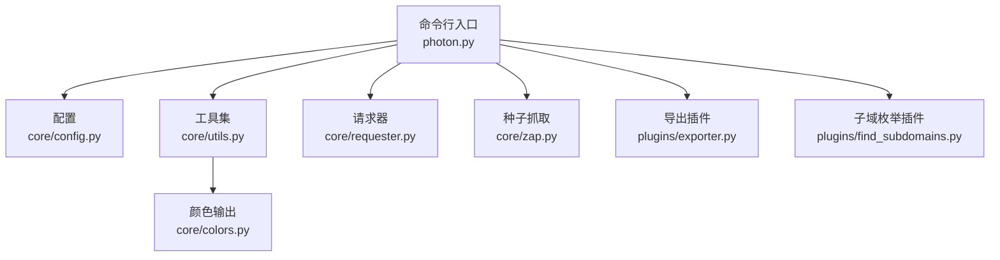
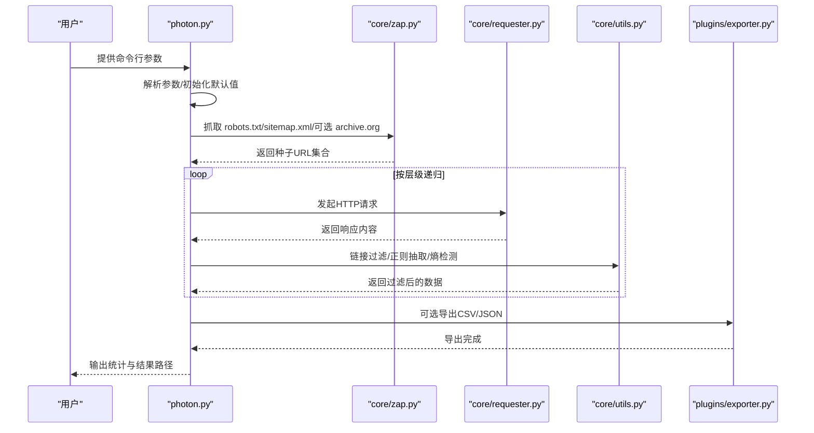

# 命令行接口

<cite>
**本文引用的文件列表**
- [photon.py](file://photon.py)
- [README.md](file://README.md)
- [requirements.txt](file://requirements.txt)
- [core/config.py](file://core/config.py)
- [core/utils.py](file://core/utils.py)
- [core/requester.py](file://core/requester.py)
- [core/zap.py](file://core/zap.py)
- [core/colors.py](file://core/colors.py)
- [plugins/exporter.py](file://plugins/exporter.py)
- [plugins/find_subdomains.py](file://plugins/find_subdomains.py)
</cite>

## 目录
1. [简介](#简介)
2. [项目结构与入口](#项目结构与入口)
3. [核心组件与参数总览](#核心组件与参数总览)
4. [架构概览](#架构概览)
5. [详细参数说明与用法](#详细参数说明与用法)
6. [依赖关系与冲突处理](#依赖关系与冲突处理)
7. [性能与并发控制](#性能与并发控制)
8. [使用示例与场景](#使用示例与场景)
9. [故障排查与常见问题](#故障排查与常见问题)
10. [结论](#结论)

## 简介
本文件为 Photon 的命令行接口参考文档，面向安全研究人员与渗透测试工程师，系统性说明所有命令行参数、选项与标志位，按功能分组讲解其使用方式，并提供丰富的实战示例、参数依赖与冲突处理建议，以及高级配置与专家级技巧，帮助用户高效、稳定地完成目标爬取与信息提取任务。

## 项目结构与入口
- 入口脚本：photon.py 负责解析命令行参数、初始化全局变量、执行爬取流程与结果导出。
- 核心模块：
  - core/config.py：全局配置（如敏感域名白名单、文件类型黑名单）。
  - core/utils.py：通用工具函数（正则抽取、链接过滤、代理校验、熵值检测、时间统计、头解析等）。
  - core/requester.py：HTTP 请求封装（会话、超时、代理、随机 UA、重定向限制）。
  - core/zap.py：从 robots.txt 与 sitemap.xml 抓取种子 URL，并可选从 archive.org 获取历史 URL。
  - core/colors.py：跨平台颜色输出控制。
  - plugins/exporter.py：将结果导出为 CSV 或 JSON。
  - plugins/find_subdomains.py：枚举子域名（依赖外部服务）。
- 依赖：requests、urllib3、tld、argparse（requirements.txt 中声明）。

图表来源
- [photon.py:57-99](file://photon.py#L57-L99)
- [core/config.py:1-28](file://core/config.py#L1-L28)
- [core/utils.py:1-207](file://core/utils.py#L1-L207)
- [core/requester.py:1-73](file://core/requester.py#L1-L73)
- [core/zap.py:1-58](file://core/zap.py#L1-L58)
- [plugins/exporter.py:1-25](file://plugins/exporter.py#L1-L25)
- [plugins/find_subdomains.py:1-15](file://plugins/find_subdomains.py#L1-L15)

章节来源
- [photon.py:1-426](file://photon.py#L1-L426)
- [requirements.txt:1-4](file://requirements.txt#L1-L4)

## 核心组件与参数总览
- 参数解析与主流程在入口脚本中完成，随后调用各模块执行具体功能。
- 关键参数分为“选项”和“开关”两类：
  - 选项：带值的参数（如 -u/--url、-o/--output、--timeout 等）
  - 开关：布尔型标志（如 --dns、--keys、--clone 等）

章节来源
- [photon.py:57-99](file://photon.py#L57-L99)

## 架构概览
下图展示了命令行参数如何驱动主流程：解析参数 -> 初始化配置 -> 抓取种子 -> 爬取与提取 -> 结果保存/导出。

图表来源
- [photon.py:308-342](file://photon.py#L308-L342)
- [core/zap.py:10-58](file://core/zap.py#L10-L58)
- [core/requester.py:11-73](file://core/requester.py#L11-L73)
- [core/utils.py:15-76](file://core/utils.py#L15-L76)
- [plugins/exporter.py:6-25](file://plugins/exporter.py#L6-L25)

## 详细参数说明与用法

### 目标设置类
- -u, --url
  - 类型：字符串
  - 必需：是（若未提供，程序打印帮助并退出）
  - 行为：作为根 URL；末尾斜杠会被自动去除；若未显式包含协议，将尝试 https，否则 http
  - 示例路径：[photon.py:108-116](file://photon.py#L108-L116)，[photon.py:177-184](file://photon.py#L177-L184)
- -c, --cookie
  - 类型：字符串
  - 行为：传递给请求器，用于登录态或访问受限资源
  - 示例路径：[photon.py:123](file://photon.py#L123)，[core/requester.py:25](file://core/requester.py#L25)
- -s, --seeds
  - 类型：字符串列表（nargs="+")
  - 行为：额外种子 URL，提升初始覆盖面
  - 示例路径：[photon.py:72-73](file://photon.py#L72-L73)，[photon.py:160](file://photon.py#L160)

章节来源
- [photon.py:59-73](file://photon.py#L59-L73)
- [photon.py:108-116](file://photon.py#L108-L116)
- [photon.py:177-184](file://photon.py#L177-L184)
- [core/requester.py:25](file://core/requester.py#L25)

### 深度与并发控制类
- -l, --level
  - 类型：整数
  - 默认：2
  - 行为：递归爬取层级数
  - 示例路径：[photon.py:64-65](file://photon.py#L64-L65)，[photon.py:315](file://photon.py#L315)
- -t, --threads
  - 类型：整数
  - 默认：2
  - 行为：并发线程数
  - 示例路径：[photon.py:66-67](file://photon.py#L66-L67)，[photon.py:327](file://photon.py#L327)
- -d, --delay
  - 类型：浮点数
  - 默认：0
  - 行为：请求间延迟秒数，降低被封风险
  - 示例路径：[photon.py:68-69](file://photon.py#L68-L69)，[core/requester.py:33](file://core/requester.py#L33)

章节来源
- [photon.py:64-69](file://photon.py#L64-L69)
- [core/requester.py:33](file://core/requester.py#L33)

### 过滤与正则类
- --exclude
  - 类型：正则表达式字符串
  - 行为：排除匹配的 URL；在每轮爬取前应用
  - 示例路径：[photon.py:77-78](file://photon.py#L77-L78)，[photon.py:312](file://photon.py#L312)，[core/utils.py:51-75](file://core/utils.py#L51-L75)
- -r, --regex
  - 类型：正则表达式字符串
  - 行为：自定义正则抽取，配合 --only-urls 使用更佳
  - 示例路径：[photon.py:61-62](file://photon.py#L61-L62)，[photon.py:280-281](file://photon.py#L280-L281)，[core/utils.py:15-24](file://core/utils.py#L15-L24)

章节来源
- [photon.py:61-78](file://photon.py#L61-L78)
- [core/utils.py:51-75](file://core/utils.py#L51-L75)

### 输出与格式化类
- -o, --output
  - 类型：目录路径
  - 默认：目标主机名
  - 行为：结果保存目录
  - 示例路径：[photon.py:63](file://photon.py#L63)，[photon.py:192](file://photon.py#L192)，[core/utils.py:78-87](file://core/utils.py#L78-L87)
- -e, --export
  - 取值：csv | json
  - 行为：导出结果为 CSV 或 JSON
  - 示例路径：[photon.py:62](file://photon.py#L62)，[photon.py:416-419](file://photon.py#L416-L419)，[plugins/exporter.py:6-25](file://plugins/exporter.py#L6-L25)
- --stdout
  - 类型：数据集名称（files/intel/robots/custom/failed/internal/scripts/external/fuzzable/endpoints/keys）
  - 行为：将指定数据集写入标准输出
  - 示例路径：[photon.py:74](file://photon.py#L74)，[photon.py:423-425](file://photon.py#L423-L425)

章节来源
- [photon.py:62-63](file://photon.py#L62-L63)
- [photon.py:74](file://photon.py#L74)
- [core/utils.py:78-87](file://core/utils.py#L78-L87)
- [plugins/exporter.py:6-25](file://plugins/exporter.py#L6-L25)

### 代理与网络类
- -p, --proxy
  - 类型：IP:PORT 或 DOMAIN:PORT，支持 socks5/http 协议
  - 行为：单个代理或从文件读取多代理；启动时会逐一校验可用性
  - 校验逻辑：core/utils.py 中的 proxy_type 与 is_good_proxy
  - 示例路径：[photon.py:81-82](file://photon.py#L81-L82)，[core/utils.py:164-180](file://core/utils.py#L164-L180)，[core/utils.py:197-206](file://core/utils.py#L197-L206)

章节来源
- [photon.py:81-82](file://photon.py#L81-L82)
- [core/utils.py:164-180](file://core/utils.py#L164-L180)
- [core/utils.py:197-206](file://core/utils.py#L197-L206)

### 头部与UA类
- --headers
  - 行为：交互式输入请求头（键值对），由 core/utils.py 的 extract_headers 解析
  - 示例路径：[photon.py:87-88](file://photon.py#L87-L88)，[photon.py:168-174](file://photon.py#L168-L174)，[core/utils.py:124-137](file://core/utils.py#L124-L137)
- --user-agent
  - 类型：UA 字符串或逗号分隔的多个 UA
  - 默认：从 core/user-agents.txt 读取
  - 示例路径：[photon.py:75-76](file://photon.py#L75-L76)，[photon.py:199-203](file://photon.py#L199-L203)

章节来源
- [photon.py:75-76](file://photon.py#L75-L76)
- [photon.py:87-88](file://photon.py#L87-L88)
- [core/utils.py:124-137](file://core/utils.py#L124-L137)

### 超时与详细输出类
- --timeout
  - 类型：浮点数
  - 默认：6 秒
  - 行为：单次请求超时
  - 示例路径：[photon.py:79-80](file://photon.py#L79-L80)，[core/requester.py:17](file://core/requester.py#L17)，[core/requester.py:52](file://core/requester.py#L52)

章节来源
- [photon.py:79-80](file://photon.py#L79-L80)
- [core/requester.py:17](file://core/requester.py#L17)
- [core/requester.py:52](file://core/requester.py#L52)

### 开关类（功能开关）
- --clone
  - 行为：本地镜像网站（保存到输出目录）
  - 示例路径：[photon.py:85](file://photon.py#L85)，[photon.py:242-243](file://photon.py#L242-L243)
- --dns
  - 行为：枚举子域名并生成 DNS 地图
  - 示例路径：[photon.py:89](file://photon.py#L89)，[photon.py:405-414](file://photon.py#L405-L414)，[plugins/find_subdomains.py:7-14](file://plugins/find_subdomains.py#L7-L14)
- --keys
  - 行为：提取高熵字符串（密钥/令牌等）
  - 示例路径：[photon.py:91](file://photon.py#L91)，[photon.py:282-287](file://photon.py#L282-L287)
- --update
  - 行为：更新 Photon（调用 core/updater，入口处处理）
  - 示例路径：[photon.py:93](file://photon.py#L93)，[photon.py:103-105](file://photon.py#L103-L105)
- --only-urls
  - 行为：仅提取 URL，跳过情报与 JS 端点扫描
  - 示例路径：[photon.py:95](file://photon.py#L95)，[photon.py:277-279](file://photon.py#L277-L279)
- --wayback
  - 行为：从 archive.org 获取历史 URL 作为种子
  - 示例路径：[photon.py:97](file://photon.py#L97)，[core/zap.py:12-22](file://core/zap.py#L12-L22)

章节来源
- [photon.py:85-98](file://photon.py#L85-L98)
- [core/zap.py:12-22](file://core/zap.py#L12-L22)
- [plugins/find_subdomains.py:7-14](file://plugins/find_subdomains.py#L7-L14)

## 依赖关系与冲突处理
- 必需参数
  - -u/--url 是必需的；未提供时打印帮助并退出。
  - 示例路径：[photon.py:108-116](file://photon.py#L108-L116)
- 互斥与冲突
  - --clone 与 --only-urls 同时启用时，--clone 仍会生效（镜像保存），但 --only-urls 会跳过情报与端点扫描。
  - --dns 与 --wayback 可叠加使用，均不影响其他参数。
  - --headers 与 --user-agent 可同时使用，但注意请求头中的 User-Agent 优先级与 UA 列表的随机选择。
- 代理冲突
  - --proxy 支持单个或文件列表；若全部不可用，程序会提示并退出。
  - 示例路径：[photon.py:126-140](file://photon.py#L126-L140)，[core/utils.py:164-180](file://core/utils.py#L164-L180)，[core/utils.py:197-206](file://core/utils.py#L197-L206)
- 超时与延迟
  - --timeout 与 -d 组合影响整体吞吐与稳定性；过低的超时可能导致大量失败。
  - 示例路径：[photon.py:121-122](file://photon.py#L121-L122)，[core/requester.py:52](file://core/requester.py#L52)

章节来源
- [photon.py:108-116](file://photon.py#L108-L116)
- [photon.py:126-140](file://photon.py#L126-L140)
- [core/utils.py:164-180](file://core/utils.py#L164-L180)
- [core/utils.py:197-206](file://core/utils.py#L197-L206)

## 性能与并发控制
- 并发与延迟
  - -t 控制线程数，-d 控制请求间隔；二者共同决定吞吐量与稳定性。
  - 示例路径：[photon.py:66-67](file://photon.py#L66-L67)，[photon.py:68-69](file://photon.py#L68-L69)，[photon.py:327](file://photon.py#L327)
- 超时与重定向
  - --timeout 控制单次请求超时；请求器内部限制最大重定向次数，避免长时间占用。
  - 示例路径：[photon.py:79-80](file://photon.py#L79-L80)，[core/requester.py:17](file://core/requester.py#L17)，[core/requester.py:9](file://core/requester.py#L9)
- 代理与会话
  - 代理列表随机选择，结合会话复用与 gzip 接收，减少带宽与连接开销。
  - 示例路径：[core/requester.py:55](file://core/requester.py#L55)

章节来源
- [photon.py:66-69](file://photon.py#L66-L69)
- [core/requester.py:9](file://core/requester.py#L9)
- [core/requester.py:17](file://core/requester.py#L17)
- [core/requester.py:55](file://core/requester.py#L55)

## 使用示例与场景
以下示例以“路径引用”的形式给出，便于定位实现细节与行为验证。

- 基础目标爬取
  - 示例：photon.py -u example.com -o ./results
  - 说明：指定目标与输出目录，使用默认层级与线程。
  - 参考路径：[photon.py:108-116](file://photon.py#L108-L116)，[photon.py:192](file://photon.py#L192)
- 深度与并发调整
  - 示例：photon.py -u example.com -l 3 -t 5 -d 0.5
  - 说明：增加层级、线程与请求间隔，降低被封概率。
  - 参考路径：[photon.py:64-67](file://photon.py#L64-L67)，[photon.py:68-69](file://photon.py#L68-L69)
- 排除规则与自定义正则
  - 示例：photon.py -u example.com --exclude "(?i)(logout|admin)" -r "(?i)password=\w+" --only-urls
  - 说明：排除管理路径，自定义抽取密码参数，仅提取 URL。
  - 参考路径：[photon.py:77-78](file://photon.py#L77-L78)，[photon.py:61-62](file://photon.py#L61-L62)，[photon.py:95](file://photon.py#L95)
- 代理与头部
  - 示例：photon.py -u example.com -p 127.0.0.1:8080 --headers --user-agent "CustomUA1,CustomUA2"
  - 说明：使用代理与自定义 UA；--headers 交互式输入头。
  - 参考路径：[photon.py:81-82](file://photon.py#L81-L82)，[photon.py:87-88](file://photon.py#L87-L88)，[photon.py:75-76](file://photon.py#L75-L76)
- 导出与标准输出
  - 示例：photon.py -u example.com -e json -o ./results
  - 示例：photon.py -u example.com --stdout internal
  - 参考路径：[photon.py:62](file://photon.py#L62)，[photon.py:416-419](file://photon.py#L416-L419)，[photon.py:74](file://photon.py#L74)，[photon.py:423-425](file://photon.py#L423-L425)
- 子域枚举与历史种子
  - 示例：photon.py -u example.com --dns --wayback -o ./results
  - 参考路径：[photon.py:89](file://photon.py#L89)，[photon.py:97](file://photon.py#L97)，[core/zap.py:12-22](file://core/zap.py#L12-L22)，[plugins/find_subdomains.py:7-14](file://plugins/find_subdomains.py#L7-L14)

章节来源
- [photon.py:61-78](file://photon.py#L61-L78)
- [photon.py:81-82](file://photon.py#L81-L82)
- [photon.py:87-88](file://photon.py#L87-L88)
- [photon.py:89](file://photon.py#L89)
- [photon.py:95](file://photon.py#L95)
- [photon.py:97](file://photon.py#L97)
- [photon.py:108-116](file://photon.py#L108-L116)
- [photon.py:192](file://photon.py#L192)
- [core/zap.py:12-22](file://core/zap.py#L12-L22)
- [plugins/exporter.py:6-25](file://plugins/exporter.py#L6-L25)
- [plugins/find_subdomains.py:7-14](file://plugins/find_subdomains.py#L7-L14)

## 故障排查与常见问题
- 未提供 -u/--url
  - 现象：打印帮助并退出
  - 参考路径：[photon.py:114-116](file://photon.py#L114-L116)
- 代理不可用
  - 现象：逐个校验失败后退出
  - 参考路径：[photon.py:126-140](file://photon.py#L126-L140)，[core/utils.py:197-206](file://core/utils.py#L197-L206)
- 超时与重定向过多
  - 现象：请求被判定为失败或提前终止
  - 参考路径：[core/requester.py:9](file://core/requester.py#L9)，[core/requester.py:57-58](file://core/requester.py#L57-L58)
- 输出目录权限不足
  - 现象：无法创建或写入目录
  - 参考路径：[photon.py:377-379](file://photon.py#L377-L379)，[core/utils.py:78-87](file://core/utils.py#L78-L87)
- 密钥提取误报
  - 现象：低熵字符串被误判为密钥
  - 参考路径：[photon.py:282-287](file://photon.py#L282-L287)，[core/utils.py:101-109](file://core/utils.py#L101-L109)

章节来源
- [photon.py:114-116](file://photon.py#L114-L116)
- [photon.py:126-140](file://photon.py#L126-L140)
- [core/requester.py:9](file://core/requester.py#L9)
- [core/requester.py:57-58](file://core/requester.py#L57-L58)
- [photon.py:377-379](file://photon.py#L377-L379)
- [core/utils.py:101-109](file://core/utils.py#L101-L109)

## 结论
本文档系统梳理了 Photon 的命令行接口，覆盖参数分类、行为细节、依赖与冲突、性能调优与实战示例。建议在生产环境中结合代理、延迟与超时策略，合理设置层级与线程，配合 --exclude 与 --regex 实现精准提取，并通过 --export 与 --stdout 满足不同输出需求。对于高风险目标，优先使用 --only-urls 与 --headers，谨慎启用 --clone 与 --keys，确保合规与稳定。