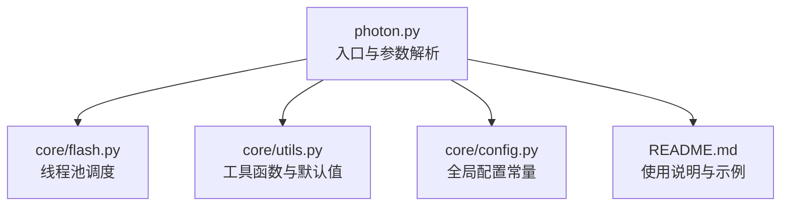
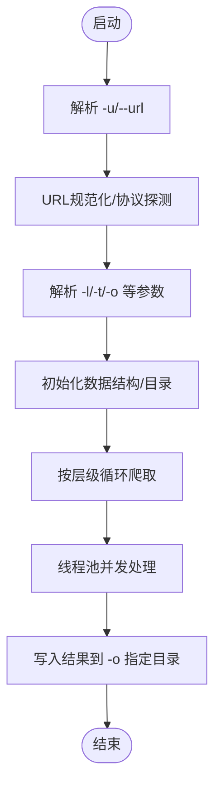

# 基础参数

<cite>
**本文引用的文件**
- [photon.py](file://photon.py)
- [README.md](file://README.md)
- [core/utils.py](file://core/utils.py)
- [core/config.py](file://core/config.py)
- [core/flash.py](file://core/flash.py)
</cite>

## 目录
1. [简介](#简介)
2. [项目结构与入口](#项目结构与入口)
3. [核心参数总览](#核心参数总览)
4. [参数详解与最佳实践](#参数详解与最佳实践)
5. [参数关系与依赖性](#参数关系与依赖性)
6. [常见问题与排错](#常见问题与排错)
7. [结语](#结语)

## 简介
本章节聚焦于 Photon 的“基础命令行参数”，帮助初学者快速理解并正确使用最常用的参数组合，尤其是：
- 必需参数：-u/--url（目标URL）
- 常用参数：-o/--output（输出目录）、-l/--level（爬取层级）、-t/--threads（线程数）

我们将从参数作用、默认值、取值范围、使用注意事项、典型示例以及参数间的关系入手，给出清晰、可操作的指导。

## 项目结构与入口
- 入口脚本负责解析命令行参数，并根据参数执行后续流程。
- 关键参数在入口脚本中通过标准库 argparse 定义与处理。
- 参数的默认行为与运行时赋值逻辑在入口脚本中集中体现。

图表来源
- [photon.py:56-99](file://photon.py#L56-L99)
- [core/flash.py:6-17](file://core/flash.py#L6-L17)
- [core/utils.py:148-185](file://core/utils.py#L148-L185)
- [core/config.py:1-28](file://core/config.py#1-L28)

章节来源
- [photon.py:56-99](file://photon.py#L56-L99)
- [README.md:72-83](file://README.md#L72-L83)

## 核心参数总览
以下是最常用的基础参数清单，便于快速查阅与对比。

- -u/--url：必填，指定目标网站根 URL。若未提供，程序会打印帮助并退出。
- -o/--output：可选，指定结果保存目录；未提供时默认以目标主机名为目录名。
- -l/--level：可选，控制递归爬取层级；未提供时默认为 2。
- -t/--threads：可选，控制并发线程数；未提供时默认为 2。

章节来源
- [photon.py:59](file://photon.py#L59)
- [photon.py:63](file://photon.py#L63)
- [photon.py:65](file://photon.py#L65)
- [photon.py:67](file://photon.py#L67)
- [photon.py:142-143](file://photon.py#L142-L143)
- [photon.py:192](file://photon.py#L192)

## 参数详解与最佳实践

### -u/--url（目标URL）
- 作用：指定要开始爬取的目标网站根地址。
- 默认值：无（必填）。若未提供，程序会打印帮助并退出。
- 取值范围：合法的 HTTP/HTTPS URL 或可被自动识别为 HTTPS 的主机名。
- 使用注意事项：
  - 若传入的 URL 末尾带斜杠，程序会自动去除，避免后续路径拼接问题。
  - 若未显式包含协议，程序会尝试探测并自动选择 https 或 http。
- 示例（基于仓库中的 Docker 使用示例）：
  - docker 运行时直接传入 -u google.com
  - 实际使用建议明确提供完整 URL，如 https://example.com

章节来源
- [photon.py:107-116](file://photon.py#L107-L116)
- [photon.py:176-184](file://photon.py#L176-L184)
- [README.md:76](file://README.md#L76)

### -o/--output（输出目录）
- 作用：设置结果保存目录。程序会在该目录下按类别生成 txt 文件。
- 默认值：未提供时，默认使用目标主机名作为目录名。
- 取值范围：任意有效的本地目录路径。
- 使用注意事项：
  - 若目录不存在，程序会自动创建。
  - 建议使用绝对路径，避免相对路径导致的结果分散。
- 示例：
  - -o ./results
  - -o /tmp/target_results

章节来源
- [photon.py:192](file://photon.py#L192)
- [photon.py:377-378](file://photon.py#L377-L378)

### -l/--level（爬取层级）
- 作用：控制递归爬取的最大深度（层级）。
- 默认值：未提供时默认为 2。
- 取值范围：整数；通常建议 1~5 之间，视站点规模与资源而定。
- 使用注意事项：
  - 层级越大，爬取的页面数量越多，耗时与资源占用越高。
  - 与 -s/--seeds 配合使用时，种子 URL 也会参与层级扩展。
- 示例：
  - -l 1
  - -l 3

章节来源
- [photon.py:65](file://photon.py#L65)
- [photon.py:142](file://photon.py#L142)
- [photon.py:315](file://photon.py#L315)

### -t/--threads（线程数）
- 作用：控制并发抓取的线程数量，提升吞吐。
- 默认值：未提供时默认为 2。
- 取值范围：正整数；过大可能导致目标站点限流或自身资源紧张。
- 使用注意事项：
  - 线程数越大，CPU 和网络占用越高；建议从 2 开始逐步调优。
  - 与 -d/--delay 配合使用，避免对目标服务器造成压力。
- 示例：
  - -t 4
  - -t 10

章节来源
- [photon.py:67](file://photon.py#L67)
- [photon.py:143](file://photon.py#L143)
- [core/flash.py:10-11](file://core/flash.py#L10-L11)

## 参数关系与依赖性
- 必需与可选关系
  - -u/--url 是必填项；其他参数均为可选。
- 参数间的相互影响
  - -l/--level 与 -t/--threads 共同决定爬取广度与并发强度：层级越大、线程越多，整体耗时越长。
  - -o/--output 与 -u/--url 无直接依赖，但输出目录命名策略与目标主机名有关（当未指定输出目录时）。
  - -d/--delay 与 -t/--threads 配合，可平衡速度与稳定性。
- 执行流程中的依赖
  - 解析 -u 后，程序会进行 URL 规范化与协议探测。
  - 解析 -l 与 -t 后，进入多轮递归爬取与线程池调度。
  - 解析 -o 后，程序在该目录下写入各类结果文件。

图表来源
- [photon.py:107-116](file://photon.py#L107-L116)
- [photon.py:176-184](file://photon.py#L176-L184)
- [photon.py:142-143](file://photon.py#L142-L143)
- [photon.py:192](file://photon.py#L192)
- [core/flash.py:6-17](file://core/flash.py#L6-L17)

章节来源
- [photon.py:107-116](file://photon.py#L107-L116)
- [photon.py:142-143](file://photon.py#L142-L143)
- [photon.py:192](file://photon.py#L192)
- [core/flash.py:6-17](file://core/flash.py#L6-L17)

## 常见问题与排错
- 未提供 -u/--url
  - 现象：程序打印帮助并退出。
  - 处理：确保提供 -u/--url，或参考 README 中的示例。
- 输出目录权限不足
  - 现象：无法创建或写入输出目录。
  - 处理：使用有写权限的目录，或以管理员身份运行。
- 线程数过高导致目标站点限流
  - 现象：大量请求失败或返回异常状态码。
  - 处理：降低 -t/--threads，配合 -d/--delay 调整节奏。
- 层级过大导致资源消耗过高
  - 现象：内存/CPU 占用飙升、耗时过长。
  - 处理：适当降低 -l/--level，或增加 -d/--delay。
- URL 末尾斜杠引发路径问题
  - 现象：内部路径拼接异常。
  - 处理：入口脚本会自动去除末尾斜杠，建议手动清理避免歧义。

章节来源
- [photon.py:107-116](file://photon.py#L107-L116)
- [photon.py:110-112](file://photon.py#L110-L112)
- [photon.py:377-378](file://photon.py#L377-L378)

## 结语
- 对于初学者，推荐先从最小可行组合开始：-u 指定目标、-l 设为 1~2、-t 设为 2，观察效果后再逐步调整。
- 在生产环境中，建议结合 -d/--delay、--proxy、--timeout 等参数，确保稳定与合规。
- 如需导出结果，请参考 README 中的导出示例与插件说明。