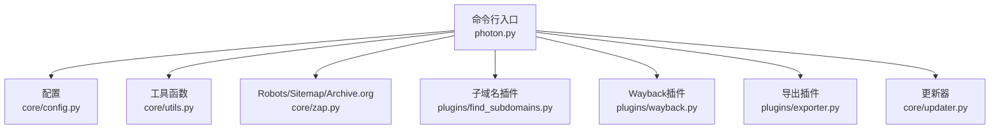
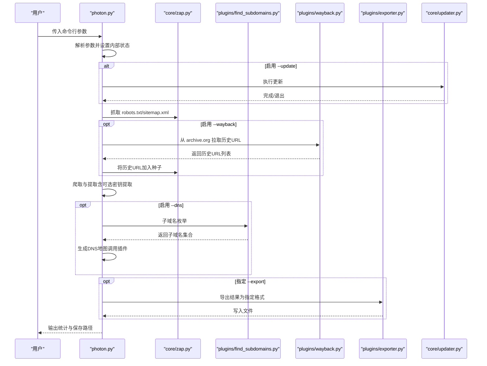
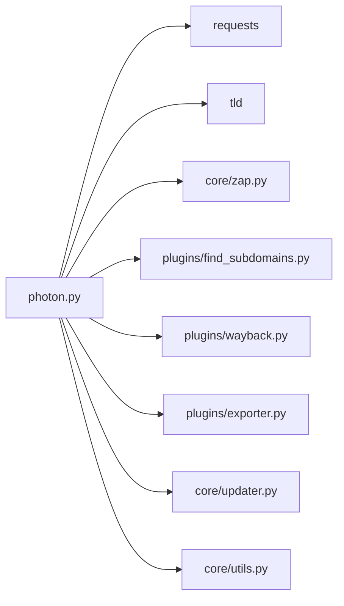

# 开关标志

<cite>
**本文引用的文件**
- [photon.py](file://photon.py)
- [README.md](file://README.md)
- [core/config.py](file://core/config.py)
- [core/utils.py](file://core/utils.py)
- [core/zap.py](file://core/zap.py)
- [core/updater.py](file://core/updater.py)
- [plugins/find_subdomains.py](file://plugins/find_subdomains.py)
- [plugins/wayback.py](file://plugins/wayback.py)
- [plugins/exporter.py](file://plugins/exporter.py)
- [requirements.txt](file://requirements.txt)
</cite>

## 目录
1. [简介](#简介)
2. [项目结构](#项目结构)
3. [核心组件](#核心组件)
4. [架构总览](#架构总览)
5. [详细组件分析](#详细组件分析)
6. [依赖分析](#依赖分析)
7. [性能考虑](#性能考虑)
8. [故障排除指南](#故障排除指南)
9. [结论](#结论)
10. [附录](#附录)

## 简介
本文件系统性梳理并说明命令行开关与标志位，重点覆盖以下布尔型开关：--clone（网站克隆）、--headers（自定义头部）、--dns（子域名枚举与DNS数据）、--keys（密钥查找）、--update（更新工具）、--only-urls（仅提取URL）、--wayback（从 archive.org 获取历史URL作为种子）。文档解释每个开关的作用、典型使用场景、与其他选项的组合效果，并给出实际应用建议与常见问题排查方法。

## 项目结构
该工具以命令行入口为中心，围绕“解析参数—初始化—抓取—处理—导出”的流程组织模块：
- 命令行入口负责参数解析与控制流分发
- 核心模块提供通用工具、配置、请求器、更新器等
- 插件模块扩展功能（子域名枚举、Wayback、导出）

图表来源
- [photon.py:57-99](file://photon.py#L57-L99)
- [core/config.py:1-28](file://core/config.py#L1-L28)
- [core/utils.py:1-207](file://core/utils.py#L1-L207)
- [core/zap.py:1-58](file://core/zap.py#L1-L58)
- [plugins/find_subdomains.py:1-15](file://plugins/find_subdomains.py#L1-L15)
- [plugins/wayback.py:1-23](file://plugins/wayback.py#L1-L23)
- [plugins/exporter.py:1-25](file://plugins/exporter.py#L1-L25)
- [core/updater.py:1-41](file://core/updater.py#L1-L41)

章节来源
- [photon.py:57-99](file://photon.py#L57-L99)
- [README.md:36-67](file://README.md#L36-L67)

## 核心组件
本节聚焦命令行开关的定义、行为与控制流，涵盖：
- 参数解析与默认值
- 开关的启用条件与副作用
- 与爬虫流程的集成点
- 与插件的交互

章节来源
- [photon.py:57-99](file://photon.py#L57-L99)
- [photon.py:102-105](file://photon.py#L102-L105)
- [photon.py:118-124](file://photon.py#L118-L124)
- [photon.py:405-411](file://photon.py#L405-L411)
- [photon.py:416-419](file://photon.py#L416-L419)

## 架构总览
下图展示命令行开关如何影响主流程：参数解析后，根据开关决定是否执行特定阶段（如更新、子域名枚举、Wayback抓取、导出），并在抓取过程中按需启用密钥提取、仅URL模式等逻辑。

图表来源
- [photon.py:102-105](file://photon.py#L102-L105)
- [photon.py:309](file://photon.py#L309)
- [photon.py:405-411](file://photon.py#L405-L411)
- [photon.py:416-419](file://photon.py#L416-L419)
- [core/zap.py:10-58](file://core/zap.py#L10-L58)
- [plugins/find_subdomains.py:7-14](file://plugins/find_subdomains.py#L7-L14)
- [plugins/wayback.py:8-22](file://plugins/wayback.py#L8-L22)
- [plugins/exporter.py:6-24](file://plugins/exporter.py#L6-L24)

## 详细组件分析

### --clone（网站克隆）
- 作用：在抓取页面时同步将页面内容镜像到本地目录，便于离线分析与复现。
- 触发点：在提取器中判断启用后，对每个响应调用镜像函数。
- 使用场景：
  - 需要保留原始HTML/CSS/JS资源以便后续离线审计
  - 对目标站点进行“快照式”备份
- 组合效果：
  - 与 --only-urls 关闭时配合，既克隆又提取信息
  - 与 --headers 配合可提升某些受保护页面的可访问性
- 注意事项：
  - 会显著增加磁盘占用与IO开销
  - 若目标站点大量静态资源，建议结合 --exclude 控制范围

章节来源
- [photon.py:242-243](file://photon.py#L242-L243)

### --headers（自定义头部）
- 作用：交互式输入HTTP请求头，解析为字典后用于后续请求。
- 触发点：解析到该开关后，进入提示流程并解析输入。
- 使用场景：
  - 需要绕过基于UA/Referer/Origin等的简单访问限制
  - 访问需要特定Cookie或Authorization的页面
- 组合效果：
  - 与 --clone、--keys、--dns 等均可叠加使用
  - 与 --proxy 可同时生效，但注意代理链路中的认证头传递
- 实践建议：
  - 头部格式应为“键: 值”，多条以换行分隔
  - 避免包含敏感凭据在脚本中，优先通过交互输入

章节来源
- [photon.py:168-174](file://photon.py#L168-L174)
- [core/utils.py:124-137](file://core/utils.py#L124-L137)

### --dns（子域名枚举与DNS数据）
- 作用：枚举子域名并生成DNS地图。
- 触发点：主流程末尾检测到开关后，调用子域名插件与DNS地图生成。
- 使用场景：
  - 资产发现与边界识别
  - 评估潜在攻击面
- 组合效果：
  - 与 --wayback 结合可扩大种子范围，提高子域名发现率
  - 与 --export 可输出结构化结果
- 实践建议：
  - 子域名枚举可能触发目标防护，建议配合延迟与代理
  - DNS地图生成依赖外部服务，网络不稳定时可重试

章节来源
- [photon.py:405-411](file://photon.py#L405-L411)
- [plugins/find_subdomains.py:7-14](file://plugins/find_subdomains.py#L7-L14)

### --keys（密钥查找）
- 作用：在页面内容中提取高熵字符串，作为潜在密钥/令牌线索。
- 触发点：在提取器中启用后，对响应进行高熵匹配与过滤。
- 使用场景：
  - 自动化发现API密钥、会话令牌、哈希等敏感信息
- 组合效果：
  - 与 --only-urls 关闭时共同启用，不影响URL提取
  - 与 --exclude 可过滤误报
- 实践建议：
  - 高熵阈值与正则规则可结合业务特征调整
  - 仅作为线索，需人工验证有效性与敏感度

章节来源
- [photon.py:282-287](file://photon.py#L282-L287)
- [core/utils.py:101-109](file://core/utils.py#L101-L109)

### --update（更新工具）
- 作用：检查并执行工具更新。
- 触发点：解析到该开关后立即执行更新逻辑，完成后退出。
- 使用场景：
  - 快速升级至最新版本，获取修复与新特性
- 组合效果：
  - 一旦启用即终止其他流程，优先完成更新
- 实践建议：
  - 更新前确保网络可达GitHub源
  - 更新过程会复制当前目录，注意备份重要数据

章节来源
- [photon.py:102-105](file://photon.py#L102-L105)
- [core/updater.py:8-40](file://core/updater.py#L8-L40)

### --only-urls（仅提取URL）
- 作用：关闭除URL以外的提取逻辑，仅收集内/外链与参数化URL。
- 触发点：在主流程中判断该开关，决定是否执行情报、JS、端点等提取。
- 使用场景：
  - 快速收集可访问的URL清单，用于后续扫描或审计
  - 减少无关信息干扰，提升处理速度
- 组合效果：
  - 与 --clone、--headers、--keys 等可叠加使用
  - 与 --export 可直接输出URL集合
- 实践建议：
  - 与 --exclude 配合可精准筛选目标URL

章节来源
- [photon.py:144](file://photon.py#L144)
- [photon.py:277-281](file://photon.py#L277-L281)

### --wayback（从 archive.org 获取历史URL作为种子）
- 作用：从互联网档案馆拉取历史URL，作为额外种子参与爬取。
- 触发点：主流程调用Zap阶段时，若启用该开关，则先抓取历史URL并加入内部种子集。
- 使用场景：
  - 发现已下线或变更的页面
  - 扩大初始种子覆盖面
- 组合效果：
  - 与 --dns、--clone、--headers 等可叠加使用
  - 与 --exclude 可过滤不关心的历史URL
- 实践建议：
  - 时间窗口由插件内部计算，网络波动时可多次尝试

章节来源
- [photon.py:309](file://photon.py#L309)
- [core/zap.py:12-22](file://core/zap.py#L12-L22)
- [plugins/wayback.py:8-22](file://plugins/wayback.py#L8-L22)

## 依赖分析
- 外部依赖：requests、urllib3、tld 等，用于HTTP请求、URL解析与TLD提取
- 内部模块耦合：
  - 命令行入口与各插件/工具模块松耦合，通过函数调用实现功能扩展
  - 更新器与主流程存在短路控制（--update 优先）

图表来源
- [requirements.txt:1-4](file://requirements.txt#L1-L4)
- [photon.py:309](file://photon.py#L309)
- [core/zap.py:1-58](file://core/zap.py#L1-L58)
- [plugins/find_subdomains.py:1-15](file://plugins/find_subdomains.py#L1-L15)
- [plugins/wayback.py:1-23](file://plugins/wayback.py#L1-L23)
- [plugins/exporter.py:1-25](file://plugins/exporter.py#L1-L25)
- [core/updater.py:1-41](file://core/updater.py#L1-L41)
- [core/utils.py:1-207](file://core/utils.py#L1-L207)

章节来源
- [requirements.txt:1-4](file://requirements.txt#L1-L4)

## 性能考虑
- 并发与线程：通过线程池并发处理链接，线程数可通过参数控制；线程过多可能引发目标限流或自身资源压力。
- 延迟与超时：合理设置延迟与超时，避免被目标封禁或自身卡死。
- 代理与头部：使用代理与自定义头部可降低被检测风险，但会增加连接失败概率，需做好容错。
- 仅URL模式：在大规模目标上优先启用仅URL模式，减少非必要解析开销。
- 克隆与导出：克隆会带来大量IO，导出CSV/JSON会占用内存，建议在资源充足的环境下使用。

## 故障排除指南
- 代理无效或超时
  - 现象：代理列表为空或全部标记失效
  - 排查：确认代理格式、网络连通性；检查代理类型与目标协议匹配
  - 参考
    - [photon.py:126-140](file://photon.py#L126-L140)
    - [core/utils.py:197-205](file://core/utils.py#L197-L205)
- 子域名枚举失败
  - 现象：返回空集或错误
  - 排查：网络异常、外部服务不可达、目标未收录
  - 参考
    - [photon.py:405-411](file://photon.py#L405-L411)
    - [plugins/find_subdomains.py:7-14](file://plugins/find_subdomains.py#L7-L14)
- Wayback 抓取无结果
  - 现象：历史URL数量极少
  - 排查：时间窗口设置、目标收录情况、网络波动
  - 参考
    - [core/zap.py:12-22](file://core/zap.py#L12-L22)
    - [plugins/wayback.py:8-22](file://plugins/wayback.py#L8-L22)
- 密钥提取误报
  - 现象：出现大量低熵字符串
  - 排查：调整高熵阈值、结合业务特征过滤
  - 参考
    - [photon.py:282-287](file://photon.py#L282-L287)
    - [core/utils.py:101-109](file://core/utils.py#L101-L109)

## 结论
命令行开关提供了灵活可控的执行路径，使工具能够适配不同场景：快速URL清单、深度信息提取、资产发现与备份。正确选择与组合这些开关，可在保证效率的同时最大化产出质量。建议在生产环境中结合代理、延迟与头部策略，谨慎启用高风险功能（如子域名枚举），并定期使用 --update 保持工具最新。

## 附录
- 常见组合示例（描述性说明）
  - 快速URL清单：-u 目标 --only-urls --export json
  - 深度信息提取：-u 目标 --headers --clone --keys
  - 资产发现：-u 目标 --dns --wayback --export csv
  - 稳定爬取：-u 目标 -t 4 -d 1 --proxy 代理 --timeout 10
- 相关文档与特性
  - README中概述了插件能力与使用场景，可作为参考
  - 参考
    - [README.md:36-67](file://README.md#L36-L67)
    - [README.md:63-67](file://README.md#L63-L67)
    - [README.md:85-91](file://README.md#L85-L91)
    - [README.md:131](file://README.md#L131)