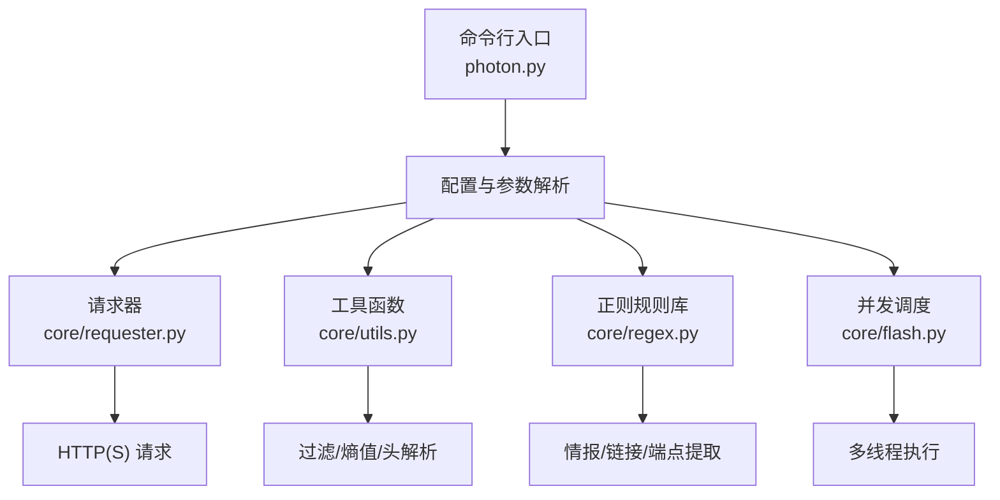
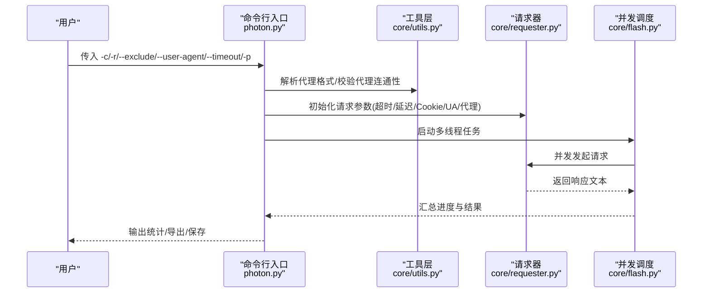
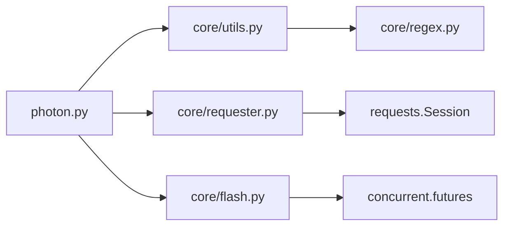

# 高级选项

<cite>
**本文引用的文件列表**
- [photon.py](file://photon.py)
- [core/requester.py](file://core/requester.py)
- [core/utils.py](file://core/utils.py)
- [core/regex.py](file://core/regex.py)
- [core/flash.py](file://core/flash.py)
- [core/config.py](file://core/config.py)
- [core/user-agents.txt](file://core/user-agents.txt)
- [README.md](file://README.md)
</cite>

## 目录
1. [简介](#简介)
2. [项目结构与入口](#项目结构与入口)
3. [核心组件与高级选项总览](#核心组件与高级选项总览)
4. [架构概览](#架构概览)
5. [详细组件分析](#详细组件分析)
6. [依赖关系分析](#依赖关系分析)
7. [性能考量与优化建议](#性能考量与优化建议)
8. [故障排查指南](#故障排查指南)
9. [结论](#结论)

## 简介
本文件面向需要深入掌握命令行高级选项的专家用户，系统梳理并解释以下复杂参数的高级用法、配置方法与最佳实践：
- -c/--cookie：Cookie 设置
- -r/--regex：自定义正则表达式
- --exclude：排除规则
- --user-agent：用户代理
- --timeout：超时设置
- -p/--proxy：代理服务器

同时提供专家级技巧与性能优化建议，帮助在不同目标与网络环境下获得稳定、高效、可控的抓取体验。

## 项目结构与入口
- 入口脚本负责解析命令行参数、初始化全局状态、调度爬取流程，并将结果输出到本地目录。
- 请求层封装了会话、超时、代理、Cookie、User-Agent 等请求细节。
- 工具层提供正则过滤、熵值检测、线程池并发执行、头信息提取等能力。
- 正则库提供多种情报抽取与链接/端点识别的规则集合。

图表来源
- [photon.py:57-99](file://photon.py#L57-L99)
- [core/requester.py:11-72](file://core/requester.py#L11-L72)
- [core/utils.py:15-75](file://core/utils.py#L15-L75)
- [core/regex.py:231-234](file://core/regex.py#L231-L234)
- [core/flash.py:6-17](file://core/flash.py#L6-L17)

章节来源
- [photon.py:57-99](file://photon.py#L57-L99)
- [README.md:54-62](file://README.md#L54-L62)

## 核心组件与高级选项总览
- 命令行参数解析与默认值
  - -c/--cookie：支持传入 Cookie 字符串，用于后续请求附带认证或会话上下文。
  - -r/--regex：自定义正则模式，从响应体中提取匹配字符串。
  - --exclude：排除匹配该正则的 URL，常用于过滤无关路径或动态参数。
  - --user-agent：可指定一个或多个 User-Agent；未指定时从内置文件读取。
  - --timeout：HTTP 请求超时秒数，默认值参与请求器调用。
  - -p/--proxy：支持 IP:PORT 或域名:PORT，可从文件批量加载，支持 http/socks5 协议前缀。

- 关键行为
  - 代理校验：启动时对提供的代理进行连通性测试，仅保留可用代理。
  - 超时与延迟：请求器按配置执行超时控制与延迟等待。
  - 并发：通过线程池并发处理链接，提升吞吐量。
  - 排除与过滤：在爬取阶段对 URL 进行正则排除与类型过滤。

章节来源
- [photon.py:59-82](file://photon.py#L59-L82)
- [photon.py:122-140](file://photon.py#L122-L140)
- [core/utils.py:164-180](file://core/utils.py#L164-L180)
- [core/utils.py:197-205](file://core/utils.py#L197-L205)
- [core/requester.py:11-72](file://core/requester.py#L11-L72)
- [core/flash.py:6-17](file://core/flash.py#L6-L17)

## 架构概览
下图展示高级选项如何贯穿参数解析、请求构造、并发执行与结果产出的全链路。

图表来源
- [photon.py:122-140](file://photon.py#L122-L140)
- [core/utils.py:164-180](file://core/utils.py#L164-L180)
- [core/utils.py:197-205](file://core/utils.py#L197-L205)
- [core/requester.py:11-72](file://core/requester.py#L11-L72)
- [core/flash.py:6-17](file://core/flash.py#L6-L17)

## 详细组件分析

### -c/--cookie（Cookie 设置）
- 作用
  - 在请求阶段附带 Cookie，用于维持登录态或访问受限资源。
- 实现要点
  - 参数解析后作为请求器的 cookies 参数传入。
  - 请求器在会话 GET 中直接携带 Cookie。
- 最佳实践
  - 优先使用目标站点有效 Cookie，避免被反爬策略拦截。
  - 对于多域场景，确保 Cookie 的域范围覆盖目标主机。
  - 若目标要求特定语言/区域偏好，结合 --headers 一起使用。

章节来源
- [photon.py:60](file://photon.py#L60)
- [photon.py:123](file://photon.py#L123)
- [core/requester.py:48-56](file://core/requester.py#L48-L56)

### -r/--regex（自定义正则表达式）
- 作用
  - 从页面响应体中提取符合自定义正则的字符串，便于发现隐藏字段、令牌或业务标识。
- 实现要点
  - 命令行传入的正则在解析页面内容后调用工具函数执行匹配。
  - 匹配结果加入“自定义”集合，最终统一输出。
- 高级用法
  - 使用分组捕获以提取关键子串。
  - 结合 --exclude 过滤掉不关心的 URL，减少误报。
  - 与 --timeout、--delay 组合，避免触发目标限速。
- 注意事项
  - 复杂正则可能带来性能开销，建议尽量精确化。
  - 若正则异常，程序会抑制错误并跳过该模式。

章节来源
- [photon.py:61](file://photon.py#L61)
- [photon.py:280-281](file://photon.py#L280-L281)
- [core/utils.py:15-24](file://core/utils.py#L15-L24)

### --exclude（排除规则）
- 作用
  - 在爬取前与爬取过程中，排除匹配该正则的 URL，降低噪声与无效请求。
- 实现要点
  - 爬取前对种子集进行排除。
  - 每轮爬取时再次应用排除规则，确保只处理目标范围内的链接。
- 高级用法
  - 排除动态参数（如带 sessionid 的 URL）。
  - 排除静态资源或特定目录（如 /static/）。
  - 与 --level、--threads 协同，控制深度与并发。
- 性能影响
  - 合理的排除规则可显著减少请求次数与处理时间。

章节来源
- [photon.py:77](file://photon.py#L77)
- [photon.py:312](file://photon.py#L312)
- [photon.py:317](file://photon.py#L317)
- [core/utils.py:51-75](file://core/utils.py#L51-L75)

### --user-agent（用户代理）
- 作用
  - 控制请求头中的 User-Agent，模拟不同浏览器或设备特征。
- 实现要点
  - 支持传入多个 UA，请求器随机选择其一。
  - 未指定时从内置文件读取 UA 列表。
- 高级用法
  - 针对目标站点的 UA 检测策略，选择更常见的桌面/移动 UA。
  - 与 --headers 配合，构建更完整的请求头集合。
- 注意事项
  - 避免使用过于冷门的 UA 导致被识别为自动化。

章节来源
- [photon.py:75-76](file://photon.py#L75-L76)
- [photon.py:199-203](file://photon.py#L199-L203)
- [core/user-agents.txt](file://core/user-agents.txt)

### --timeout（超时设置）
- 作用
  - 控制单次 HTTP 请求的最大等待时间，防止长时间阻塞。
- 实现要点
  - 默认值参与请求器调用；请求器将该值传递给底层 HTTP 库。
- 高级用法
  - 在网络不稳定或目标响应慢时适当提高超时。
  - 与 --delay 组合，平衡吞吐与稳定性。
- 性能影响
  - 过短超时可能导致大量失败重试；过长超时会拖慢整体进度。

章节来源
- [photon.py:79-80](file://photon.py#L79-L80)
- [photon.py:122](file://photon.py#L122)
- [core/requester.py:52](file://core/requester.py#L52)

### -p/--proxy（代理服务器）
- 作用
  - 通过代理转发请求，隐藏源 IP 或绕过地理限制。
- 实现要点
  - 支持 IP:PORT 或域名:PORT，可带协议前缀（http/socks5）。
  - 支持从文件批量加载代理，逐个校验连通性。
  - 只保留可用代理，不可用代理会被提示并剔除。
- 高级用法
  - 使用高匿名代理降低被识别风险。
  - 与 --threads 协同，合理分配代理池以避免被限速。
  - 结合 --timeout 与 --delay，提升代理池的稳定性。
- 注意事项
  - 代理质量参差不齐，务必先做连通性测试。
  - 某些代理可能对特定站点有访问限制。

章节来源
- [photon.py:81-82](file://photon.py#L81-L82)
- [photon.py:126-140](file://photon.py#L126-L140)
- [core/utils.py:164-180](file://core/utils.py#L164-L180)
- [core/utils.py:197-205](file://core/utils.py#L197-L205)

### 专家级技巧与最佳实践
- 代理池管理
  - 将代理写入文件，每行一条，自动批量加载与校验。
  - 为不同目标准备专用代理池，避免跨站点冲突。
- 正则策略
  - 自定义正则应尽量精确，避免宽泛匹配导致误报。
  - 对敏感数据（如密钥）使用高熵阈值与二次验证。
- 并发与稳定性
  - 合理设置 --threads，避免对目标造成过大压力。
  - 结合 --delay 与 --timeout，平衡速度与成功率。
- 排除规则
  - 在种子阶段就应用 --exclude，减少后续工作量。
  - 使用锚点与边界断言，避免误伤目标页面。

章节来源
- [core/utils.py:148-161](file://core/utils.py#L148-L161)
- [core/utils.py:15-24](file://core/utils.py#L15-L24)
- [core/flash.py:6-17](file://core/flash.py#L6-L17)

## 依赖关系分析
- 命令行入口依赖工具层与请求层完成参数解析、代理校验、请求构造与并发执行。
- 请求层依赖第三方 HTTP 库完成实际网络请求。
- 工具层提供正则过滤、熵值计算、头解析等通用能力。
- 正则库提供情报抽取与链接/端点识别的基础规则。

图表来源
- [photon.py:32-51](file://photon.py#L32-L51)
- [core/requester.py:8](file://core/requester.py#L8)
- [core/flash.py:2](file://core/flash.py#L2)

章节来源
- [photon.py:32-51](file://photon.py#L32-L51)
- [core/requester.py:8](file://core/requester.py#L8)
- [core/flash.py:2](file://core/flash.py#L2)

## 性能考量与优化建议
- 并发与线程数
  - --threads 越大吞吐越高，但需考虑目标限速与自身带宽。
  - 建议从较小值起步，逐步调优。
- 延迟与超时
  - --delay 可缓解目标限速；--timeout 需根据网络状况调整。
- 代理与稳定性
  - 优先使用高质量代理，减少失败重试。
  - 代理池轮询或随机选择，避免单一代理过载。
- 正则与过滤
  - 精准正则减少无效匹配成本。
  - 合理的 --exclude 提升爬取效率。
- 输出与导出
  - 结果按模块分类保存，必要时使用 --export 导出为 JSON/CSV。

章节来源
- [core/flash.py:6-17](file://core/flash.py#L6-L17)
- [photon.py:121-122](file://photon.py#L121-L122)
- [photon.py:199-203](file://photon.py#L199-L203)
- [README.md:54-62](file://README.md#L54-L62)

## 故障排查指南
- 代理不可用
  - 现象：提示代理不可用或超时。
  - 处理：检查代理格式、网络连通性；使用 --timeout 适当增大；更换代理。
- 自定义正则异常
  - 现象：自定义正则导致解析失败。
  - 处理：简化正则，使用更精确的锚点；必要时禁用该模式。
- 请求超时频繁
  - 现象：大量请求超时。
  - 处理：增大 --timeout；增加 --delay；降低 --threads。
- UA 不生效
  - 现象：请求头未按预期 UA 发送。
  - 处理：确认传入多个 UA 且格式正确；检查是否被中间层覆盖。
- 排除规则误伤
  - 现象：目标页面被错误排除。
  - 处理：缩小排除范围，使用更具体的正则表达式。

章节来源
- [core/utils.py:197-205](file://core/utils.py#L197-L205)
- [core/utils.py:15-24](file://core/utils.py#L15-L24)
- [core/requester.py:52](file://core/requester.py#L52)
- [photon.py:199-203](file://photon.py#L199-L203)
- [core/utils.py:51-75](file://core/utils.py#L51-L75)

## 结论
通过系统化理解各高级选项的实现机制与交互关系，可以在复杂网络与目标环境下实现稳定、高效、可控的抓取。建议在实践中遵循“先稳后快”的原则，结合代理池、正则过滤与并发调优，持续迭代以达到最佳效果。