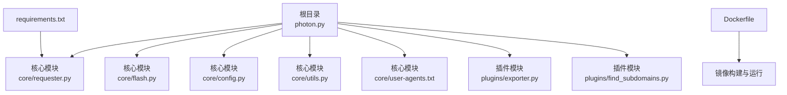
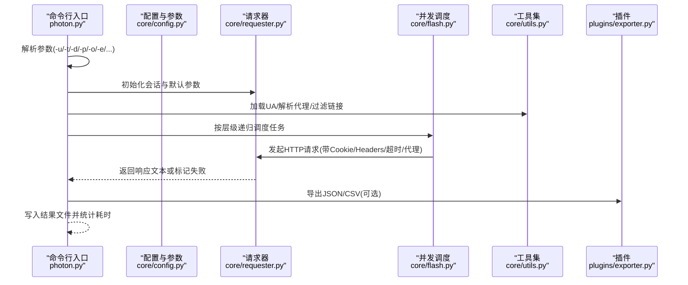
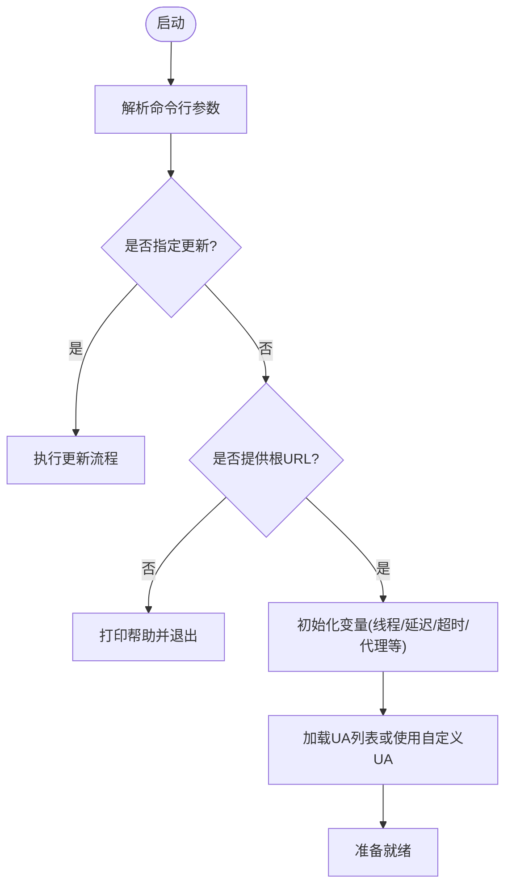
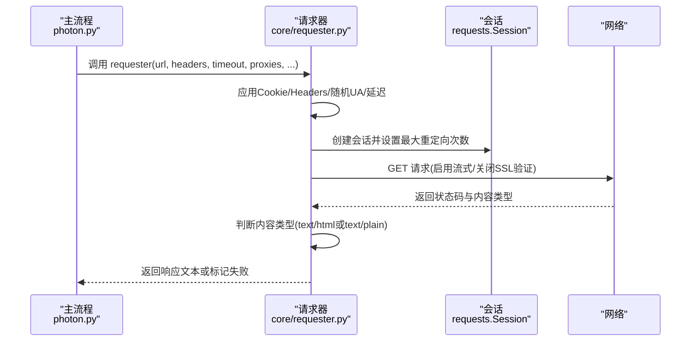
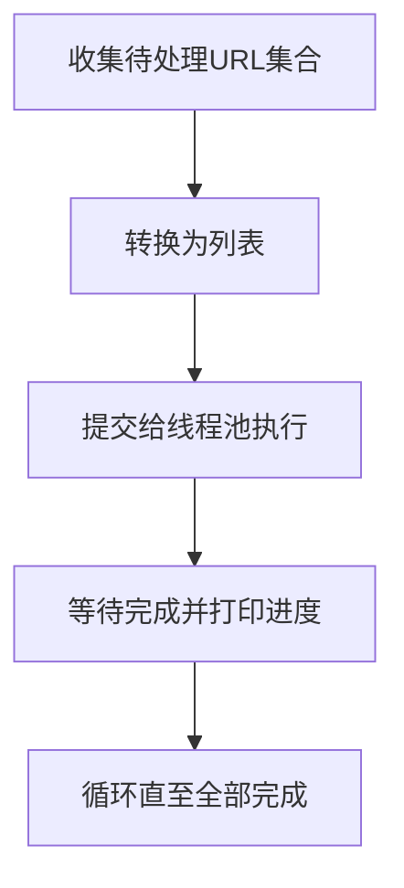
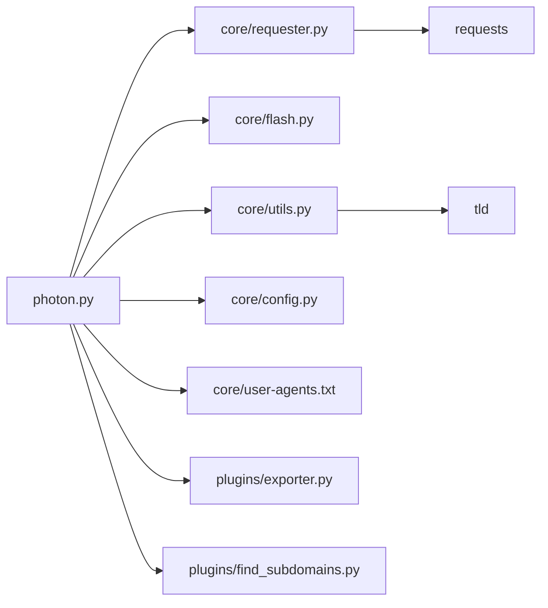

# 安装与配置

<cite>
**本文引用的文件**
- [README.md](file://README.md)
- [requirements.txt](file://requirements.txt)
- [Dockerfile](file://Dockerfile)
- [photon.py](file://photon.py)
- [core/config.py](file://core/config.py)
- [core/requester.py](file://core/requester.py)
- [core/utils.py](file://core/utils.py)
- [core/flash.py](file://core/flash.py)
- [core/user-agents.txt](file://core/user-agents.txt)
- [plugins/exporter.py](file://plugins/exporter.py)
- [plugins/find_subdomains.py](file://plugins/find_subdomains.py)
</cite>

## 目录
1. [简介](#简介)
2. [项目结构](#项目结构)
3. [核心组件](#核心组件)
4. [架构总览](#架构总览)
5. [详细组件分析](#详细组件分析)
6. [依赖关系分析](#依赖关系分析)
7. [性能考虑](#性能考虑)
8. [故障排查指南](#故障排查指南)
9. [结论](#结论)
10. [附录](#附录)

## 简介
本章节面向首次接触 Photon 的用户，提供从零开始的安装与配置指南。内容覆盖以下主题：
- 多种安装方式：源码安装、PyPI 安装（如可用）、Docker 容器化部署
- 系统依赖与 Python 版本要求
- 第三方库依赖说明
- 配置项详解：用户代理、代理、超时、并发、输出格式等
- 生产环境部署最佳实践与性能调优建议

## 项目结构
为便于理解安装与配置流程，先概览项目目录组织与关键文件职责：
- 根目录入口脚本负责命令行参数解析与主流程调度
- 核心模块提供请求、并发、配置、工具函数等能力
- 插件模块扩展导出与子域名枚举等能力
- Dockerfile 提供容器化构建与运行方式
- requirements.txt 声明第三方依赖

图表来源
- [photon.py:1-426](file://photon.py#L1-L426)
- [core/requester.py:1-73](file://core/requester.py#L1-L73)
- [core/flash.py:1-18](file://core/flash.py#L1-L18)
- [core/config.py:1-28](file://core/config.py#L1-L28)
- [core/utils.py:1-207](file://core/utils.py#L1-L207)
- [core/user-agents.txt:1-19](file://core/user-agents.txt#L1-L19)
- [plugins/exporter.py:1-25](file://plugins/exporter.py#L1-L25)
- [plugins/find_subdomains.py:1-15](file://plugins/find_subdomains.py#L1-L15)
- [Dockerfile:1-17](file://Dockerfile#L1-L17)
- [requirements.txt:1-4](file://requirements.txt#L1-L4)

章节来源
- [photon.py:1-426](file://photon.py#L1-L426)
- [Dockerfile:1-17](file://Dockerfile#L1-L17)
- [requirements.txt:1-4](file://requirements.txt#L1-L4)

## 核心组件
- 命令行入口与参数解析：负责解析用户输入的 URL、线程数、延迟、超时、代理、输出目录、导出格式等，并驱动主流程
- 请求器：封装 HTTP 请求逻辑，支持自定义 Cookie、Headers、超时、代理、随机 User-Agent、重定向限制与流式响应
- 并发调度：基于线程池并发执行爬取任务，打印进度
- 工具与配置：提供正则抽取、链接过滤、熵值检测、代理校验、头提取、顶级域解析、结果写入等通用能力
- 用户代理列表：内置多条 User-Agent，可被请求器随机使用或由用户自定义
- 插件：导出为 JSON/CSV；子域名枚举

章节来源
- [photon.py:56-99](file://photon.py#L56-L99)
- [core/requester.py:11-73](file://core/requester.py#L11-L73)
- [core/flash.py:6-17](file://core/flash.py#L6-L17)
- [core/utils.py:15-207](file://core/utils.py#L15-L207)
- [core/config.py:1-28](file://core/config.py#L1-L28)
- [core/user-agents.txt:1-19](file://core/user-agents.txt#L1-L19)
- [plugins/exporter.py:6-25](file://plugins/exporter.py#L6-L25)
- [plugins/find_subdomains.py:7-15](file://plugins/find_subdomains.py#L7-L15)

## 架构总览
下图展示从命令行到请求与导出的整体流程。

图表来源
- [photon.py:108-199](file://photon.py#L108-L199)
- [core/requester.py:11-73](file://core/requester.py#L11-L73)
- [core/flash.py:6-17](file://core/flash.py#L6-L17)
- [core/utils.py:15-207](file://core/utils.py#L15-L207)
- [plugins/exporter.py:6-25](file://plugins/exporter.py#L6-L25)

## 详细组件分析

### 安装方式
- 源码安装
  - 克隆仓库后进入目录，安装依赖，即可直接运行入口脚本
  - 依赖通过 requirements.txt 声明
- PyPI 安装
  - 若项目已发布至 PyPI，可通过 pip 安装；若未发布，请参考源码安装步骤
- Docker 容器化部署
  - 使用官方 Dockerfile 构建镜像，运行容器时传入目标 URL 与输出挂载卷

章节来源
- [README.md:72-83](file://README.md#L72-L83)
- [Dockerfile:1-17](file://Dockerfile#L1-L17)
- [requirements.txt:1-4](file://requirements.txt#L1-L4)

### 系统依赖与兼容性
- Python 版本
  - 仅支持 Python 3.2 及以上版本
- 系统依赖
  - 无额外系统库要求，依赖通过 pip 安装
- 第三方库依赖
  - requests、requests[socks]、urllib3、tld

章节来源
- [photon.py:26-30](file://photon.py#L26-L30)
- [requirements.txt:1-4](file://requirements.txt#L1-L4)

### 配置文件与参数详解
- 用户代理(User-Agent)
  - 默认从内置 UA 列表中随机选择
  - 支持通过命令行传入自定义 UA（可逗号分隔多个）
- 代理(Proxy)
  - 支持 IP:PORT 或 域名:PORT 格式
  - 支持从文件批量读取代理列表
  - 启动时会对代理进行连通性测试，无效代理会被过滤
- 超时(Timeout)
  - 单次请求超时默认值在代码中有设定
  - 可通过命令行参数调整
- 并发控制(Threads)
  - 线程数默认值在代码中有设定
  - 可通过命令行参数调整
- 输出与导出
  - 结果保存在以目标域名为名的目录中
  - 支持导出为 JSON/CSV
- 其他常用参数
  - 延迟(Delay)、种子(Seeds)、排除规则(Exclude)、仅提取 URL 模式、DNS 子域名枚举、Wayback 种子等

章节来源
- [photon.py:199-203](file://photon.py#L199-L203)
- [photon.py:121-143](file://photon.py#L121-L143)
- [core/utils.py:164-180](file://core/utils.py#L164-L180)
- [core/utils.py:148-161](file://core/utils.py#L148-L161)
- [core/requester.py:17-22](file://core/requester.py#L17-L22)
- [plugins/exporter.py:6-25](file://plugins/exporter.py#L6-L25)

### 关键流程与算法

#### 参数解析与初始化

图表来源
- [photon.py:56-99](file://photon.py#L56-L99)
- [photon.py:102-116](file://photon.py#L102-L116)
- [photon.py:199-203](file://photon.py#L199-L203)

#### 请求与响应处理

图表来源
- [core/requester.py:11-73](file://core/requester.py#L11-L73)

#### 并发调度与进度

图表来源
- [core/flash.py:6-17](file://core/flash.py#L6-L17)
- [photon.py:327](file://photon.py#L327)

### 数据模型与导出
- 结果数据集
  - 包括文件、情报、robots、自定义正则匹配、失败URL、内部URL、脚本、外部URL、可模糊URL、端点、密钥等
- 导出格式
  - JSON：导出为单个 JSON 文件
  - CSV：逐键导出为 CSV 行

章节来源
- [photon.py:380-403](file://photon.py#L380-L403)
- [plugins/exporter.py:6-25](file://plugins/exporter.py#L6-L25)

## 依赖关系分析
- 运行时依赖
  - requests、requests[socks]、urllib3、tld
- 组件耦合
  - 主入口依赖请求器、并发调度、工具集与配置
  - 插件依赖标准库与核心工具
- 外部集成
  - 子域名枚举调用第三方服务接口
  - 更新器通过网络拉取最新变更日志

图表来源
- [photon.py:1-426](file://photon.py#L1-L426)
- [core/requester.py:1-73](file://core/requester.py#L1-L73)
- [core/flash.py:1-18](file://core/flash.py#L1-L18)
- [core/utils.py:1-207](file://core/utils.py#L1-L207)
- [core/config.py:1-28](file://core/config.py#L1-L28)
- [core/user-agents.txt:1-19](file://core/user-agents.txt#L1-L19)
- [plugins/exporter.py:1-25](file://plugins/exporter.py#L1-L25)
- [plugins/find_subdomains.py:1-15](file://plugins/find_subdomains.py#L1-L15)
- [requirements.txt:1-4](file://requirements.txt#L1-L4)

章节来源
- [requirements.txt:1-4](file://requirements.txt#L1-L4)
- [photon.py:1-426](file://photon.py#L1-L426)

## 性能考虑
- 并发与吞吐
  - 合理设置线程数，避免对目标站点造成过大压力
  - 使用延迟参数平滑请求节奏
- 超时与稳定性
  - 根据网络状况调整超时时间，避免长时间阻塞
  - 对代理进行预检，剔除不可用代理
- I/O 与存储
  - 输出目录建议挂载到高性能磁盘
  - 导出为 JSON/CSV 时注意文件大小与磁盘空间
- 网络与协议
  - 启用流式响应减少内存占用
  - 在允许场景下关闭 SSL 验证以提升速度，但需权衡安全风险

## 故障排查指南
- Python 版本不兼容
  - 现象：启动即退出并提示仅支持 Python 3.2+
  - 处理：升级至 Python 3.2+ 或使用容器镜像
- 代理不可用
  - 现象：代理测试失败或全部被过滤
  - 处理：检查代理格式、网络连通性与目标站点可达性
- 请求超时或频繁重定向
  - 现象：大量失败或卡顿
  - 处理：增大超时、降低并发、增加延迟、检查目标站点重定向策略
- 导出失败
  - 现象：导出 JSON/CSV 报错
  - 处理：确认输出目录权限与磁盘空间，检查数据结构是否为空

章节来源
- [photon.py:26-30](file://photon.py#L26-L30)
- [core/utils.py:197-205](file://core/utils.py#L197-L205)
- [core/requester.py:47-70](file://core/requester.py#L47-L70)
- [plugins/exporter.py:6-25](file://plugins/exporter.py#L6-L25)

## 结论
通过上述安装与配置说明，您可以在本地或容器环境中快速部署 Photon，并结合代理、超时、并发等参数实现稳定高效的爬取。生产环境下建议结合网络条件与目标站点特性进行参数微调，并定期使用更新功能保持工具的最新状态。

## 附录

### 常用命令示例
- 源码安装与运行
  - 克隆仓库后安装依赖，直接运行入口脚本
- Docker 部署
  - 构建镜像并运行，映射输出目录到宿主机
- 导出结果
  - 使用导出插件将结果保存为 JSON/CSV

章节来源
- [README.md:72-83](file://README.md#L72-L83)
- [Dockerfile:9-16](file://Dockerfile#L9-L16)
- [plugins/exporter.py:6-25](file://plugins/exporter.py#L6-L25)