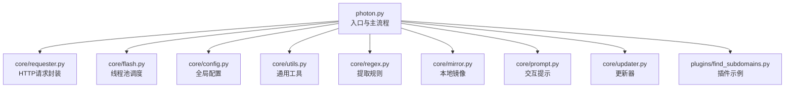
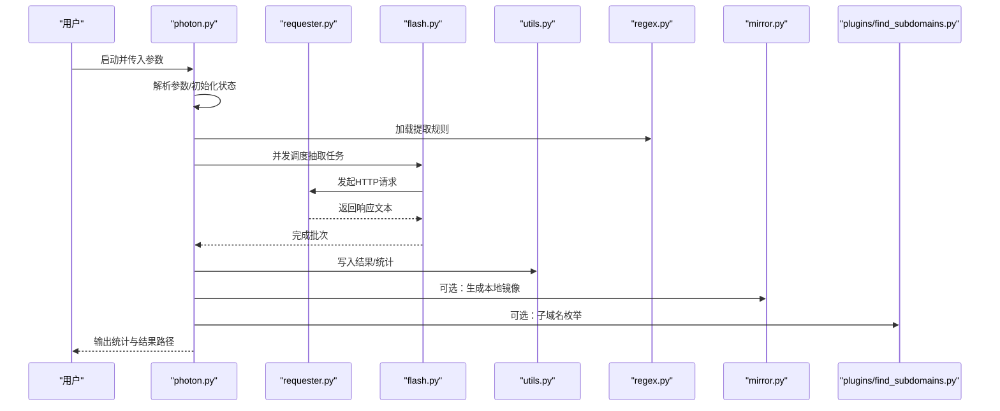
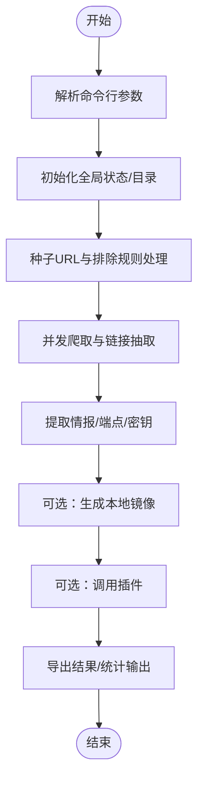
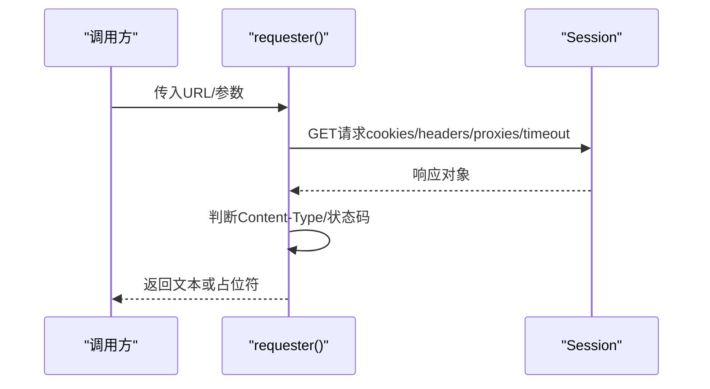
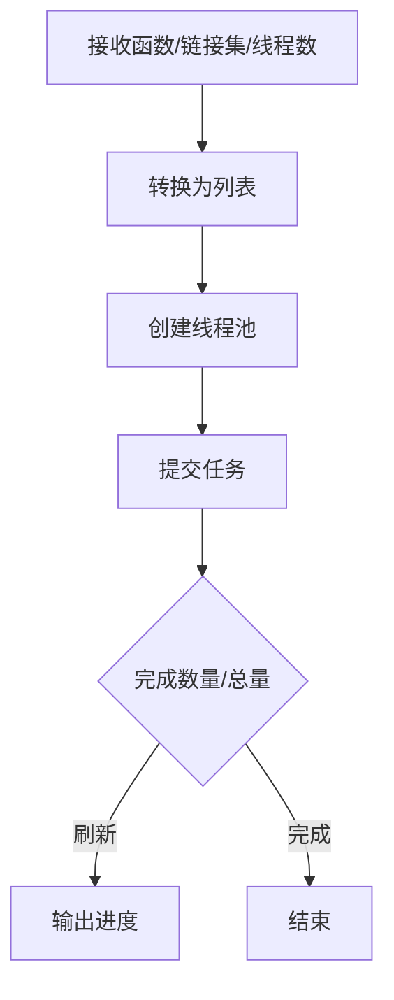
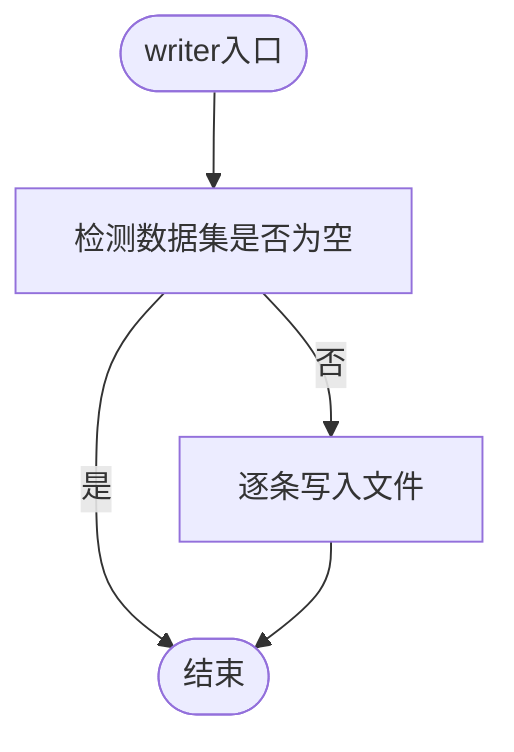
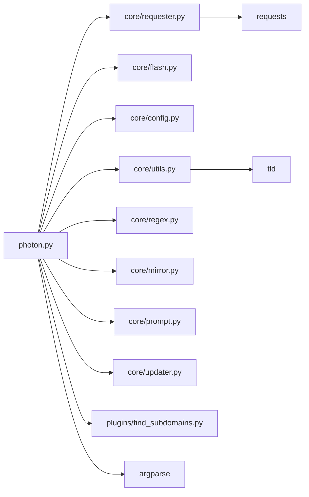

# 代码规范

<cite>
**本文引用的文件**
- [README.md](file://README.md)
- [photon.py](file://photon.py)
- [requirements.txt](file://requirements.txt)
- [core/__init__.py](file://core/__init__.py)
- [plugins/__init__.py](file://plugins/__init__.py)
- [core/utils.py](file://core/utils.py)
- [core/colors.py](file://core/colors.py)
- [core/requester.py](file://core/requester.py)
- [core/config.py](file://core/config.py)
- [core/flash.py](file://core/flash.py)
- [core/mirror.py](file://core/mirror.py)
- [core/prompt.py](file://core/prompt.py)
- [core/regex.py](file://core/regex.py)
- [core/updater.py](file://core/updater.py)
- [plugins/find_subdomains.py](file://plugins/find_subdomains.py)
</cite>

## 目录
1. [引言](#引言)
2. [项目结构](#项目结构)
3. [核心组件](#核心组件)
4. [架构总览](#架构总览)
5. [详细组件分析](#详细组件分析)
6. [依赖关系分析](#依赖关系分析)
7. [性能考虑](#性能考虑)
8. [故障排查指南](#故障排查指南)
9. [结论](#结论)
10. [附录](#附录)

## 引言
本文件为Photon项目的Python代码规范文档，旨在统一开发与贡献者的编码风格，提升可读性、可维护性与协作效率。内容覆盖PEP8遵循情况、命名约定、注释与文档字符串、模块导入顺序、变量与函数定义标准、错误处理与异常抛出、日志记录建议、以及代码格式化工具与自动化检查流程的配置思路。

## 项目结构
- 根目录入口脚本负责参数解析、初始化与主流程调度。
- 核心功能集中在core子包：网络请求、并发执行、配置、颜色输出、正则集合、镜像保存、交互提示、更新器等。
- 插件位于plugins子包：扩展功能（如子域名枚举）。
- 顶层README提供使用说明与贡献信息；requirements.txt声明运行依赖。

图表来源
- [photon.py:1-426](file://photon.py#L1-L426)
- [core/requester.py:1-73](file://core/requester.py#L1-L73)
- [core/flash.py:1-18](file://core/flash.py#L1-L18)
- [core/config.py:1-28](file://core/config.py#L1-L28)
- [core/utils.py:1-207](file://core/utils.py#L1-L207)
- [core/regex.py:1-235](file://core/regex.py#L1-L235)
- [core/mirror.py:1-40](file://core/mirror.py#L1-L40)
- [core/prompt.py:1-23](file://core/prompt.py#L1-L23)
- [core/updater.py:1-41](file://core/updater.py#L1-L41)
- [plugins/find_subdomains.py:1-15](file://plugins/find_subdomains.py#L1-L15)

章节来源
- [README.md:1-176](file://README.md#L1-L176)
- [requirements.txt:1-4](file://requirements.txt#L1-L4)
- [photon.py:1-426](file://photon.py#L1-L426)

## 核心组件
- 命名约定
  - 模块与包：小写短名称，如core、plugins。
  - 函数与方法：小写下划线命名，如requester、flash、writer、entropy。
  - 常量：全大写或大写下划线，如BAD_TYPES、INTELS、END_PUNCTUATION。
  - 类：采用驼峰命名，但当前项目未见类定义。
- 注释与文档字符串
  - 函数/方法：使用三重引号文档字符串描述用途、参数、返回值与行为边界。
  - 行内注释：简明解释复杂逻辑或边界条件。
- 导入顺序
  - 标准库 → 第三方库 → 项目内部模块（按层级分组），同一组内按字母序排列。
  - 项目内部模块中，优先导入核心模块，再导入插件模块。
- 变量与函数定义
  - 函数参数默认值：避免可变默认值（如列表/字典），必要时使用None并在函数内初始化。
  - 复杂逻辑拆分为小函数，保持单一职责。
- 错误处理与异常抛出
  - 明确捕获具体异常类型，避免裸except。
  - 对外部依赖（网络、文件）进行超时与连接异常处理。
  - 在需要时抛出自定义异常或使用标准异常类型。
- 日志记录
  - 当前项目通过颜色输出与打印实现轻量级“日志”，建议在新场景引入logging模块并配置级别与格式。
- 代码格式化与自动化检查
  - 推荐使用flake8、pylint或ruff进行静态检查；使用black或yapf进行格式化；使用isort整理导入顺序。
  - 将检查集成到CI/CD或pre-commit钩子中，确保提交前一致性。

章节来源
- [core/utils.py:15-207](file://core/utils.py#L15-L207)
- [core/requester.py:11-73](file://core/requester.py#L11-L73)
- [core/flash.py:6-18](file://core/flash.py#L6-L18)
- [core/config.py:1-28](file://core/config.py#L1-L28)
- [core/regex.py:1-235](file://core/regex.py#L1-L235)
- [core/mirror.py:4-40](file://core/mirror.py#L4-L40)
- [core/prompt.py:6-23](file://core/prompt.py#L6-L23)
- [core/updater.py:8-41](file://core/updater.py#L8-L41)
- [plugins/find_subdomains.py:7-15](file://plugins/find_subdomains.py#L7-L15)

## 架构总览
下图展示入口脚本如何组织核心模块与插件，形成爬取、提取、镜像与导出的主流程。

图表来源
- [photon.py:108-426](file://photon.py#L108-L426)
- [core/requester.py:11-73](file://core/requester.py#L11-L73)
- [core/flash.py:6-18](file://core/flash.py#L6-L18)
- [core/utils.py:78-87](file://core/utils.py#L78-L87)
- [core/regex.py:231-235](file://core/regex.py#L231-L235)
- [core/mirror.py:4-40](file://core/mirror.py#L4-L40)
- [plugins/find_subdomains.py:7-15](file://plugins/find_subdomains.py#L7-L15)

## 详细组件分析

### 组件A：入口与主流程（photon.py）
- 职责：命令行参数解析、初始化全局状态、调度爬取与提取、结果输出与导出。
- 关键点：
  - 使用argparse定义选项与开关，合理设置默认值与类型转换。
  - 对代理输入进行校验与筛选，失败时给出明确提示。
  - 使用并发调度器批量处理链接，支持中断与进度反馈。
  - 条件加载插件，避免不必要的导入开销。
- 规范建议：
  - 文档字符串补充参数说明与行为约束。
  - 对异常分支增加更细粒度的日志输出。
  - 将硬编码的阈值与路径抽象为配置项。

图表来源
- [photon.py:57-99](file://photon.py#L57-L99)
- [photon.py:108-204](file://photon.py#L108-L204)
- [photon.py:308-342](file://photon.py#L308-L342)
- [photon.py:405-426](file://photon.py#L405-L426)

章节来源
- [photon.py:1-426](file://photon.py#L1-L426)

### 组件B：网络请求封装（core/requester.py）
- 职责：统一发起HTTP请求，设置会话、头信息、超时与代理，处理非HTML响应与重定向。
- 规范要点：
  - 使用Session复用连接，限制最大重定向次数。
  - 对响应类型进行判断，仅处理文本/HTML内容。
  - 捕获特定异常（如TooManyRedirects），保证流程稳定性。
- 改进建议：
  - 将默认头信息与UA策略集中管理，便于扩展。
  - 增加重试机制与指数退避策略。

图表来源
- [core/requester.py:11-73](file://core/requester.py#L11-L73)

章节来源
- [core/requester.py:1-73](file://core/requester.py#L1-L73)

### 组件C：并发调度（core/flash.py）
- 职责：基于ThreadPoolExecutor并发执行给定函数，实时输出进度。
- 规范要点：
  - 将集合转为列表以便索引与进度计算。
  - 使用as_completed收集完成的任务，按线程数倍数刷新进度。
- 改进建议：
  - 支持取消任务与优雅退出。
  - 将进度输出抽象为回调接口。

图表来源
- [core/flash.py:6-18](file://core/flash.py#L6-L18)

章节来源
- [core/flash.py:1-18](file://core/flash.py#L1-L18)

### 组件D：通用工具（core/utils.py）
- 职责：正则匹配、链接过滤、结果写出、时间统计、熵值计算、头信息解析、顶级域提取、代理校验等。
- 规范要点：
  - 文档字符串清晰描述参数与返回值。
  - 对可能的异常（如正则编译、类型不匹配）进行捕获与降级。
  - 避免在函数内直接操作全局状态，必要时通过参数传递。
- 改进建议：
  - 将“坏文件类型”集合抽象为配置常量。
  - 对writer函数增加编码与换行处理的健壮性。

图表来源
- [core/utils.py:78-87](file://core/utils.py#L78-L87)

章节来源
- [core/utils.py:15-207](file://core/utils.py#L15-L207)

### 组件E：正则规则（core/regex.py）
- 职责：定义各类情报与URL提取的正则表达式集合，支持多种混淆与编码形式。
- 规范要点：
  - 常量命名统一为大写+下划线，便于引用。
  - 正则表达式使用多行与忽略大小写标志，提高可读性。
- 改进建议：
  - 将复杂正则拆分为子表达式并添加注释。
  - 提供单元测试覆盖典型样例。

章节来源
- [core/regex.py:1-235](file://core/regex.py#L1-L235)

### 组件F：颜色输出（core/colors.py）
- 职责：跨平台控制台颜色输出，兼容Windows/Mac/Linux。
- 规范要点：
  - 将颜色常量与平台检测逻辑分离，便于移植。
- 改进建议：
  - 使用logging级别映射颜色，统一输出通道。

章节来源
- [core/colors.py:1-19](file://core/colors.py#L1-L19)

### 组件G：本地镜像（core/mirror.py）
- 职责：根据URL生成目录结构并写入响应内容，支持查询参数拼接。
- 规范要点：
  - 对目录创建与文件命名进行容错处理。
- 改进建议：
  - 支持二进制文件的正确编码写入。
  - 增加去重与白名单过滤。

章节来源
- [core/mirror.py:1-40](file://core/mirror.py#L1-L40)

### 组件H：交互提示（core/prompt.py）
- 职责：临时文件与编辑器交互，获取用户输入。
- 规范要点：
  - 使用fork/exec模型启动编辑器，等待子进程结束。
- 改进建议：
  - 增加编辑器选择与环境变量支持。

章节来源
- [core/prompt.py:1-23](file://core/prompt.py#L1-L23)

### 组件I：更新器（core/updater.py）
- 职责：检查远端版本并提示更新，执行克隆与合并。
- 规范要点：
  - 通过比较变更摘要判断是否需要更新。
- 改进建议：
  - 使用Git命令或GitHub API进行更可靠的版本比对。
  - 增加备份与回滚机制。

章节来源
- [core/updater.py:1-41](file://core/updater.py#L1-L41)

### 组件J：插件示例（plugins/find_subdomains.py）
- 职责：调用第三方服务获取子域名并解析结果。
- 规范要点：
  - 简洁的函数职责，返回标准化数据结构。
- 改进建议：
  - 增加超时与异常处理，避免阻塞主流程。

章节来源
- [plugins/find_subdomains.py:1-15](file://plugins/find_subdomains.py#L1-L15)

## 依赖关系分析
- 运行时依赖：requests、urllib3、tld等。
- 项目内部依赖：入口脚本依赖核心模块与插件；核心模块之间低耦合，通过函数接口交互。
- 外部依赖：第三方API（如findsubdomains.com）、GitHub更新源。

图表来源
- [photon.py:6-51](file://photon.py#L6-L51)
- [core/requester.py:4-5](file://core/requester.py#L4-L5)
- [core/utils.py:1-12](file://core/utils.py#L1-L12)
- [requirements.txt:1-4](file://requirements.txt#L1-L4)

章节来源
- [requirements.txt:1-4](file://requirements.txt#L1-L4)
- [photon.py:1-51](file://photon.py#L1-L51)

## 性能考虑
- 并发控制：通过线程池上限与批次大小平衡吞吐与资源占用。
- 请求优化：复用Session、限制重定向、合理设置超时与延迟。
- I/O优化：批量写入与缓冲，避免频繁磁盘操作。
- 正则优化：预编译正则表达式，减少重复编译开销。

## 故障排查指南
- 网络异常
  - 现象：请求超时、连接失败。
  - 排查：检查代理配置、目标可达性、证书验证与超时设置。
  - 参考实现位置：[core/requester.py:47-67](file://core/requester.py#L47-L67)
- 代理无效
  - 现象：代理不可用导致全部失败。
  - 排查：使用代理校验函数逐个测试，剔除无效代理。
  - 参考实现位置：[core/utils.py:197-206](file://core/utils.py#L197-L206)
- 结果为空
  - 现象：无提取到情报或端点。
  - 排查：确认链接范围、排除规则、正则匹配与只提取URL模式。
  - 参考实现位置：[photon.py:277-288](file://photon.py#L277-L288)
- 更新失败
  - 现象：更新流程中断或覆盖失败。
  - 排查：检查当前工作目录权限、网络连通性与Git可用性。
  - 参考实现位置：[core/updater.py:32-40](file://core/updater.py#L32-L40)

章节来源
- [core/requester.py:47-67](file://core/requester.py#L47-L67)
- [core/utils.py:197-206](file://core/utils.py#L197-L206)
- [photon.py:277-288](file://photon.py#L277-L288)
- [core/updater.py:32-40](file://core/updater.py#L32-L40)

## 结论
本规范总结了Photon项目在命名、导入、注释、错误处理与并发调度等方面的既有实践，并提出可落地的改进建议。建议在后续开发中逐步引入统一的日志框架、完善的单元测试与静态检查流程，持续提升代码质量与可维护性。

## 附录
- 代码格式化与自动化检查（推荐配置思路）
  - 格式化：black或yapf，统一缩进与排版。
  - 导入排序：isort，按标准库/第三方/项目分组。
  - 静态检查：flake8/pylint/ruff，结合项目实际启用规则。
  - CI集成：在PR中自动运行检查，失败阻止合并。
  - pre-commit钩子：在提交前自动格式化与基础检查。