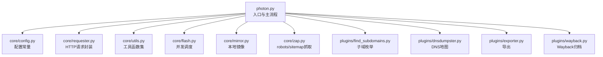
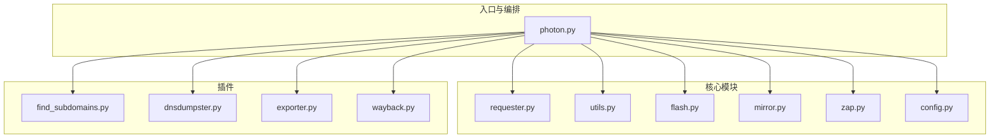
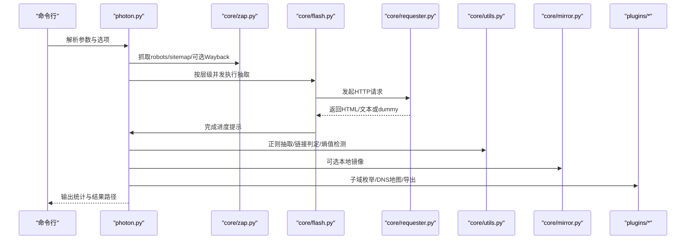
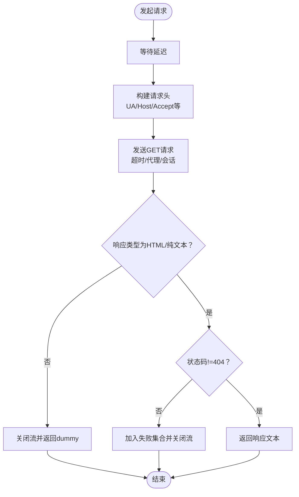
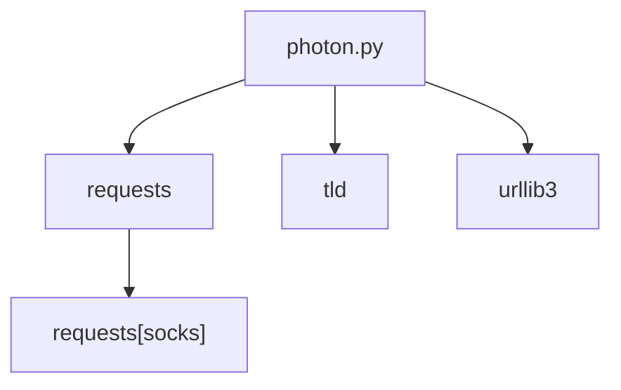

# 开发者指南

<cite>
**本文引用的文件**
- [README.md](file://README.md)
- [photon.py](file://photon.py)
- [requirements.txt](file://requirements.txt)
- [core/__init__.py](file://core/__init__.py)
- [plugins/__init__.py](file://plugins/__init__.py)
- [core/config.py](file://core/config.py)
- [core/requester.py](file://core/requester.py)
- [core/utils.py](file://core/utils.py)
- [core/flash.py](file://core/flash.py)
- [core/mirror.py](file://core/mirror.py)
- [core/zap.py](file://core/zap.py)
- [plugins/find_subdomains.py](file://plugins/find_subdomains.py)
- [plugins/dnsdumpster.py](file://plugins/dnsdumpster.py)
- [plugins/exporter.py](file://plugins/exporter.py)
- [plugins/wayback.py](file://plugins/wayback.py)
</cite>

## 目录
1. [简介](#简介)
2. [项目结构](#项目结构)
3. [核心组件](#核心组件)
4. [架构总览](#架构总览)
5. [详细组件分析](#详细组件分析)
6. [依赖分析](#依赖分析)
7. [性能考虑](#性能考虑)
8. [故障排查指南](#故障排查指南)
9. [结论](#结论)
10. [附录](#附录)

## 简介
本指南面向希望参与Photon开发与贡献的工程师与安全研究者，系统阐述代码结构、开发规范、插件开发流程、测试策略、持续集成配置建议、代码审查标准与质量保障措施，并提供新贡献者的入门路径。Photon是一个用于OSINT（开源情报）的高速爬虫，具备灵活的参数控制、智能线程管理、插件化扩展能力以及结果导出功能。

章节来源
- [README.md:1-176](file://README.md#L1-L176)

## 项目结构
项目采用“入口脚本 + 核心模块 + 插件模块”的分层组织方式：
- 入口脚本：photon.py 负责命令行解析、主流程编排、结果输出与插件调用。
- 核心模块：位于 core/，封装通用能力（请求、并发、工具函数、镜像下载、配置等）。
- 插件模块：位于 plugins/，提供可选功能（子域名枚举、DNS地图、导出、Wayback归档）。

图表来源
- [photon.py:1-426](file://photon.py#L1-L426)
- [core/config.py:1-28](file://core/config.py#L1-L28)
- [core/requester.py:1-73](file://core/requester.py#L1-L73)
- [core/utils.py:1-207](file://core/utils.py#L1-L207)
- [core/flash.py:1-18](file://core/flash.py#L1-L18)
- [core/mirror.py:1-40](file://core/mirror.py#L1-L40)
- [core/zap.py:1-58](file://core/zap.py#L1-L58)
- [plugins/find_subdomains.py:1-15](file://plugins/find_subdomains.py#L1-L15)
- [plugins/dnsdumpster.py:1-23](file://plugins/dnsdumpster.py#L1-L23)
- [plugins/exporter.py:1-25](file://plugins/exporter.py#L1-L25)
- [plugins/wayback.py:1-23](file://plugins/wayback.py#L1-L23)

章节来源
- [photon.py:1-426](file://photon.py#L1-L426)
- [core/__init__.py:1-2](file://core/__init__.py#L1-L2)
- [plugins/__init__.py:1-2](file://plugins/__init__.py#L1-L2)

## 核心组件
- 命令行与主流程：负责参数解析、初始化变量、主循环、结果汇总与导出。
- 请求器：统一处理HTTP请求、超时、重定向、代理、随机UA、响应类型过滤。
- 并发调度：基于ThreadPoolExecutor的批量任务提交与进度提示。
- 工具函数：正则抽取、链接判定、排除规则、熵值检测、头提取、TLD解析、代理校验等。
- 镜像下载：按原始URL层级在本地重建目录并保存页面内容。
- 抓取入口：从 robots.txt、sitemap.xml 以及可选的Wayback归档中收集种子URL。
- 插件：子域枚举、DNS地图生成、JSON/CSV导出、归档URL抓取。

章节来源
- [photon.py:56-117](file://photon.py#L56-L117)
- [core/requester.py:11-73](file://core/requester.py#L11-L73)
- [core/flash.py:6-18](file://core/flash.py#L6-L18)
- [core/utils.py:15-207](file://core/utils.py#L15-L207)
- [core/mirror.py:4-40](file://core/mirror.py#L4-L40)
- [core/zap.py:10-58](file://core/zap.py#L10-L58)
- [plugins/find_subdomains.py:7-15](file://plugins/find_subdomains.py#L7-L15)
- [plugins/dnsdumpster.py:7-23](file://plugins/dnsdumpster.py#L7-L23)
- [plugins/exporter.py:6-25](file://plugins/exporter.py#L6-L25)
- [plugins/wayback.py:8-23](file://plugins/wayback.py#L8-L23)

## 架构总览
下图展示从入口到各核心模块与插件的交互关系，体现“主流程编排 + 可插拔扩展”的设计。

图表来源
- [photon.py:1-426](file://photon.py#L1-L426)
- [core/requester.py:1-73](file://core/requester.py#L1-L73)
- [core/utils.py:1-207](file://core/utils.py#L1-L207)
- [core/flash.py:1-18](file://core/flash.py#L1-L18)
- [core/mirror.py:1-40](file://core/mirror.py#L1-L40)
- [core/zap.py:1-58](file://core/zap.py#L1-L58)
- [core/config.py:1-28](file://core/config.py#L1-L28)
- [plugins/find_subdomains.py:1-15](file://plugins/find_subdomains.py#L1-L15)
- [plugins/dnsdumpster.py:1-23](file://plugins/dnsdumpster.py#L1-L23)
- [plugins/exporter.py:1-25](file://plugins/exporter.py#L1-L25)
- [plugins/wayback.py:1-23](file://plugins/wayback.py#L1-L23)

## 详细组件分析

### 主流程与数据流（photon.py）
- 参数解析与初始化：解析命令行参数，设置线程数、延迟、超时、输出目录、是否仅提取URL、是否启用DNS枚举、是否导出等。
- 种子收集：从robots.txt、sitemap.xml抓取；可选从Wayback归档拉取历史URL；支持用户自定义种子与排除正则。
- 并发爬取：按层级递归，使用并发调度器对每个URL执行抽取逻辑。
- 数据抽取：链接、内/外链、参数化URL、敏感信息（邮箱、社交账号、密钥）、JS文件、端点、自定义正则匹配、高熵字符串。
- 结果处理：去重、过滤、Luhn校验信用卡号、生成镜像（可选）、导出（JSON/CSV）。
- 输出统计：总请求数、耗时、每秒请求数。

图表来源
- [photon.py:108-426](file://photon.py#L108-L426)
- [core/zap.py:10-58](file://core/zap.py#L10-L58)
- [core/flash.py:6-18](file://core/flash.py#L6-L18)
- [core/requester.py:11-73](file://core/requester.py#L11-L73)
- [core/utils.py:15-207](file://core/utils.py#L15-L207)
- [core/mirror.py:4-40](file://core/mirror.py#L4-L40)
- [plugins/find_subdomains.py:7-15](file://plugins/find_subdomains.py#L7-L15)
- [plugins/dnsdumpster.py:7-23](file://plugins/dnsdumpster.py#L7-L23)
- [plugins/exporter.py:6-25](file://plugins/exporter.py#L6-L25)
- [plugins/wayback.py:8-23](file://plugins/wayback.py#L8-L23)

章节来源
- [photon.py:108-426](file://photon.py#L108-L426)

### 请求器（core/requester.py）
- 统一会话与限制：最大重定向次数、关闭SSL验证、流式响应、随机代理与UA。
- 类型过滤：仅对text/html与text/plain进行解析，其他类型直接丢弃。
- 错误处理：捕获重定向异常，状态码404标记失败并关闭响应流。

图表来源
- [core/requester.py:11-73](file://core/requester.py#L11-L73)

章节来源
- [core/requester.py:11-73](file://core/requester.py#L11-L73)

### 并发调度（core/flash.py）
- 使用ThreadPoolExecutor批量提交任务，动态打印进度，避免阻塞主线程。
- 适配不同数据规模，提升吞吐。

章节来源
- [core/flash.py:6-18](file://core/flash.py#L6-L18)

### 工具函数（core/utils.py）
- 正则抽取：支持用户自定义正则，异常时抑制后续执行。
- 链接判定：排除已爬取、锚点、javascript、文件类型（由配置常量定义）。
- 排除正则：对URL集合进行非匹配过滤。
- 写出：将各数据集写入独立txt文件。
- 计时：计算总耗时与平均每次请求耗时。
- 熵值检测：识别高熵字符串（如密钥）。
- XML解析：从sitemap中提取URL。
- 头部解析：从交互输入中提取键值对形式的请求头。
- TLD解析：提取顶级域名。
- 代理校验：支持IP:PORT、域名:PORT与文件列表格式，自动校验连通性。
- Luhn校验：信用卡号校验。
- 代理类型匹配：统一格式化为{"http": "...", "https": "..."}。

章节来源
- [core/utils.py:15-207](file://core/utils.py#L15-L207)

### 镜像下载（core/mirror.py）
- 将远程URL映射到本地目录树，保留查询参数，必要时补全index.html。
- 适用于离线复现与取证。

章节来源
- [core/mirror.py:4-40](file://core/mirror.py#L4-L40)

### 抓取入口（core/zap.py）
- 从robots.txt提取Allow/Disallow规则，拼接绝对URL加入内部待爬集合。
- 从sitemap.xml解析URL并清洗后加入内部集合。
- 可选通过Wayback归档接口获取历史页面作为种子。

章节来源
- [core/zap.py:10-58](file://core/zap.py#L10-L58)

### 插件：子域枚举（plugins/find_subdomains.py）
- 调用第三方站点接口，解析返回的子域列表。

章节来源
- [plugins/find_subdomains.py:7-15](file://plugins/find_subdomains.py#L7-L15)

### 插件：DNS地图（plugins/dnsdumpster.py）
- 获取CSRF令牌，提交目标域名，下载对应的DNS地图PNG图片。

章节来源
- [plugins/dnsdumpster.py:7-23](file://plugins/dnsdumpster.py#L7-L23)

### 插件：导出（plugins/exporter.py）
- 支持JSON与CSV两种导出格式，将数据集写入指定目录。

章节来源
- [plugins/exporter.py:6-25](file://plugins/exporter.py#L6-L25)

### 插件：Wayback归档（plugins/wayback.py）
- 通过CDX接口按时间窗口检索历史页面URL，返回去重后的原始URL列表。

章节来源
- [plugins/wayback.py:8-23](file://plugins/wayback.py#L8-L23)

## 依赖分析
- 运行时依赖：requests、urllib3、tld，可选支持SOCKS代理。
- 版本与兼容性：项目明确要求Python 3.2+，入口脚本在导入阶段进行版本检查。

图表来源
- [requirements.txt:1-4](file://requirements.txt#L1-L4)
- [photon.py:26-30](file://photon.py#L26-L30)

章节来源
- [requirements.txt:1-4](file://requirements.txt#L1-L4)
- [photon.py:26-30](file://photon.py#L26-L30)

## 性能考虑
- 线程池并发：通过并发调度器提升爬取吞吐，需根据目标网站限速与自身资源合理设置线程数。
- 延迟与超时：合理设置请求延迟与超时，避免触发反爬或资源争用。
- 代理与UA：随机UA与代理有助于降低被封风险，但需确保代理可用性与稳定性。
- 响应类型过滤：仅解析HTML/纯文本，减少I/O与解析开销。
- 本地镜像：镜像下载会增加磁盘IO，建议按需开启。
- 排序与去重：利用集合进行去重，降低重复请求概率。

## 故障排查指南
- 无法启动（Python版本过低）：确认运行环境满足Python 3.2+要求。
- 代理无效：检查代理格式与连通性，使用内置代理校验逻辑。
- 导出失败：确认输出目录存在且有写权限，导出模块会创建对应文件。
- 证书相关告警：当前禁用了SSL验证以降低兼容性问题，生产场景建议谨慎处理。
- 404与重定向：请求器对404与过多重定向有处理，若仍异常可调整超时与代理。

章节来源
- [photon.py:26-30](file://photon.py#L26-L30)
- [core/requester.py:47-70](file://core/requester.py#L47-L70)
- [core/utils.py:197-207](file://core/utils.py#L197-L207)
- [plugins/exporter.py:6-25](file://plugins/exporter.py#L6-L25)

## 结论
Photon通过清晰的分层架构与插件化扩展，实现了高性能、可定制的OSINT爬取能力。开发者可依据本文档的规范与流程开展贡献与二次开发，确保代码质量与可维护性。

## 附录

### 开发环境搭建
- 环境要求：Python 3.2+。
- 安装依赖：使用提供的依赖清单安装运行时依赖。
- 克隆仓库：获取源码后即可运行入口脚本进行功能验证。

章节来源
- [requirements.txt:1-4](file://requirements.txt#L1-L4)
- [photon.py:26-30](file://photon.py#L26-L30)

### 代码风格与规范
- 编码：统一使用UTF-8编码。
- 注释：模块级与函数级注释遵循现有风格，保持一致性。
- 命名：函数与变量命名尽量语义化，避免缩写。
- 异常处理：对外部依赖与网络请求进行显式异常捕获与降级处理。
- 日志与输出：使用统一的颜色与提示模块，便于调试与用户反馈。

章节来源
- [photon.py:1-50](file://photon.py#L1-L50)
- [core/requester.py:1-10](file://core/requester.py#L1-L10)
- [core/utils.py:1-12](file://core/utils.py#L1-L12)

### 测试策略
- 单元测试：针对工具函数（如正则抽取、熵值检测、TLD解析、代理校验）编写覆盖用例。
- 集成测试：模拟主流程，验证从robots/sitemap/Wayback抓取到并发抽取再到导出的完整链路。
- 性能测试：在不同线程数与延迟下评估吞吐与稳定性。
- 兼容性测试：在不同Python版本与操作系统上验证运行。

### 持续集成配置建议
- 触发条件：推送与PR均触发CI。
- 环境矩阵：包含多个Python版本与操作系统。
- 步骤建议：安装依赖 → 运行单元测试 → 运行集成测试 → 代码覆盖率报告 → 构建Docker镜像（可选）。
- 产物：测试报告、覆盖率报告、可选镜像制品。

### 插件开发指南
- 目录结构：在plugins/下新增模块，遵循现有命名与导出约定。
- 输入输出：接收必要的参数（如域名、输出目录），返回标准化数据结构或直接写出文件。
- 依赖管理：尽量减少外部依赖，若必须引入，请在依赖清单中声明。
- 调试技巧：使用verbose模式与日志输出定位问题；对网络请求添加超时与重试策略。
- 发布流程：在本地完成测试与文档更新后，提交PR并附带变更说明与测试截图。

章节来源
- [plugins/find_subdomains.py:1-15](file://plugins/find_subdomains.py#L1-L15)
- [plugins/dnsdumpster.py:1-23](file://plugins/dnsdumpster.py#L1-L23)
- [plugins/exporter.py:1-25](file://plugins/exporter.py#L1-L25)
- [plugins/wayback.py:1-23](file://plugins/wayback.py#L1-L23)

### 代码审查标准
- 功能正确性：确保逻辑与预期一致，边界条件处理完备。
- 可读性：注释清晰、命名规范、模块职责单一。
- 性能：避免不必要的I/O与CPU消耗，合理使用并发。
- 安全性：注意输入校验、URL拼接、敏感信息泄露风险。
- 兼容性：关注跨平台与多Python版本的兼容性。
- 文档：补充或更新README中的使用示例与参数说明。

### 质量保证措施
- 提交前自检：运行单元测试与静态检查工具。
- CI自动化：通过流水线执行测试与覆盖率统计。
- 回归测试：对关键路径与修复的缺陷进行回归验证。
- 版本管理：遵循语义化版本与变更日志规范。