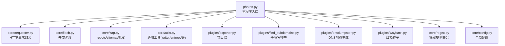
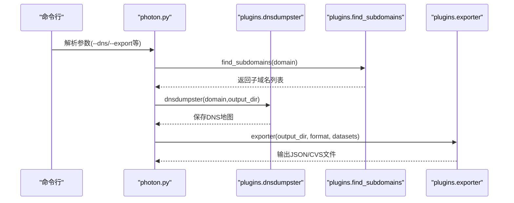
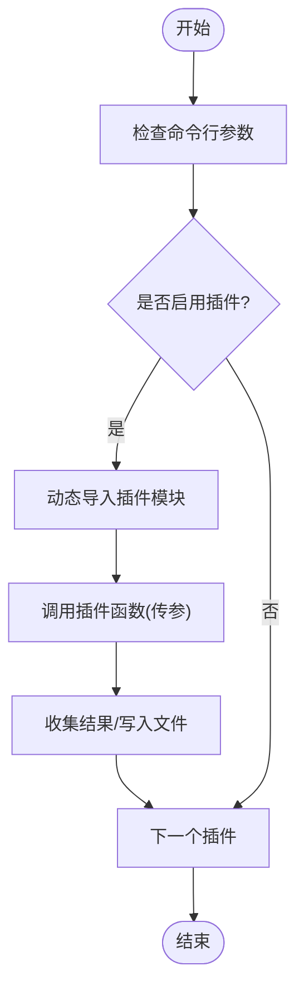
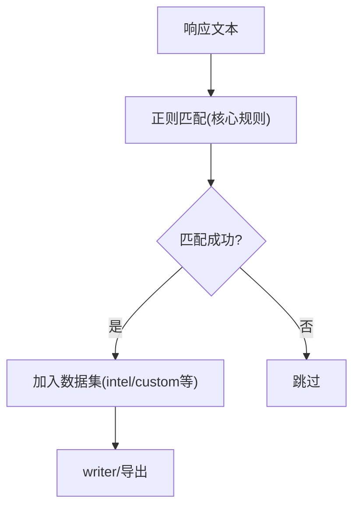
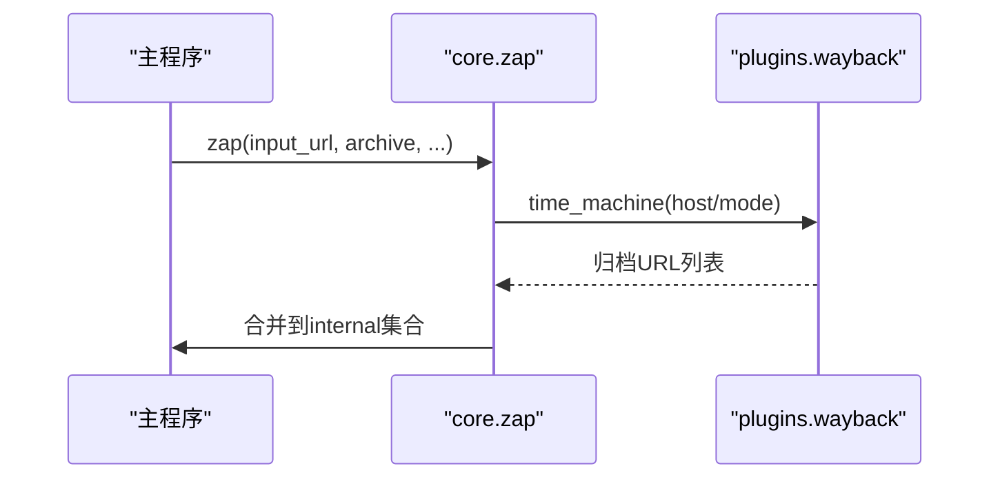
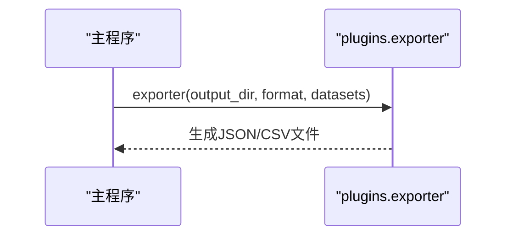
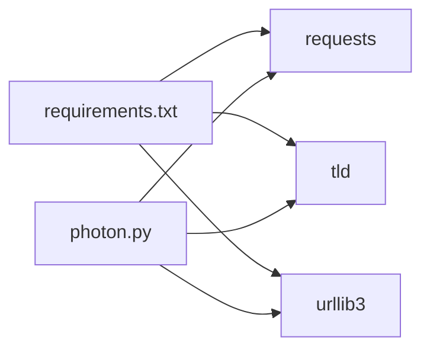

# 插件开发

<cite>
**本文引用的文件**
- [photon.py](file://photon.py)
- [README.md](file://README.md)
- [requirements.txt](file://requirements.txt)
- [plugins/__init__.py](file://plugins/__init__.py)
- [plugins/find_subdomains.py](file://plugins/find_subdomains.py)
- [plugins/exporter.py](file://plugins/exporter.py)
- [plugins/dnsdumpster.py](file://plugins/dnsdumpster.py)
- [plugins/wayback.py](file://plugins/wayback.py)
- [core/__init__.py](file://core/__init__.py)
- [core/utils.py](file://core/utils.py)
- [core/requester.py](file://core/requester.py)
- [core/config.py](file://core/config.py)
- [core/flash.py](file://core/flash.py)
- [core/colors.py](file://core/colors.py)
- [core/regex.py](file://core/regex.py)
- [core/zap.py](file://core/zap.py)
</cite>

## 目录
1. [简介](#简介)
2. [项目结构](#项目结构)
3. [核心组件](#核心组件)
4. [架构总览](#架构总览)
5. [详细组件分析](#详细组件分析)
6. [依赖分析](#依赖分析)
7. [性能考虑](#性能考虑)
8. [故障排查指南](#故障排查指南)
9. [结论](#结论)
10. [附录：插件开发模板与最佳实践](#附录插件开发模板与最佳实践)

## 简介
本指南面向希望为Photon开发插件的开发者，系统阐述插件系统的架构设计、接口规范、生命周期与注册机制，并提供可直接复用的开发模板与示例路径。你将学会：
- 如何实现自定义数据提取功能
- 如何集成新的数据源
- 如何扩展输出格式支持
- 插件调试、测试与性能优化
- 插件打包、分发与版本管理最佳实践

## 项目结构
Photon采用“主程序 + 核心模块 + 插件模块”的分层组织方式：
- 主程序负责参数解析、控制流调度、结果聚合与导出
- 核心模块提供通用工具（请求、正则、并发、配置等）
- 插件模块提供可选能力（DNS枚举、归档种子、导出等）

图表来源
- [photon.py:108-426](file://photon.py#L108-L426)
- [core/requester.py:11-73](file://core/requester.py#L11-L73)
- [core/flash.py:6-18](file://core/flash.py#L6-L18)
- [core/zap.py:10-58](file://core/zap.py#L10-L58)
- [core/utils.py:78-87](file://core/utils.py#L78-L87)
- [plugins/exporter.py:6-25](file://plugins/exporter.py#L6-L25)
- [plugins/find_subdomains.py:7-15](file://plugins/find_subdomains.py#L7-L15)
- [plugins/dnsdumpster.py:7-23](file://plugins/dnsdumpster.py#L7-L23)
- [plugins/wayback.py:8-23](file://plugins/wayback.py#L8-L23)
- [core/regex.py:214-235](file://core/regex.py#L214-L235)
- [core/config.py:3-28](file://core/config.py#L3-L28)

章节来源
- [photon.py:108-426](file://photon.py#L108-L426)
- [README.md:63-67](file://README.md#L63-L67)

## 核心组件
- 主程序控制流与数据集聚合
  - 参数解析、初始化、爬取循环、结果写入与导出
  - 关键路径参考：[photon.py:108-426](file://photon.py#L108-L426)
- 并发执行器
  - 使用线程池并发处理URL，统一进度反馈
  - 参考：[core/flash.py:6-18](file://core/flash.py#L6-L18)
- 请求器
  - 统一封装HTTP请求、超时、代理、随机UA、重定向限制
  - 参考：[core/requester.py:11-73](file://core/requester.py#L11-L73)
- 工具库
  - 写文件、熵值计算、正则匹配、链接过滤、时间统计等
  - 参考：[core/utils.py:78-87](file://core/utils.py#L78-L87)、[core/utils.py:15-24](file://core/utils.py#L15-L24)、[core/utils.py:101-109](file://core/utils.py#L101-L109)
- 正则规则
  - 集成多种情报提取规则（邮箱、哈希、URL变体、端点等）
  - 参考：[core/regex.py:214-235](file://core/regex.py#L214-L235)
- 配置
  - 全局开关与黑名单类型
  - 参考：[core/config.py:3-28](file://core/config.py#L3-L28)

章节来源
- [core/flash.py:6-18](file://core/flash.py#L6-L18)
- [core/requester.py:11-73](file://core/requester.py#L11-L73)
- [core/utils.py:78-87](file://core/utils.py#L78-L87)
- [core/regex.py:214-235](file://core/regex.py#L214-L235)
- [core/config.py:3-28](file://core/config.py#L3-L28)

## 架构总览
Photon通过主程序在不同阶段调用插件，形成“主流程 + 插件扩展”的模式。下图展示了DNS枚举与导出两个典型插件的调用序列。

图表来源
- [photon.py:405-420](file://photon.py#L405-L420)
- [plugins/find_subdomains.py:7-15](file://plugins/find_subdomains.py#L7-L15)
- [plugins/dnsdumpster.py:7-23](file://plugins/dnsdumpster.py#L7-L23)
- [plugins/exporter.py:6-25](file://plugins/exporter.py#L6-L25)

## 详细组件分析

### 插件接口规范与生命周期
- 接口规范
  - 插件函数签名需满足主程序调用约定。例如：
    - 子域名枚举：接收域名，返回列表或集合
      - 参考：[plugins/find_subdomains.py:7-15](file://plugins/find_subdomains.py#L7-L15)
    - DNS地图：接收域名与输出目录，无返回或返回None
      - 参考：[plugins/dnsdumpster.py:7-23](file://plugins/dnsdumpster.py#L7-L23)
    - 导出：接收目录、格式、数据集字典，无返回或返回None
      - 参考：[plugins/exporter.py:6-25](file://plugins/exporter.py#L6-L25)
- 生命周期
  - 加载时机：主程序根据参数动态导入插件模块
    - 参考：[photon.py:405-420](file://photon.py#L405-L420)
  - 执行顺序：按参数启用顺序依次执行
  - 数据传递：通过参数显式传递；导出插件接收统一的数据集字典
    - 参考：[photon.py:397-403](file://photon.py#L397-L403)

图表来源
- [photon.py:405-420](file://photon.py#L405-L420)
- [plugins/exporter.py:6-25](file://plugins/exporter.py#L6-L25)
- [plugins/find_subdomains.py:7-15](file://plugins/find_subdomains.py#L7-L15)
- [plugins/dnsdumpster.py:7-23](file://plugins/dnsdumpster.py#L7-L23)

章节来源
- [photon.py:405-420](file://photon.py#L405-L420)
- [plugins/find_subdomains.py:7-15](file://plugins/find_subdomains.py#L7-L15)
- [plugins/dnsdumpster.py:7-23](file://plugins/dnsdumpster.py#L7-L23)
- [plugins/exporter.py:6-25](file://plugins/exporter.py#L6-L25)

### 自定义数据提取功能
- 在主程序中扩展提取逻辑
  - 可在现有提取流程中插入新规则或替换默认行为
  - 参考：[photon.py:208-288](file://photon.py#L208-L288)
- 利用正则规则库
  - 复用核心正则集合，或新增自定义规则
  - 参考：[core/regex.py:214-235](file://core/regex.py#L214-L235)
- 结果聚合
  - 将提取结果写入统一数据集，供导出使用
  - 参考：[photon.py:397-403](file://photon.py#L397-L403)、[core/utils.py:78-87](file://core/utils.py#L78-L87)

图表来源
- [photon.py:208-288](file://photon.py#L208-L288)
- [core/regex.py:214-235](file://core/regex.py#L214-L235)
- [core/utils.py:78-87](file://core/utils.py#L78-L87)

章节来源
- [photon.py:208-288](file://photon.py#L208-L288)
- [core/regex.py:214-235](file://core/regex.py#L214-L235)
- [core/utils.py:78-87](file://core/utils.py#L78-L87)

### 新数据源集成（以归档种子为例）
- 设计要点
  - 输入：目标主机/域
  - 输出：URL列表
  - 参考：[plugins/wayback.py:8-23](file://plugins/wayback.py#L8-L23)
- 在主流程中接入
  - 通过主程序调用插件并把结果合并到内部URL集合
  - 参考：[core/zap.py:10-58](file://core/zap.py#L10-L58)、[photon.py:309](file://photon.py#L309)

图表来源
- [core/zap.py:10-58](file://core/zap.py#L10-L58)
- [plugins/wayback.py:8-23](file://plugins/wayback.py#L8-L23)

章节来源
- [core/zap.py:10-58](file://core/zap.py#L10-L58)
- [plugins/wayback.py:8-23](file://plugins/wayback.py#L8-L23)

### 输出格式支持扩展（以CSV/JSON为例）
- 设计要点
  - 输入：输出目录、格式字符串、数据集字典
  - 输出：对应格式文件
  - 参考：[plugins/exporter.py:6-25](file://plugins/exporter.py#L6-L25)
- 主程序调用
  - 根据参数选择导出器并传入数据
  - 参考：[photon.py:416-419](file://photon.py#L416-L419)

图表来源
- [photon.py:416-419](file://photon.py#L416-L419)
- [plugins/exporter.py:6-25](file://plugins/exporter.py#L6-L25)

章节来源
- [photon.py:416-419](file://photon.py#L416-L419)
- [plugins/exporter.py:6-25](file://plugins/exporter.py#L6-L25)

## 依赖分析
- 运行时依赖
  - requests、tld、urllib3 等
  - 参考：[requirements.txt:1-4](file://requirements.txt#L1-L4)
- 模块间耦合
  - 主程序与插件通过动态导入解耦
  - 插件之间无直接耦合，仅通过主程序编排
  - 参考：[photon.py:405-420](file://photon.py#L405-L420)

图表来源
- [requirements.txt:1-4](file://requirements.txt#L1-L4)
- [photon.py:405-420](file://photon.py#L405-L420)

章节来源
- [requirements.txt:1-4](file://requirements.txt#L1-L4)
- [photon.py:405-420](file://photon.py#L405-L420)

## 性能考虑
- 并发与限速
  - 使用线程池并发处理URL，合理设置线程数
  - 参考：[core/flash.py:6-18](file://core/flash.py#L6-L18)
  - 请求延时与代理：避免触发反爬策略
  - 参考：[core/requester.py:11-73](file://core/requester.py#L11-L73)
- I/O与写盘
  - 批量写入与编码处理，减少I/O开销
  - 参考：[core/utils.py:78-87](file://core/utils.py#L78-L87)
- 正则复杂度
  - 控制正则匹配范围与数量，避免高复杂度回溯
  - 参考：[core/regex.py:214-235](file://core/regex.py#L214-L235)

## 故障排查指南
- 插件未生效
  - 检查参数是否正确启用插件
  - 参考：[photon.py:405-420](file://photon.py#L405-L420)
- 请求失败或被拒
  - 调整超时、代理、UA，检查网络连通性
  - 参考：[core/requester.py:11-73](file://core/requester.py#L11-L73)
- 导出异常
  - 确认输出目录存在且有写权限
  - 参考：[core/utils.py:78-87](file://core/utils.py#L78-L87)、[plugins/exporter.py:6-25](file://plugins/exporter.py#L6-L25)
- 正则报错
  - 捕获异常并降级处理，避免中断主流程
  - 参考：[core/utils.py:15-24](file://core/utils.py#L15-L24)

章节来源
- [photon.py:405-420](file://photon.py#L405-L420)
- [core/requester.py:11-73](file://core/requester.py#L11-L73)
- [core/utils.py:78-87](file://core/utils.py#L78-L87)
- [plugins/exporter.py:6-25](file://plugins/exporter.py#L6-L25)
- [core/utils.py:15-24](file://core/utils.py#L15-L24)

## 结论
Photon的插件体系以“主程序编排 + 动态插件加载”为核心，具备清晰的接口规范与良好的扩展性。开发者可通过遵循本文的接口约定、生命周期与最佳实践，在不修改主程序的前提下快速集成新的数据源与输出格式，并保证性能与稳定性。

## 附录：插件开发模板与最佳实践

### 开发模板（步骤化）
- 创建插件文件
  - 在 plugins 目录下新建模块文件，如 plugins/my_plugin.py
  - 参考现有插件结构：[plugins/__init__.py](file://plugins/__init__.py)
- 定义插件函数
  - 明确输入参数与返回值，保持幂等与可测试性
  - 参考：[plugins/find_subdomains.py:7-15](file://plugins/find_subdomains.py#L7-L15)、[plugins/exporter.py:6-25](file://plugins/exporter.py#L6-L25)
- 在主程序中注册
  - 根据参数判断是否启用插件，并在合适阶段调用
  - 参考：[photon.py:405-420](file://photon.py#L405-L420)
- 单元测试
  - 对插件函数编写最小可验证用例，覆盖边界场景
  - 参考：[core/requester.py:11-73](file://core/requester.py#L11-L73) 的请求行为作为测试基线
- 性能优化
  - 合理设置并发度与请求延时，避免触发风控
  - 参考：[core/flash.py:6-18](file://core/flash.py#L6-L18)、[core/requester.py:11-73](file://core/requester.py#L11-L73)
- 日志与错误处理
  - 使用统一日志输出，捕获异常并优雅降级
  - 参考：[core/colors.py](file://core/colors.py)、[core/utils.py:15-24](file://core/utils.py#L15-L24)

### 示例路径索引
- 子域名枚举插件
  - [plugins/find_subdomains.py:7-15](file://plugins/find_subdomains.py#L7-L15)
- DNS地图插件
  - [plugins/dnsdumpster.py:7-23](file://plugins/dnsdumpster.py#L7-L23)
- 归档种子插件
  - [plugins/wayback.py:8-23](file://plugins/wayback.py#L8-L23)
- 导出插件
  - [plugins/exporter.py:6-25](file://plugins/exporter.py#L6-L25)
- 主程序调用点
  - [photon.py:405-420](file://photon.py#L405-L420)

### 打包、分发与版本管理最佳实践
- 包装
  - 将插件作为独立模块发布，保持与主程序的低耦合
- 版本兼容
  - 在插件中声明最低依赖版本，确保运行环境一致
  - 参考：[requirements.txt:1-4](file://requirements.txt#L1-L4)
- 文档与示例
  - 提供简短README与最小可用示例，便于用户快速上手
- 发布渠道
  - 可通过PyPI或仓库内Release页面分发，配合CHANGELOG记录变更