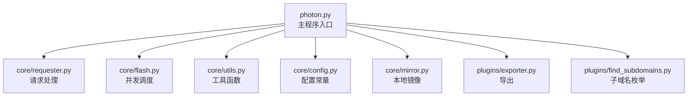
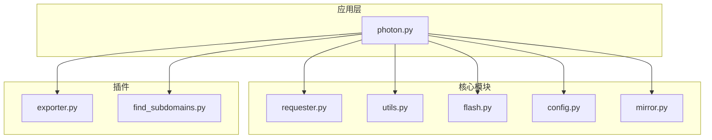
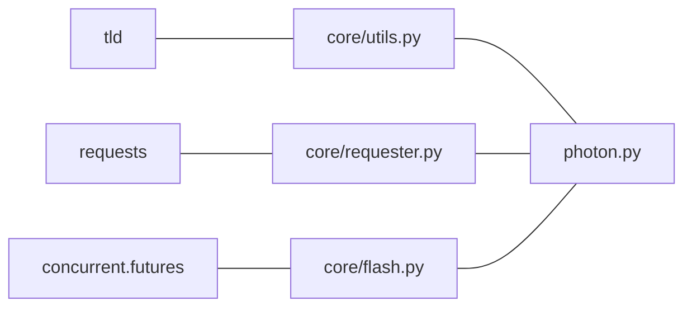

# 测试策略

<cite>
**本文引用的文件**
- [README.md](file://README.md)
- [.travis.yml](file://.travis.yml)
- [requirements.txt](file://requirements.txt)
- [photon.py](file://photon.py)
- [core/requester.py](file://core/requester.py)
- [core/utils.py](file://core/utils.py)
- [core/config.py](file://core/config.py)
- [core/flash.py](file://core/flash.py)
- [core/mirror.py](file://core/mirror.py)
- [plugins/find_subdomains.py](file://plugins/find_subdomains.py)
- [plugins/exporter.py](file://plugins/exporter.py)
</cite>

## 目录
1. [引言](#引言)
2. [项目结构](#项目结构)
3. [核心组件](#核心组件)
4. [架构总览](#架构总览)
5. [详细组件分析](#详细组件分析)
6. [依赖分析](#依赖分析)
7. [性能考虑](#性能考虑)
8. [故障排查指南](#故障排查指南)
9. [结论](#结论)
10. [附录](#附录)

## 引言
本测试策略文档面向Photon项目，旨在建立系统化的测试与质量保证流程。文档覆盖单元测试、集成测试与端到端测试的实施方法，明确测试框架选择、测试用例设计与覆盖率目标，给出持续集成配置与自动化测试流程建议，并提供测试数据准备、模拟服务搭建与测试环境管理指南。同时，针对性能、安全与兼容性测试提出可操作的实施方案。

## 项目结构
Photon采用“主程序 + 核心模块 + 插件”的分层组织方式：
- 主程序入口负责参数解析、流程编排与结果输出
- 核心模块提供网络请求、并发调度、工具函数与配置常量
- 插件模块扩展导出、子域名枚举等能力

图表来源
- [photon.py:1-426](file://photon.py#L1-L426)
- [core/requester.py:1-73](file://core/requester.py#L1-L73)
- [core/flash.py:1-18](file://core/flash.py#L1-L18)
- [core/utils.py:1-207](file://core/utils.py#L1-L207)
- [core/config.py:1-28](file://core/config.py#L1-L28)
- [core/mirror.py:1-40](file://core/mirror.py#L1-L40)
- [plugins/exporter.py:1-25](file://plugins/exporter.py#L1-L25)
- [plugins/find_subdomains.py:1-15](file://plugins/find_subdomains.py#L1-L15)

章节来源
- [photon.py:1-426](file://photon.py#L1-L426)
- [README.md:1-176](file://README.md#L1-L176)

## 核心组件
- 主程序（photon.py）：命令行参数解析、爬取流程控制、结果聚合与导出
- 请求器（core/requester.py）：封装HTTP请求、会话复用、超时与重定向处理
- 并发调度（core/flash.py）：线程池执行、进度反馈
- 工具函数（core/utils.py）：正则匹配、链接过滤、熵值计算、代理校验、时间统计等
- 配置常量（core/config.py）：全局开关与黑名单类型
- 本地镜像（core/mirror.py）：可选的静态站点本地化
- 导出插件（plugins/exporter.py）：JSON/CSS导出
- 子域名插件（plugins/find_subdomains.py）：第三方接口调用

章节来源
- [photon.py:1-426](file://photon.py#L1-L426)
- [core/requester.py:1-73](file://core/requester.py#L1-L73)
- [core/flash.py:1-18](file://core/flash.py#L1-L18)
- [core/utils.py:1-207](file://core/utils.py#L1-L207)
- [core/config.py:1-28](file://core/config.py#L1-L28)
- [core/mirror.py:1-40](file://core/mirror.py#L1-L40)
- [plugins/exporter.py:1-25](file://plugins/exporter.py#L1-L25)
- [plugins/find_subdomains.py:1-15](file://plugins/find_subdomains.py#L1-L15)

## 架构总览
下图展示从主程序到各核心模块与插件的交互关系，以及测试关注点：

图表来源
- [photon.py:1-426](file://photon.py#L1-L426)
- [core/requester.py:1-73](file://core/requester.py#L1-L73)
- [core/utils.py:1-207](file://core/utils.py#L1-L207)
- [core/flash.py:1-18](file://core/flash.py#L1-L18)
- [core/config.py:1-28](file://core/config.py#L1-L28)
- [core/mirror.py:1-40](file://core/mirror.py#L1-L40)
- [plugins/exporter.py:1-25](file://plugins/exporter.py#L1-L25)
- [plugins/find_subdomains.py:1-15](file://plugins/find_subdomains.py#L1-L15)

## 详细组件分析

### 单元测试策略
- 测试范围
  - 工具函数：链接过滤、正则提取、熵值计算、代理校验、时间统计、XML解析、头部解析、顶级域提取
  - 请求器：请求构造、超时/重定向处理、响应类型判断
  - 并发调度：线程池提交、完成回调、进度输出
  - 配置常量：全局开关与类型黑名单
- 测试用例设计
  - 边界与异常：空输入、非法URL、非HTML响应、TooManyRedirects、连接超时
  - 行为验证：is_link对不同后缀的判定、remove_regex排除逻辑、entropy对不同字符串的熵值
  - 稳定性：writer写入、timer除零保护、top_level解析
- 覆盖率目标
  - 关键路径与分支覆盖率不低于80%，核心函数（如requester、is_link、entropy、remove_regex）不低于90%
- 框架选择
  - 推荐pytest + coverage.py；使用unittest.mock进行外部依赖隔离

章节来源
- [core/utils.py:1-207](file://core/utils.py#L1-L207)
- [core/requester.py:1-73](file://core/requester.py#L1-L73)
- [core/flash.py:1-18](file://core/flash.py#L1-L18)
- [core/config.py:1-28](file://core/config.py#L1-L28)

### 集成测试策略
- 测试范围
  - 主程序流程：参数解析、种子URL、层级爬取、JavaScript扫描、结果聚合与导出
  - 插件集成：导出（JSON/CVS）、子域名枚举
  - 并发与资源：多线程调度、会话复用、磁盘IO
- 场景设计
  - 小规模目标站点（如本地静态页面或受控测试站点）
  - 带代理与不带代理两种模式
  - 启用/禁用DNS枚举与导出功能
- 断言内容
  - 输出目录存在且包含预期文件
  - 结果集数量与类型符合预期
  - 进度输出与线程数一致

章节来源
- [photon.py:1-426](file://photon.py#L1-L426)
- [plugins/exporter.py:1-25](file://plugins/exporter.py#L1-L25)
- [plugins/find_subdomains.py:1-15](file://plugins/find_subdomains.py#L1-L15)
- [core/flash.py:1-18](file://core/flash.py#L1-L18)

### 端到端测试策略
- 测试范围
  - 完整命令行工作流：从启动到结果导出
  - 多种参数组合：仅URL、深度、线程、延迟、超时、代理、正则、导出格式、DNS枚举
- 测试环境
  - 使用Docker镜像运行，确保环境一致性
  - 通过挂载卷验证结果持久化
- 断言内容
  - 返回码与标准输出
  - 结果目录结构与文件内容
  - 性能指标（请求速率、总耗时）

章节来源
- [README.md:68-84](file://README.md#L68-L84)
- [photon.py:1421-1426](file://photon.py#L1421-L1426)

### 持续集成与自动化
- 当前CI配置要点
  - 语言与操作系统：Python 3.6，Linux
  - 依赖安装：requirements.txt
  - Lint：flake8（复杂度与行长限制）
  - 执行示例：两条命令行示例用于快速验证
- 建议增强
  - 添加pytest与coverage执行步骤
  - 增加单元测试与集成测试阶段
  - 将导出与DNS枚举作为可选测试项
  - 生成覆盖率报告并设置阈值

章节来源
- [.travis.yml:1-17](file://.travis.yml#L1-L17)
- [requirements.txt:1-4](file://requirements.txt#L1-L4)

### 测试数据准备与模拟服务
- 测试数据
  - 静态HTML页面、含锚点与相对链接的页面
  - 包含敏感信息（高熵字符串）的页面
  - XML站点地图与robots.txt
- 模拟服务
  - 使用HTTP服务器返回固定响应，控制状态码与Content-Type
  - 使用mock库拦截第三方接口（如find_subdomains）
- 测试环境
  - Docker容器内运行，避免主机环境差异
  - 通过卷挂载共享测试数据与结果

### 性能测试
- 目标指标
  - 并发线程数对吞吐的影响
  - 延迟与超时对成功率的影响
  - 磁盘写入对整体性能的影响
- 方法
  - 固定目标站点，改变线程数与延迟
  - 记录请求总数、平均耗时、RPS
  - 对比启用/禁用镜像与导出的差异

### 安全测试
- 输入验证
  - 正则表达式注入、代理格式错误
  - 头部输入的合法性校验
- 外部接口
  - 第三方子域名接口的可用性与稳定性
- 敏感信息
  - 高熵字符串检测与误报率评估

### 兼容性测试
- Python版本：确保在3.6+稳定运行
- 依赖版本：锁定requests、urllib3、tld等关键依赖
- 平台：Linux与Windows下的行为一致性

## 依赖分析
- 外部依赖
  - requests、requests[socks]、urllib3、tld
- 内部耦合
  - 主程序高度依赖核心模块；插件与主程序松耦合
- 风险点
  - 请求器对网络与第三方接口的依赖
  - 并发调度对系统资源的占用

图表来源
- [requirements.txt:1-4](file://requirements.txt#L1-L4)
- [core/requester.py:1-73](file://core/requester.py#L1-L73)
- [core/utils.py:1-207](file://core/utils.py#L1-L207)
- [core/flash.py:1-18](file://core/flash.py#L1-L18)
- [photon.py:1-426](file://photon.py#L1-L426)

## 性能考虑
- 并发模型：线程池大小应与CPU与网络带宽匹配
- I/O优化：批量写入、按需导出
- 资源限制：合理设置超时与最大重定向次数
- 监控指标：RPS、平均响应时间、失败率

## 故障排查指南
- 常见问题
  - 请求超时/连接失败：检查代理、超时与网络连通性
  - 结果为空：确认种子URL、排除规则与层级设置
  - 导出失败：确认输出目录权限与格式参数
- 日志与调试
  - 开启详细输出（verbose）定位问题
  - 分模块断点验证（请求器、工具函数、导出器）

章节来源
- [core/requester.py:1-73](file://core/requester.py#L1-L73)
- [core/utils.py:1-207](file://core/utils.py#L1-L207)
- [plugins/exporter.py:1-25](file://plugins/exporter.py#L1-L25)

## 结论
通过分层测试策略与持续集成流程，Photon可在保证质量的同时提升开发效率。建议优先完善单元与集成测试，逐步引入端到端与性能/安全/兼容性专项测试，并结合覆盖率阈值与CI自动化，形成闭环的质量保障体系。

## 附录
- 测试清单（示例）
  - 单元测试：工具函数、请求器、并发调度、配置常量
  - 集成测试：主流程、导出插件、子域名插件
  - 端到端：Docker环境、命令行参数组合
  - 性能：不同线程数与延迟下的吞吐对比
  - 安全：代理格式、正则注入、敏感信息误报
  - 兼容性：Python版本、依赖版本、平台差异