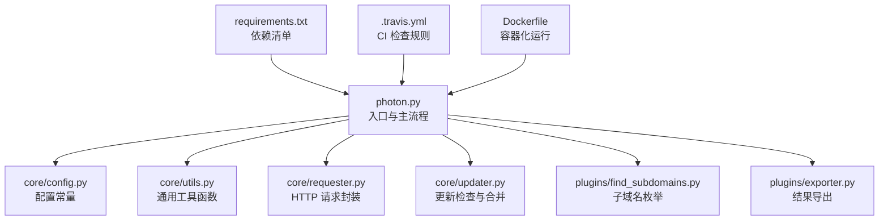
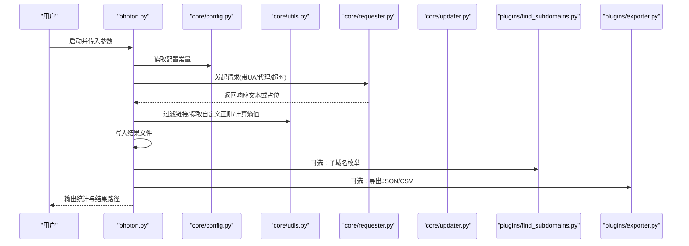
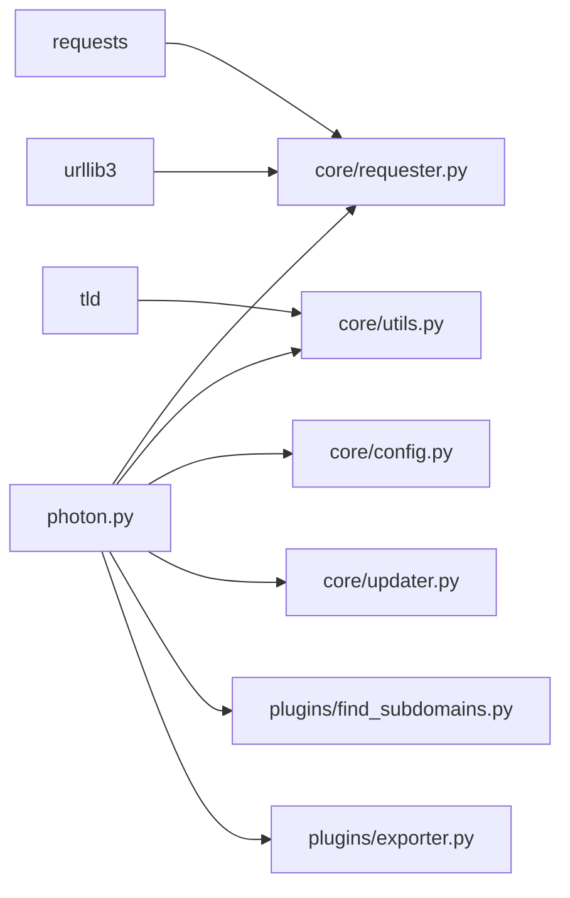

# 贡献流程

<cite>
**本文引用的文件**
- [README.md](file://README.md)
- [CHANGELOG.md](file://CHANGELOG.md)
- [LICENSE.md](file://LICENSE.md)
- [requirements.txt](file://requirements.txt)
- [Dockerfile](file://Dockerfile)
- [.travis.yml](file://.travis.yml)
- [photon.py](file://photon.py)
- [core/config.py](file://core/config.py)
- [core/utils.py](file://core/utils.py)
- [core/requester.py](file://core/requester.py)
- [core/updater.py](file://core/updater.py)
- [plugins/__init__.py](file://plugins/__init__.py)
- [plugins/find_subdomains.py](file://plugins/find_subdomains.py)
- [plugins/exporter.py](file://plugins/exporter.py)
</cite>

## 目录
1. [简介](#简介)
2. [项目结构](#项目结构)
3. [核心组件](#核心组件)
4. [架构总览](#架构总览)
5. [详细组件分析](#详细组件分析)
6. [依赖分析](#依赖分析)
7. [性能考虑](#性能考虑)
8. [故障排查指南](#故障排查指南)
9. [结论](#结论)
10. [附录](#附录)

## 简介
本文件面向希望参与 Photon 项目开发与贡献的开发者，系统性说明贡献流程、开发环境搭建、依赖安装、本地测试、代码审查、问题报告与功能请求提交方式、社区行为准则与沟通渠道，以及新贡献者的入门指导与常见问题解答。Photon 是一款面向 OSINT 的高速爬虫工具，支持多线程、可扩展插件与多种导出格式。

## 项目结构
- 根目录包含入口脚本、Dockerfile、Travis CI 配置、依赖清单与变更日志等。
- 核心模块位于 core 子目录，负责配置、通用工具、网络请求、更新机制等。
- 插件位于 plugins 子目录，提供子域名枚举、结果导出等功能。
- README 提供使用说明与贡献指引；CHANGELOG 记录版本迭代与变更；LICENSE 为 GPLv3 协议全文。

图表来源
- [photon.py:1-426](file://photon.py#L1-L426)
- [core/config.py:1-28](file://core/config.py#L1-L28)
- [core/utils.py:1-207](file://core/utils.py#L1-L207)
- [core/requester.py:1-73](file://core/requester.py#L1-L73)
- [core/updater.py:1-41](file://core/updater.py#L1-L41)
- [plugins/find_subdomains.py:1-15](file://plugins/find_subdomains.py#L1-L15)
- [plugins/exporter.py:1-25](file://plugins/exporter.py#L1-L25)
- [requirements.txt:1-4](file://requirements.txt#L1-L4)
- [.travis.yml:1-17](file://.travis.yml#L1-L17)
- [Dockerfile:1-17](file://Dockerfile#L1-L17)

章节来源
- [README.md:1-176](file://README.md#L1-L176)
- [photon.py:1-426](file://photon.py#L1-L426)

## 核心组件
- 入口与主流程：解析命令行参数、初始化配置、执行爬取与提取、保存结果、按需调用插件与导出。
- 配置模块：定义全局常量（如敏感信息类型、文件类型黑名单）。
- 工具模块：提供正则匹配、链接过滤、输出写入、熵值计算、代理校验、时间统计等。
- 请求模块：统一管理会话、超时、重定向限制、随机 UA、代理轮换与流式响应处理。
- 更新模块：通过远程对比变更标记判断新版本并提示更新。
- 插件系统：以模块化方式扩展功能（子域名枚举、结果导出）。

章节来源
- [photon.py:56-99](file://photon.py#L56-L99)
- [core/config.py:1-28](file://core/config.py#L1-L28)
- [core/utils.py:15-207](file://core/utils.py#L15-L207)
- [core/requester.py:11-73](file://core/requester.py#L11-L73)
- [core/updater.py:8-41](file://core/updater.py#L8-L41)
- [plugins/__init__.py:1-2](file://plugins/__init__.py#L1-L2)

## 架构总览
下图展示从用户输入到数据产出的整体流程，包括参数解析、爬取调度、数据提取、结果保存与插件扩展。

图表来源
- [photon.py:108-426](file://photon.py#L108-L426)
- [core/config.py:1-28](file://core/config.py#L1-L28)
- [core/utils.py:15-207](file://core/utils.py#L15-L207)
- [core/requester.py:11-73](file://core/requester.py#L11-L73)
- [plugins/find_subdomains.py:7-15](file://plugins/find_subdomains.py#L7-L15)
- [plugins/exporter.py:6-25](file://plugins/exporter.py#L6-L25)

## 详细组件分析

### Git 工作流程与分支管理
- 建议采用基于功能的分支命名，例如 feature/xxx、fix/xxx、docs/xxx。
- 在提交前确保通过本地测试与风格检查（见“本地测试”）。
- 提交信息应清晰描述变更目的与影响范围。

[本节为通用实践建议，不直接分析具体文件]

### Pull Request 规范
- PR 必须关联一个已开启的问题或需求。
- 描述中包含变更动机、实现方式、测试方法与潜在风险。
- 保持最小变更集，避免无关格式化改动混入。
- 通过 CI 检查（flake8 与端到端示例）后方可合并。

章节来源
- [README.md:162-176](file://README.md#L162-L176)
- [.travis.yml:14-16](file://.travis.yml#L14-L16)

### 开发环境搭建与依赖安装
- 环境要求：Python 3.6+（入口脚本声明仅支持 Python 3.2+）。
- 安装依赖：使用 pip 安装 requirements.txt 中列出的包。
- Docker 运行：可直接构建镜像并在容器内运行入口脚本，便于隔离环境与复现问题。

章节来源
- [photon.py:26-30](file://photon.py#L26-L30)
- [requirements.txt:1-4](file://requirements.txt#L1-L4)
- [Dockerfile:1-17](file://Dockerfile#L1-L17)

### 本地测试流程
- 语法与复杂度检查：使用 flake8 对项目进行静态检查。
- 功能验证：运行两个示例命令，分别测试正则提取、DNS 枚举、导出与 Wayback 种子等特性。
- 结果确认：检查输出目录是否生成对应文件，统计信息是否合理。

章节来源
- [.travis.yml:6-16](file://.travis.yml#L6-L16)

### 代码审查流程
- 提交 PR 后由维护者进行审查，重点覆盖：逻辑正确性、边界条件、性能影响、安全性与可维护性。
- 审查意见需在规定时间内响应与修正，必要时补充测试用例。

章节来源
- [README.md:162-176](file://README.md#L162-L176)

### 问题报告与功能请求
- 使用 GitHub Issues 提交问题或建议，提供：环境信息、复现步骤、期望行为与实际行为。
- 功能请求请说明使用场景、收益与可能的实现方案。

章节来源
- [README.md:162-176](file://README.md#L162-L176)

### 社区行为准则与沟通渠道
- 项目遵循 GPLv3 许可证，贡献需遵守许可证条款。
- 沟通渠道：GitHub Issues/Wiki、项目主页与公开资源链接。

章节来源
- [LICENSE.md:1-674](file://LICENSE.md#L1-L674)
- [README.md:162-176](file://README.md#L162-L176)

### 新贡献者入门指导
- 从理解入口脚本与核心模块开始，逐步熟悉工具函数、请求封装与更新机制。
- 阅读 CHANGELOG 了解近期变更，有助于把握发展方向与兼容性注意点。
- 从最小可行修改入手（如修复小错误、优化注释），逐步承担更复杂的任务。

章节来源
- [CHANGELOG.md:1-122](file://CHANGELOG.md#L1-L122)
- [photon.py:108-426](file://photon.py#L108-L426)

### 常见问题解答
- 为什么只支持 Python 3.2+？入口脚本对旧版本做了显式检查。
- 如何添加新的导出格式？参考导出插件的实现方式，在导出函数中新增分支。
- 如何扩展子域名枚举源？在插件中新增接口并注册到主流程。

章节来源
- [photon.py:26-30](file://photon.py#L26-L30)
- [plugins/exporter.py:6-25](file://plugins/exporter.py#L6-L25)
- [plugins/find_subdomains.py:7-15](file://plugins/find_subdomains.py#L7-L15)

## 依赖分析
- 外部依赖：requests、urllib3、tld、可选 socks 支持。
- 内部依赖：入口脚本依赖核心模块与插件；核心模块之间存在清晰职责划分。
- CI 依赖：Travis 使用 flake8 与两个示例命令进行质量与功能验证。

图表来源
- [photon.py:15-51](file://photon.py#L15-L51)
- [core/requester.py:4-5](file://core/requester.py#L4-L5)
- [core/utils.py:1-12](file://core/utils.py#L1-L12)
- [requirements.txt:1-4](file://requirements.txt#L1-L4)

章节来源
- [requirements.txt:1-4](file://requirements.txt#L1-L4)
- [core/requester.py:4-5](file://core/requester.py#L4-L5)
- [core/utils.py:1-12](file://core/utils.py#L1-L12)

## 性能考虑
- 线程与并发：主流程通过批量调度函数实现并发抓取，合理设置线程数与延迟可平衡吞吐与稳定性。
- 请求优化：统一会话、限制重定向次数、关闭 SSL 校验、启用 gzip 接收与流式响应，减少内存占用。
- 数据处理：使用集合去重、按需写入文件、避免重复解析与无效请求。

章节来源
- [photon.py:327-330](file://photon.py#L327-L330)
- [core/requester.py:8-73](file://core/requester.py#L8-L73)
- [core/utils.py:78-87](file://core/utils.py#L78-L87)

## 故障排查指南
- 代理不可用：检查代理格式与连通性，使用内置代理校验函数进行验证。
- 超时与重定向：调整超时阈值与重定向限制，避免长时间阻塞。
- 导出失败：确认目标目录权限与磁盘空间，检查导出函数的分支逻辑。
- 更新异常：若更新检测提示新版本但合并失败，手动克隆最新版本并比对差异。

章节来源
- [core/utils.py:197-206](file://core/utils.py#L197-L206)
- [core/requester.py:57-67](file://core/requester.py#L57-L67)
- [plugins/exporter.py:6-25](file://plugins/exporter.py#L6-L25)
- [core/updater.py:8-41](file://core/updater.py#L8-L41)

## 结论
通过明确的贡献流程、完善的开发与测试规范、清晰的插件扩展机制与严格的代码审查，Photon 项目能够持续迭代并保持高质量。新贡献者可从最小修改入手，逐步深入核心模块与插件体系，共同推动项目发展。

## 附录
- 版本变更记录：用于了解功能演进与兼容性变化。
- 许可证：GPLv3，强调自由分发与修改的权利与义务。

章节来源
- [CHANGELOG.md:1-122](file://CHANGELOG.md#L1-L122)
- [LICENSE.md:1-674](file://LICENSE.md#L1-L674)