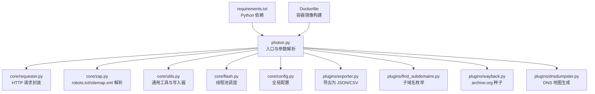
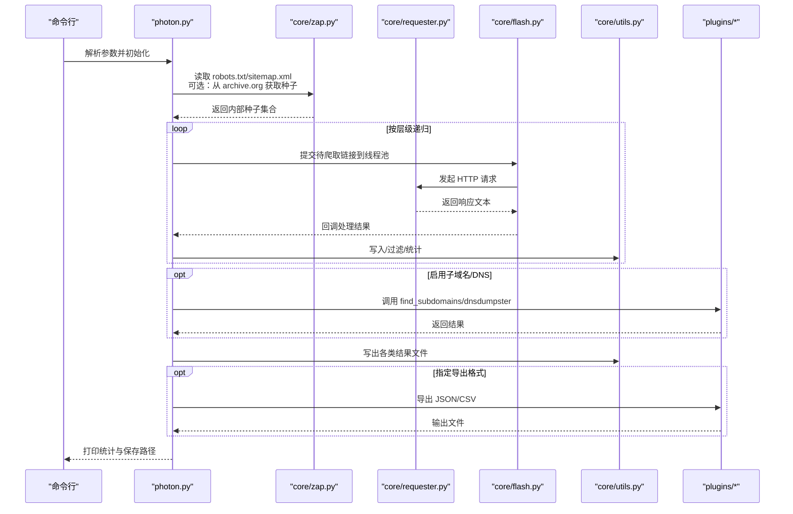
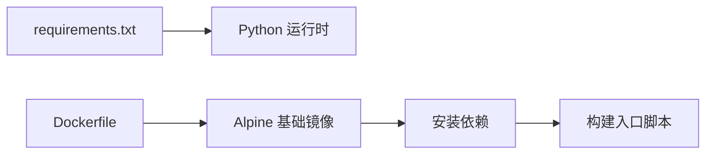

# 快速开始

<cite>
**本文引用的文件**
- [README.md](file://README.md)
- [photon.py](file://photon.py)
- [requirements.txt](file://requirements.txt)
- [Dockerfile](file://Dockerfile)
- [core/config.py](file://core/config.py)
- [core/requester.py](file://core/requester.py)
- [core/utils.py](file://core/utils.py)
- [core/zap.py](file://core/zap.py)
- [core/flash.py](file://core/flash.py)
- [plugins/exporter.py](file://plugins/exporter.py)
- [plugins/find_subdomains.py](file://plugins/find_subdomains.py)
- [plugins/wayback.py](file://plugins/wayback.py)
- [plugins/dnsdumpster.py](file://plugins/dnsdumpster.py)
</cite>

## 目录
1. [简介](#简介)
2. [项目结构](#项目结构)
3. [核心组件](#核心组件)
4. [架构总览](#架构总览)
5. [详细组件分析](#详细组件分析)
6. [依赖分析](#依赖分析)
7. [性能考虑](#性能考虑)
8. [故障排除指南](#故障排除指南)
9. [结论](#结论)
10. [附录](#附录)

## 简介
Photon 是一款面向开源情报（OSINT）的高速爬虫工具，能够从目标网站提取多种类型的数据，包括内/外链、参数化链接、敏感信息（如邮箱、社交媒体账号、AWS 存储桶等）、文件、密钥、JavaScript 文件与其中的端点、自定义正则匹配结果以及子域名与 DNS 相关信息。它支持灵活的参数控制（超时、延迟、种子 URL、排除规则等），并提供导出为 JSON 或 CSV 的能力。同时，项目提供了 Docker 镜像以简化部署。

本“快速开始”指南将帮助你完成环境准备、安装与基本使用，覆盖以下安装方式：
- 从源码安装
- 使用 pip 安装
- 使用 Docker 部署

并提供基础命令行示例，演示如何对简单网站进行爬取与数据提取；随后给出常见使用场景与参数配置建议，并附带故障排除与常见问题解决方案。

## 项目结构
仓库采用按功能模块划分的组织方式：入口脚本位于根目录，核心逻辑与工具函数集中在 core 子目录，扩展功能通过 plugins 子目录实现，Docker 配置与依赖清单分别在根目录提供。

图表来源
- [photon.py:57-99](file://photon.py#L57-L99)
- [core/requester.py:11-73](file://core/requester.py#L11-L73)
- [core/zap.py:10-58](file://core/zap.py#L10-L58)
- [core/utils.py:78-87](file://core/utils.py#L78-L87)
- [core/flash.py:6-18](file://core/flash.py#L6-L18)
- [core/config.py:1-28](file://core/config.py#L1-L28)
- [plugins/exporter.py:6-25](file://plugins/exporter.py#L6-L25)
- [plugins/find_subdomains.py:7-15](file://plugins/find_subdomains.py#L7-L15)
- [plugins/wayback.py:8-23](file://plugins/wayback.py#L8-L23)
- [plugins/dnsdumpster.py:7-23](file://plugins/dnsdumpster.py#L7-L23)
- [requirements.txt:1-4](file://requirements.txt#L1-L4)
- [Dockerfile:1-17](file://Dockerfile#L1-L17)

章节来源
- [photon.py:108-117](file://photon.py#L108-L117)
- [requirements.txt:1-4](file://requirements.txt#L1-L4)
- [Dockerfile:1-17](file://Dockerfile#L1-L17)

## 核心组件
- 命令行参数与入口
  - 入口脚本负责解析命令行参数、初始化运行配置、执行爬取流程并将结果保存到输出目录。
  - 关键参数包括：目标 URL、Cookie、正则模式、导出格式、输出目录、爬取层级、线程数、请求延迟、是否仅提取 URL、是否启用代理、是否添加额外种子、是否仅显示标准输出、是否从 archive.org 获取种子、是否枚举子域名与 DNS 数据、是否仅提取 URL、是否更新等。
- 请求与会话
  - 统一封装 HTTP 请求，设置随机 User-Agent、可选 Cookie、超时、代理、流式响应等，并处理重定向与内容类型过滤。
- 并发调度
  - 使用线程池并发处理待爬取链接，提升整体吞吐。
- 结果写入与导出
  - 将各类抽取结果（内链、外链、文件、敏感信息、端点、密钥、失败列表等）写入文本文件；支持导出为 JSON 或 CSV。
- 插件生态
  - 导出插件：将结果集导出为 JSON/CSV。
  - 子域名枚举：调用第三方接口获取子域名列表。
  - Wayback 插件：从 archive.org 拉取历史页面作为种子。
  - DNSDumpster 插件：生成 DNS 地图图片并保存到输出目录。

章节来源
- [photon.py:57-99](file://photon.py#L57-L99)
- [photon.py:108-117](file://photon.py#L108-L117)
- [core/requester.py:11-73](file://core/requester.py#L11-L73)
- [core/flash.py:6-18](file://core/flash.py#L6-L18)
- [plugins/exporter.py:6-25](file://plugins/exporter.py#L6-L25)
- [plugins/find_subdomains.py:7-15](file://plugins/find_subdomains.py#L7-L15)
- [plugins/wayback.py:8-23](file://plugins/wayback.py#L8-L23)
- [plugins/dnsdumpster.py:7-23](file://plugins/dnsdumpster.py#L7-L23)

## 架构总览
下图展示了从命令行启动到完成爬取与结果保存的整体流程，以及各核心模块之间的交互关系。

图表来源
- [photon.py:308-343](file://photon.py#L308-L343)
- [core/zap.py:10-58](file://core/zap.py#L10-L58)
- [core/requester.py:11-73](file://core/requester.py#L11-L73)
- [core/flash.py:6-18](file://core/flash.py#L6-L18)
- [core/utils.py:78-87](file://core/utils.py#L78-L87)
- [plugins/exporter.py:6-25](file://plugins/exporter.py#L6-L25)
- [plugins/find_subdomains.py:7-15](file://plugins/find_subdomains.py#L7-L15)
- [plugins/dnsdumpster.py:7-23](file://plugins/dnsdumpster.py#L7-L23)

## 详细组件分析

### 命令行与参数解析
- 支持的主要选项与开关
  - 选项：-u/--url、-c/--cookie、-r/--regex、-e/--export、-o/--output、-l/--level、-t/--threads、-d/--delay、-v/--verbose、-s/--seeds、--stdout、--user-agent、--exclude、--timeout、-p/--proxy
  - 开关：--clone、--headers、--dns、--keys、--update、--only-urls、--wayback
- 参数默认值与行为
  - 默认线程数、默认延迟、默认超时、默认输出目录、默认爬取层级等均在入口脚本中设定。
  - 若未提供 URL，程序打印帮助并退出。
  - 支持从 archive.org 获取历史页面作为种子，或手动指定额外种子 URL。
  - 支持导出为 JSON/CSV，或直接将指定数据集输出到标准输出。
- 常见使用场景
  - 基础爬取：提供 -u 目标 URL 即可。
  - 控制资源消耗：调整 -t 线程数与 -d 延迟。
  - 排除特定 URL：使用 --exclude 正则。
  - 仅提取 URL：--only-urls。
  - 从 archive.org 获取种子：--wayback。
  - 枚举子域名与生成 DNS 图：--dns。
  - 导出结果：-e json 或 -e csv。

章节来源
- [photon.py:57-99](file://photon.py#L57-L99)
- [photon.py:108-117](file://photon.py#L108-L117)
- [photon.py:118-144](file://photon.py#L118-L144)
- [photon.py:416-426](file://photon.py#L416-L426)

### 请求与会话管理
- 功能要点
  - 使用会话对象统一管理请求，限制最大重定向次数，避免死循环。
  - 自动设置随机 User-Agent、基础 Accept 头，支持自定义 Cookie、超时、代理与头部。
  - 对响应内容类型进行过滤，仅处理 HTML/纯文本类内容。
  - 对 404 等错误状态进行失败记录。
- 性能与稳定性
  - 通过延迟参数与线程池控制并发，减少对目标服务器的压力。
  - 代理支持自动测试与筛选，确保可用性。

章节来源
- [core/requester.py:11-73](file://core/requester.py#L11-L73)

### 并发调度与进度反馈
- 线程池调度
  - 将待处理链接提交至线程池，按完成顺序输出进度提示。
  - 进度条样式简洁，便于在终端观察执行状态。
- 取消与中断
  - 支持键盘中断优雅退出当前层级的爬取。

章节来源
- [core/flash.py:6-18](file://core/flash.py#L6-L18)

### 结果写入与导出
- 文本文件写入
  - 将各类抽取结果（内链、外链、文件、敏感信息、端点、密钥、失败列表等）分别写入对应文件。
- 导出为 JSON/CSV
  - JSON：将所有数据集序列化为 JSON 字符串并保存。
  - CSV：逐项写入键与值列表，便于导入电子表格工具。

章节来源
- [core/utils.py:78-87](file://core/utils.py#L78-L87)
- [plugins/exporter.py:6-25](file://plugins/exporter.py#L6-L25)

### 插件：子域名枚举与 DNS 地图
- 子域名枚举
  - 调用第三方接口获取子域名列表并保存。
- DNS 地图
  - 生成 DNS 地图图片并保存到输出目录。

章节来源
- [plugins/find_subdomains.py:7-15](file://plugins/find_subdomains.py#L7-L15)
- [plugins/dnsdumpster.py:7-23](file://plugins/dnsdumpster.py#L7-L23)

### 插件：Wayback 历史种子
- 功能说明
  - 从 archive.org 拉取历史页面 URL 作为种子，加速初始发现。
- 使用方式
  - 在入口脚本中通过开关启用，内部根据域名或主机选择查询模式。

章节来源
- [plugins/wayback.py:8-23](file://plugins/wayback.py#L8-L23)
- [core/zap.py:10-22](file://core/zap.py#L10-L22)

## 依赖分析
- Python 依赖
  - requests、requests[socks]、urllib3、tld
- Docker 依赖
  - 基于 Python-Alpine 镜像，自动克隆仓库并安装依赖，入口为 python 入口脚本。

图表来源
- [requirements.txt:1-4](file://requirements.txt#L1-L4)
- [Dockerfile:1-17](file://Dockerfile#L1-L17)

章节来源
- [requirements.txt:1-4](file://requirements.txt#L1-L4)
- [Dockerfile:1-17](file://Dockerfile#L1-L17)

## 性能考虑
- 线程数与延迟
  - 合理设置 -t 与 -d 可在速度与稳定性之间取得平衡，避免触发目标站点的限流或被封禁。
- 代理与头部
  - 使用 -p 指定代理并配合 --user-agent 可降低被识别风险。
- 爬取层级与排除
  - 通过 -l 控制层级，结合 --exclude 过滤无关路径，减少无效请求。
- 导出策略
  - 大规模结果建议导出为 JSON/CSV，便于后续分析与二次处理。

## 故障排除指南
- Python 版本不兼容
  - 现有版本仅支持 Python 3.2 及以上；若低于该版本，程序会提示并退出。
- 无法连接网络或代理不可用
  - 检查代理格式与连通性；程序会对代理进行测试，失败则提示并退出。
- 目标站点返回非 HTML/纯文本内容
  - 请求模块仅处理 HTML/纯文本类型，其他类型会被忽略；可通过调整目标或增加种子解决。
- 权限与输出目录
  - 确保对输出目录具有写权限；程序会在首次运行时创建目录。
- 导出失败
  - 确认导出格式参数正确且磁盘空间充足；JSON/CSV 文件将保存在输出目录中。
- DNS 插件与子域名插件
  - 第三方接口可能受限或变更；如失败，可跳过相关开关或稍后重试。

章节来源
- [photon.py:26-31](file://photon.py#L26-L31)
- [core/requester.py:47-70](file://core/requester.py#L47-L70)
- [core/utils.py:164-180](file://core/utils.py#L164-L180)
- [plugins/exporter.py:6-25](file://plugins/exporter.py#L6-L25)

## 结论
通过本指南，你可以快速完成环境准备与安装，并使用命令行对目标网站进行基础爬取与数据提取。建议从最小化参数开始，逐步引入代理、延迟、层级与导出等功能，以获得更稳定与可控的抓取体验。遇到问题时，优先检查 Python 版本、网络与代理连通性、输出目录权限以及第三方插件的可用性。

## 附录

### 环境要求
- Python 版本：3.2 及以上
- 依赖包：requests、requests[socks]、urllib3、tld

章节来源
- [photon.py:26-31](file://photon.py#L26-L31)
- [requirements.txt:1-4](file://requirements.txt#L1-L4)

### 安装步骤

- 从源码安装
  - 克隆仓库后进入目录，安装依赖，即可直接运行入口脚本。
  - 参考路径：[Dockerfile:9-11](file://Dockerfile#L9-L11)
- 使用 pip 安装
  - 通过包管理器安装依赖后，可直接运行入口脚本。
  - 参考路径：[requirements.txt:1-4](file://requirements.txt#L1-L4)
- 使用 Docker 部署
  - 构建镜像并运行容器，传入目标 URL 与可选参数。
  - 参考路径：[Dockerfile:14-16](file://Dockerfile#L14-L16)

章节来源
- [Dockerfile:9-11](file://Dockerfile#L9-L11)
- [requirements.txt:1-4](file://requirements.txt#L1-L4)
- [Dockerfile:14-16](file://Dockerfile#L14-L16)

### 基本命令行使用示例
- 最小化示例
  - 提供目标 URL，程序将自动创建输出目录并保存结果。
  - 参考路径：[photon.py:108-117](file://photon.py#L108-L117)
- 控制并发与延迟
  - 使用 -t 设置线程数，-d 设置请求延迟，平衡速度与稳定性。
  - 参考路径：[photon.py:66-69](file://photon.py#L66-L69)
- 仅提取 URL
  - 使用 --only-urls 仅收集链接，不进行敏感信息与端点扫描。
  - 参考路径：[photon.py:96-96](file://photon.py#L96-L96)
- 从 archive.org 获取种子
  - 使用 --wayback 以历史页面作为初始种子。
  - 参考路径：[photon.py:98-98](file://photon.py#L98-L98)
- 导出为 JSON/CSV
  - 使用 -e json 或 -e csv 导出结果。
  - 参考路径：[photon.py:62-62](file://photon.py#L62-L62)
- 仅输出到标准输出
  - 使用 --stdout 指定数据集名称，将结果写入标准输出。
  - 参考路径：[photon.py:74-74](file://photon.py#L74-L74)

章节来源
- [photon.py:57-99](file://photon.py#L57-L99)
- [photon.py:108-117](file://photon.py#L108-L117)

### 常见使用场景与参数配置示例
- 场景一：基础爬取
  - 目标：对单个网站进行内链与外链收集。
  - 建议：-u 目标URL；-l 2；-t 2；-d 0；-o 输出目录。
- 场景二：高并发与低延迟
  - 目标：在允许范围内提高速度。
  - 建议：-t 4/-t 8；-d 0.1；必要时使用代理。
- 场景三：排除无关路径
  - 目标：过滤静态资源与特定目录。
  - 建议：--exclude "(\.css|\.js|/static/)"
- 场景四：导出结果
  - 目标：将结果导入分析工具。
  - 建议：-e json 或 -e csv；-o 指定输出目录。
- 场景五：子域名与 DNS
  - 目标：获取子域名并生成 DNS 地图。
  - 建议：--dns；-o 输出目录。

章节来源
- [photon.py:62-62](file://photon.py#L62-L62)
- [photon.py:66-69](file://photon.py#L66-L69)
- [photon.py:74-74](file://photon.py#L74-L74)
- [photon.py:96-96](file://photon.py#L96-L96)
- [photon.py:98-98](file://photon.py#L98-L98)