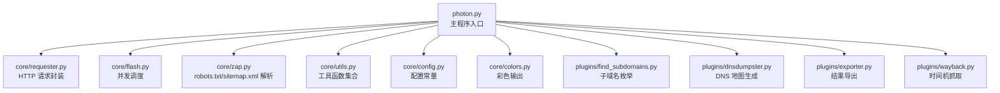
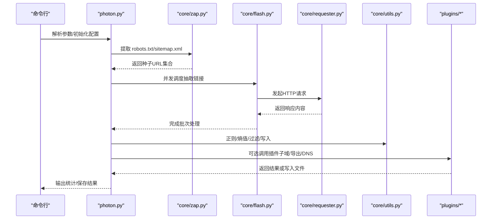
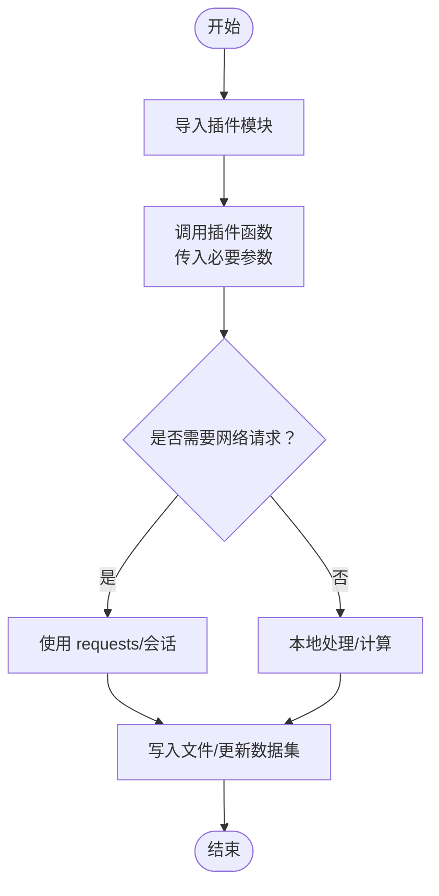
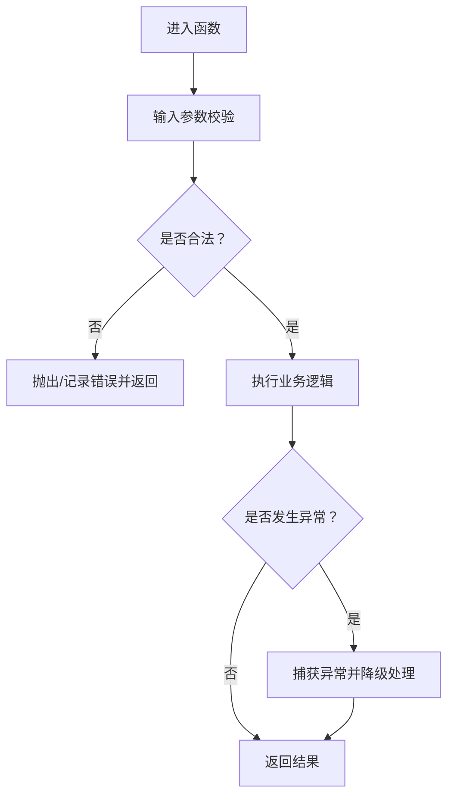
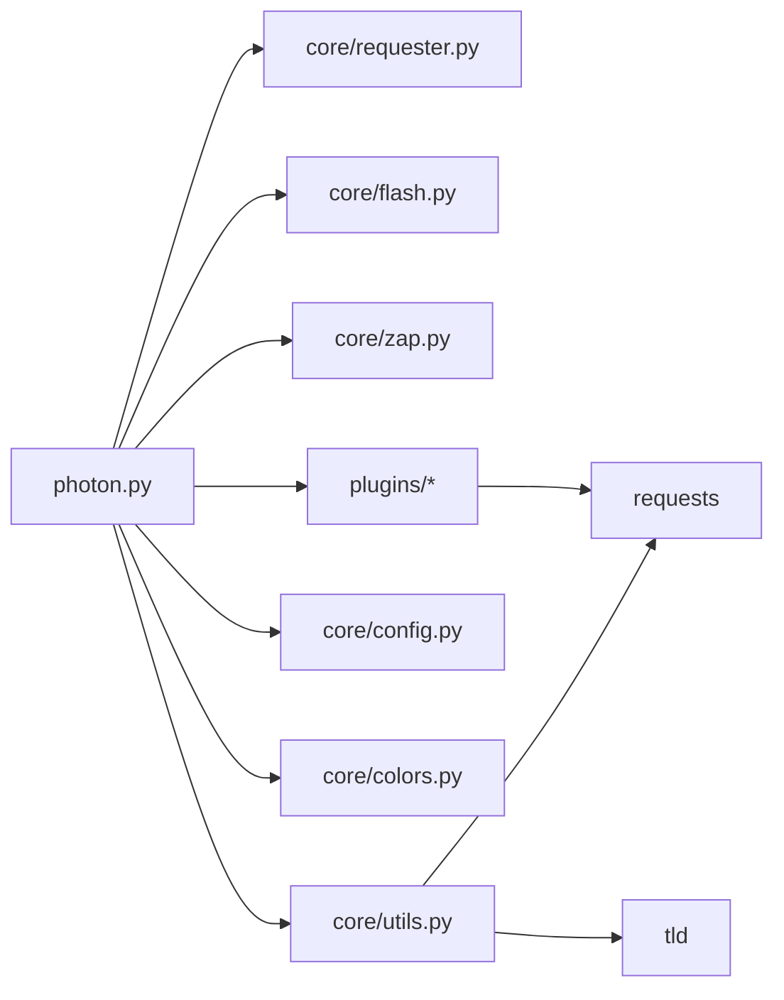

# 插件开发指南

<cite>
**本文引用的文件**
- [README.md](file://README.md)
- [photon.py](file://photon.py)
- [requirements.txt](file://requirements.txt)
- [core/__init__.py](file://core/__init__.py)
- [core/colors.py](file://core/colors.py)
- [core/config.py](file://core/config.py)
- [core/utils.py](file://core/utils.py)
- [core/requester.py](file://core/requester.py)
- [core/flash.py](file://core/flash.py)
- [core/zap.py](file://core/zap.py)
- [plugins/__init__.py](file://plugins/__init__.py)
- [plugins/find_subdomains.py](file://plugins/find_subdomains.py)
- [plugins/dnsdumpster.py](file://plugins/dnsdumpster.py)
- [plugins/exporter.py](file://plugins/exporter.py)
- [plugins/wayback.py](file://plugins/wayback.py)
</cite>

## 目录
1. [简介](#简介)
2. [项目结构](#项目结构)
3. [核心组件](#核心组件)
4. [架构总览](#架构总览)
5. [详细组件分析](#详细组件分析)
6. [依赖关系分析](#依赖关系分析)
7. [性能考量](#性能考量)
8. [故障排查指南](#故障排查指南)
9. [结论](#结论)
10. [附录](#附录)

## 简介
本指南面向希望为 Photon 开发插件的开发者，提供从环境搭建、项目结构规范、编码标准到插件模板使用、接口实现、配置参数与错误处理机制的完整教程。文档还涵盖核心模块工具函数与 API 的使用方式、插件测试与调试技巧，并通过简单到复杂的功能示例帮助你完成从入门到进阶的开发路径。最后给出插件打包、分发与版本管理的最佳实践。

## 项目结构
Photon 采用“主程序 + 核心模块 + 插件模块”的分层组织方式：
- 主程序入口负责命令行参数解析、流程编排与结果输出。
- 核心模块提供通用能力：网络请求、并发调度、工具函数、颜色输出、配置常量等。
- 插件模块提供可扩展的功能点，如子域名枚举、DNS 地图生成、导出器、Wayback 时间机等。

图表来源
- [photon.py:1-426](file://photon.py#L1-L426)
- [core/requester.py:1-73](file://core/requester.py#L1-L73)
- [core/flash.py:1-18](file://core/flash.py#L1-L18)
- [core/zap.py:1-58](file://core/zap.py#L1-L58)
- [core/utils.py:1-207](file://core/utils.py#L1-L207)
- [core/config.py:1-28](file://core/config.py#L1-L28)
- [core/colors.py:1-19](file://core/colors.py#L1-L19)
- [plugins/find_subdomains.py:1-15](file://plugins/find_subdomains.py#L1-L15)
- [plugins/dnsdumpster.py:1-23](file://plugins/dnsdumpster.py#L1-L23)
- [plugins/exporter.py:1-25](file://plugins/exporter.py#L1-L25)
- [plugins/wayback.py:1-23](file://plugins/wayback.py#L1-L23)

章节来源
- [README.md:1-176](file://README.md#L1-L176)
- [photon.py:1-426](file://photon.py#L1-L426)

## 核心组件
- 命令行参数与运行时控制：主程序解析参数、设置全局变量（线程数、超时、延迟、代理、种子 URL 等），并驱动爬取流程。
- 并发调度：通过线程池对链接进行并发处理，提升吞吐。
- 请求封装：统一的 HTTP 请求器，支持随机 UA、Cookie、Headers、超时、代理与流式响应。
- 工具函数：正则匹配、熵值计算、URL 过滤、XML 解析、头提取、代理校验、Luhn 校验等。
- 配置常量：全局开关与白名单/黑名单类型列表。
- 输出与颜色：跨平台彩色输出，便于日志与进度提示。
- 插件集成点：在主程序中按需导入并调用插件函数，形成可插拔扩展。

章节来源
- [photon.py:56-117](file://photon.py#L56-L117)
- [core/flash.py:6-17](file://core/flash.py#L6-L17)
- [core/requester.py:11-72](file://core/requester.py#L11-L72)
- [core/utils.py:15-207](file://core/utils.py#L15-L207)
- [core/config.py:1-28](file://core/config.py#L1-L28)
- [core/colors.py:1-19](file://core/colors.py#L1-L19)

## 架构总览
下图展示了主程序与核心模块、插件模块之间的交互关系，以及数据在各模块间的流转。

图表来源
- [photon.py:308-343](file://photon.py#L308-L343)
- [core/zap.py:10-58](file://core/zap.py#L10-L58)
- [core/flash.py:6-17](file://core/flash.py#L6-L17)
- [core/requester.py:11-72](file://core/requester.py#L11-L72)
- [core/utils.py:78-87](file://core/utils.py#L78-L87)
- [plugins/exporter.py:6-25](file://plugins/exporter.py#L6-L25)

## 详细组件分析

### 插件模板与接口规范
- 插件应位于 plugins 目录下，每个插件是一个独立模块，提供明确的函数签名与返回值约定。
- 插件在主程序中通过动态导入并调用，例如：
  - 子域名枚举：在主程序中导入并调用对应函数，接收目标域名为参数，返回子域列表。
  - DNS 地图生成：接收域名与输出目录，下载并保存图片。
  - 导出器：接收输出目录、导出格式与数据集字典，写出 JSON 或 CSV 文件。
  - Wayback 时间机：接收主机名与模式，返回归档 URL 列表。

图表来源
- [photon.py:405-419](file://photon.py#L405-L419)
- [plugins/find_subdomains.py:7-14](file://plugins/find_subdomains.py#L7-L14)
- [plugins/dnsdumpster.py:7-22](file://plugins/dnsdumpster.py#L7-L22)
- [plugins/exporter.py:6-24](file://plugins/exporter.py#L6-L24)
- [plugins/wayback.py:8-22](file://plugins/wayback.py#L8-L22)

章节来源
- [plugins/__init__.py:1-2](file://plugins/__init__.py#L1-L2)
- [photon.py:405-419](file://photon.py#L405-L419)

### 必需接口与配置参数定义
- 接口约定
  - 子域名枚举：函数接收域名字符串，返回子域列表。
  - DNS 地图：函数接收域名与输出目录，无返回或写入文件。
  - 导出器：函数接收目录、格式与数据集字典，无返回或写入文件。
  - Wayback：函数接收主机与模式，返回 URL 列表。
- 参数来源
  - 主程序通过命令行参数传递配置，插件在被调用时接收这些参数。
  - 插件内部可使用核心模块提供的工具函数与常量，确保一致的行为与输出格式。

章节来源
- [photon.py:56-99](file://photon.py#L56-L99)
- [plugins/find_subdomains.py:7-14](file://plugins/find_subdomains.py#L7-L14)
- [plugins/dnsdumpster.py:7-22](file://plugins/dnsdumpster.py#L7-L22)
- [plugins/exporter.py:6-24](file://plugins/exporter.py#L6-L24)
- [plugins/wayback.py:8-22](file://plugins/wayback.py#L8-L22)

### 错误处理机制
- 请求异常：请求器对重定向过多等异常进行捕获并返回占位值，避免中断流程。
- 代理校验：对代理地址进行格式匹配与连通性测试，失败则跳过或报错。
- 正则异常：自定义正则提取时对异常进行捕获并抑制后续执行。
- 文件写入：统一使用工具函数进行写入，确保编码与换行处理正确。

图表来源
- [core/requester.py:47-67](file://core/requester.py#L47-L67)
- [core/utils.py:17-24](file://core/utils.py#L17-L24)
- [core/utils.py:197-205](file://core/utils.py#L197-L205)

章节来源
- [core/requester.py:11-72](file://core/requester.py#L11-L72)
- [core/utils.py:15-24](file://core/utils.py#L15-L24)
- [core/utils.py:197-205](file://core/utils.py#L197-L205)

### 使用核心模块工具函数与 API
- 并发调度：使用线程池对链接进行并发处理，支持进度打印。
- 请求封装：统一的 HTTP 请求器，支持随机 UA、Cookie、Headers、超时、代理与流式响应。
- 工具函数：正则匹配、熵值计算、URL 过滤、XML 解析、头提取、代理校验、Luhn 校验等。
- 配置常量：全局开关与白名单/黑名单类型列表。
- 输出与颜色：跨平台彩色输出，便于日志与进度提示。

章节来源
- [core/flash.py:6-17](file://core/flash.py#L6-L17)
- [core/requester.py:11-72](file://core/requester.py#L11-L72)
- [core/utils.py:15-207](file://core/utils.py#L15-L207)
- [core/config.py:1-28](file://core/config.py#L1-L28)
- [core/colors.py:1-19](file://core/colors.py#L1-L19)

### 插件测试方法与调试技巧
- 单元测试：针对插件函数编写最小化测试，覆盖正常路径与异常路径。
- 集成测试：在主程序中启用相应开关，验证插件与核心模块的协同工作。
- 调试技巧：
  - 启用详细输出以观察中间状态。
  - 使用代理与超时参数模拟网络异常。
  - 对外部服务调用增加重试与降级策略。
  - 将结果写入临时目录，便于比对与回溯。

章节来源
- [photon.py:166-174](file://photon.py#L166-L174)
- [core/utils.py:197-205](file://core/utils.py#L197-L205)

### 开发示例

#### 示例一：简单功能插件（子域名枚举）
- 目标：从第三方服务抓取子域名并返回列表。
- 关键点：函数签名清晰，参数为域名；返回子域列表；注意异常与空结果处理。
- 参考实现位置：[plugins/find_subdomains.py:7-14](file://plugins/find_subdomains.py#L7-L14)

章节来源
- [plugins/find_subdomains.py:1-15](file://plugins/find_subdomains.py#L1-L15)

#### 示例二：数据处理插件（导出器）
- 目标：将内部数据集导出为 JSON 或 CSV。
- 关键点：接收目录、格式与数据集字典；根据格式分支写出文件；注意编码与换行。
- 参考实现位置：[plugins/exporter.py:6-24](file://plugins/exporter.py#L6-L24)

章节来源
- [plugins/exporter.py:1-25](file://plugins/exporter.py#L1-L25)

#### 示例三：复杂数据处理插件（DNS 地图生成）
- 目标：登录并抓取 DNS 地图图片，保存到指定目录。
- 关键点：解析 CSRF Token、构造会话、发送 POST、下载图片并写入文件。
- 参考实现位置：[plugins/dnsdumpster.py:7-22](file://plugins/dnsdumpster.py#L7-L22)

章节来源
- [plugins/dnsdumpster.py:1-23](file://plugins/dnsdumpster.py#L1-L23)

#### 示例四：时间机插件（Wayback）
- 目标：查询归档站点 URL 列表。
- 关键点：构造时间范围、拼接查询 URL、解析 JSON、过滤重复项。
- 参考实现位置：[plugins/wayback.py:8-22](file://plugins/wayback.py#L8-L22)

章节来源
- [plugins/wayback.py:1-23](file://plugins/wayback.py#L1-L23)

## 依赖关系分析
- 外部依赖：requests、urllib3、tld 等，用于 HTTP 请求、URL 解析与顶级域名提取。
- 内部依赖：主程序依赖核心模块与插件模块；核心模块之间存在工具函数复用；插件模块依赖 requests 与正则表达式。

图表来源
- [requirements.txt:1-4](file://requirements.txt#L1-L4)
- [photon.py:32-51](file://photon.py#L32-L51)
- [core/utils.py:1-12](file://core/utils.py#L1-L12)
- [plugins/exporter.py:1-4](file://plugins/exporter.py#L1-L4)

章节来源
- [requirements.txt:1-4](file://requirements.txt#L1-L4)
- [photon.py:32-51](file://photon.py#L32-L51)

## 性能考量
- 并发与限速：合理设置线程数与请求延迟，避免触发目标站点限流或自身资源耗尽。
- 代理与超时：使用有效代理与适配超时，提高稳定性与成功率。
- 结果缓存：对外部服务的重复请求可做本地缓存，减少网络开销。
- 数据写入：批量写入与编码处理优化，避免频繁 I/O 操作。

## 故障排查指南
- 代理不可用：检查代理格式与连通性，必要时禁用代理或更换代理。
- 请求异常：关注重定向过多、超时、状态码非 200 等情况，适当放宽限制或调整策略。
- 正则异常：用户自定义正则可能导致异常，建议捕获并抑制后续执行。
- 文件写入：统一使用工具函数进行写入，确保编码与换行处理正确。

章节来源
- [core/utils.py:17-24](file://core/utils.py#L17-L24)
- [core/requester.py:47-67](file://core/requester.py#L47-L67)
- [core/utils.py:197-205](file://core/utils.py#L197-L205)

## 结论
通过本指南，你可以基于 Photon 的核心模块与插件架构，快速开发符合规范的插件。遵循接口约定、参数定义与错误处理机制，结合工具函数与 API，能够高效完成从简单到复杂的各类功能插件开发。同时，配合测试与调试技巧，确保插件在真实场景中的稳定性与可靠性。

## 附录

### 开发环境搭建
- Python 版本：Python 3.2+
- 依赖安装：使用 pip 安装 requirements.txt 中列出的包。
- 仓库克隆：从官方仓库获取源码，参考 README 的使用说明与贡献指南。

章节来源
- [README.md:1-176](file://README.md#L1-L176)
- [requirements.txt:1-4](file://requirements.txt#L1-L4)

### 项目结构规范与编码标准
- 目录结构：插件统一放置于 plugins 目录，每个插件为独立模块。
- 函数命名：清晰语义化，参数与返回值明确。
- 异常处理：对外部依赖与用户输入进行健壮性处理。
- 输出格式：遵循主程序统一的输出目录与文件命名规则。

章节来源
- [plugins/__init__.py:1-2](file://plugins/__init__.py#L1-L2)
- [core/utils.py:78-87](file://core/utils.py#L78-L87)

### 插件打包、分发与版本管理最佳实践
- 打包：遵循 Python 包规范，提供清晰的模块与依赖声明。
- 分发：通过 PyPI 或发行版渠道发布，保持版本号语义化。
- 版本管理：使用 Git 标签与变更日志，明确破坏性变更与修复。

章节来源
- [README.md:162-176](file://README.md#L162-L176)