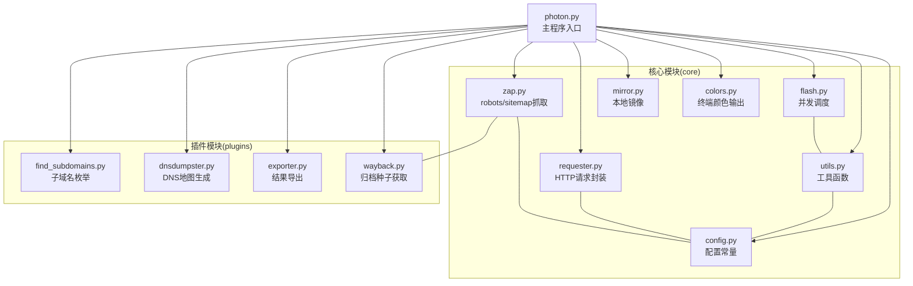
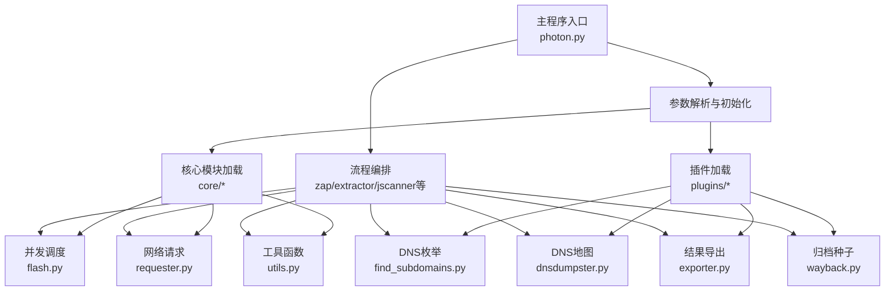
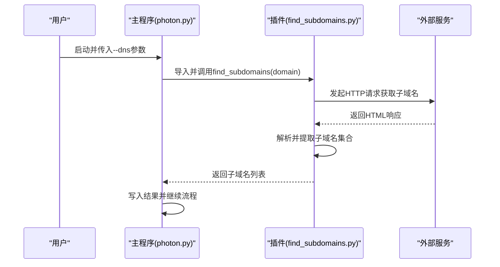
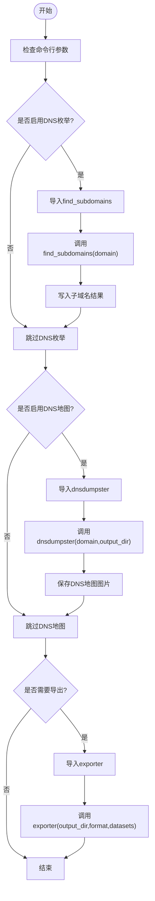
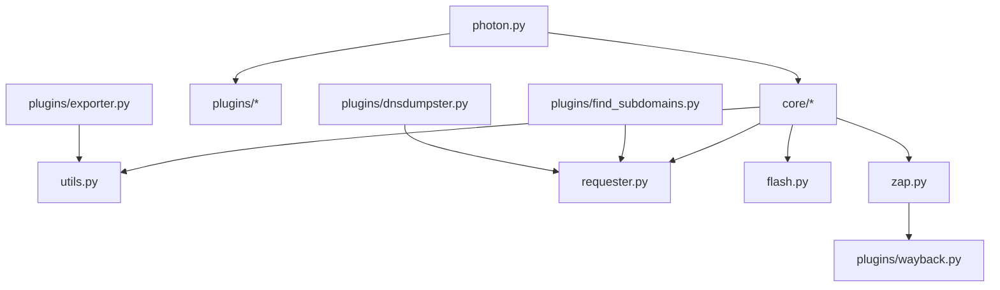

# 插件架构设计

<cite>
**本文档引用的文件**
- [photon.py](file://photon.py)
- [README.md](file://README.md)
- [plugins/__init__.py](file://plugins/__init__.py)
- [plugins/find_subdomains.py](file://plugins/find_subdomains.py)
- [plugins/dnsdumpster.py](file://plugins/dnsdumpster.py)
- [plugins/exporter.py](file://plugins/exporter.py)
- [plugins/wayback.py](file://plugins/wayback.py)
- [core/__init__.py](file://core/__init__.py)
- [core/config.py](file://core/config.py)
- [core/utils.py](file://core/utils.py)
- [core/requester.py](file://core/requester.py)
- [core/flash.py](file://core/flash.py)
- [core/zap.py](file://core/zap.py)
- [core/mirror.py](file://core/mirror.py)
- [core/colors.py](file://core/colors.py)
</cite>

## 目录
1. [引言](#引言)
2. [项目结构](#项目结构)
3. [核心组件](#核心组件)
4. [架构总览](#架构总览)
5. [详细组件分析](#详细组件分析)
6. [依赖分析](#依赖分析)
7. [性能考虑](#性能考虑)
8. [故障排除指南](#故障排除指南)
9. [结论](#结论)
10. [附录](#附录)

## 引言
本文件系统性阐述Photon插件架构的设计理念与实现细节，重点覆盖以下方面：
- 插件注册机制：通过命令行参数触发插件调用，采用显式导入与按需执行的方式实现“注册”。
- 加载流程：在主程序运行时根据用户输入动态加载插件模块，并传递必要的上下文数据。
- 生命周期管理：插件在主程序特定阶段（如DNS枚举、结果导出）被调用，完成任务后即结束。
- 接口规范与扩展点：插件以独立模块形式存在，遵循统一的函数签名约定；主程序通过明确的调用点与数据结构进行集成。
- 与主程序交互：通过函数调用与数据传递实现松耦合协作；未使用事件驱动或回调框架。
- 依赖注入与配置管理：主程序将运行参数、配置常量与工具函数作为依赖注入到插件；配置集中于core/config.py。
- 错误传播机制：插件内部异常由调用方捕获并处理，未实现统一的错误分发或回调。

该设计强调简单、可维护与可扩展，适合OSINT场景下的功能模块化扩展。

## 项目结构
Photon采用“核心引擎 + 插件模块”的分层组织方式：
- 核心模块（core）：提供通用能力（网络请求、并发调度、工具函数、配置等），为插件提供基础设施。
- 插件模块（plugins）：提供可选功能（DNS枚举、导出、归档种子等），以独立模块形式存在。
- 主程序入口（photon.py）：解析参数、协调流程、按需加载并调用插件。

图表来源
- [photon.py:1-426](file://photon.py#L1-L426)
- [core/config.py:1-28](file://core/config.py#L1-L28)
- [core/utils.py:1-207](file://core/utils.py#L1-L207)
- [core/requester.py:1-73](file://core/requester.py#L1-L73)
- [core/flash.py:1-18](file://core/flash.py#L1-L18)
- [core/zap.py:1-58](file://core/zap.py#L1-L58)
- [core/mirror.py:1-40](file://core/mirror.py#L1-L40)
- [core/colors.py:1-19](file://core/colors.py#L1-L19)
- [plugins/find_subdomains.py:1-15](file://plugins/find_subdomains.py#L1-L15)
- [plugins/dnsdumpster.py:1-23](file://plugins/dnsdumpster.py#L1-L23)
- [plugins/exporter.py:1-25](file://plugins/exporter.py#L1-L25)
- [plugins/wayback.py:1-23](file://plugins/wayback.py#L1-L23)

章节来源
- [photon.py:1-426](file://photon.py#L1-L426)
- [README.md:63-67](file://README.md#L63-L67)

## 核心组件
- 配置中心（core/config.py）
  - 定义全局开关与常量，如调试开关、敏感类型过滤列表、外部站点域名白名单等。
  - 为其他模块提供统一配置入口，降低硬编码耦合度。
- 工具集（core/utils.py）
  - 提供正则抽取、链接过滤、结果写入、熵值计算、代理校验、时间统计等通用能力。
  - 为插件与主流程提供可复用的辅助函数。
- 请求器（core/requester.py）
  - 封装HTTP请求逻辑，支持随机User-Agent、超时控制、代理选择、重定向限制等。
  - 作为插件与外部服务交互的基础能力。
- 并发调度（core/flash.py）
  - 基于线程池并发执行任务，负责进度打印与资源回收。
  - 插件调用通过此模块实现并行化。
- 抓取入口（core/zap.py）
  - 从robots.txt与sitemap.xml提取种子URL；在启用归档模式时调用插件获取历史URL。
- 镜像功能（core/mirror.py）
  - 可选的本地镜像保存能力，便于离线分析。
- 终端输出（core/colors.py）
  - 跨平台的颜色输出封装，提升用户体验。

章节来源
- [core/config.py:1-28](file://core/config.py#L1-L28)
- [core/utils.py:1-207](file://core/utils.py#L1-L207)
- [core/requester.py:1-73](file://core/requester.py#L1-L73)
- [core/flash.py:1-18](file://core/flash.py#L1-L18)
- [core/zap.py:1-58](file://core/zap.py#L1-L58)
- [core/mirror.py:1-40](file://core/mirror.py#L1-L40)
- [core/colors.py:1-19](file://core/colors.py#L1-L19)

## 架构总览
Photon插件架构采用“主程序驱动 + 模块化插件”的设计。主程序在运行期根据用户参数决定是否加载并调用插件，插件以独立模块存在，仅通过函数调用与数据传递与主程序交互，不引入额外的事件总线或回调框架。

图表来源
- [photon.py:1-426](file://photon.py#L1-L426)
- [core/flash.py:1-18](file://core/flash.py#L1-L18)
- [core/requester.py:1-73](file://core/requester.py#L1-L73)
- [core/utils.py:1-207](file://core/utils.py#L1-L207)
- [plugins/find_subdomains.py:1-15](file://plugins/find_subdomains.py#L1-L15)
- [plugins/dnsdumpster.py:1-23](file://plugins/dnsdumpster.py#L1-L23)
- [plugins/exporter.py:1-25](file://plugins/exporter.py#L1-L25)
- [plugins/wayback.py:1-23](file://plugins/wayback.py#L1-L23)

## 详细组件分析

### 插件接口规范与扩展点
- 规范形态
  - 插件为独立Python模块，包含一个或多个公开函数，函数签名与职责明确。
  - 主程序通过显式导入并调用插件函数，形成“扩展点”。
- 扩展点位置
  - DNS枚举：在主程序中根据参数动态导入并调用子域名枚举插件。
  - DNS地图：在主程序中根据参数动态导入并调用DNS地图生成插件。
  - 结果导出：在主程序中根据参数动态导入并调用导出插件。
  - 归档种子：在核心抓取模块中调用插件以获取历史URL作为种子。

图表来源
- [photon.py:405-411](file://photon.py#L405-L411)
- [plugins/find_subdomains.py:1-15](file://plugins/find_subdomains.py#L1-L15)

章节来源
- [photon.py:405-411](file://photon.py#L405-L411)
- [plugins/find_subdomains.py:1-15](file://plugins/find_subdomains.py#L1-L15)

### 插件加载与生命周期管理
- 注册机制
  - 通过命令行参数触发插件加载，主程序在相应阶段动态导入插件模块。
- 生命周期
  - 初始化：主程序解析参数并准备上下文。
  - 执行：在指定流程节点调用插件函数。
  - 清理：插件执行完毕，返回结果给主程序，不保留状态。
- 典型流程
  - DNS枚举：主程序在需要时导入并调用子域名枚举插件，完成后写入结果。
  - DNS地图：主程序在需要时导入并调用DNS地图生成插件，下载图片并保存。
  - 结果导出：主程序在需要时导入并调用导出插件，将数据集导出为JSON或CSV。
  - 归档种子：核心抓取模块在启动时调用归档插件获取历史URL。

图表来源
- [photon.py:405-420](file://photon.py#L405-L420)
- [plugins/find_subdomains.py:1-15](file://plugins/find_subdomains.py#L1-L15)
- [plugins/dnsdumpster.py:1-23](file://plugins/dnsdumpster.py#L1-L23)
- [plugins/exporter.py:1-25](file://plugins/exporter.py#L1-L25)

章节来源
- [photon.py:405-420](file://photon.py#L405-L420)

### 插件与主程序的交互方式
- 数据传递
  - 主程序将目标域、输出目录、数据集等作为参数传递给插件。
  - 插件返回处理结果（如子域名列表、布尔成功标志等）。
- 并发与网络
  - 插件通过主程序提供的请求器或直接使用requests库发起HTTP请求。
  - 并发由主程序统一调度，插件无需关心线程管理。
- 输出与日志
  - 插件可直接打印信息，或通过主程序的日志工具输出。

章节来源
- [core/requester.py:1-73](file://core/requester.py#L1-L73)
- [core/flash.py:1-18](file://core/flash.py#L1-L18)
- [plugins/dnsdumpster.py:1-23](file://plugins/dnsdumpster.py#L1-L23)

### 依赖注入与配置管理
- 依赖注入
  - 主程序将运行参数（如输出目录、导出格式）、数据集、工具函数等作为依赖注入到插件。
  - 插件不直接访问全局状态，仅依赖传入的参数与返回值。
- 配置管理
  - 配置集中在core/config.py，插件通过导入该模块获取常量与开关。
  - 工具函数（如正则抽取、链接过滤、写入结果等）集中于core/utils.py，插件可直接调用。

章节来源
- [core/config.py:1-28](file://core/config.py#L1-L28)
- [core/utils.py:1-207](file://core/utils.py#L1-L207)

### 错误传播机制
- 插件内部异常处理
  - 插件内部可能抛出异常（如网络请求失败、解析错误等），主程序在调用处捕获并记录失败信息。
- 失败回退
  - 对于DNS地图等非关键功能，主程序在插件失败时继续执行后续流程。
- 统一输出
  - 主程序汇总所有结果并统一输出统计信息与保存路径。

章节来源
- [photon.py:405-420](file://photon.py#L405-L420)
- [plugins/dnsdumpster.py:1-23](file://plugins/dnsdumpster.py#L1-L23)

## 依赖分析
- 模块内聚与耦合
  - 插件模块与核心模块保持低耦合：插件仅依赖主程序传入的参数与返回值。
  - 核心模块之间通过工具函数与配置共享实现高内聚。
- 外部依赖
  - requests用于HTTP请求；concurrent.futures用于并发；re、json等标准库用于解析与序列化。
- 循环依赖
  - 未发现循环导入；插件与核心模块单向依赖主程序。

图表来源
- [photon.py:1-426](file://photon.py#L1-L426)
- [core/utils.py:1-207](file://core/utils.py#L1-L207)
- [core/requester.py:1-73](file://core/requester.py#L1-L73)
- [core/flash.py:1-18](file://core/flash.py#L1-L18)
- [core/zap.py:1-58](file://core/zap.py#L1-L58)
- [plugins/find_subdomains.py:1-15](file://plugins/find_subdomains.py#L1-L15)
- [plugins/dnsdumpster.py:1-23](file://plugins/dnsdumpster.py#L1-L23)
- [plugins/exporter.py:1-25](file://plugins/exporter.py#L1-L25)
- [plugins/wayback.py:1-23](file://plugins/wayback.py#L1-L23)

章节来源
- [photon.py:1-426](file://photon.py#L1-L426)

## 性能考虑
- 并发策略
  - 使用线程池并发执行URL提取与扫描任务，提高吞吐量。
- 网络优化
  - 请求器内置超时、代理与User-Agent轮换，减少被反爬拦截风险。
- I/O优化
  - 结果写入采用批量写入，避免频繁I/O。
- 资源控制
  - 通过参数控制线程数、延迟与超时，平衡性能与稳定性。

章节来源
- [core/flash.py:1-18](file://core/flash.py#L1-L18)
- [core/requester.py:1-73](file://core/requester.py#L1-L73)
- [core/utils.py:78-87](file://core/utils.py#L78-L87)

## 故障排除指南
- 插件调用失败
  - 检查命令行参数是否正确启用对应插件。
  - 查看主程序输出的进度与错误提示，确认插件导入与调用是否成功。
- DNS地图导出异常
  - 确认网络连通性与外部服务可用性。
  - 检查输出目录权限与磁盘空间。
- 导出格式问题
  - 确认导出格式参数与数据集结构一致。
  - 检查导出插件对空值与特殊字符的处理。

章节来源
- [photon.py:405-420](file://photon.py#L405-L420)
- [plugins/dnsdumpster.py:1-23](file://plugins/dnsdumpster.py#L1-L23)
- [plugins/exporter.py:1-25](file://plugins/exporter.py#L1-L25)

## 结论
Photon插件架构以“主程序驱动 + 模块化插件”为核心思想，通过命令行参数触发插件加载，以函数调用与数据传递实现松耦合协作。该设计简洁、可维护且易于扩展，适合在OSINT场景下快速集成新功能。未来可在现有基础上引入更完善的错误传播与事件机制，进一步增强插件生态的健壮性与可观测性。

## 附录
- 插件清单与用途
  - 子域名枚举：从第三方服务获取子域名列表。
  - DNS地图：生成并保存DNS地图图片。
  - 结果导出：将数据集导出为JSON或CSV。
  - 归档种子：从互联网档案馆获取历史URL作为种子。

章节来源
- [README.md:63-67](file://README.md#L63-L67)
- [plugins/find_subdomains.py:1-15](file://plugins/find_subdomains.py#L1-L15)
- [plugins/dnsdumpster.py:1-23](file://plugins/dnsdumpster.py#L1-L23)
- [plugins/exporter.py:1-25](file://plugins/exporter.py#L1-L25)
- [plugins/wayback.py:1-23](file://plugins/wayback.py#L1-L23)