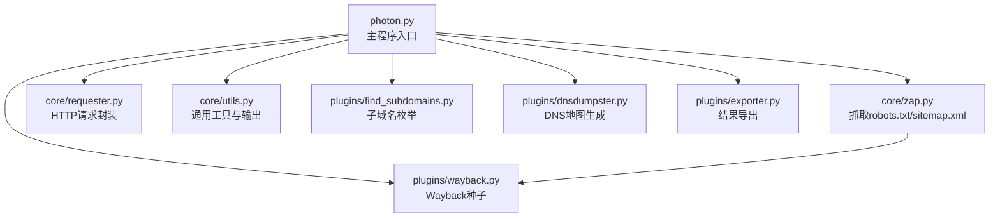
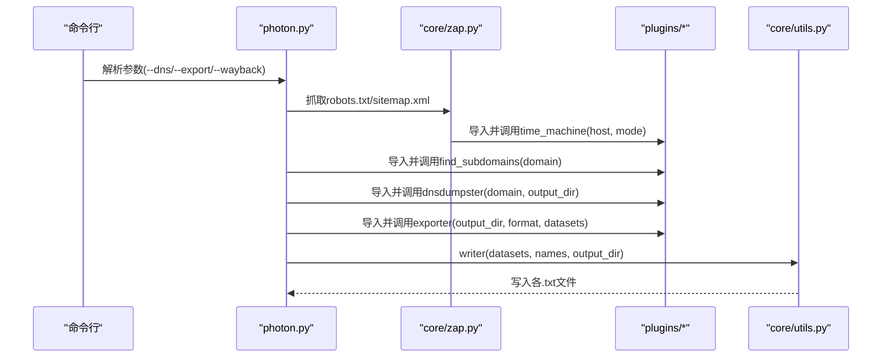
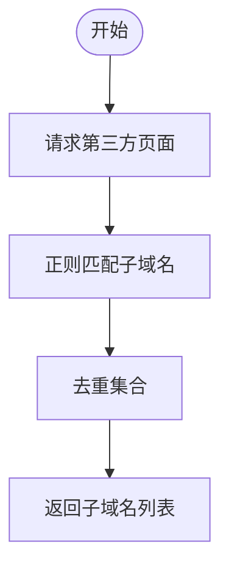
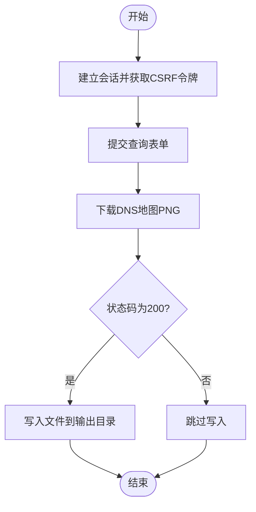
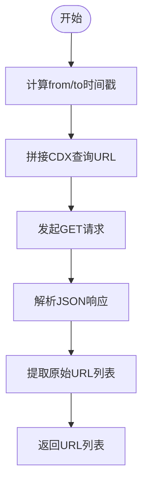
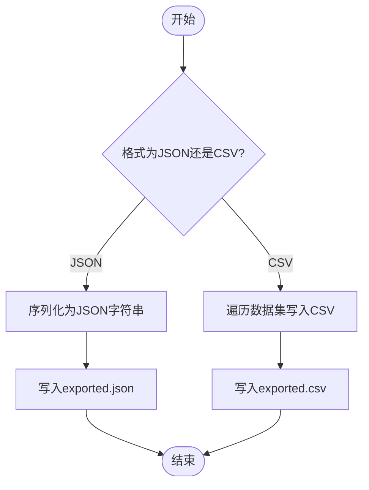
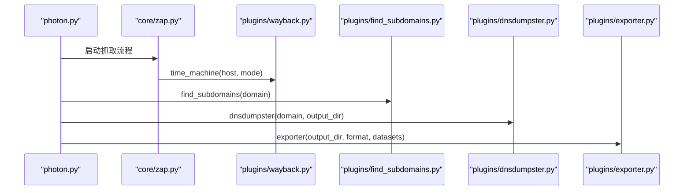
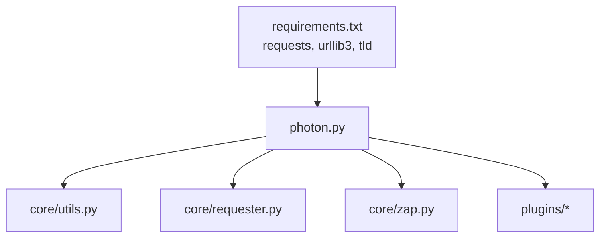

# 插件系统

<cite>
**本文引用的文件**
- [photon.py](file://photon.py)
- [README.md](file://README.md)
- [requirements.txt](file://requirements.txt)
- [plugins/__init__.py](file://plugins/__init__.py)
- [plugins/dnsdumpster.py](file://plugins/dnsdumpster.py)
- [plugins/exporter.py](file://plugins/exporter.py)
- [plugins/find_subdomains.py](file://plugins/find_subdomains.py)
- [plugins/wayback.py](file://plugins/wayback.py)
- [core/zap.py](file://core/zap.py)
- [core/utils.py](file://core/utils.py)
- [core/requester.py](file://core/requester.py)
- [core/config.py](file://core/config.py)
- [core/colors.py](file://core/colors.py)
</cite>

## 目录
1. [简介](#简介)
2. [项目结构](#项目结构)
3. [核心组件](#核心组件)
4. [架构总览](#架构总览)
5. [详细组件分析](#详细组件分析)
6. [依赖分析](#依赖分析)
7. [性能考虑](#性能考虑)
8. [故障排查指南](#故障排查指南)
9. [结论](#结论)
10. [附录：插件开发指南](#附录插件开发指南)

## 简介
本文件系统性阐述Photon的插件架构与扩展机制，覆盖插件的组织方式、接口约定、生命周期管理、错误处理以及开发规范。Photon通过在主程序中按需导入插件模块，实现功能的可插拔扩展，当前内置插件包括：
- DNS枚举插件：从第三方服务抓取子域名与DNS地图
- 数据导出插件：将结果集导出为JSON或CSV
- Wayback存档插件：从archive.org抓取历史URL作为种子

同时，本文提供插件开发模板、API调用示例路径、最佳实践与常见问题排查建议，帮助开发者快速构建符合Photon生态的插件。

## 项目结构
Photon采用“主程序 + 核心模块 + 插件模块”的分层组织方式：
- 主程序负责参数解析、流程编排、结果写入与插件集成点
- 核心模块提供网络请求、正则提取、输出格式化、颜色打印等通用能力
- 插件模块提供独立的功能扩展，按需被主程序导入并执行

图表来源
- [photon.py:405-421](file://photon.py#L405-L421)
- [core/zap.py:7](file://core/zap.py#L7)
- [core/requester.py:11-73](file://core/requester.py#L11-L73)
- [core/utils.py:78-87](file://core/utils.py#L78-L87)

章节来源
- [photon.py:56-99](file://photon.py#L56-L99)
- [README.md:63-67](file://README.md#L63-L67)

## 核心组件
- 主程序（photon.py）：命令行参数解析、爬取流程控制、结果聚合与持久化、插件调用点
- 插件模块（plugins/）：独立功能模块，遵循统一的函数签名与返回约定
- 核心模块（core/）：网络请求、日志输出、通用工具、配置常量

关键职责划分：
- 请求与线程调度：由主程序统一管理，插件仅暴露纯函数接口
- 结果写入：统一通过writer函数写入文本文件；导出插件负责JSON/CSV格式化
- 插件生命周期：按需导入、执行、返回数据或副作用（如文件写入）

章节来源
- [photon.py:376-421](file://photon.py#L376-L421)
- [core/utils.py:78-87](file://core/utils.py#L78-L87)

## 架构总览
Photon的插件架构遵循“主程序驱动 + 按需加载 + 纯函数接口”的设计原则。主程序在不同阶段调用插件，插件完成特定任务后返回数据或产生副作用（如文件写入），最终由主程序统一汇总与导出。

图表来源
- [photon.py:405-421](file://photon.py#L405-L421)
- [core/zap.py:10-22](file://core/zap.py#L10-L22)
- [core/utils.py:78-87](file://core/utils.py#L78-L87)

## 详细组件分析

### DNS枚举插件（find_subdomains）
- 功能概述：从第三方服务抓取目标域的子域名列表
- 接口定义：接收域名字符串，返回去重后的子域名列表
- 调用位置：主程序在启用--dns时导入并调用
- 处理逻辑要点：
  - 使用正则从页面中提取子域名
  - 去重并返回列表
- 错误处理：未见显式异常捕获，建议在调用处增加try/except

图表来源
- [plugins/find_subdomains.py:7-14](file://plugins/find_subdomains.py#L7-L14)

章节来源
- [plugins/find_subdomains.py:1-15](file://plugins/find_subdomains.py#L1-L15)
- [photon.py:405-411](file://photon.py#L405-L411)

### DNS地图插件（dnsdumpster）
- 功能概述：抓取并保存DNS地图图片到指定目录
- 接口定义：接收域名与输出目录，无返回值（产生文件副作用）
- 调用位置：主程序在启用--dns时导入并调用
- 处理逻辑要点：
  - 获取CSRF令牌并构造会话
  - 提交表单查询目标域名
  - 下载对应PNG地图并写入文件
- 错误处理：未见显式异常捕获，建议在下载与写入环节增加try/except

图表来源
- [plugins/dnsdumpster.py:7-23](file://plugins/dnsdumpster.py#L7-L23)

章节来源
- [plugins/dnsdumpster.py:1-23](file://plugins/dnsdumpster.py#L1-L23)
- [photon.py:412-414](file://photon.py#L412-L414)

### Wayback存档插件（wayback）
- 功能概述：从archive.org检索目标主机的历史HTML页面URL
- 接口定义：接收主机名与匹配模式，返回URL列表
- 调用位置：由core/zap.py在启用--wayback时导入并调用
- 处理逻辑要点：
  - 计算时间范围（from/to）
  - 组装CDX查询URL并发起GET请求
  - 解析JSON响应，提取原始URL
- 错误处理：未见显式异常捕获，建议在请求与解析环节增加try/except

图表来源
- [plugins/wayback.py:8-22](file://plugins/wayback.py#L8-L22)
- [core/zap.py:12-22](file://core/zap.py#L12-L22)

章节来源
- [plugins/wayback.py:1-23](file://plugins/wayback.py#L1-L23)
- [core/zap.py:7-22](file://core/zap.py#L7-L22)

### 数据导出插件（exporter）
- 功能概述：将内部数据集导出为JSON或CSV
- 接口定义：接收输出目录、导出格式、数据字典，无返回值（产生文件副作用）
- 调用位置：主程序在启用--export时导入并调用
- 处理逻辑要点：
  - JSON：序列化为字符串并写入exported.json
  - CSV：逐项写入键与值（None值单独一行）
- 错误处理：未见显式异常捕获，建议在文件写入环节增加try/except

图表来源
- [plugins/exporter.py:6-24](file://plugins/exporter.py#L6-L24)

章节来源
- [plugins/exporter.py:1-25](file://plugins/exporter.py#L1-L25)
- [photon.py:416-419](file://photon.py#L416-L419)

### 主程序集成点与生命周期
- 生命周期阶段：
  - 初始化：解析参数、准备输出目录、设置全局配置
  - 抓取阶段：调用core/zap.py抓取robots.txt/sitemap.xml，并在启用--wayback时调用wayback插件
  - 爬取阶段：多级递归爬取、提取信息、扫描JavaScript端点
  - 结果阶段：聚合数据集、写入文本文件、按需导出JSON/CSV、按需枚举DNS
- 插件调用时机：
  - --dns：调用find_subdomains与dnsdumpster
  - --export：调用exporter
  - --wayback：由core/zap.py调用wayback

图表来源
- [photon.py:405-421](file://photon.py#L405-L421)
- [core/zap.py:12-22](file://core/zap.py#L12-L22)

章节来源
- [photon.py:308-342](file://photon.py#L308-L342)
- [photon.py:405-421](file://photon.py#L405-L421)

## 依赖分析
- 外部依赖：requests、urllib3、tld
- 内部依赖：
  - 主程序依赖核心模块进行网络请求、输出与通用工具
  - 插件之间无直接依赖，均通过主程序导入
  - 插件与核心模块的耦合度低，便于替换与扩展

图表来源
- [requirements.txt:1-4](file://requirements.txt#L1-L4)
- [photon.py:32-51](file://photon.py#L32-L51)

章节来源
- [requirements.txt:1-4](file://requirements.txt#L1-L4)
- [photon.py:32-51](file://photon.py#L32-L51)

## 性能考虑
- 并发与延迟：主程序通过线程池并发执行爬取任务，可通过--threads与--delay调节
- 请求超时：默认超时可由--timeout配置，避免长时间阻塞
- 代理支持：支持HTTP/SOCKS代理，提升稳定性与匿名性
- 输出策略：writer统一写入文本文件，导出插件在内存中序列化后再落盘，注意大数据集的内存占用

章节来源
- [photon.py:62-82](file://photon.py#L62-L82)
- [photon.py:122-143](file://photon.py#L122-L143)
- [core/requester.py:11-73](file://core/requester.py#L11-L73)

## 故障排查指南
- 插件导入失败
  - 症状：运行时报错找不到模块
  - 排查：确认插件文件位于plugins目录且命名正确
  - 参考：主程序中按需导入插件的写法
- 网络请求异常
  - 症状：超时、连接失败、重定向过多
  - 排查：检查--timeout、--delay、代理配置；在插件中增加异常捕获
  - 参考：core/requester.py的异常处理与默认头设置
- 导出失败
  - 症状：JSON/CSV写入失败
  - 排查：确认输出目录权限与磁盘空间；在插件中增加try/except
- DNS/DNS地图导出为空
  - 症状：未生成地图文件
  - 排查：检查目标域名是否有效、网络连通性、CSRF令牌获取

章节来源
- [photon.py:405-421](file://photon.py#L405-L421)
- [core/requester.py:47-70](file://core/requester.py#L47-L70)
- [plugins/dnsdumpster.py:19-23](file://plugins/dnsdumpster.py#L19-L23)

## 结论
Photon的插件系统以简洁的纯函数接口与按需导入机制实现了高内聚、低耦合的扩展能力。通过统一的生命周期与错误处理建议，开发者可以快速构建稳定可靠的插件。建议在后续版本中引入更完善的异常处理与插件注册机制，进一步提升可维护性与可扩展性。

## 附录：插件开发指南

### 开发规范
- 文件命名：位于plugins目录下，文件名为小写、下划线风格
- 函数命名：清晰表达意图，如time_machine、find_subdomains、exporter
- 参数与返回：明确输入输出类型，必要时提供默认值
- 副作用：若涉及文件写入，请在函数内处理异常并记录日志
- 文档注释：为每个函数添加简要说明，便于主程序与他人理解

### 接口定义与集成方式
- DNS枚举插件接口
  - 输入：域名字符串
  - 返回：子域名列表
  - 集成点：主程序在--dns启用时调用
  - 示例路径：[plugins/find_subdomains.py:7-14](file://plugins/find_subdomains.py#L7-L14)
- DNS地图插件接口
  - 输入：域名、输出目录
  - 返回：无（文件副作用）
  - 集成点：主程序在--dns启用时调用
  - 示例路径：[plugins/dnsdumpster.py:7-23](file://plugins/dnsdumpster.py#L7-L23)
- Wayback插件接口
  - 输入：主机名、匹配模式
  - 返回：URL列表
  - 集成点：core/zap.py在--wayback启用时调用
  - 示例路径：[plugins/wayback.py:8-22](file://plugins/wayback.py#L8-L22)
- 导出插件接口
  - 输入：输出目录、导出格式、数据字典
  - 返回：无（文件副作用）
  - 集成点：主程序在--export启用时调用
  - 示例路径：[plugins/exporter.py:6-24](file://plugins/exporter.py#L6-L24)

### API调用与最佳实践
- 网络请求
  - 使用requests库，设置合理的超时与重试
  - 在插件中增加异常捕获，避免影响主流程
  - 参考：[core/requester.py:11-73](file://core/requester.py#L11-L73)
- 正则匹配
  - 使用re模块进行内容提取，注意转义与边界
  - 参考：[plugins/find_subdomains.py:10-14](file://plugins/find_subdomains.py#L10-L14)
- 文件写入
  - 统一在插件内处理异常，确保文件完整性
  - 参考：[plugins/dnsdumpster.py:19-23](file://plugins/dnsdumpster.py#L19-L23)、[plugins/exporter.py:11-24](file://plugins/exporter.py#L11-L24)
- 结果导出
  - JSON：使用json.dumps并设置缩进
  - CSV：使用csv.writer逐行写入
  - 参考：[plugins/exporter.py:8-24](file://plugins/exporter.py#L8-L24)

### 生命周期管理与错误处理
- 生命周期
  - 初始化：读取配置、准备输出目录
  - 执行：按需导入插件并调用
  - 清理：主程序统一写入文本文件，插件负责文件副作用
- 错误处理
  - 在插件中增加try/except，记录错误并返回安全值
  - 对外部API调用增加超时与重试策略
  - 对文件操作增加存在性与权限检查

章节来源
- [photon.py:405-421](file://photon.py#L405-L421)
- [core/requester.py:11-73](file://core/requester.py#L11-L73)
- [plugins/exporter.py:6-24](file://plugins/exporter.py#L6-L24)