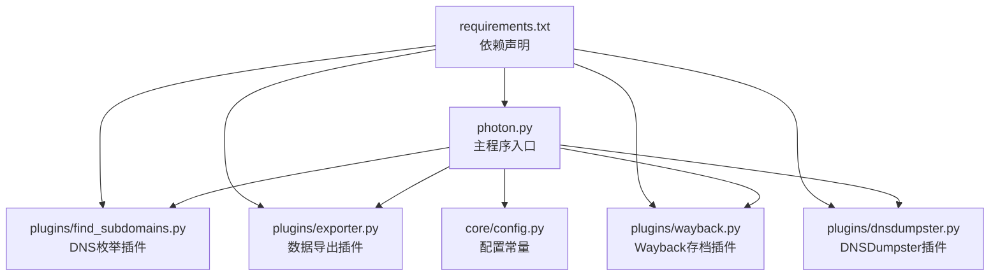
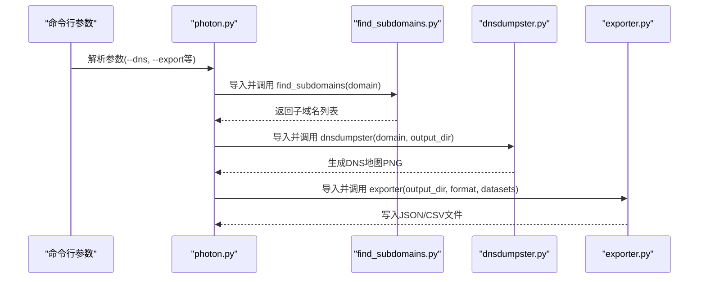
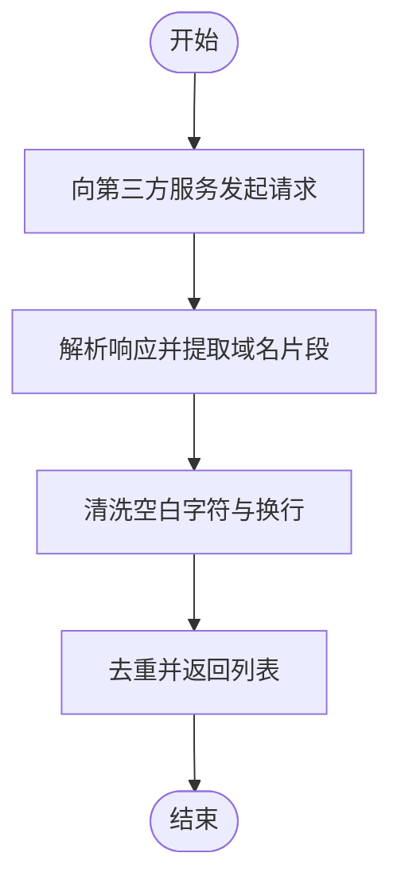
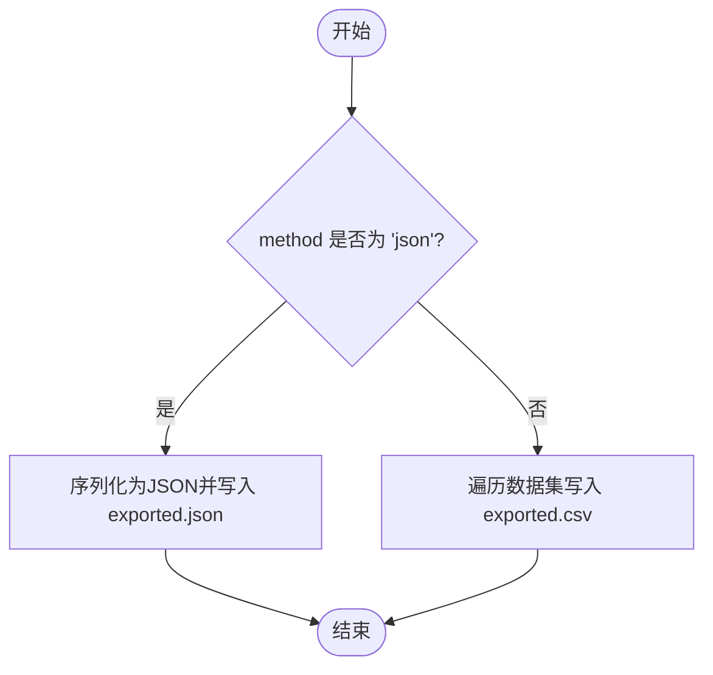
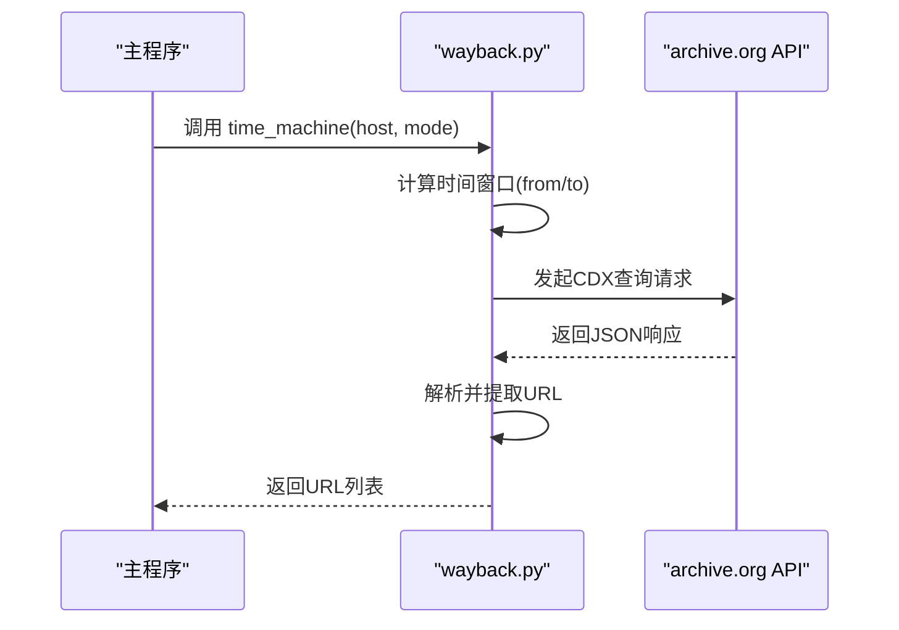
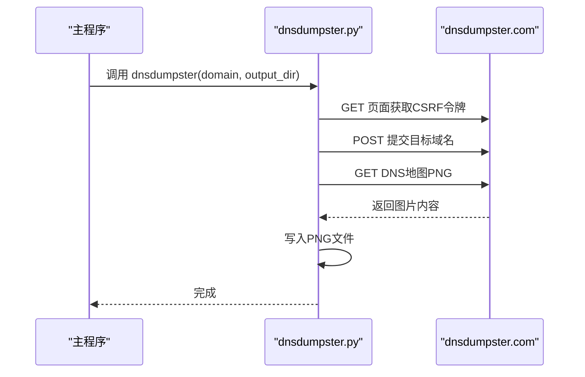
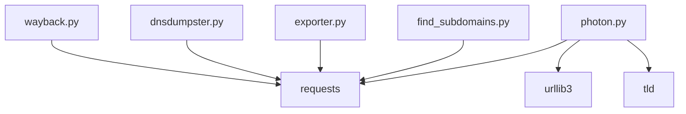

# 现有插件介绍

<cite>
**本文引用的文件**
- [photon.py](file://photon.py)
- [README.md](file://README.md)
- [requirements.txt](file://requirements.txt)
- [plugins/__init__.py](file://plugins/__init__.py)
- [plugins/find_subdomains.py](file://plugins/find_subdomains.py)
- [plugins/exporter.py](file://plugins/exporter.py)
- [plugins/wayback.py](file://plugins/wayback.py)
- [plugins/dnsdumpster.py](file://plugins/dnsdumpster.py)
- [core/config.py](file://core/config.py)
</cite>

## 目录
1. [简介](#简介)
2. [项目结构](#项目结构)
3. [核心组件](#核心组件)
4. [架构总览](#架构总览)
5. [详细组件分析](#详细组件分析)
6. [依赖关系分析](#依赖关系分析)
7. [性能考虑](#性能考虑)
8. [故障排除指南](#故障排除指南)
9. [结论](#结论)
10. [附录](#附录)

## 简介
本文件面向使用者与开发者，系统性介绍 Photon 项目中的现有插件：DNS 枚举插件（find_subdomains）、数据导出插件（exporter）、Wayback 存档插件（wayback）与 DNSDumpster 插件（dnsdumpster）。文档涵盖各插件的功能特性、使用方法、配置选项、参数说明、输出格式、插件间协作关系与依赖关系，并提供常见使用场景与最佳实践建议。

## 项目结构
Photon 的插件位于 plugins 目录中，每个插件是一个独立的模块，通过主程序在运行时按需导入并调用。主程序负责解析命令行参数、执行爬取流程，并在需要时调用相应插件完成扩展功能。

图表来源
- [photon.py:405-421](file://photon.py#L405-L421)
- [plugins/find_subdomains.py:1-15](file://plugins/find_subdomains.py#L1-L15)
- [plugins/exporter.py:1-25](file://plugins/exporter.py#L1-L25)
- [plugins/wayback.py:1-23](file://plugins/wayback.py#L1-L23)
- [plugins/dnsdumpster.py:1-23](file://plugins/dnsdumpster.py#L1-L23)
- [core/config.py:1-28](file://core/config.py#L1-L28)
- [requirements.txt:1-4](file://requirements.txt#L1-L4)

章节来源
- [photon.py:405-421](file://photon.py#L405-L421)
- [plugins/__init__.py:1-2](file://plugins/__init__.py#L1-L2)
- [requirements.txt:1-4](file://requirements.txt#L1-L4)

## 核心组件
- DNS 枚举插件（find_subdomains）
  - 功能：从第三方服务查询目标域名的子域名集合，返回去重后的列表。
  - 入口函数：find_subdomains(domain)
  - 返回值：字符串列表（去重后的子域名）
  - 外部依赖：HTTP 请求库
- 数据导出插件（exporter）
  - 功能：将内部数据集导出为 JSON 或 CSV 文件。
  - 入口函数：exporter(directory, method, datasets)
  - 支持格式：json、csv
  - 输出文件：exported.json、exported.csv
- Wayback 存档插件（wayback）
  - 功能：从互联网档案馆（archive.org）查询历史 HTML URL 列表。
  - 入口函数：time_machine(host, mode)
  - 参数：host（目标主机名），mode（匹配类型）
  - 返回值：URL 列表
- DNSDumpster 插件（dnsdumpster）
  - 功能：访问 dnsdumpster.com 获取 DNS 地图图片并保存到本地。
  - 入口函数：dnsdumpster(domain, output_dir)
  - 输出：PNG 图片文件（域名命名）

章节来源
- [plugins/find_subdomains.py:7-14](file://plugins/find_subdomains.py#L7-L14)
- [plugins/exporter.py:6-24](file://plugins/exporter.py#L6-L24)
- [plugins/wayback.py:8-22](file://plugins/wayback.py#L8-L22)
- [plugins/dnsdumpster.py:7-22](file://plugins/dnsdumpster.py#L7-L22)

## 架构总览
下图展示了主程序与插件之间的调用关系与数据流向。主程序根据命令行参数决定是否启用 DNS 枚举与导出功能，并在执行过程中按需导入插件模块。

图表来源
- [photon.py:405-421](file://photon.py#L405-L421)
- [plugins/find_subdomains.py:7-14](file://plugins/find_subdomains.py#L7-L14)
- [plugins/dnsdumpster.py:7-22](file://plugins/dnsdumpster.py#L7-L22)
- [plugins/exporter.py:6-24](file://plugins/exporter.py#L6-L24)

## 详细组件分析

### DNS 枚举插件（find_subdomains）
- 功能概述
  - 通过第三方服务查询目标域名的子域名集合，返回去重后的结果。
  - 使用正则表达式提取页面中的域名片段，并进行清洗处理。
- 输入参数
  - domain：目标域名字符串
- 输出
  - 字符串列表：去重后的子域名
- 使用方式
  - 在主程序中通过命令行参数启用 DNS 枚举后，自动调用该插件。
- 注意事项
  - 依赖网络访问与第三方服务可用性。
  - 结果可能受第三方服务的数据覆盖范围影响。

图表来源
- [plugins/find_subdomains.py:10-14](file://plugins/find_subdomains.py#L10-L14)

章节来源
- [plugins/find_subdomains.py:7-14](file://plugins/find_subdomains.py#L7-L14)

### 数据导出插件（exporter）
- 功能概述
  - 将主程序收集的数据集导出为 JSON 或 CSV 格式文件。
  - 支持键值对形式的多字段数据写入。
- 输入参数
  - directory：输出目录路径
  - method：导出格式（'json' 或 'csv'）
  - datasets：字典形式的数据集
- 输出文件
  - exported.json（当 method 为 'json'）
  - exported.csv（当 method 为 'csv'）
- 使用方式
  - 在主程序中通过命令行参数指定导出格式后，自动调用该插件。
- 注意事项
  - CSV 模式会逐项写入键与对应值列表，None 值单独写一行。

图表来源
- [plugins/exporter.py:8-24](file://plugins/exporter.py#L8-L24)

章节来源
- [plugins/exporter.py:6-24](file://plugins/exporter.py#L6-L24)

### Wayback 存档插件（wayback）
- 功能概述
  - 调用互联网档案馆 API 查询历史 HTML URL，返回可作为种子的 URL 列表。
  - 自动计算时间窗口（from/to），限定状态码与 MIME 类型。
- 输入参数
  - host：目标主机名
  - mode：匹配类型（如精确或前缀匹配）
- 输出
  - URL 列表：过滤后的历史页面链接
- 使用方式
  - 主程序在启动阶段调用核心模块（zap）时，若启用 --wayback，则会结合该插件获取历史 URL 作为种子。
- 注意事项
  - 依赖网络访问与 API 可用性。
  - 返回结果数量取决于存档覆盖范围与过滤条件。

图表来源
- [plugins/wayback.py:8-22](file://plugins/wayback.py#L8-L22)

章节来源
- [plugins/wayback.py:8-22](file://plugins/wayback.py#L8-L22)

### DNSDumpster 插件（dnsdumpster）
- 功能概述
  - 访问 dnsdumpster.com 获取 DNS 地图图片并保存到指定目录。
  - 需要处理 CSRF 令牌与会话状态。
- 输入参数
  - domain：目标域名
  - output_dir：输出目录路径
- 输出
  - PNG 图片文件：以域名命名保存至输出目录
- 使用方式
  - 在主程序启用 DNS 枚举后，自动调用该插件生成 DNS 地图。
- 注意事项
  - 依赖网络访问与第三方服务可用性。
  - 若图片不存在或请求失败，不会产生错误但也不会保存文件。

图表来源
- [plugins/dnsdumpster.py:9-22](file://plugins/dnsdumpster.py#L9-L22)

章节来源
- [plugins/dnsdumpster.py:7-22](file://plugins/dnsdumpster.py#L7-L22)

## 依赖关系分析
- 运行时依赖
  - 主程序与插件均依赖 requests 库进行 HTTP 请求。
  - 主程序还依赖 urllib3、tld 等库用于 URL 解析与顶级域名处理。
- 插件间耦合
  - 插件彼此独立，无直接相互调用关系。
  - 主程序在运行时按需导入插件模块，实现松耦合扩展。
- 外部服务依赖
  - find_subdomains 依赖第三方域名枚举服务。
  - dnsdumpster 依赖 dnsdumpster.com 的网页与图片资源。
  - wayback 依赖 archive.org 的 CDX API。

图表来源
- [requirements.txt:1-4](file://requirements.txt#L1-L4)
- [photon.py:9-13](file://photon.py#L9-L13)
- [plugins/find_subdomains.py:4](file://plugins/find_subdomains.py#L4)
- [plugins/exporter.py:2-3](file://plugins/exporter.py#L2-L3)
- [plugins/dnsdumpster.py:4](file://plugins/dnsdumpster.py#L4)
- [plugins/wayback.py:5](file://plugins/wayback.py#L5)

章节来源
- [requirements.txt:1-4](file://requirements.txt#L1-L4)
- [photon.py:9-13](file://photon.py#L9-L13)

## 性能考虑
- 并发与线程
  - 主程序使用线程池并发处理链接，插件本身不涉及并发逻辑。
- 网络延迟
  - 第三方服务（archive.org、dnsdumpster、find_subdomains）的响应时间会影响整体性能。
- 导出开销
  - JSON/CSV 导出为磁盘写入操作，大体量数据时应关注 I/O 性能。
- 最佳实践
  - 合理设置 --threads 与 --delay，平衡吞吐与外部服务压力。
  - 在启用 DNS 枚举与导出时，选择合适的输出目录与权限。

## 故障排除指南
- 插件未生效
  - 确认已正确传入命令行参数启用相应功能（如 --dns、--export）。
  - 检查主程序导入路径与模块可见性。
- 网络请求失败
  - 检查代理设置与网络连通性。
  - 对于 DNSDumpster 与 find_subdomains，确认第三方服务可用。
- 导出文件缺失
  - 确认输出目录存在且具有写权限。
  - 检查 datasets 是否为空或格式不符合预期。
- Wayback 结果为空
  - 检查目标域名是否在 archive.org 存档范围内。
  - 调整匹配模式（mode）或时间窗口参数。

章节来源
- [photon.py:405-421](file://photon.py#L405-L421)
- [plugins/exporter.py:6-24](file://plugins/exporter.py#L6-L24)
- [plugins/wayback.py:8-22](file://plugins/wayback.py#L8-L22)
- [plugins/dnsdumpster.py:7-22](file://plugins/dnsdumpster.py#L7-L22)
- [plugins/find_subdomains.py:7-14](file://plugins/find_subdomains.py#L7-L14)

## 结论
Photon 的插件体系通过主程序的按需导入机制实现了高扩展性与低耦合。DNS 枚举与 DNSDumpster 插件共同提供子域名与 DNS 地图能力；Wayback 插件为种子获取提供历史 URL；导出插件支持将结果以 JSON/CSV 形式落地。合理配置命令行参数与网络环境，可在不同场景下获得稳定高效的产出。

## 附录

### 使用示例与参数说明
- DNS 枚举
  - 启用方式：--dns
  - 行为：调用 find_subdomains(domain)，生成 subdomains 列表并保存；随后调用 dnsdumpster(domain, output_dir) 生成 DNS 地图。
  - 输出：子域名列表与 PNG 地图文件。
- 数据导出
  - 启用方式：--export json|csv
  - 行为：调用 exporter(output_dir, format, datasets)，生成 exported.json 或 exported.csv。
  - 输出：JSON/CSV 文件。
- Wayback 种子
  - 启用方式：--wayback
  - 行为：主程序在启动阶段调用核心模块（zap）时结合 wayback 插件获取历史 URL 作为种子。
  - 输出：历史 URL 列表（作为后续爬取的种子）。

章节来源
- [photon.py:405-421](file://photon.py#L405-L421)
- [README.md:63-67](file://README.md#L63-L67)