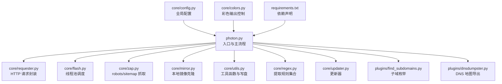
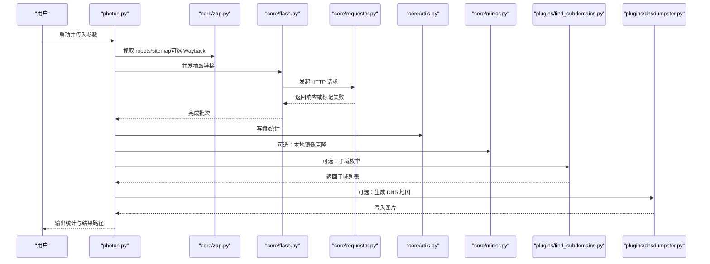
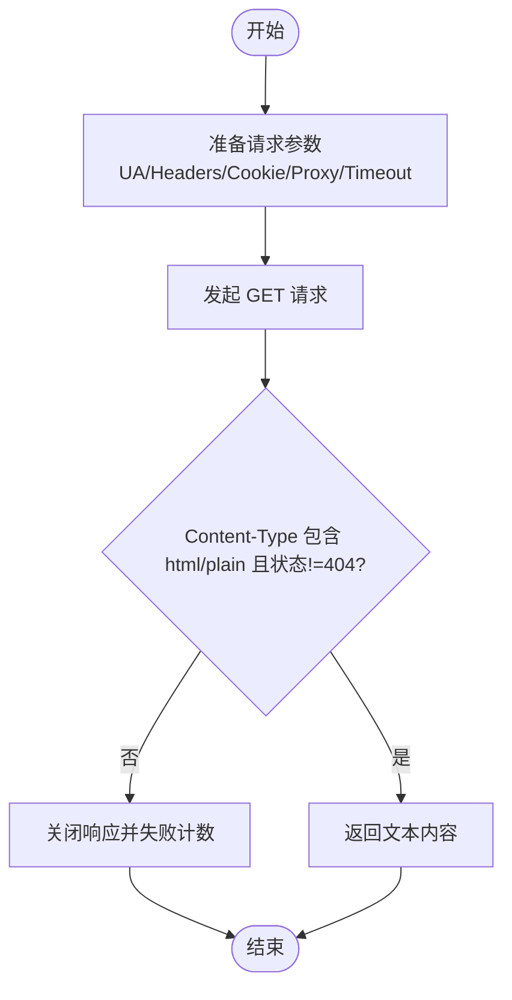
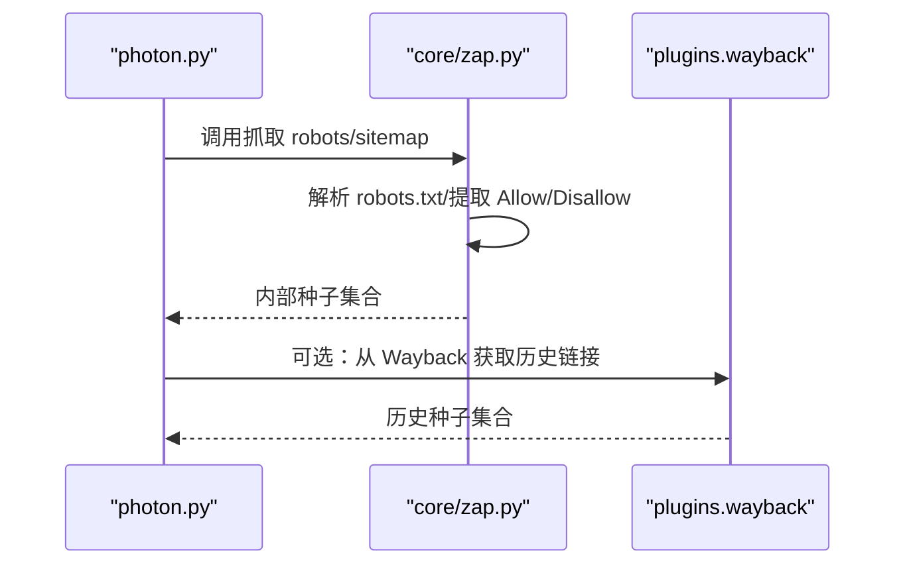
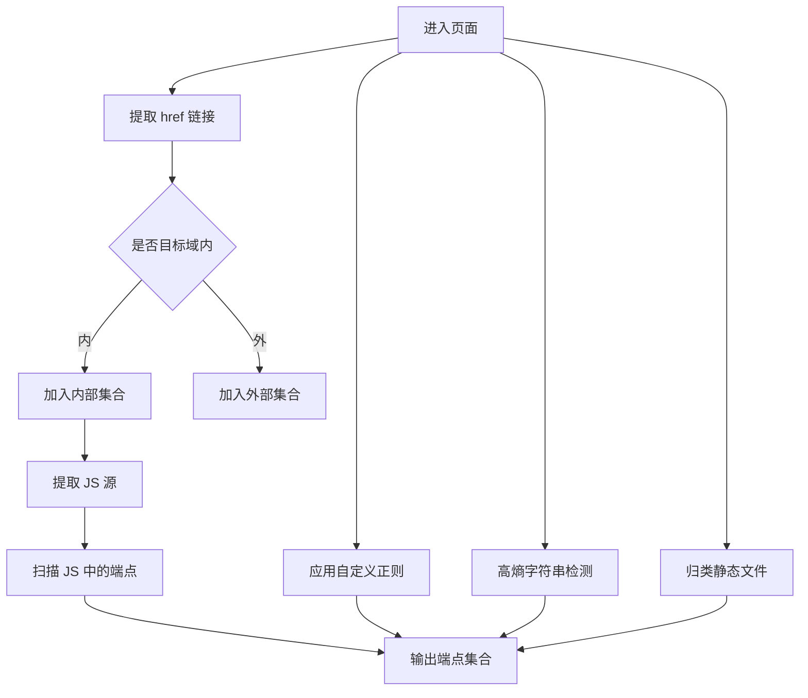
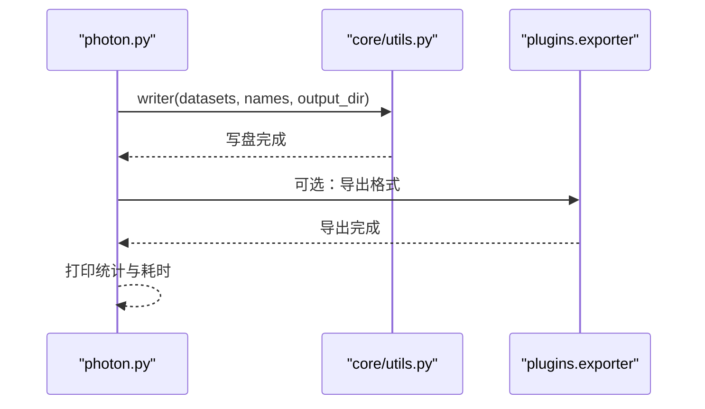
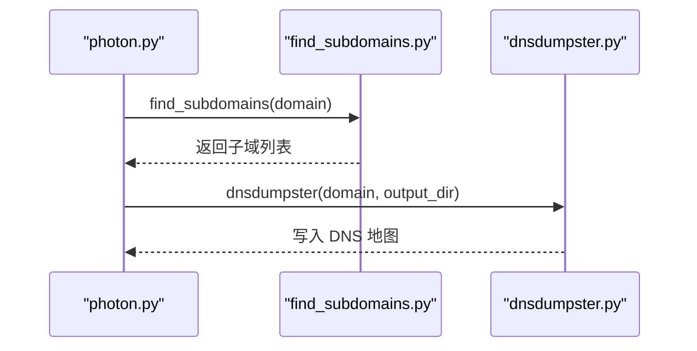
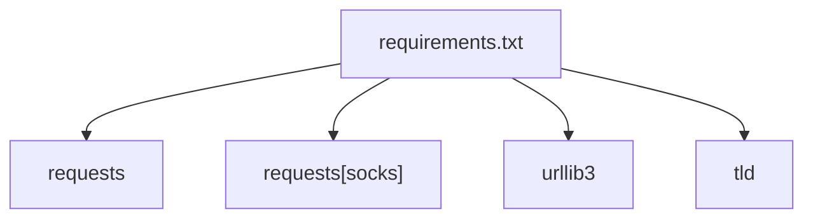

# 故障排除

<cite>
**本文引用的文件**
- [README.md](file://README.md)
- [photon.py](file://photon.py)
- [requirements.txt](file://requirements.txt)
- [core/requester.py](file://core/requester.py)
- [core/utils.py](file://core/utils.py)
- [core/flash.py](file://core/flash.py)
- [core/zap.py](file://core/zap.py)
- [core/mirror.py](file://core/mirror.py)
- [core/colors.py](file://core/colors.py)
- [core/config.py](file://core/config.py)
- [core/regex.py](file://core/regex.py)
- [core/updater.py](file://core/updater.py)
- [plugins/find_subdomains.py](file://plugins/find_subdomains.py)
- [plugins/dnsdumpster.py](file://plugins/dnsdumpster.py)
</cite>

## 目录
1. [简介](#简介)
2. [项目结构](#项目结构)
3. [核心组件](#核心组件)
4. [架构总览](#架构总览)
5. [详细组件分析](#详细组件分析)
6. [依赖分析](#依赖分析)
7. [性能考虑](#性能考虑)
8. [故障排除指南](#故障排除指南)
9. [结论](#结论)
10. [附录](#附录)

## 简介
本指南面向使用 Photon 的用户与运维人员，聚焦于安装、运行时错误、网络连接、性能与日志分析等常见问题的系统化诊断与解决路径。文档基于仓库源码进行分析，提供可操作的排障步骤、错误代码与行为解释、调试技巧以及跨平台差异处理建议。

## 项目结构
- 入口脚本负责参数解析、初始化配置、调度爬取流程与结果输出。
- 核心模块封装请求、并发、正则、更新、镜像克隆、颜色输出等通用能力。
- 插件模块扩展子域名枚举与 DNS 地图导出功能。
- 依赖通过 requirements.txt 声明，确保运行环境具备所需库。

图表来源
- [photon.py:1-426](file://photon.py#L1-L426)
- [core/requester.py:1-73](file://core/requester.py#L1-L73)
- [core/flash.py:1-18](file://core/flash.py#L1-L18)
- [core/zap.py:1-58](file://core/zap.py#L1-L58)
- [core/mirror.py:1-40](file://core/mirror.py#L1-L40)
- [core/utils.py:1-207](file://core/utils.py#L1-L207)
- [core/regex.py:1-235](file://core/regex.py#L1-L235)
- [core/updater.py:1-41](file://core/updater.py#L1-L41)
- [plugins/find_subdomains.py:1-15](file://plugins/find_subdomains.py#L1-L15)
- [plugins/dnsdumpster.py:1-23](file://plugins/dnsdumpster.py#L1-L23)
- [core/config.py:1-28](file://core/config.py#L1-L28)
- [core/colors.py:1-19](file://core/colors.py#L1-L19)
- [requirements.txt:1-4](file://requirements.txt#L1-L4)

章节来源
- [photon.py:1-426](file://photon.py#L1-L426)
- [requirements.txt:1-4](file://requirements.txt#L1-L4)

## 核心组件
- 参数与入口：解析命令行参数、校验 Python 版本、初始化并发与超时、选择输出目录、加载用户代理列表、准备结果集与统计信息。
- 请求器：统一管理会话、随机 UA、超时与重定向限制、按内容类型过滤响应、失败记录与代理轮换。
- 并发调度：基于线程池执行抽取与扫描任务，打印进度。
- 资源发现：从 robots.txt、sitemap.xml 与可选的 Wayback（通过插件）抓取种子链接。
- 数据提取：HTML 链接、内嵌 JS、自定义正则、高熵字符串（密钥）、端点、外部情报等。
- 结果输出：按数据集写入文本文件，支持导出为 JSON/CVS（通过插件）。
- 更新器：检查远端变更并提示是否覆盖更新。
- 子域与 DNS：调用第三方服务进行子域枚举与生成 DNS 地图。

章节来源
- [photon.py:56-117](file://photon.py#L56-L117)
- [core/requester.py:11-73](file://core/requester.py#L11-L73)
- [core/flash.py:6-17](file://core/flash.py#L6-L17)
- [core/zap.py:10-58](file://core/zap.py#L10-L58)
- [core/utils.py:78-87](file://core/utils.py#L78-L87)
- [core/updater.py:8-41](file://core/updater.py#L8-L41)
- [plugins/find_subdomains.py:7-15](file://plugins/find_subdomains.py#L7-L15)
- [plugins/dnsdumpster.py:7-23](file://plugins/dnsdumpster.py#L7-L23)

## 架构总览
下图展示从入口到各核心模块的调用关系与数据流。

图表来源
- [photon.py:305-426](file://photon.py#L305-L426)
- [core/zap.py:10-58](file://core/zap.py#L10-L58)
- [core/flash.py:6-17](file://core/flash.py#L6-L17)
- [core/requester.py:35-73](file://core/requester.py#L35-L73)
- [core/utils.py:78-87](file://core/utils.py#L78-L87)
- [core/mirror.py:4-40](file://core/mirror.py#L4-L40)
- [plugins/find_subdomains.py:7-15](file://plugins/find_subdomains.py#L7-L15)
- [plugins/dnsdumpster.py:7-23](file://plugins/dnsdumpster.py#L7-L23)

## 详细组件分析

### 组件A：请求与并发
- 请求器负责设置会话、UA、Cookie、超时、代理与最大重定向数；仅在响应类型为 HTML 或纯文本且状态非 404 时返回正文，否则关闭连接并记录失败。
- 并发调度以线程池方式提交任务，按完成数量打印进度，避免阻塞。

图表来源
- [core/requester.py:35-73](file://core/requester.py#L35-L73)

章节来源
- [core/requester.py:11-73](file://core/requester.py#L11-L73)
- [core/flash.py:6-17](file://core/flash.py#L6-L17)

### 组件B：资源发现与种子
- 从 robots.txt 与 sitemap.xml 提取允许访问的路径作为种子；可选从 Wayback 获取历史快照链接。
- 对 robots.txt 的解析采用正则匹配 Allow/Disallow 条目，并清洗后加入内部待爬队列。

图表来源
- [core/zap.py:10-58](file://core/zap.py#L10-L58)
- [photon.py:309-312](file://photon.py#L309-L312)

章节来源
- [core/zap.py:10-58](file://core/zap.py#L10-L58)

### 组件C：数据提取与过滤
- HTML 链接提取、内外链判定、参数化 URL 归类、JS 文件收集、端点扫描、自定义正则、高熵字符串识别、外部情报聚合与校验（如 Luhn 校验信用卡号）。
- 对文件类型进行白名单过滤，避免对静态资源重复抓取。

图表来源
- [photon.py:239-288](file://photon.py#L239-L288)
- [core/regex.py:231-235](file://core/regex.py#L231-L235)
- [core/utils.py:15-24](file://core/utils.py#L15-L24)
- [core/config.py:12-27](file://core/config.py#L12-L27)

章节来源
- [photon.py:208-368](file://photon.py#L208-L368)
- [core/regex.py:1-235](file://core/regex.py#L1-L235)
- [core/utils.py:26-48](file://core/utils.py#L26-L48)
- [core/config.py:12-27](file://core/config.py#L12-L27)

### 组件D：结果输出与导出
- 将各类集合写入独立文件；支持导出为 JSON/CVS（通过插件）；打印统计信息与耗时。

图表来源
- [photon.py:376-421](file://photon.py#L376-L421)
- [core/utils.py:78-87](file://core/utils.py#L78-L87)

章节来源
- [photon.py:376-421](file://photon.py#L376-L421)
- [core/utils.py:78-87](file://core/utils.py#L78-L87)

### 组件E：子域与 DNS
- 子域枚举：调用第三方接口获取子域列表。
- DNS 地图：登录并提交目标域，下载对应 PNG 地图保存至输出目录。

图表来源
- [photon.py:405-415](file://photon.py#L405-L415)
- [plugins/find_subdomains.py:7-15](file://plugins/find_subdomains.py#L7-L15)
- [plugins/dnsdumpster.py:7-23](file://plugins/dnsdumpster.py#L7-L23)

章节来源
- [photon.py:405-415](file://photon.py#L405-L415)
- [plugins/find_subdomains.py:1-15](file://plugins/find_subdomains.py#L1-L15)
- [plugins/dnsdumpster.py:1-23](file://plugins/dnsdumpster.py#L1-L23)

## 依赖分析
- 运行时依赖：requests、urllib3、tld、可选 socks 支持。
- 依赖安装与版本：通过 requirements.txt 声明；若缺少依赖将导致导入异常或功能不可用。

图表来源
- [requirements.txt:1-4](file://requirements.txt#L1-L4)

章节来源
- [requirements.txt:1-4](file://requirements.txt#L1-L4)

## 性能考虑
- 并发与延迟：通过线程数与请求间隔控制吞吐与对目标服务器的压力；过低延迟可能触发限速或被封禁。
- 超时与重定向：请求器限制最大重定向次数，避免长时间挂起；超时过短可能导致大量失败。
- 过滤策略：对静态资源类型进行过滤，减少无效 IO 与 CPU 开销。
- 输出与克隆：开启本地镜像克隆会显著增加磁盘 IO；仅在需要时启用。

章节来源
- [core/requester.py:8-10](file://core/requester.py#L8-L10)
- [core/utils.py:12-27](file://core/utils.py#L12-L27)
- [core/config.py:12-27](file://core/config.py#L12-L27)
- [core/mirror.py:4-40](file://core/mirror.py#L4-L40)

## 故障排除指南

### 一、安装与环境问题
- 症状：启动时报“仅支持 Python 3.2+”或无法导入模块。
  - 排查要点：确认 Python 版本满足要求；检查虚拟环境是否激活；核对依赖是否完整安装。
  - 处理建议：升级 Python 至 3.2+；重新安装依赖；使用 requirements.txt 一次性安装。
  - 参考路径
    - [photon.py:26-30](file://photon.py#L26-L30)
    - [requirements.txt:1-4](file://requirements.txt#L1-L4)

- 症状：Windows/macOS 下彩色输出异常或显示为乱码。
  - 排查要点：颜色模块根据平台判断是否启用 ANSI；非支持平台会禁用颜色。
  - 处理建议：无需额外配置；若需彩色输出请在支持的终端中运行。
  - 参考路径
    - [core/colors.py:4-19](file://core/colors.py#L4-L19)

- 症状：缺少 socks 支持或代理相关功能异常。
  - 排查要点：确认安装了带可选依赖的 requests；检查代理格式是否正确。
  - 处理建议：安装 requests[socks]；使用 IP:PORT 或 DOMAIN:PORT 格式。
  - 参考路径
    - [requirements.txt:1-4](file://requirements.txt#L1-L4)
    - [core/utils.py:164-180](file://core/utils.py#L164-L180)

章节来源
- [photon.py:26-30](file://photon.py#L26-L30)
- [requirements.txt:1-4](file://requirements.txt#L1-L4)
- [core/colors.py:4-19](file://core/colors.py#L4-L19)
- [core/utils.py:164-180](file://core/utils.py#L164-L180)

### 二、运行时错误与常见异常
- 症状：请求超时或频繁失败。
  - 排查要点：检查超时参数、代理可用性、目标站点限流策略；查看失败集合大小。
  - 处理建议：增大超时；更换代理；降低并发或增加延迟；必要时分批执行。
  - 参考路径
    - [core/requester.py:48-56](file://core/requester.py#L48-L56)
    - [core/utils.py:94-98](file://core/utils.py#L94-L98)

- 症状：TooManyRedirects 异常导致页面未被处理。
  - 排查要点：目标站点存在循环重定向；请求器已捕获并返回占位值。
  - 处理建议：调整目标 URL 协议（http/https）；检查中间人代理或 CDN 行为。
  - 参考路径
    - [core/requester.py:57-58](file://core/requester.py#L57-L58)

- 症状：键盘中断后程序退出。
  - 排查要点：并发执行中按下 Ctrl+C 触发 KeyboardInterrupt。
  - 处理建议：合理设置层级与并发；在稳定阶段再扩大规模。
  - 参考路径
    - [photon.py:328-330](file://photon.py#L328-L330)

- 症状：输出目录创建失败或权限不足。
  - 排查要点：当前用户对目标路径无写权限；路径非法或被占用。
  - 处理建议：切换到有权限的目录；使用绝对路径；检查磁盘空间。
  - 参考路径
    - [photon.py:377-379](file://photon.py#L377-L379)
    - [core/utils.py:82-86](file://core/utils.py#L82-L86)

章节来源
- [core/requester.py:48-58](file://core/requester.py#L48-L58)
- [core/utils.py:94-98](file://core/utils.py#L94-L98)
- [photon.py:328-330](file://photon.py#L328-L330)
- [photon.py:377-379](file://photon.py#L377-L379)

### 三、网络连接与代理问题
- 症状：代理不可用或测试失败。
  - 排查要点：代理连通性测试超时；代理格式不合法；代理列表为空。
  - 处理建议：逐一验证代理；修正格式；提供有效代理列表；必要时禁用代理。
  - 参考路径
    - [photon.py:126-140](file://photon.py#L126-L140)
    - [core/utils.py:197-206](file://core/utils.py#L197-L206)
    - [core/utils.py:164-180](file://core/utils.py#L164-L180)

- 症状：DNS/DNS 地图或子域枚举失败。
  - 排查要点：第三方服务不可达；CSRF 令牌缺失；网络策略限制。
  - 处理建议：更换网络环境；检查代理；稍后重试；确认域名格式。
  - 参考路径
    - [plugins/find_subdomains.py:10-14](file://plugins/find_subdomains.py#L10-L14)
    - [plugins/dnsdumpster.py:10-17](file://plugins/dnsdumpster.py#L10-L17)

章节来源
- [photon.py:126-140](file://photon.py#L126-L140)
- [core/utils.py:197-206](file://core/utils.py#L197-L206)
- [plugins/find_subdomains.py:1-15](file://plugins/find_subdomains.py#L1-L15)
- [plugins/dnsdumpster.py:1-23](file://plugins/dnsdumpster.py#L1-L23)

### 四、性能问题与优化建议
- 症状：CPU/IO 占用过高或耗时过长。
  - 排查要点：并发过大、延迟过小、静态资源过多、开启镜像克隆。
  - 优化建议：降低线程数；增大请求间隔；减少层级；关闭镜像克隆；仅在需要时启用高熵扫描。
  - 参考路径
    - [core/flash.py:10-11](file://core/flash.py#L10-L11)
    - [core/mirror.py:4-40](file://core/mirror.py#L4-L40)
    - [core/config.py:12-27](file://core/config.py#L12-L27)

- 症状：内存增长或 OOM。
  - 排查要点：结果集合过大；未及时清理临时集合；正则匹配复杂度高。
  - 优化建议：定期检查集合大小；使用更精确的正则；分批处理；限制层级与种子数量。
  - 参考路径
    - [photon.py:146-164](file://photon.py#L146-L164)
    - [core/regex.py:1-235](file://core/regex.py#L1-L235)

章节来源
- [core/flash.py:10-11](file://core/flash.py#L10-L11)
- [core/mirror.py:4-40](file://core/mirror.py#L4-L40)
- [core/config.py:12-27](file://core/config.py#L12-L27)
- [photon.py:146-164](file://photon.py#L146-L164)
- [core/regex.py:1-235](file://core/regex.py#L1-L235)

### 五、日志分析与问题定位
- 日志来源与输出位置
  - 控制台输出：进度、统计、提示信息；颜色模块按平台控制输出样式。
  - 结果文件：按数据集写入独立 txt；导出插件可生成 JSON/CVS。
  - 参考路径
    - [core/colors.py:4-19](file://core/colors.py#L4-L19)
    - [core/utils.py:78-87](file://core/utils.py#L78-L87)
    - [photon.py:376-421](file://photon.py#L376-L421)

- 常见指标定位
  - 失败集合大小：反映网络不稳定或目标站点异常。
  - 端点与高熵集合：用于识别敏感信息暴露风险。
  - 外部情报集合：用于识别跨域风险与第三方集成。
  - 参考路径
    - [photon.py:146-164](file://photon.py#L146-L164)
    - [photon.py:348-368](file://photon.py#L348-L368)

章节来源
- [core/colors.py:4-19](file://core/colors.py#L4-L19)
- [core/utils.py:78-87](file://core/utils.py#L78-L87)
- [photon.py:376-421](file://photon.py#L376-L421)
- [photon.py:146-164](file://photon.py#L146-L164)
- [photon.py:348-368](file://photon.py#L348-L368)

### 六、跨平台与环境差异
- Windows/macOS 终端
  - 彩色输出禁用；不影响功能，仅影响可读性。
  - 参考路径
    - [core/colors.py:4-19](file://core/colors.py#L4-L19)

- Docker 环境
  - 使用轻量级 Python-Alpine 镜像；可通过卷挂载共享结果目录。
  - 参考路径
    - [README.md:68-84](file://README.md#L68-L84)

章节来源
- [core/colors.py:4-19](file://core/colors.py#L4-L19)
- [README.md:68-84](file://README.md#L68-L84)

### 七、更新与版本兼容
- 更新机制
  - 检查远端变更并提示是否覆盖；更新过程涉及克隆与复制当前目录。
  - 参考路径
    - [core/updater.py:8-41](file://core/updater.py#L8-L41)

- 版本要求
  - 仅支持 Python 3.2+；依赖库版本需满足 requirements。
  - 参考路径
    - [photon.py:26-30](file://photon.py#L26-L30)
    - [requirements.txt:1-4](file://requirements.txt#L1-L4)

章节来源
- [core/updater.py:8-41](file://core/updater.py#L8-L41)
- [photon.py:26-30](file://photon.py#L26-L30)
- [requirements.txt:1-4](file://requirements.txt#L1-L4)

## 结论
本指南围绕安装、运行、网络、性能与日志五个维度，结合源码实现给出系统化的排障路径。建议在生产环境中优先保证依赖完整、代理可用与合理的并发/延迟配置；出现问题时先从超时与失败集合入手，再逐步缩小范围到第三方服务与平台差异。通过分层调试与阶段性导出，可有效提升定位效率与稳定性。

## 附录
- 快速检查清单
  - Python 版本与依赖安装
  - 代理连通性与格式
  - 超时与并发参数
  - 输出目录权限
  - 第三方服务可达性
  - 平台输出样式与 Docker 卷挂载