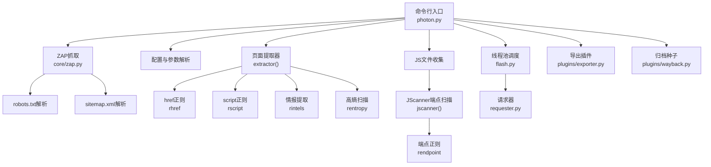
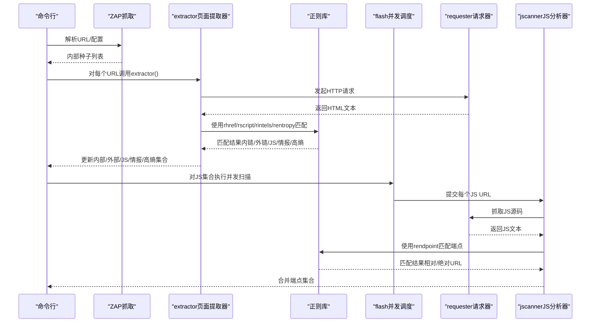
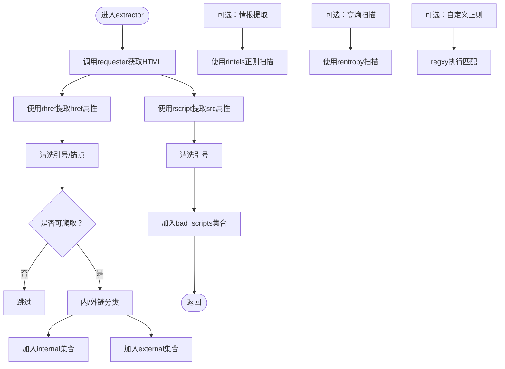
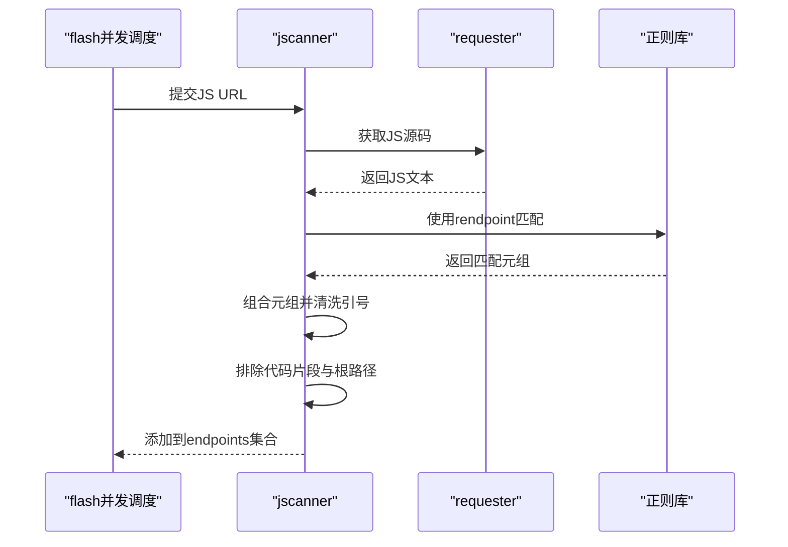
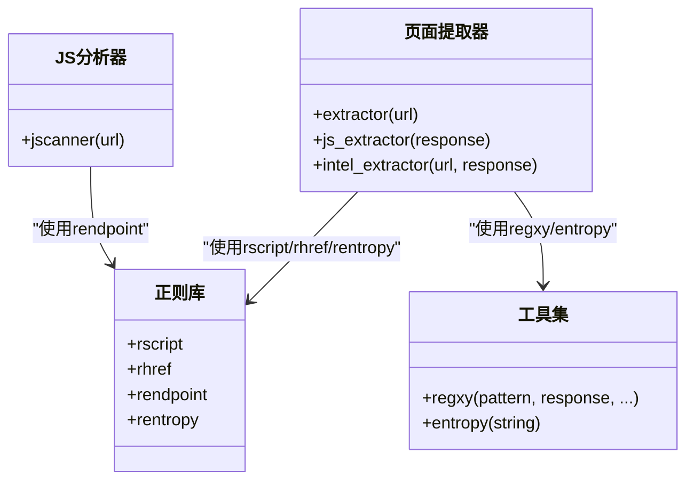
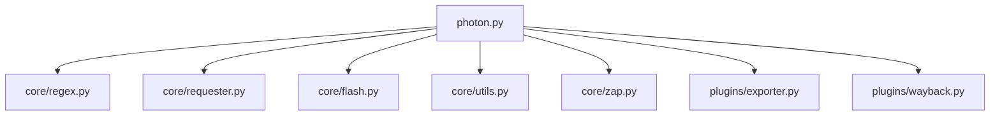

# JavaScript分析

<cite>
**本文引用的文件**
- [photon.py](file://photon.py)
- [regex.py](file://core/regex.py)
- [requester.py](file://core/requester.py)
- [utils.py](file://core/utils.py)
- [flash.py](file://core/flash.py)
- [zap.py](file://core/zap.py)
- [exporter.py](file://plugins/exporter.py)
- [wayback.py](file://plugins/wayback.py)
- [README.md](file://README.md)
</cite>

## 目录
1. [简介](#简介)
2. [项目结构](#项目结构)
3. [核心组件](#核心组件)
4. [架构总览](#架构总览)
5. [详细组件分析](#详细组件分析)
6. [依赖分析](#依赖分析)
7. [性能考虑](#性能考虑)
8. [故障排查指南](#故障排查指南)
9. [结论](#结论)
10. [附录](#附录)

## 简介
本文件系统性阐述Photon对JavaScript文件的分析能力与实现机制，重点覆盖以下方面：
- 脚本标签提取：从HTML中定位<script>标签并解析其src属性，形成待抓取的JS文件集合。
- 链接端点识别：从页面HTML中提取所有<a>标签的href属性，进行内/外链分类与去重。
- API端点发现：在JavaScript源码中通过正则匹配提取潜在的端点URL，过滤掉疑似代码片段。
- 正则表达式应用：涵盖<script>标签匹配、href属性提取、端点URL识别、高熵字符串（密钥）检测等。
- 隐藏链接与API端点发现：结合页面与JS源码的多轮扫描，提升发现率。
- 性能优化与内存管理：线程池并发、请求会话复用、流式响应处理、延迟与超时控制。
- 恶意脚本与代码注入检测思路：基于正则与启发式规则的初步识别与过滤。

## 项目结构
Photon采用分层设计，核心逻辑集中在主程序与核心模块中，插件用于扩展功能（如导出、Wayback归档等）。与JavaScript分析直接相关的模块如下：
- 主程序：负责爬虫流程编排、任务调度、结果汇总。
- 核心正则：定义各类URL、脚本、端点、高熵字符串的匹配模式。
- 请求器：统一发起HTTP请求，支持代理、超时、随机User-Agent、流式响应。
- 工具集：通用正则匹配、熵值计算、输出写入、进度打印等。
- 并发调度：线程池执行器，控制并发度与进度反馈。
- 扩展插件：导出为JSON/CSV、从archive.org获取历史URL作为种子。

图表来源
- [photon.py](file://photon.py)
- [regex.py](file://core/regex.py)
- [requester.py](file://core/requester.py)
- [flash.py](file://core/flash.py)
- [zap.py](file://core/zap.py)
- [exporter.py](file://plugins/exporter.py)
- [wayback.py](file://plugins/wayback.py)

章节来源
- [photon.py](file://photon.py)
- [regex.py](file://core/regex.py)
- [requester.py](file://core/requester.py)
- [flash.py](file://core/flash.py)
- [zap.py](file://core/zap.py)
- [exporter.py](file://plugins/exporter.py)
- [wayback.py](file://plugins/wayback.py)

## 核心组件
- 页面提取器（extractor）：从HTML响应中提取内/外链、JS文件、情报信息与高熵字符串；同时支持自定义正则匹配。
- JS分析器（jscanner）：对JS文件内容进行端点URL提取，过滤疑似代码片段，保留纯路径或完整URL。
- 正则库（core/regex.py）：集中定义<script>、<a>、端点URL、高熵字符串等正则模式。
- 请求器（requester）：统一HTTP请求封装，支持代理、随机UA、超时、流式响应与状态判断。
- 并发调度（flash）：基于ThreadPoolExecutor的并发执行器，控制线程数与进度输出。
- 扩展插件：导出结果为JSON/CSV，从archive.org获取历史URL作为种子。

章节来源
- [photon.py](file://photon.py)
- [regex.py](file://core/regex.py)
- [requester.py](file://core/requester.py)
- [flash.py](file://core/flash.py)
- [exporter.py](file://plugins/exporter.py)
- [wayback.py](file://plugins/wayback.py)

## 架构总览
下图展示了从页面到JS文件再到端点提取的完整流程，以及与正则库、请求器、并发调度的交互关系。

图表来源
- [photon.py](file://photon.py)
- [regex.py](file://core/regex.py)
- [requester.py](file://core/requester.py)
- [flash.py](file://core/flash.py)

## 详细组件分析

### 页面提取器（extractor）
职责：
- 从HTML中提取所有<a>标签的href属性，进行内/外链分类与去重。
- 从<script>标签中提取src属性，形成JS文件集合。
- 可选：提取情报（邮箱、子域名、云存储等）、高熵字符串（API密钥）。
- 可选：执行用户自定义正则匹配。

关键实现要点：
- href提取使用rhref，去除引号与锚点后判定是否可爬取。
- script提取使用rscript，清理引号后加入候选JS集合。
- 内外链判定基于协议、主机名与根路径拼接规则。
- 可选的自定义正则与高熵扫描通过工具函数完成。

图表来源
- [photon.py](file://photon.py)
- [regex.py](file://core/regex.py)
- [utils.py](file://core/utils.py)
- [requester.py](file://core/requester.py)

章节来源
- [photon.py](file://photon.py)
- [regex.py](file://core/regex.py)
- [utils.py](file://core/utils.py)
- [requester.py](file://core/requester.py)

### JS分析器（jscanner）
职责：
- 对每个JS文件发起HTTP请求，抓取源码。
- 使用rendpoint正则提取潜在端点URL。
- 过滤掉疑似代码片段（排除包含大括号、引号等字符），保留纯URL。

关键实现要点：
- 使用requester统一发起请求，避免重复初始化。
- 使用rendpoint匹配单引号/双引号包裹的相对路径或完整URL。
- 通过正则排除代码片段，确保仅保留URL。

图表来源
- [photon.py](file://photon.py)
- [regex.py](file://core/regex.py)
- [requester.py](file://core/requester.py)
- [flash.py](file://core/flash.py)

章节来源
- [photon.py](file://photon.py)
- [regex.py](file://core/regex.py)
- [requester.py](file://core/requester.py)
- [flash.py](file://core/flash.py)

### 正则表达式在JavaScript分析中的应用
- script标签匹配：rscript用于匹配<script>标签的src属性，便于收集JS文件URL。
- href属性提取：rhref用于提取<a>标签的href属性，支撑页面链接发现与内/外链分类。
- 端点URL识别：rendpoint用于在JS源码中提取被引号包裹的URL，支持相对路径与完整URL。
- 高熵字符串检测：rentropy用于识别长字符串，结合熵值阈值筛选潜在API密钥。

图表来源
- [regex.py](file://core/regex.py)
- [photon.py](file://photon.py)
- [utils.py](file://core/utils.py)

章节来源
- [regex.py](file://core/regex.py)
- [photon.py](file://photon.py)
- [utils.py](file://core/utils.py)

### 隐藏链接与API端点的发现技术
- 多轮扫描：先从HTML页面提取内/外链与JS文件，再对JS文件进行端点扫描，提升发现率。
- 引号包裹URL：rendpoint优先匹配被引号包裹的URL，减少误报。
- 代码片段过滤：通过排除包含大括号、引号等字符的匹配项，降低噪声。
- 归档种子：通过Wayback插件获取历史URL作为种子，扩大页面覆盖面。

章节来源
- [photon.py](file://photon.py)
- [wayback.py](file://plugins/wayback.py)
- [regex.py](file://core/regex.py)

### JavaScript代码注入检测与恶意脚本识别（思路）
- 基于正则的启发式过滤：在端点提取阶段排除疑似代码片段（如包含{ } " ' > <等字符）。
- 高熵字符串检测：结合rentropy与entropy，识别潜在的API密钥或敏感令牌。
- 自定义正则扩展：通过--regex参数允许用户传入更细粒度的规则，以识别特定模式的注入点或恶意载荷。
- 注意：当前实现未内置深度JS语法分析或沙箱执行，建议在后续版本引入静态分析或轻量级AST检查以增强识别能力。

章节来源
- [photon.py](file://photon.py)
- [regex.py](file://core/regex.py)
- [utils.py](file://core/utils.py)

### 实际分析示例与提取结果
- 示例场景：对目标站点进行递归爬取，提取内链、外链、JS文件、情报与高熵字符串；随后对JS文件进行端点扫描，得到API端点集合。
- 结果保存：所有集合按名称写入输出目录的txt文件；支持导出为JSON/CSV。
- 导出插件：exporter根据选择的格式生成对应文件，便于二次分析与集成。

章节来源
- [photon.py](file://photon.py)
- [exporter.py](file://plugins/exporter.py)
- [README.md](file://README.md)

## 依赖分析
- 组件耦合：
  - 主程序依赖正则库、请求器、并发调度与工具集。
  - JS分析器依赖请求器与正则库。
  - 页面提取器依赖请求器与正则库，并可调用工具集执行自定义正则与熵值扫描。
- 外部依赖：
  - requests（HTTP请求）、concurrent.futures（并发）、tld（顶级域名解析）。
- 循环依赖：未发现循环导入或循环调用。

图表来源
- [photon.py](file://photon.py)
- [regex.py](file://core/regex.py)
- [requester.py](file://core/requester.py)
- [flash.py](file://core/flash.py)
- [utils.py](file://core/utils.py)
- [zap.py](file://core/zap.py)
- [exporter.py](file://plugins/exporter.py)
- [wayback.py](file://plugins/wayback.py)

章节来源
- [photon.py](file://photon.py)
- [regex.py](file://core/regex.py)
- [requester.py](file://core/requester.py)
- [flash.py](file://core/flash.py)
- [utils.py](file://core/utils.py)
- [zap.py](file://core/zap.py)
- [exporter.py](file://plugins/exporter.py)
- [wayback.py](file://plugins/wayback.py)

## 性能考虑
- 并发控制：通过flash的线程池限制最大并发数，避免资源争用；进度条实时反馈已完成数量。
- 请求优化：requester使用requests.Session复用连接，设置最大重定向次数，启用gzip压缩，关闭SSL验证以提升速度。
- 响应处理：对非HTML/纯文本响应直接丢弃，减少无效IO；对404等错误记录失败集合。
- 超时与延迟：支持全局超时与请求间延迟，缓解目标服务器压力并提高稳定性。
- 内存管理：使用集合（set）去重，避免重复抓取；输出阶段一次性写入文件，减少内存占用峰值。

章节来源
- [flash.py](file://core/flash.py)
- [requester.py](file://core/requester.py)
- [utils.py](file://core/utils.py)
- [photon.py](file://photon.py)

## 故障排查指南
- 无法启动或提示Python版本不兼容：确认运行环境为Python 3.2+。
- 代理不可用：使用--proxy参数测试代理连通性，仅接受IP:PORT或域名:PORT格式。
- 请求超时或频繁重定向：调整--timeout与--delay参数；必要时更换代理。
- 结果为空：检查--exclude正则是否误排除；确认目标站点存在<script>与<a>标签；尝试开启--wayback获取更多种子。
- 导出失败：确认输出目录权限与格式参数正确（json/csv）。

章节来源
- [photon.py](file://photon.py)
- [utils.py](file://core/utils.py)
- [exporter.py](file://plugins/exporter.py)

## 结论
Photon在JavaScript分析方面具备完善的端到端流程：从HTML页面提取脚本与链接，到JS源码端点扫描，再到结果导出与性能优化。通过精心设计的正则库与并发调度，能够在保证性能的同时提升发现率。建议在后续版本中引入更严格的JS语法过滤与静态分析能力，以进一步提升对隐藏链接与恶意脚本的识别效果。

## 附录
- 关键正则定义位置参考：
  - [script标签匹配](file://core/regex.py)
  - [href属性提取](file://core/regex.py)
  - [端点URL识别](file://core/regex.py)
  - [高熵字符串检测](file://core/regex.py)
- 相关实现位置参考：
  - [页面提取器](file://photon.py)
  - [JS分析器](file://photon.py)
  - [请求器](file://core/requester.py)
  - [并发调度](file://core/flash.py)
  - [导出插件](file://plugins/exporter.py)
  - [Wayback种子](file://plugins/wayback.py)