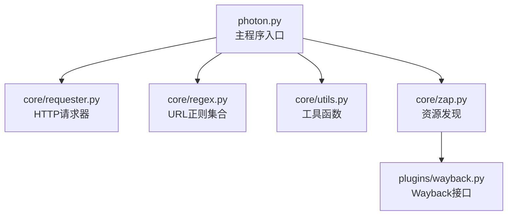
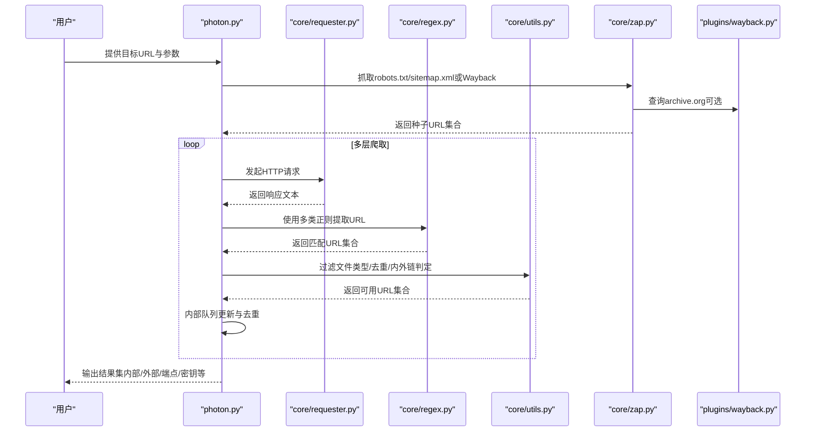
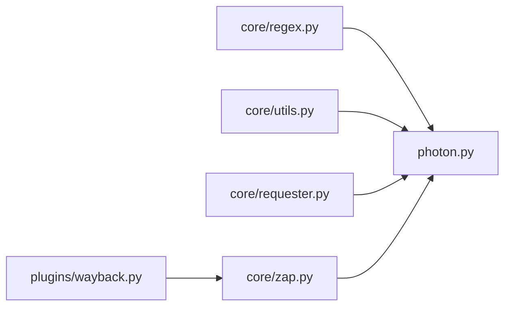

# URL提取技术

<cite>
**本文档引用的文件**
- [photon.py](file://photon.py)
- [core/regex.py](file://core/regex.py)
- [core/utils.py](file://core/utils.py)
- [core/requester.py](file://core/requester.py)
- [core/zap.py](file://core/zap.py)
- [plugins/wayback.py](file://plugins/wayback.py)
- [README.md](file://README.md)
</cite>

## 目录
1. [简介](#简介)
2. [项目结构](#项目结构)
3. [核心组件](#核心组件)
4. [架构总览](#架构总览)
5. [详细组件分析](#详细组件分析)
6. [依赖关系分析](#依赖关系分析)
7. [性能考虑](#性能考虑)
8. [故障排除指南](#故障排除指南)
9. [结论](#结论)
10. [附录](#附录)

## 简介
本文件系统性梳理Photon项目中的URL提取与去混淆技术，重点覆盖以下方面：
- 通用URL正则表达式：支持常见协议、可选分隔符、空白与括号等去混淆场景
- 括号URL：通过方括号与圆括号包裹点号的模式识别
- 反斜杠URL：识别反斜杠转义的点号与路径分隔符
- 十六进制编码URL：基于十六进制字节序列的URL识别
- URL编码URL：识别百分号编码（如%3A、%2F）的URL
- Base64编码URL：识别Base64编码的URL载荷
- 去混淆策略：针对点号、括号、反斜杠等字符的处理
- 性能优化与最佳实践：线程池调度、请求超时、代理与延迟控制

该文档面向不同技术背景的读者，既提供高层概览，也给出代码级的可视化图示与来源标注，便于快速定位实现细节。

## 项目结构
Photon采用模块化设计，URL提取相关的核心逻辑分布在以下模块：
- 主程序入口：负责参数解析、任务调度与结果输出
- 正则定义：集中管理各类URL提取正则表达式
- 工具函数：链接过滤、自定义正则、熵值检测、写入结果等
- 请求器：统一处理HTTP请求、会话复用与异常处理
- 资源发现：从robots.txt、sitemap.xml与Wayback Machine抓取种子URL

图表来源
- [photon.py:108-320](file://photon.py#L108-L320)
- [core/requester.py:11-72](file://core/requester.py#L11-L72)
- [core/regex.py:14-235](file://core/regex.py#L14-L235)
- [core/utils.py:15-76](file://core/utils.py#L15-L76)
- [core/zap.py:10-58](file://core/zap.py#L10-L58)
- [plugins/wayback.py:8-23](file://plugins/wayback.py#L8-L23)

章节来源
- [photon.py:108-320](file://photon.py#L108-L320)
- [README.md:36-61](file://README.md#L36-L61)

## 核心组件
- URL提取正则集合：在core/regex.py中定义了多种URL提取模式，涵盖通用URL、括号URL、反斜杠URL、十六进制编码URL、URL编码URL与Base64编码URL，并统一注册到智能情报提取列表中
- 链接过滤与去重：在photon.py中对提取到的链接进行去重、过滤文件类型、内外链判定与相对路径补全
- 自定义正则与高熵字符串：支持用户自定义正则抽取与API密钥等高熵字符串识别
- 请求器与会话：统一的HTTP请求封装，支持随机User-Agent、代理、超时与流式读取
- 资源发现：从robots.txt、sitemap.xml以及Wayback Machine抓取种子URL，提升初始覆盖率

章节来源
- [core/regex.py:14-235](file://core/regex.py#L14-L235)
- [photon.py:208-288](file://photon.py#L208-L288)
- [core/utils.py:15-76](file://core/utils.py#L15-L76)
- [core/requester.py:11-72](file://core/requester.py#L11-L72)
- [core/zap.py:10-58](file://core/zap.py#L10-L58)

## 架构总览
下图展示了URL提取与去混淆在整体流程中的位置与交互关系。

图表来源
- [photon.py:308-342](file://photon.py#L308-L342)
- [core/requester.py:11-72](file://core/requester.py#L11-L72)
- [core/regex.py:214-235](file://core/regex.py#L214-L235)
- [core/utils.py:26-48](file://core/utils.py#L26-L48)
- [core/zap.py:10-58](file://core/zap.py#L10-L58)
- [plugins/wayback.py:8-23](file://plugins/wayback.py#L8-L23)

## 详细组件分析

### 通用URL正则表达式
- 设计思路：以URI方案作为锚点，允许可选分隔符（如“://”、“:\\\\”、“__”），中间穿插空白与去混淆符号（括号、方括号、花括号、尖括号、反斜杠），并支持Cisco ESA风格的空格+斜杠+非点号的组合，最终以结束标点断词
- 应用场景：识别被轻微去混淆的URL，如将“http://”替换为“h t t p : / /”
- 匹配要点：忽略大小写、支持Unicode；结尾处使用预定义的结束标点集合进行断词，避免误匹配

章节来源
- [core/regex.py:14-37](file://core/regex.py#L14-L37)

### 括号URL
- 设计思路：以方括号或圆括号包裹点号为核心特征，允许括号前后存在空白字符，重复出现以覆盖多段域名与路径
- 应用场景：识别将点号用括号包裹以规避检测的URL
- 匹配要点：使用预定义的去混淆符号集合，确保括号与点号的组合被正确捕获

章节来源
- [core/regex.py:39-57](file://core/regex.py#L39-L57)

### 反斜杠URL
- 设计思路：以反斜杠前缀的点号为主要锚点，允许反斜杠可选出现，支持多段匹配，覆盖反斜杠+点号的组合
- 应用场景：识别将点号用反斜杠转义的URL
- 匹配要点：允许反斜杠可选出现，增强对“\.”与“\\.”的兼容

章节来源
- [core/regex.py:59-85](file://core/regex.py#L59-L85)

### 十六进制编码URL
- 设计思路：基于十六进制字节序列的URL识别，先匹配常见协议与“://”对应的十六进制编码，再匹配后续域名与路径的十六进制字节序列
- 应用场景：识别以十六进制编码形式隐藏的URL
- 匹配要点：限定结尾字符集，避免误匹配非URL内容；大小写不敏感

章节来源
- [core/regex.py:87-100](file://core/regex.py#L87-L100)

### URL编码URL
- 设计思路：识别百分号编码的协议与“://”，随后匹配域名与路径的编码字符
- 应用场景：识别以%3A、%2F等编码形式隐藏的URL
- 匹配要点：大小写不敏感，结尾使用非字母数字字符或字符串边界断词

章节来源
- [core/regex.py:102-105](file://core/regex.py#L102-L105)

### Base64编码URL
- 设计思路：针对“http(s)://”等协议的Base64编码载荷，采用多分支模式匹配协议部分，随后匹配Base64字符与填充符，限制最大长度以避免误匹配
- 应用场景：识别以Base64编码形式隐藏的URL
- 匹配要点：严格限制协议分支与字符集，避免误匹配；设置合理上限长度

章节来源
- [core/regex.py:107-127](file://core/regex.py#L107-L127)

### 去混淆技术实现
- 点号处理：通过括号URL与反斜杠URL两类正则分别覆盖“[.]”与“\.”的场景
- 括号处理：使用去混淆符号集合匹配括号与方括号包裹的点号
- 反斜杠处理：允许反斜杠可选出现，增强对“\.”的识别能力
- 综合策略：结合结束标点断词与Unicode支持，减少误报

章节来源
- [core/regex.py:5-11](file://core/regex.py#L5-L11)
- [core/regex.py:39-85](file://core/regex.py#L39-L85)

### 链接过滤与路径补全
- 过滤规则：跳过已处理过的URL、锚点与javascript链接；根据扩展名判断是否为文件类型
- 路径补全：对相对路径进行补全，支持“//”协议相对链接与“/”开头的绝对路径
- 内外链判定：基于根URL与主机名判断内/外链

章节来源
- [photon.py:208-288](file://photon.py#L208-L288)
- [core/utils.py:26-48](file://core/utils.py#L26-L48)

### 自定义正则与高熵字符串
- 自定义正则：支持用户传入正则表达式进行抽取
- 高熵字符串：基于熵值阈值识别API密钥等敏感信息

章节来源
- [core/utils.py:15-24](file://core/utils.py#L15-L24)
- [core/utils.py:101-109](file://core/utils.py#L101-L109)
- [core/regex.py:234](file://core/regex.py#L234)

### 请求器与会话
- 会话复用：使用requests.Session，限制最大重定向次数
- 请求头：随机User-Agent、基础头部字段
- 异常处理：捕获TooManyRedirects并返回占位符

章节来源
- [core/requester.py:8-72](file://core/requester.py#L8-L72)

### 资源发现与种子URL
- robots.txt：解析Allow/Disallow条目，生成可访问的种子URL
- sitemap.xml：解析XML中的URL条目
- Wayback Machine：按时间窗口查询归档URL并作为种子

章节来源
- [core/zap.py:10-58](file://core/zap.py#L10-L58)
- [plugins/wayback.py:8-23](file://plugins/wayback.py#L8-L23)

## 依赖关系分析
- 正则集合依赖：所有URL提取正则均在core/regex.py中定义，并通过智能情报列表统一调用
- 主流程依赖：photon.py在提取阶段调用requester.py获取响应文本，再交由regex.py进行匹配
- 工具函数依赖：is_link、remove_regex等工具函数贯穿链接过滤与排除逻辑
- 资源发现依赖：zap.py依赖plugins/wayback.py与core/utils.xml_parser

图表来源
- [core/regex.py:214-235](file://core/regex.py#L214-L235)
- [photon.py:208-288](file://photon.py#L208-L288)
- [core/utils.py:26-76](file://core/utils.py#L26-L76)
- [core/requester.py:11-72](file://core/requester.py#L11-L72)
- [core/zap.py:10-58](file://core/zap.py#L10-L58)
- [plugins/wayback.py:8-23](file://plugins/wayback.py#L8-L23)

## 性能考虑
- 线程池调度：使用flash函数并发执行提取任务，提高吞吐量
- 请求超时与延迟：通过参数控制请求超时与请求间隔，降低网络波动影响
- 代理与随机User-Agent：支持代理池与随机User-Agent，提升稳定性与绕过能力
- 会话复用与流式读取：复用会话、启用压缩与流式读取，减少内存占用
- 正则匹配优化：使用预编译正则与断词策略，减少回溯与误匹配

章节来源
- [photon.py:327](file://photon.py#L327)
- [core/requester.py:8-72](file://core/requester.py#L8-L72)
- [core/utils.py:15-24](file://core/utils.py#L15-L24)

## 故障排除指南
- 请求异常：TooManyRedirects导致返回占位符，需检查目标站点重定向策略
- 文件类型误判：通过扩展名白名单过滤文件类型，避免下载大文件
- 正则匹配失败：确认输入文本编码与正则标志（如IGNORECASE、UNICODE）是否正确
- 代理不可用：使用is_good_proxy进行连通性测试，剔除无效代理
- 结果为空：检查种子URL来源（robots.txt、sitemap.xml、Wayback）与排除正则

章节来源
- [core/requester.py:57-58](file://core/requester.py#L57-L58)
- [core/utils.py:40-48](file://core/utils.py#L40-L48)
- [core/utils.py:197-206](file://core/utils.py#L197-L206)
- [core/utils.py:51-75](file://core/utils.py#L51-L75)

## 结论
Photon的URL提取技术通过多类正则表达式覆盖常见的去混淆场景，结合严格的过滤与路径补全逻辑，实现了高效且鲁棒的URL提取。配合资源发现、代理与延迟控制等机制，能够在复杂网络环境中稳定运行。建议在实际使用中：
- 根据目标站点特征选择合适的正则组合
- 合理配置线程数、超时与延迟，平衡速度与稳定性
- 使用代理池与随机User-Agent提升成功率
- 对结果进行二次校验与去重

## 附录
- 关键实现路径参考
  - 通用URL正则：[core/regex.py:14-37](file://core/regex.py#L14-L37)
  - 括号URL正则：[core/regex.py:39-57](file://core/regex.py#L39-L57)
  - 反斜杠URL正则：[core/regex.py:59-85](file://core/regex.py#L59-L85)
  - 十六进制编码URL正则：[core/regex.py:87-100](file://core/regex.py#L87-L100)
  - URL编码URL正则：[core/regex.py:102-105](file://core/regex.py#L102-L105)
  - Base64编码URL正则：[core/regex.py:107-127](file://core/regex.py#L107-L127)
  - 链接过滤与路径补全：[photon.py:208-288](file://photon.py#L208-L288)
  - 自定义正则与高熵字符串：[core/utils.py:15-24](file://core/utils.py#L15-L24), [core/utils.py:101-109](file://core/utils.py#L101-L109)
  - 请求器与会话：[core/requester.py:11-72](file://core/requester.py#L11-L72)
  - 资源发现与种子URL：[core/zap.py:10-58](file://core/zap.py#L10-L58), [plugins/wayback.py:8-23](file://plugins/wayback.py#L8-L23)