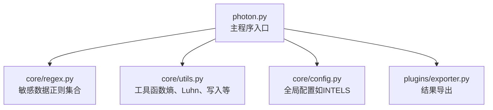
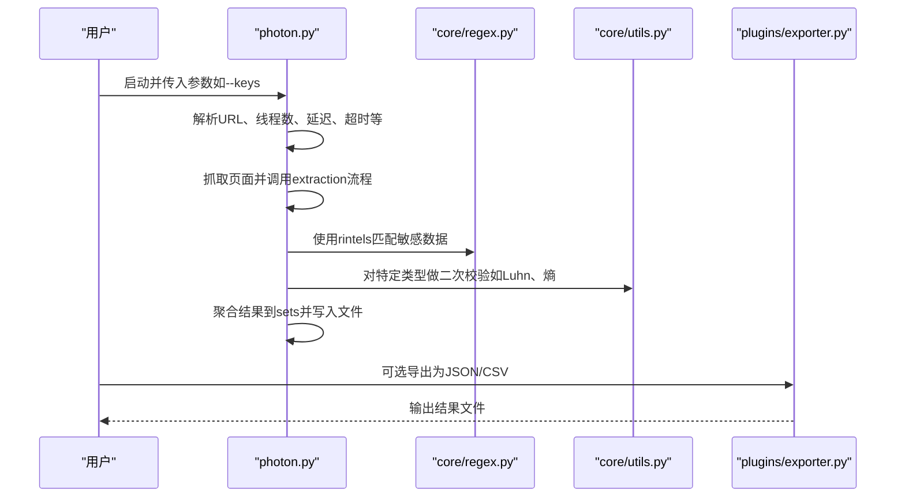
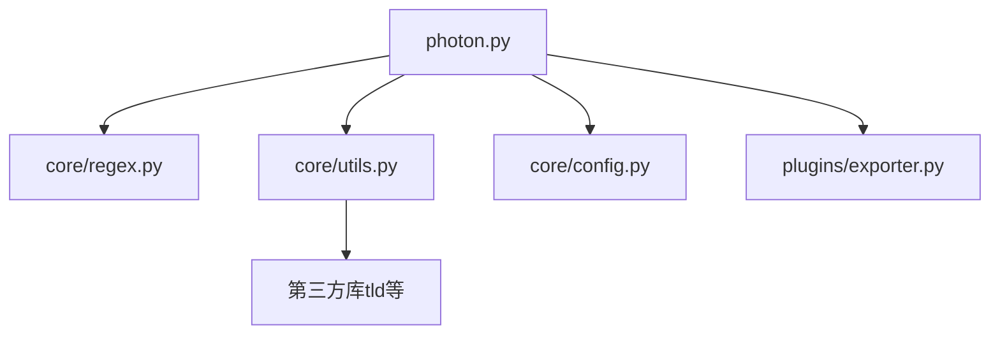
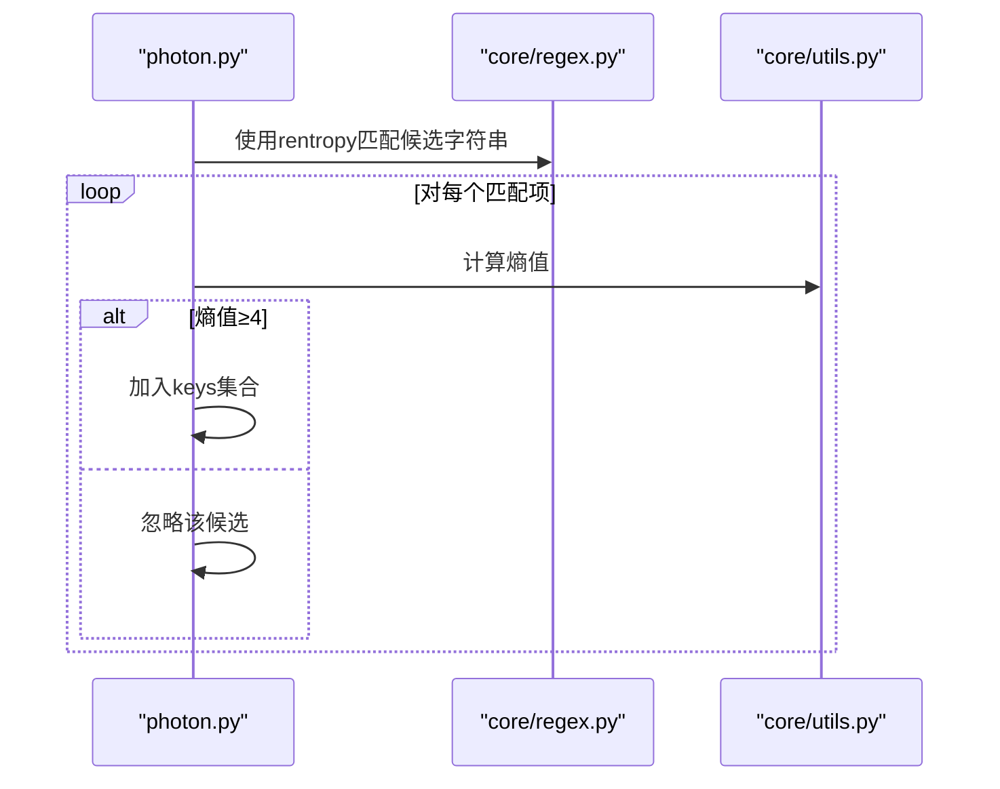
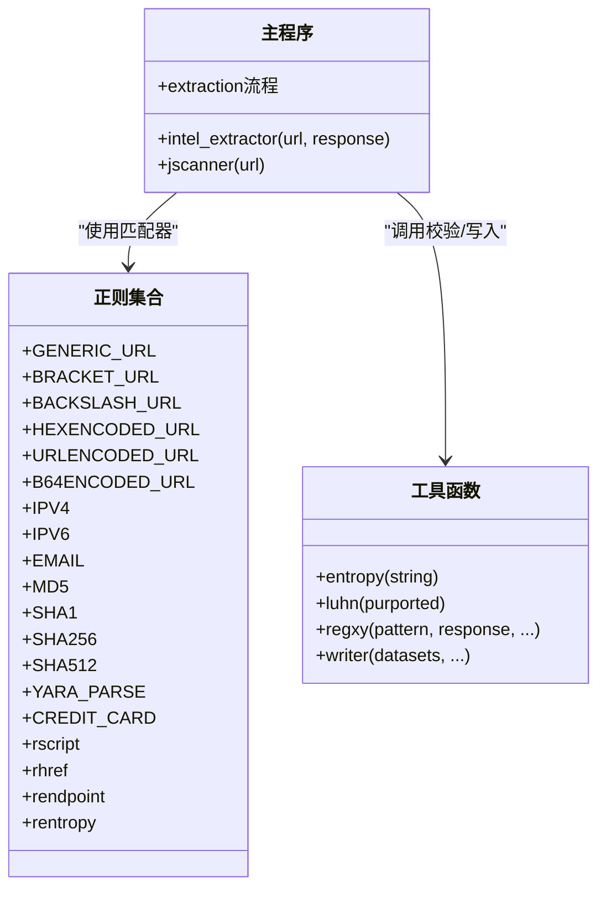

# 敏感数据检测

<cite>
**本文引用的文件**
- [photon.py](file://photon.py)
- [core/regex.py](file://core/regex.py)
- [core/utils.py](file://core/utils.py)
- [core/config.py](file://core/config.py)
- [README.md](file://README.md)
- [plugins/exporter.py](file://plugins/exporter.py)
</cite>

## 目录
1. [简介](#简介)
2. [项目结构](#项目结构)
3. [核心组件](#核心组件)
4. [架构总览](#架构总览)
5. [详细组件分析](#详细组件分析)
6. [依赖关系分析](#依赖关系分析)
7. [性能考量](#性能考量)
8. [故障排查指南](#故障排查指南)
9. [结论](#结论)
10. [附录](#附录)

## 简介
本文件系统性梳理Photon在敏感数据检测方面的能力与实现，覆盖以下主题：
- 邮箱地址识别
- 哈希值检测（MD5、SHA1、SHA256、SHA512）
- 信用卡号验证（Luhn算法）
- YARA规则解析
- API密钥检测（高熵字符串）
- 自定义敏感数据模式的添加与扩展
- 安全考虑与误报处理策略

同时，给出关键流程的时序图与类图，帮助读者从代码层面理解检测逻辑与数据流。

## 项目结构
- 主程序入口负责参数解析、爬取控制、结果聚合与导出。
- 核心正则模块集中定义各类敏感数据的匹配模式。
- 工具模块提供通用函数，如熵计算、Luhn校验、代理校验、输出写入等。
- 插件模块提供结果导出（JSON/CSV）能力。

图表来源
- [photon.py:1-426](file://photon.py#L1-L426)
- [core/regex.py:1-235](file://core/regex.py#L1-L235)
- [core/utils.py:1-207](file://core/utils.py#L1-L207)
- [core/config.py:1-28](file://core/config.py#L1-L28)
- [plugins/exporter.py:1-25](file://plugins/exporter.py#L1-L25)

章节来源
- [photon.py:1-50](file://photon.py#L1-L50)
- [core/regex.py:1-50](file://core/regex.py#L1-L50)
- [core/utils.py:1-50](file://core/utils.py#L1-L50)
- [core/config.py:1-28](file://core/config.py#L1-L28)
- [README.md:1-176](file://README.md#L1-L176)

## 核心组件
- 正则匹配器：集中于敏感数据类型的正则表达式集合，用于从响应体中抽取目标字符串。
- 检测执行器：在页面抓取后，按顺序调用正则匹配器提取敏感信息，并进行二次校验（如Luhn、熵阈值）。
- 结果聚合与导出：将提取到的敏感数据写入文件或导出为JSON/CSV。

章节来源
- [core/regex.py:214-235](file://core/regex.py#L214-L235)
- [photon.py:208-362](file://photon.py#L208-L362)
- [plugins/exporter.py:6-25](file://plugins/exporter.py#L6-L25)

## 架构总览
下图展示敏感数据检测在主流程中的位置与调用关系：

图表来源
- [photon.py:208-362](file://photon.py#L208-L362)
- [core/regex.py:214-235](file://core/regex.py#L214-L235)
- [core/utils.py:101-195](file://core/utils.py#L101-L195)
- [plugins/exporter.py:6-25](file://plugins/exporter.py#L6-L25)

## 详细组件分析

### 邮箱地址识别
- 正则模式：基于可防脱字符的邮箱格式，支持常见“@”替代写法与点号脱字符（如dot）等变体。
- 匹配范围：在页面HTML文本中查找符合邮箱格式的字符串。
- 处理流程：先移除脚本标签与HTML标签，再进行正则匹配，匹配成功即加入情报集合。

章节来源
- [core/regex.py:148-176](file://core/regex.py#L148-L176)
- [photon.py:208-218](file://photon.py#L208-L218)

### 哈希值检测（MD5、SHA1、SHA256、SHA512）
- 正则模式：分别针对固定长度的十六进制字符串（32、40、64、128位）进行匹配，使用单词边界确保非十六进制字符环绕。
- 匹配范围：页面正文与JavaScript内容中出现的哈希串。
- 处理流程：匹配后直接加入情报集合，不进行二次校验。

章节来源
- [core/regex.py:178-182](file://core/regex.py#L178-L182)
- [core/regex.py:223-226](file://core/regex.py#L223-L226)
- [photon.py:208-218](file://photon.py#L208-L218)

### 信用卡号验证（Luhn算法）
- 正则模式：匹配形如四组四位数字、中间可含空格或连字符的信用卡号格式。
- 二次校验：对匹配到的字符串调用Luhn算法进行校验，仅保留通过校验的有效卡号。
- 处理流程：在情报集合构建阶段，若为信用卡类型且Luhn校验失败，则跳过该条目。

章节来源
- [core/regex.py:212-212](file://core/regex.py#L212-L212)
- [core/utils.py:182-195](file://core/utils.py#L182-L195)
- [photon.py:352-362](file://photon.py#L352-L362)

### API密钥检测（高熵字符串）
- 正则模式：匹配长度在16至45之间的字母数字与连字符组合，作为潜在高熵字符串的候选。
- 二次校验：计算字符串的熵值，当熵值达到阈值（默认≥4）时，判定为高熵字符串并标记为密钥。
- 处理流程：在页面抓取后，使用高熵正则匹配，再对每个匹配项计算熵值，满足条件则加入密钥集合。

章节来源
- [core/regex.py:234-234](file://core/regex.py#L234-L234)
- [core/utils.py:101-109](file://core/utils.py#L101-L109)
- [photon.py:282-287](file://photon.py#L282-L287)

### YARA规则解析
- 正则模式：能够捕获YARA规则的导入、包含、注释、私有/全局修饰符、rule名称、标签、条件块等结构。
- 匹配范围：在页面文本中提取YARA规则片段，便于后续分析或安全审计。
- 处理流程：匹配后直接加入情报集合，不进行二次校验。

章节来源
- [core/regex.py:185-210](file://core/regex.py#L185-L210)
- [core/regex.py:227-227](file://core/regex.py#L227-L227)
- [photon.py:208-218](file://photon.py#L208-L218)

### 自定义敏感数据模式的添加与扩展
- 用户自定义正则：通过命令行参数传入自定义正则模式，程序会使用该模式在响应体中提取匹配项。
- 扩展方式：在正则模块中新增一个正则对象与名称元组，并将其加入匹配列表；或在运行时通过命令行参数传入正则表达式。

章节来源
- [core/utils.py:15-24](file://core/utils.py#L15-L24)
- [photon.py:280-281](file://photon.py#L280-L281)
- [core/regex.py:214-228](file://core/regex.py#L214-L228)

### 结果聚合与导出
- 写入文件：将各类集合（如files、intel、keys等）写入对应txt文件。
- 导出格式：支持JSON与CSV两种导出格式，便于进一步分析与集成。

章节来源
- [core/utils.py:78-87](file://core/utils.py#L78-L87)
- [plugins/exporter.py:6-25](file://plugins/exporter.py#L6-L25)
- [photon.py:376-403](file://photon.py#L376-L403)

## 依赖关系分析
- 主程序依赖正则模块提供的匹配器与工具模块提供的辅助函数。
- 工具模块依赖标准库与第三方库（如tld），用于域名解析与HTTP请求。
- 插件模块依赖标准库进行文件写入与格式化输出。

图表来源
- [photon.py:1-50](file://photon.py#L1-L50)
- [core/regex.py:1-5](file://core/regex.py#L1-L5)
- [core/utils.py:1-12](file://core/utils.py#L1-L12)
- [core/config.py:1-28](file://core/config.py#L1-L28)
- [plugins/exporter.py:1-25](file://plugins/exporter.py#L1-L25)

## 性能考量
- 正则匹配复杂度：各正则为固定长度或简单通配，整体匹配开销可控。
- 熵计算：对每个候选字符串计算熵，时间复杂度与字符串长度线性相关；建议在必要时限制候选集规模。
- Luhn校验：对每个信用卡号进行常数时间校验，开销极低。
- 并发与批量：主程序采用并发抓取与批量处理，提升整体吞吐量。

## 故障排查指南
- 自定义正则无效
  - 检查正则语法是否正确，避免在命令行中转义问题。
  - 确认响应体中确实存在匹配内容。
  - 参考路径：[core/utils.py:15-24](file://core/utils.py#L15-L24)，[photon.py:280-281](file://photon.py#L280-L281)
- API密钥误报
  - 提高熵阈值或增加上下文过滤（如排除常见短语）。
  - 参考路径：[core/utils.py:101-109](file://core/utils.py#L101-L109)，[photon.py:282-287](file://photon.py#L282-L287)
- 信用卡号漏报
  - 调整信用卡正则以适配更多格式（如去除空格/连字符限制）。
  - 参考路径：[core/regex.py:212-212](file://core/regex.py#L212-L212)，[core/utils.py:182-195](file://core/utils.py#L182-L195)
- 结果未导出
  - 确认导出参数与目录权限。
  - 参考路径：[plugins/exporter.py:6-25](file://plugins/exporter.py#L6-L25)，[photon.py:416-420](file://photon.py#L416-L420)

## 结论
Photon在敏感数据检测方面提供了较为完善的基础设施：
- 通过统一的正则集合覆盖邮箱、哈希、YARA规则、信用卡号等常见敏感类型。
- 在关键场景（API密钥、信用卡号）引入二次校验，有效降低误报。
- 支持自定义正则扩展，便于适应新的威胁模型。
- 提供导出能力，便于后续审计与集成。

建议在生产环境中结合业务上下文与误报率，动态调整阈值与规则，以获得更佳的检测效果。

## 附录

### 关键流程时序图：API密钥检测

图表来源
- [photon.py:282-287](file://photon.py#L282-L287)
- [core/regex.py:234-234](file://core/regex.py#L234-L234)
- [core/utils.py:101-109](file://core/utils.py#L101-L109)

### 类图：核心检测组件关系

图表来源
- [core/regex.py:1-235](file://core/regex.py#L1-L235)
- [core/utils.py:101-195](file://core/utils.py#L101-L195)
- [photon.py:208-362](file://photon.py#L208-L362)