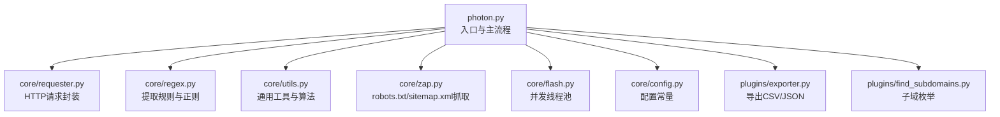
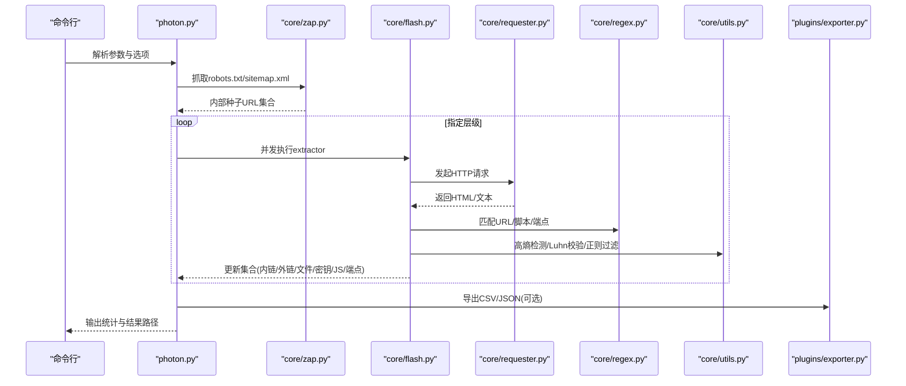
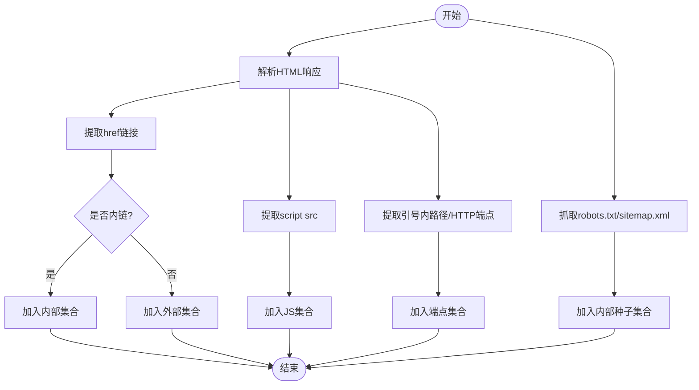
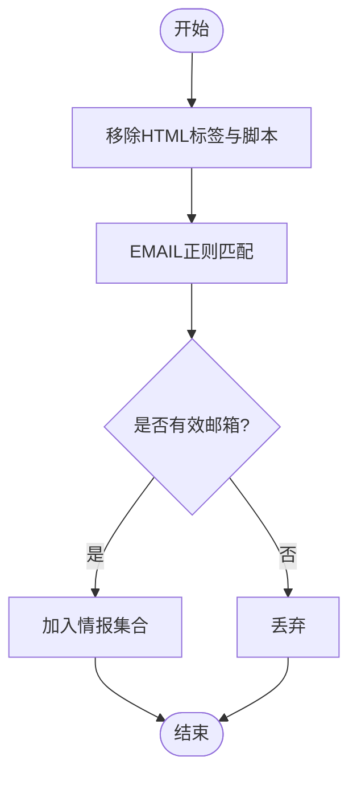
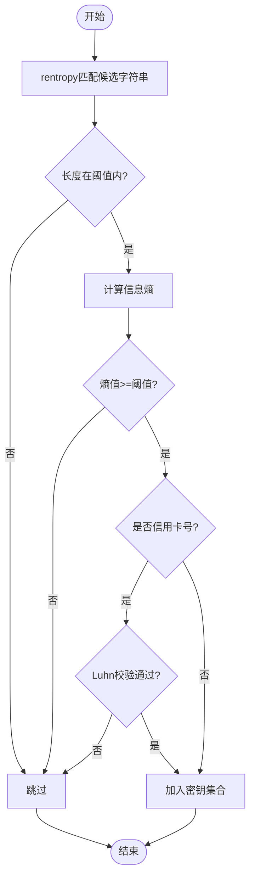
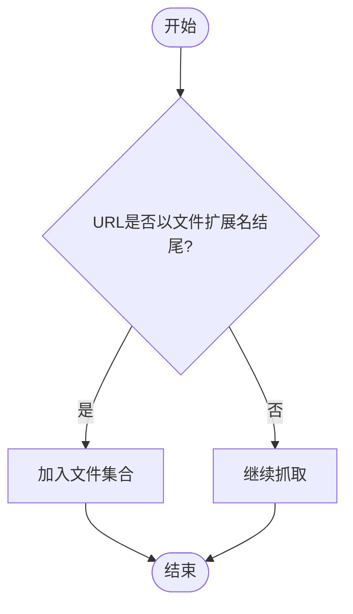
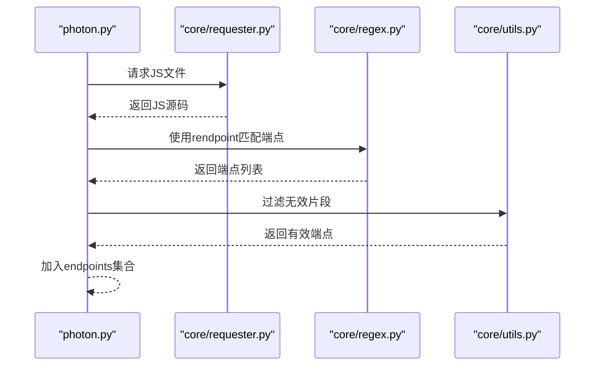
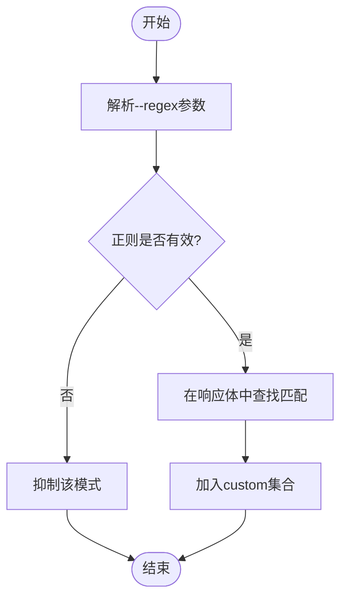
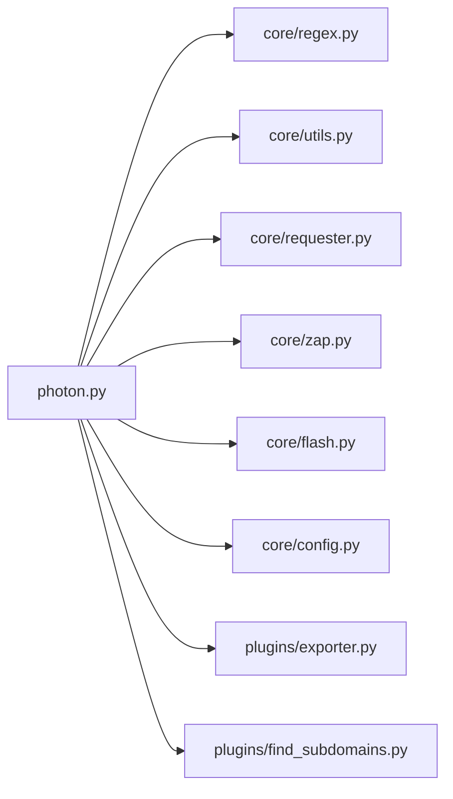

# 数据提取功能

<cite>
**本文引用的文件**
- [photon.py](file://photon.py)
- [core/regex.py](file://core/regex.py)
- [core/utils.py](file://core/utils.py)
- [core/requester.py](file://core/requester.py)
- [core/zap.py](file://core/zap.py)
- [core/flash.py](file://core/flash.py)
- [core/config.py](file://core/config.py)
- [plugins/exporter.py](file://plugins/exporter.py)
- [plugins/find_subdomains.py](file://plugins/find_subdomains.py)
- [README.md](file://README.md)
</cite>

## 目录
1. [简介](#简介)
2. [项目结构](#项目结构)
3. [核心组件](#核心组件)
4. [架构总览](#架构总览)
5. [详细组件分析](#详细组件分析)
6. [依赖关系分析](#依赖关系分析)
7. [性能考量](#性能考量)
8. [故障排查指南](#故障排查指南)
9. [结论](#结论)
10. [附录](#附录)

## 简介
本文件系统性阐述Photon的数据提取能力与实现原理，覆盖以下主题：
- URL提取：支持普通、括号、反斜杠、十六进制、URL编码、Base64编码等多种形式的URL识别，并能从robots.txt与sitemap.xml中抓取种子链接。
- 邮箱地址识别：通过正则匹配识别常见格式的邮箱地址，支持常见的“去花括号”（defang）技巧。
- API密钥检测：基于高熵字符串检测算法，筛选疑似密钥或令牌。
- 文件类型识别：根据扩展名过滤非网页内容，自动归类为文件集合。
- JavaScript分析：解析页面中的脚本标签，抽取JS文件；在JS中进一步提取潜在端点路径。
- 正则表达式使用与自定义模式：支持用户传入自定义正则进行提取。
- 安全考虑与最佳实践：敏感信息检测、误报控制、合规使用建议。

## 项目结构
Photon采用模块化设计，主程序负责参数解析、调度与结果输出，核心模块提供请求、正则、工具函数、并发执行等能力，插件模块提供导出与DNS子域枚举等扩展功能。

图表来源
- [photon.py:108-426](file://photon.py#L108-L426)
- [core/requester.py:11-73](file://core/requester.py#L11-L73)
- [core/regex.py:1-235](file://core/regex.py#L1-L235)
- [core/utils.py:1-207](file://core/utils.py#L1-L207)
- [core/zap.py:10-58](file://core/zap.py#L10-L58)
- [core/flash.py:6-17](file://core/flash.py#L6-L17)
- [core/config.py:1-28](file://core/config.py#L1-L28)
- [plugins/exporter.py:6-25](file://plugins/exporter.py#L6-L25)
- [plugins/find_subdomains.py:7-15](file://plugins/find_subdomains.py#L7-L15)

章节来源
- [photon.py:108-426](file://photon.py#L108-L426)
- [README.md:36-50](file://README.md#L36-L50)

## 核心组件
- 主程序调度器：解析命令行参数、初始化全局状态、驱动爬取与提取流程。
- 请求器：统一管理HTTP会话、超时、代理、随机User-Agent、响应类型判断。
- 正则库：集中定义各类提取规则（URL、邮箱、哈希、端点、JS脚本等），并提供高熵字符串匹配。
- 工具库：包含熵计算、Luhn校验、正则过滤、头解析、域名层级提取、代理校验、并发执行等。
- 并发执行：基于ThreadPoolExecutor的批量任务调度。
- 插件：导出CSV/JSON、子域枚举等扩展功能。

章节来源
- [photon.py:108-426](file://photon.py#L108-L426)
- [core/requester.py:11-73](file://core/requester.py#L11-L73)
- [core/regex.py:1-235](file://core/regex.py#L1-L235)
- [core/utils.py:1-207](file://core/utils.py#L1-L207)
- [core/flash.py:6-17](file://core/flash.py#L6-L17)

## 架构总览
下图展示了从入口到各提取模块的调用关系与数据流。

图表来源
- [photon.py:308-342](file://photon.py#L308-L342)
- [core/zap.py:10-58](file://core/zap.py#L10-L58)
- [core/flash.py:6-17](file://core/flash.py#L6-L17)
- [core/requester.py:11-73](file://core/requester.py#L11-L73)
- [core/regex.py:231-235](file://core/regex.py#L231-L235)
- [core/utils.py:15-24](file://core/utils.py#L15-L24)
- [plugins/exporter.py:6-25](file://plugins/exporter.py#L6-L25)

## 详细组件分析

### URL提取与链接发现
- 提取策略
  - 页面内链接：通过匹配<a>标签的href属性，解析相对/绝对路径，区分内外链。
  - JS文件：通过匹配<script>标签的src属性，收集脚本资源。
  - 端点路径：在HTML中匹配引号包裹的路径串，在JS中进一步提取HTTP端点。
  - 种子来源：优先从robots.txt与sitemap.xml抓取，支持从archive.org拉取历史URL作为种子。
- 正则规则
  - 页面链接：使用rhref匹配href属性值。
  - JS文件：使用rscript匹配src属性值。
  - 端点路径：使用rendpoint匹配引号内的路径或HTTP开头的URL。
  - URL识别：使用多种正则组合识别不同编码/变形的URL（通用、括号、反斜杠、十六进制、URL编码、Base64）。
- 外链判定与归类
  - 基于目标域名与协议，将链接分为内链、外链两类，便于后续分析与风险评估。

图表来源
- [photon.py:239-303](file://photon.py#L239-L303)
- [core/regex.py:231-235](file://core/regex.py#L231-L235)
- [core/zap.py:10-58](file://core/zap.py#L10-L58)

章节来源
- [photon.py:239-303](file://photon.py#L239-L303)
- [core/regex.py:231-235](file://core/regex.py#L231-L235)
- [core/zap.py:10-58](file://core/zap.py#L10-L58)

### 邮箱地址识别
- 实现原理
  - 使用EMAIL正则匹配邮箱地址，支持常见的“去花括号”技巧（如将@替换为“at”、点号替换为“dot”等）。
  - 在提取前先移除HTML标签与脚本块，降低误报。
- 过滤与验证
  - 对匹配结果进行二次过滤，避免将无效片段误判为邮箱。
  - 可结合外部规则对社交平台账号等进行补充识别。

图表来源
- [photon.py:208-218](file://photon.py#L208-L218)
- [core/regex.py:147-176](file://core/regex.py#L147-L176)

章节来源
- [photon.py:208-218](file://photon.py#L208-L218)
- [core/regex.py:147-176](file://core/regex.py#L147-L176)

### API密钥检测与高熵字符串
- 算法原理
  - 高熵检测：对候选字符串计算信息熵，熵值越高越可能为随机密钥或令牌。
  - Luhn算法：用于信用卡号校验，减少信用卡号误报。
- 实现细节
  - 使用rentropy匹配长度在阈值范围内的字母数字串。
  - 结合entropy函数计算熵值，设定阈值过滤可疑字符串。
  - 对信用卡号使用Luhn校验，剔除无效号码。
- 结果输出
  - 将疑似密钥以“来源URL:密钥”的形式保存至keys集合。

图表来源
- [photon.py:282-287](file://photon.py#L282-L287)
- [core/utils.py:101-109](file://core/utils.py#L101-L109)
- [core/utils.py:182-194](file://core/utils.py#L182-L194)
- [core/regex.py:234](file://core/regex.py#L234)

章节来源
- [photon.py:282-287](file://photon.py#L282-L287)
- [core/utils.py:101-109](file://core/utils.py#L101-L109)
- [core/utils.py:182-194](file://core/utils.py#L182-L194)
- [core/regex.py:234](file://core/regex.py#L234)

### 文件类型识别
- 实现原理
  - 通过BAD_TYPES元组维护不希望抓取的文件扩展名列表。
  - 在链接过滤阶段，若URL以这些扩展名结尾，则将其归类为文件集合，不再继续深入抓取。
- 影响
  - 减少对静态资源的请求开销，提高整体效率。

图表来源
- [core/config.py:12-27](file://core/config.py#L12-L27)
- [core/utils.py:26-48](file://core/utils.py#L26-L48)

章节来源
- [core/config.py:12-27](file://core/config.py#L12-L27)
- [core/utils.py:26-48](file://core/utils.py#L26-L48)

### JavaScript分析与端点提取
- 分析流程
  - 先从HTML中提取所有<script>标签的src属性，形成JS文件集合。
  - 对每个JS文件发起请求，使用rendpoint正则提取其中的路径或HTTP端点。
  - 过滤掉明显不是端点的片段（如包含大括号、引号等）。
- 结果
  - endpoints集合记录所有发现的端点路径，便于后续安全测试。

图表来源
- [photon.py:332-342](file://photon.py#L332-L342)
- [photon.py:290-303](file://photon.py#L290-L303)
- [core/regex.py:233](file://core/regex.py#L233)

章节来源
- [photon.py:332-342](file://photon.py#L332-L342)
- [photon.py:290-303](file://photon.py#L290-L303)
- [core/regex.py:233](file://core/regex.py#L233)

### 正则表达式使用与自定义模式
- 用户自定义正则
  - 通过-r/--regex参数传入自定义正则模式，程序会使用regxy函数在响应体中查找匹配项。
  - 若正则无效或异常，将抑制后续该模式的执行。
- 自定义模式的添加方法
  - 在命令行中直接传入正则表达式，例如匹配特定业务字段或API路径。
  - 注意：正则应尽量精确，避免误报与性能问题。

图表来源
- [photon.py:280-281](file://photon.py#L280-L281)
- [core/utils.py:15-24](file://core/utils.py#L15-L24)

章节来源
- [photon.py:280-281](file://photon.py#L280-L281)
- [core/utils.py:15-24](file://core/utils.py#L15-L24)

### 敏感信息检测的安全考虑与最佳实践
- 误报控制
  - 使用Luhn算法过滤信用卡号，减少误报。
  - 使用高熵阈值筛选可疑密钥，避免将长字符串误判为密钥。
- 合规与最小化
  - 仅在授权范围内使用，遵守目标网站的robots.txt与服务条款。
  - 控制请求频率与并发度，避免对目标服务器造成压力。
- 结果管理
  - 将敏感信息分类存储，导出时注意脱敏与权限控制。
  - 建议在本地或受控环境中进行分析，避免泄露。

章节来源
- [photon.py:352-362](file://photon.py#L352-L362)
- [core/utils.py:101-109](file://core/utils.py#L101-L109)
- [core/utils.py:182-194](file://core/utils.py#L182-L194)

## 依赖关系分析

图表来源
- [photon.py:32-51](file://photon.py#L32-L51)
- [core/regex.py:1-235](file://core/regex.py#L1-L235)
- [core/utils.py:1-207](file://core/utils.py#L1-L207)
- [core/requester.py:11-73](file://core/requester.py#L11-L73)
- [core/zap.py:10-58](file://core/zap.py#L10-L58)
- [core/flash.py:6-17](file://core/flash.py#L6-L17)
- [core/config.py:1-28](file://core/config.py#L1-L28)
- [plugins/exporter.py:6-25](file://plugins/exporter.py#L6-L25)
- [plugins/find_subdomains.py:7-15](file://plugins/find_subdomains.py#L7-L15)

章节来源
- [photon.py:32-51](file://photon.py#L32-L51)

## 性能考量
- 并发与线程池
  - 使用ThreadPoolExecutor按指定线程数并发执行extractor与jscanner，显著提升吞吐量。
- 请求优化
  - 统一会话、随机User-Agent、限制重定向次数、关闭SSL验证、按需设置超时。
- 资源过滤
  - 通过BAD_TYPES过滤静态资源，减少无效请求。
- 级别与排除
  - 支持设置爬取层级与排除正则，避免无限扩展与冗余抓取。

章节来源
- [core/flash.py:6-17](file://core/flash.py#L6-L17)
- [core/requester.py:8-73](file://core/requester.py#L8-L73)
- [core/config.py:12-27](file://core/config.py#L12-L27)
- [core/utils.py:51-75](file://core/utils.py#L51-L75)

## 故障排查指南
- 代理不可用
  - 使用is_good_proxy进行连通性测试，失败则提示并退出。
- 正则异常
  - 自定义正则无效时会抑制后续执行，检查正则语法与目标内容。
- 请求失败
  - 对404或重定向过多的响应进行标记，避免重复尝试。
- 结果为空
  - 检查robots.txt与sitemap.xml是否被正确解析，确认种子URL是否有效。

章节来源
- [core/utils.py:197-206](file://core/utils.py#L197-L206)
- [core/utils.py:15-24](file://core/utils.py#L15-L24)
- [core/requester.py:47-70](file://core/requester.py#L47-L70)
- [core/zap.py:23-57](file://core/zap.py#L23-L57)

## 结论
Photon通过模块化的架构与完善的正则体系，实现了对URL、邮箱、密钥、文件、JS与端点的多维度提取。其高熵检测与Luhn校验有效降低了误报，配合并发执行与资源过滤提升了整体性能。在实际使用中，应严格遵循合规要求，合理设置参数，确保高效且安全地完成数据提取任务。

## 附录
- 常用命令示例
  - 基础爬取：photon.py -u example.com
  - 仅提取URL：photon.py -u example.com --only-urls
  - 自定义正则：photon.py -u example.com -r "your-pattern"
  - 导出结果：photon.py -u example.com -e json
  - 子域枚举：photon.py -u example.com --dns
- 输出文件
  - files/intel/robots/custom/failed/internal/scripts/external/fuzzable/endpoints/keys/keys等集合分别保存为独立txt文件，也可导出为CSV/JSON。

章节来源
- [README.md:36-50](file://README.md#L36-L50)
- [photon.py:376-421](file://photon.py#L376-L421)
- [plugins/exporter.py:6-25](file://plugins/exporter.py#L6-L25)