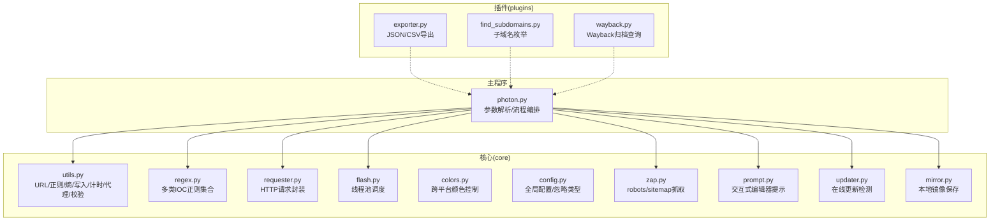
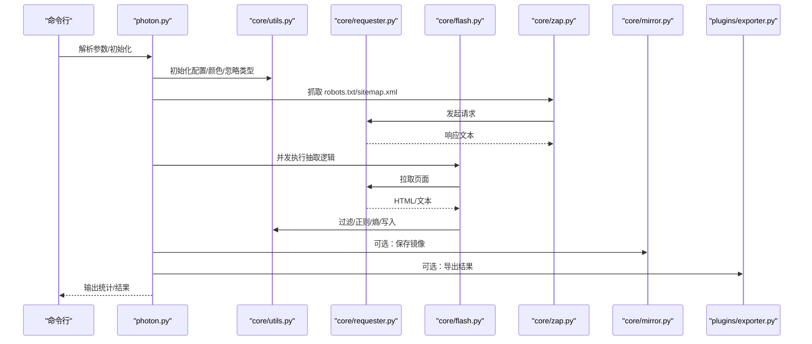
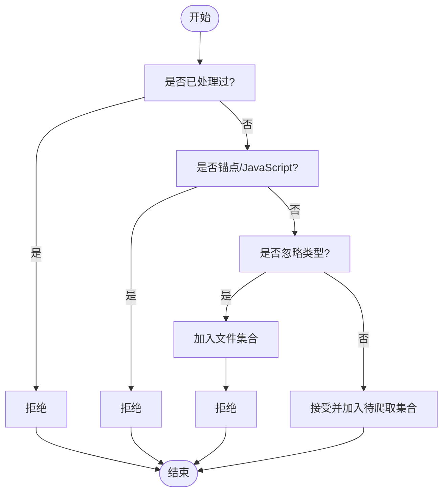
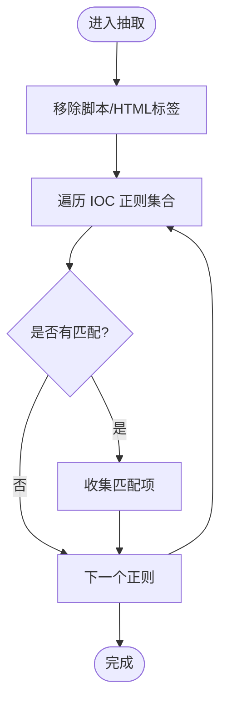
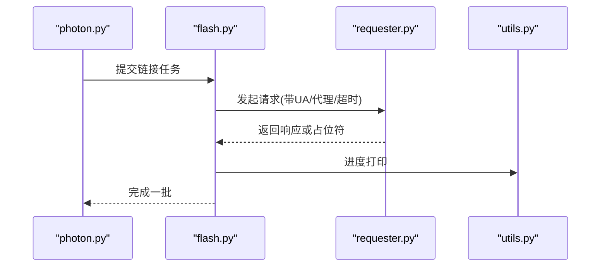
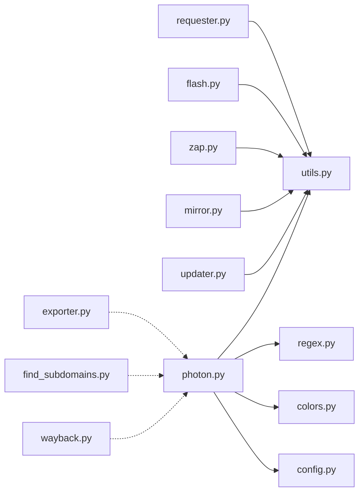

# 工具函数库

<cite>
**本文引用的文件**
- [photon.py](file://photon.py)
- [core/utils.py](file://core/utils.py)
- [core/colors.py](file://core/colors.py)
- [core/config.py](file://core/config.py)
- [core/regex.py](file://core/regex.py)
- [core/requester.py](file://core/requester.py)
- [core/mirror.py](file://core/mirror.py)
- [core/flash.py](file://core/flash.py)
- [core/zap.py](file://core/zap.py)
- [core/prompt.py](file://core/prompt.py)
- [core/updater.py](file://core/updater.py)
- [plugins/exporter.py](file://plugins/exporter.py)
- [plugins/find_subdomains.py](file://plugins/find_subdomains.py)
- [plugins/wayback.py](file://plugins/wayback.py)
- [README.md](file://README.md)
- [requirements.txt](file://requirements.txt)
</cite>

## 目录
1. [简介](#简介)
2. [项目结构](#项目结构)
3. [核心组件](#核心组件)
4. [架构总览](#架构总览)
5. [详细组件分析](#详细组件分析)
6. [依赖分析](#依赖分析)
7. [性能考虑](#性能考虑)
8. [故障排查指南](#故障排查指南)
9. [结论](#结论)
10. [附录](#附录)

## 简介
本文件为工具函数库的综合技术文档，聚焦于核心工具模块与常用辅助函数的设计与使用，涵盖以下主题：
- URL 处理：链接过滤、相对路径拼接、顶层域名提取、robots.txt/sitemap 解析
- 文件类型判断：基于扩展名的文件类型黑名单过滤
- 颜色输出：跨平台终端颜色控制
- 配置管理：全局开关与默认集合（如忽略类型）
- 正则与情报提取：通用 URL/邮箱/IP/CRC/哈希/YARA/卡号等识别
- 请求与并发：会话封装、请求头与代理、线程池调度
- 结果导出与镜像：结果写入、本地镜像保存
- 更新与提示：在线更新检测、交互式编辑器提示

文档同时提供设计原则、复用策略、扩展与自定义建议、错误处理与边界条件说明，并给出集成方法与使用示例。

## 项目结构
该项目采用按功能域分层的组织方式：
- 核心工具与服务位于 core 目录，提供通用能力（正则、网络请求、并发、颜色、配置等）
- 主程序入口在根目录，负责参数解析、流程编排与调用核心工具
- 插件位于 plugins 目录，提供可选扩展能力（导出、子域名枚举、Wayback 归档）

**图表来源**
- [photon.py](file://photon.py)
- [core/utils.py](file://core/utils.py)
- [core/regex.py](file://core/regex.py)
- [core/requester.py](file://core/requester.py)
- [core/flash.py](file://core/flash.py)
- [core/zap.py](file://core/zap.py)
- [core/prompt.py](file://core/prompt.py)
- [core/updater.py](file://core/updater.py)
- [core/mirror.py](file://core/mirror.py)
- [plugins/exporter.py](file://plugins/exporter.py)
- [plugins/find_subdomains.py](file://plugins/find_subdomains.py)
- [plugins/wayback.py](file://plugins/wayback.py)

**章节来源**
- [photon.py](file://photon.py)
- [README.md](file://README.md)

## 核心组件
本节对关键工具函数进行深入分析，解释其职责、输入输出、复杂度与边界条件，并给出使用示例与集成方法。

- URL 过滤与去重
  - is_link：根据已处理集合、协议/锚点、以及“忽略类型”集合判断是否应爬取；命中忽略类型会加入文件集合
  - remove_regex：对 URL 列表进行非匹配过滤，支持字符串转列表；异常时返回空列表
  - 示例路径：[is_link](file://core/utils.py)，[remove_regex](file://core/utils.py)

- URL 解析与拼接
  - top_level：从 URL 中提取顶层域名，兼容协议修复
  - 示例路径：[top_level](file://core/utils.py)

- 正则与情报提取
  - regxy：基于用户提供的正则模式从响应中抽取匹配项，支持抑制异常
  - rintels/rendpoint/rhref/rscript/rentropy：多类 IOC 与端点识别正则集合
  - 示例路径：[regxy](file://core/utils.py)，[core/regex.py](file://core/regex.py)

- 数据写入与统计
  - writer：将多个数据集写入指定目录下的文本文件
  - timer：计算耗时与平均请求耗时（零除保护）
  - 示例路径：[writer](file://core/utils.py)，[timer](file://core/utils.py)

- 熵值与卡号校验
  - entropy：计算字符串熵值，用于识别高随机性密钥
  - luhn：Luhn 校验算法，用于信用卡号有效性粗判
  - 示例路径：[entropy](file://core/utils.py)，[luhn](file://core/utils.py)

- 代理与请求
  - proxy_type/is_proxy_list：解析单个或文件中的代理条目，生成 requests 兼容格式
  - is_good_proxy：测试代理连通性（超时即视为失败）
  - requester：统一的 HTTP 请求封装，含延迟、随机 UA、随机代理、流式读取、状态/类型检查
  - 示例路径：[proxy_type](file://core/utils.py)，[is_proxy_list](file://core/utils.py)，[is_good_proxy](file://core/utils.py)，[requester](file://core/requester.py)

- 并发与进度
  - flash：基于 ThreadPoolExecutor 的并发执行与进度打印
  - 示例路径：[flash](file://core/flash.py)

- 输出与颜色
  - colors：跨平台颜色常量与信息/成功/警告等标记
  - 示例路径：[colors](file://core/colors.py)

- 配置与忽略类型
  - config：全局开关与忽略类型元组
  - 示例路径：[config](file://core/config.py)

- 结果导出与镜像
  - mirror：将响应内容按原始 URL 结构保存到本地镜像目录
  - exporter：将数据集导出为 JSON 或 CSV
  - 示例路径：[mirror](file://core/mirror.py)，[exporter.py](file://plugins/exporter.py)

- 在线更新与提示
  - updater：检测最新版本变更并提示更新
  - prompt：通过临时文件与系统编辑器交互式输入头部
  - 示例路径：[updater.py](file://core/updater.py)，[prompt.py](file://core/prompt.py)

**章节来源**
- [core/utils.py](file://core/utils.py)
- [core/regex.py](file://core/regex.py)
- [core/requester.py](file://core/requester.py)
- [core/flash.py](file://core/flash.py)
- [core/colors.py](file://core/colors.py)
- [core/config.py](file://core/config.py)
- [core/mirror.py](file://core/mirror.py)
- [plugins/exporter.py](file://plugins/exporter.py)
- [core/updater.py](file://core/updater.py)
- [core/prompt.py](file://core/prompt.py)

## 架构总览
下图展示了主程序与核心工具之间的调用关系与数据流向。

**图表来源**
- [photon.py](file://photon.py)
- [core/utils.py](file://core/utils.py)
- [core/requester.py](file://core/requester.py)
- [core/flash.py](file://core/flash.py)
- [core/zap.py](file://core/zap.py)
- [core/mirror.py](file://core/mirror.py)
- [plugins/exporter.py](file://plugins/exporter.py)

## 详细组件分析

### URL 处理与过滤
- 设计原则
  - 明确区分“应爬取”与“忽略”的边界，避免重复请求与无效资源下载
  - 支持正则排除与黑名单扩展，便于灵活控制
- 关键函数
  - is_link：基于已处理集合、协议/锚点、忽略类型三要素判定
  - remove_regex：非匹配过滤，健壮性处理异常输入
  - top_level：稳定提取顶层域名，便于外部站点识别
- 使用示例（路径）
  - [is_link 调用位置](file://photon.py)
  - [remove_regex 调用位置](file://photon.py)
  - [top_level 调用位置](file://photon.py)
- 扩展建议
  - 新增“白名单/黑名单规则”组合，支持更细粒度的 URL 控制
  - 引入缓存机制减少重复正则匹配

**图表来源**
- [core/utils.py](file://core/utils.py)

**章节来源**
- [core/utils.py](file://core/utils.py)
- [photon.py](file://photon.py)

### 正则与情报提取
- 设计原则
  - 将多种 IOC 识别规则集中管理，便于统一调用与维护
  - 对脚本/HTML标签进行预清理，降低误报
- 关键函数
  - regxy：自定义正则抽取
  - rintels：多类 IOC 正则集合（URL/邮箱/IP/哈希/YARA/卡号等）
  - rhref/rscript/rendpoint/rentropy：页面链接、脚本、端点、高熵字符串识别
- 使用示例（路径）
  - [regxy 调用位置](file://photon.py)
  - [lintels 使用位置](file://photon.py)
  - [正则集合定义](file://core/regex.py)

**图表来源**
- [core/regex.py](file://core/regex.py)
- [photon.py](file://photon.py)

**章节来源**
- [core/regex.py](file://core/regex.py)
- [core/utils.py](file://core/utils.py)
- [photon.py](file://photon.py)

### 请求与并发
- 设计原则
  - 统一请求接口，隐藏细节（随机 UA、代理轮换、超时、流式读取）
  - 并发调度与进度反馈，提升吞吐
- 关键函数
  - requester：封装 GET 请求，类型/状态检查，异常处理
  - flash：线程池并发执行，周期性进度输出
  - proxy_type/is_proxy_list/is_good_proxy：代理解析、批量加载、连通性测试
- 使用示例（路径）
  - [requester 调用位置](file://photon.py)
  - [flash 调用位置](file://photon.py)
  - [代理解析与测试](file://photon.py)

**图表来源**
- [core/flash.py](file://core/flash.py)
- [core/requester.py](file://core/requester.py)
- [core/utils.py](file://core/utils.py)
- [photon.py](file://photon.py)

**章节来源**
- [core/requester.py](file://core/requester.py)
- [core/flash.py](file://core/flash.py)
- [core/utils.py](file://core/utils.py)
- [photon.py](file://photon.py)

### 颜色输出与配置
- 设计原则
  - 跨平台兼容（Windows/macOS 不显示颜色），保持输出一致性
  - 将颜色常量集中管理，便于统一风格
- 关键函数
  - colors：定义颜色前缀与信息/成功/警告等标记
  - config：全局开关与忽略类型集合
- 使用示例（路径）
  - [颜色使用位置](file://photon.py)
  - [配置使用位置](file://photon.py)

**章节来源**
- [core/colors.py](file://core/colors.py)
- [core/config.py](file://core/config.py)
- [photon.py](file://photon.py)

### 结果导出与镜像
- 设计原则
  - 结果写入与导出解耦，支持多种格式
  - 镜像保存遵循原始 URL 结构，便于本地复现
- 关键函数
  - writer：批量写入文本文件
  - mirror：按层级创建目录并写入内容
  - exporter：JSON/CSV 导出
- 使用示例（路径）
  - [writer 调用位置](file://photon.py)
  - [mirror 调用位置](file://photon.py)
  - [exporter 调用位置](file://photon.py)

**章节来源**
- [core/utils.py](file://core/utils.py)
- [core/mirror.py](file://core/mirror.py)
- [plugins/exporter.py](file://plugins/exporter.py)
- [photon.py](file://photon.py)

### 在线更新与提示
- 设计原则
  - 自动检测新版本并提示更新，保证工具持续可用
  - 交互式编辑器提示，简化头部输入
- 关键函数
  - updater：拉取远程更新脚本，比对变更并提示
  - prompt：临时文件 + 系统编辑器交互
- 使用示例（路径）
  - [updater 调用位置](file://photon.py)
  - [prompt 调用位置](file://photon.py)

**章节来源**
- [core/updater.py](file://core/updater.py)
- [core/prompt.py](file://core/prompt.py)
- [photon.py](file://photon.py)

## 依赖分析
- 外部依赖
  - requests、urllib3、tld：网络请求、URL 解析与顶级域名提取
- 内部依赖
  - utils 作为“工具箱”，被 requester、flash、zap、mirror、updater 等广泛使用
  - regex 作为“规则库”，被主程序与抽取逻辑直接引用
  - colors/config 作为“基础设施”，被多数模块引用

**图表来源**
- [core/requester.py](file://core/requester.py)
- [core/flash.py](file://core/flash.py)
- [core/zap.py](file://core/zap.py)
- [core/mirror.py](file://core/mirror.py)
- [core/updater.py](file://core/updater.py)
- [core/utils.py](file://core/utils.py)
- [core/regex.py](file://core/regex.py)
- [core/colors.py](file://core/colors.py)
- [core/config.py](file://core/config.py)
- [plugins/exporter.py](file://plugins/exporter.py)
- [plugins/find_subdomains.py](file://plugins/find_subdomains.py)
- [plugins/wayback.py](file://plugins/wayback.py)
- [photon.py](file://photon.py)

**章节来源**
- [requirements.txt](file://requirements.txt)
- [photon.py](file://photon.py)

## 性能考虑
- 并发与限速
  - 使用线程池并发执行，结合延迟参数控制请求速率，避免触发目标防护
- 流式读取与类型检查
  - 请求阶段仅处理文本/HTML 类型响应，减少无关资源占用
- 正则与过滤
  - 预清理 HTML/脚本标签，降低正则匹配成本
- 代理轮换
  - 随机选择代理，提高稳定性与速度

[本节为通用指导，不涉及具体文件分析]

## 故障排查指南
- 代理不可用
  - 现象：代理测试失败或超时
  - 排查：确认代理格式、网络可达性；使用 is_good_proxy 进行连通性验证
  - 参考：[is_good_proxy](file://core/utils.py)，[proxy_type](file://core/utils.py)
- 请求异常
  - 现象：TooManyRedirects 或连接失败
  - 排查：调整超时、禁用 SSL 校验（谨慎）、更换代理
  - 参考：[requester](file://core/requester.py)
- 正则异常
  - 现象：自定义正则导致异常
  - 排查：捕获异常并抑制后续正则处理
  - 参考：[regxy](file://core/utils.py)
- 输出编码问题
  - 现象：中文乱码
  - 排查：确保写入时使用 UTF-8 编码
  - 参考：[writer](file://core/utils.py)
- 镜像保存失败
  - 现象：目录创建失败或权限不足
  - 排查：检查目标路径权限与磁盘空间
  - 参考：[mirror](file://core/mirror.py)

**章节来源**
- [core/utils.py](file://core/utils.py)
- [core/requester.py](file://core/requester.py)
- [core/mirror.py](file://core/mirror.py)

## 结论
该工具函数库围绕“可复用、可扩展、可维护”的目标构建，通过集中化的工具模块与清晰的调用链路，实现了从 URL 处理、正则提取、请求并发到结果导出的完整能力闭环。建议在实际项目中：
- 将核心工具模块化，按需引入
- 为关键路径增加日志与可观测性
- 扩展规则库与代理池，提升鲁棒性
- 保持对外部依赖的最小化与可控性

[本节为总结性内容，不涉及具体文件分析]

## 附录

### 设计原则与复用策略
- 单一职责：每个工具函数专注一个领域（如 URL 过滤、正则提取、请求封装）
- 可组合：通过组合多个工具函数实现复杂流程
- 可测试：对纯函数（如正则、熵、LUHN）提供明确输入输出
- 可扩展：新增规则/正则/导出格式只需在现有框架内扩展

### 使用示例与集成方法
- URL 过滤与正则抽取
  - 在主流程中先调用 is_link 过滤，再用 remove_regex 排除不需要的 URL
  - 使用 rintels/rendpoint 等正则集合进行情报提取
  - 参考：[photon.py 中的抽取流程](file://photon.py)
- 请求与并发
  - 通过 requester 统一封装请求，配合 flash 实现并发
  - 参考：[requester](file://core/requester.py)，[flash](file://core/flash.py)
- 结果导出
  - 使用 writer 写入文本，或使用 exporter 导出 JSON/CSV
  - 参考：[writer](file://core/utils.py)，[exporter.py](file://plugins/exporter.py)

### 扩展与自定义
- 新增正则规则
  - 在 regex.py 中添加新的正则表达式与名称映射
  - 在主流程中引用新规则集合
  - 参考：[core/regex.py](file://core/regex.py)
- 新增导出格式
  - 在 plugins/exporter.py 中扩展导出逻辑
  - 参考：[plugins/exporter.py](file://plugins/exporter.py)
- 新增代理源
  - 在 utils.py 中扩展代理解析与测试逻辑
  - 参考：[core/utils.py](file://core/utils.py)

**章节来源**
- [core/regex.py](file://core/regex.py)
- [plugins/exporter.py](file://plugins/exporter.py)
- [core/utils.py](file://core/utils.py)
- [photon.py](file://photon.py)