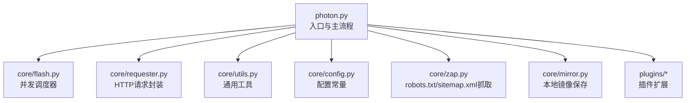
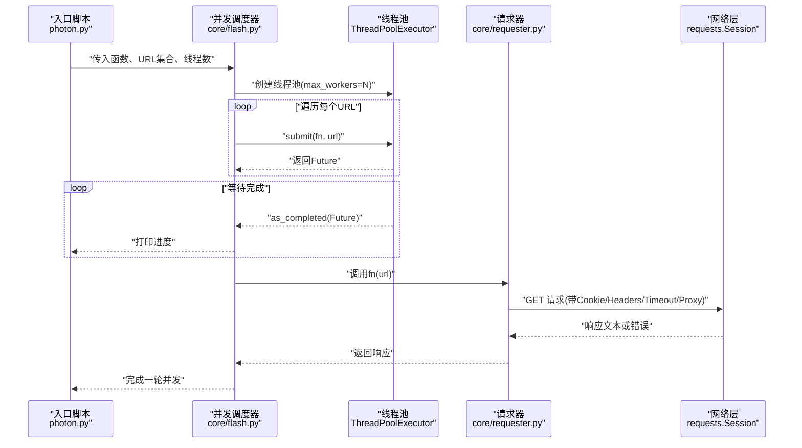
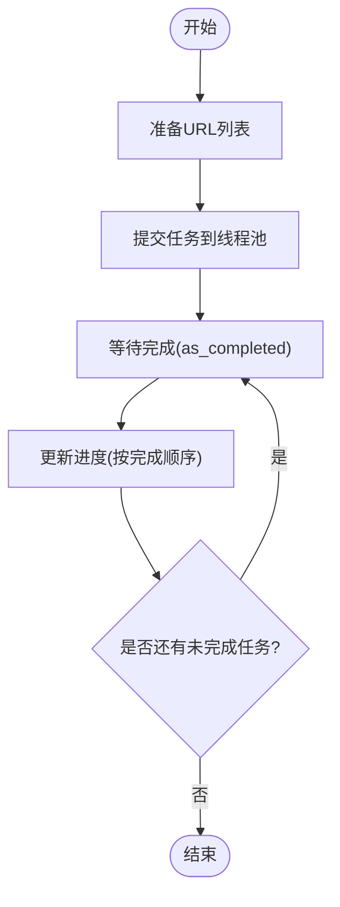
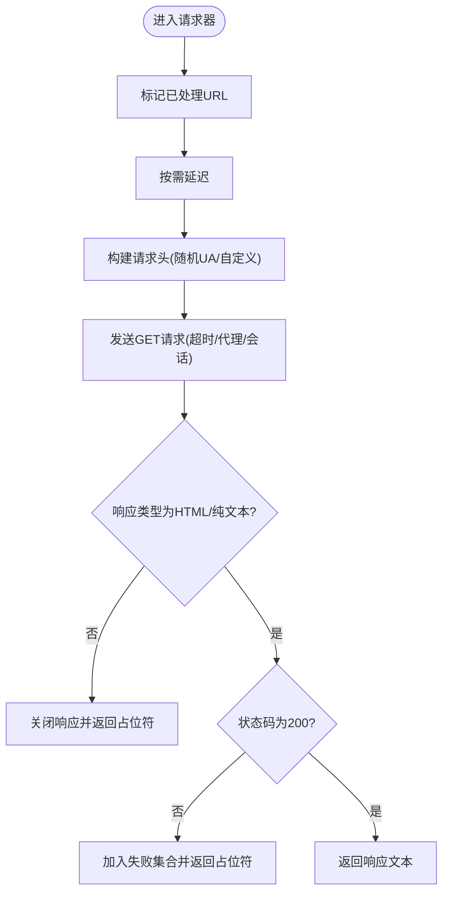
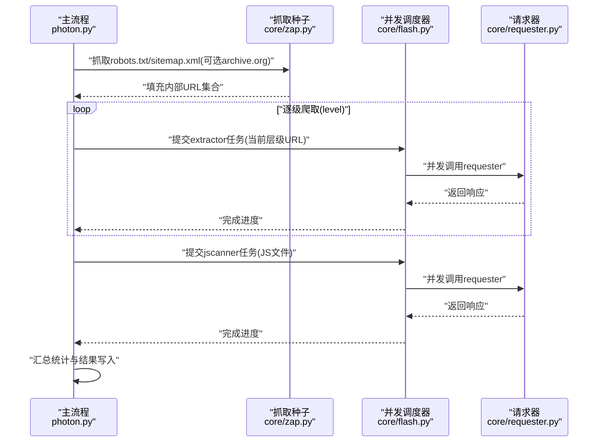
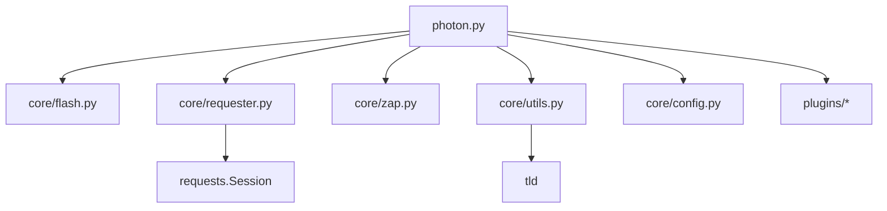

# 并发处理架构

<cite>
**本文档引用的文件**
- [photon.py](file://photon.py)
- [flash.py](file://core/flash.py)
- [requester.py](file://core/requester.py)
- [utils.py](file://core/utils.py)
- [config.py](file://core/config.py)
- [zap.py](file://core/zap.py)
- [mirror.py](file://core/mirror.py)
- [README.md](file://README.md)
- [CHANGELOG.md](file://CHANGELOG.md)
- [requirements.txt](file://requirements.txt)
</cite>

## 目录
1. [引言](#引言)
2. [项目结构](#项目结构)
3. [核心组件](#核心组件)
4. [架构总览](#架构总览)
5. [详细组件分析](#详细组件分析)
6. [依赖分析](#依赖分析)
7. [性能考虑](#性能考虑)
8. [故障排除指南](#故障排除指南)
9. [结论](#结论)
10. [附录](#附录)

## 引言
本文件围绕基于 ThreadPoolExecutor 的并发处理架构，系统性阐述该代码库在爬虫任务中的多线程实现原理、线程池管理策略、任务调度机制、线程同步与资源竞争处理方式，并结合实际源码路径给出性能调优建议、线程数量配置与内存优化策略，同时总结并发编程最佳实践与常见陷阱，帮助读者在爬虫场景中高效、稳定地运用并发能力。

## 项目结构
该项目采用功能模块化组织，入口脚本负责参数解析与主流程编排，核心模块提供请求、并发调度、工具函数等能力；插件模块扩展额外功能（如 DNS 枚举、导出等）。并发处理的关键实现集中在核心模块中的并发调度器与请求器。

图表来源
- [photon.py](file://photon.py)
- [flash.py](file://core/flash.py)
- [requester.py](file://core/requester.py)
- [utils.py](file://core/utils.py)
- [config.py](file://core/config.py)
- [zap.py](file://core/zap.py)
- [mirror.py](file://core/mirror.py)

章节来源
- [photon.py](file://photon.py)
- [README.md](file://README.md)

## 核心组件
- 并发调度器：通过 ThreadPoolExecutor 管理线程池，提交任务并按完成顺序输出进度。
- 请求器：封装 HTTP 请求逻辑，统一处理超时、重定向、内容类型判断、代理与用户代理选择等。
- 工具集：提供正则提取、链接过滤、熵值计算、代理校验、计时统计、结果写入等辅助能力。
- 配置常量：定义全局开关与黑名单类型等配置项。
- 资源抓取：从 robots.txt 与 sitemap.xml 中提取种子 URL，为后续并发爬取提供输入。
- 本地镜像：可选的静态页面本地保存能力。

章节来源
- [flash.py](file://core/flash.py)
- [requester.py](file://core/requester.py)
- [utils.py](file://core/utils.py)
- [config.py](file://core/config.py)
- [zap.py](file://core/zap.py)
- [mirror.py](file://core/mirror.py)

## 架构总览
下图展示了从入口到并发执行再到数据产出的整体流程，重点体现并发调度器与请求器之间的协作关系。

图表来源
- [photon.py](file://photon.py)
- [flash.py](file://core/flash.py)
- [requester.py](file://core/requester.py)

## 详细组件分析

### 组件A：并发调度器（ThreadPoolExecutor）
- 实现要点
  - 将待处理 URL 集合转换为列表后提交给线程池。
  - 使用 as_completed 按完成顺序迭代，周期性输出进度信息。
  - 线程池大小由外部传入的线程数参数控制。
- 关键行为
  - 提交阶段：为每个 URL 创建一个 Future。
  - 完成阶段：按完成顺序更新进度，便于监控整体吞吐。
- 并发特性
  - 通过 max_workers 控制并发度，避免过度并发导致资源争用。
  - 采用惰性生成器提交任务，降低内存峰值。
- 性能影响
  - 线程数过小：CPU/IO 利用率不足。
  - 线程数过大：上下文切换开销上升，网络连接受限，可能触发目标反爬策略。

图表来源
- [flash.py](file://core/flash.py)

章节来源
- [flash.py](file://core/flash.py)

### 组件B：请求器（HTTP请求封装）
- 实现要点
  - 使用单例 Session 以复用连接，减少握手开销。
  - 支持自定义 Cookie、Headers、超时、代理、用户代理随机选择。
  - 对响应内容类型进行筛选，仅处理 HTML/纯文本类响应。
  - 处理重定向异常与非 200 响应，记录失败 URL。
- 同步与竞态
  - processed 集合用于去重，避免重复抓取同一 URL。
  - failed 集合记录失败 URL，供后续重试或审计。
- 资源与性能
  - 流式读取响应体，避免一次性加载大文件。
  - 通过延迟参数控制请求节奏，缓解目标服务器压力。

图表来源
- [requester.py](file://core/requester.py)

章节来源
- [requester.py](file://core/requester.py)

### 组件C：主流程与任务编排
- 实现要点
  - 解析命令行参数，初始化线程数、超时、延迟、代理等。
  - 从 robots.txt 与 sitemap.xml 抓取种子 URL，并支持从 archive.org 获取历史 URL。
  - 递归爬取指定层级，每层将未处理且未匹配排除规则的 URL 提交给并发调度器。
  - 在 JS 文件扫描阶段再次使用并发调度器提取端点。
  - 最终汇总结果并写入文件。
- 进度与统计
  - 记录开始/结束时间，计算总耗时与平均每次请求耗时。
  - 输出各数据集规模与总请求数。

图表来源
- [photon.py](file://photon.py)
- [zap.py](file://core/zap.py)
- [flash.py](file://core/flash.py)
- [requester.py](file://core/requester.py)

章节来源
- [photon.py](file://photon.py)
- [zap.py](file://core/zap.py)
- [flash.py](file://core/flash.py)
- [requester.py](file://core/requester.py)

### 组件D：工具与配置
- 正则与链接处理：提供自定义正则提取、链接合法性判断、排除规则应用等。
- 代理与用户代理：支持单个/批量代理校验与随机选择，提升稳定性与伪装效果。
- 计时与统计：计算总耗时、平均耗时与每秒请求数。
- 结果写入：将各类提取结果写入独立文件，便于后续审计与导出。

章节来源
- [utils.py](file://core/utils.py)
- [config.py](file://core/config.py)

## 依赖分析
- 外部依赖
  - requests：HTTP 客户端，支持 SOCKS 代理与连接池复用。
  - urllib3：底层网络库，与 requests 协同工作。
  - tld：顶级域名解析，辅助识别外部/内部链接。
- 内部模块耦合
  - 主流程依赖并发调度器与请求器；并发调度器仅依赖标准库 concurrent.futures。
  - 请求器依赖 requests 与配置常量；工具模块提供通用能力。
- 循环依赖
  - 未发现循环导入；模块间为单向依赖。

图表来源
- [photon.py](file://photon.py)
- [flash.py](file://core/flash.py)
- [requester.py](file://core/requester.py)
- [utils.py](file://core/utils.py)
- [config.py](file://core/config.py)
- [zap.py](file://core/zap.py)
- [requirements.txt](file://requirements.txt)

章节来源
- [requirements.txt](file://requirements.txt)

## 性能考虑
- 线程数量配置
  - CPU 密集型：线程数≈CPU核数，避免过多上下文切换。
  - IO 密集型：适当增加线程数，但需考虑目标服务器并发限制与自身网络带宽。
  - 建议：从较小线程数起步，逐步调优，观察吞吐与错误率变化。
- 超时与延迟
  - 合理设置超时与请求间隔，避免被目标站点限速或触发风控。
  - 可根据响应时间动态调整延迟，平衡速度与稳定性。
- 代理与用户代理
  - 使用多个代理轮换，降低单一代理的命中率与封禁风险。
  - 随机选择 UA，模拟真实用户访问模式。
- 内存与资源
  - 使用流式读取与按需解析，避免一次性加载大响应体。
  - 控制线程池大小与队列长度，防止内存峰值过高。
- I/O 与网络
  - 复用会话与连接，减少握手成本。
  - 对于静态资源，可考虑本地镜像保存以减少重复下载。

## 故障排除指南
- 线程池无响应或卡死
  - 检查任务是否抛出未捕获异常导致 Future 不完成。
  - 确认线程数与 CPU/网络资源匹配，避免阻塞。
- 请求频繁失败
  - 调整超时与重试策略，检查代理有效性与可用性。
  - 适当增加请求间隔，规避反爬机制。
- 结果不完整
  - 排查排除规则是否误伤有效链接。
  - 确认链接去重逻辑与处理集合更新时机。
- 性能不达预期
  - 分析网络瓶颈与目标服务器限速策略，必要时降低并发。
  - 评估磁盘 I/O 与文件写入频率，优化写入策略。

章节来源
- [flash.py](file://core/flash.py)
- [requester.py](file://core/requester.py)
- [utils.py](file://core/utils.py)

## 结论
该代码库通过 ThreadPoolExecutor 实现了高效的并发调度，结合请求器的会话复用与灵活配置，在爬虫任务中实现了较好的吞吐与稳定性。通过合理配置线程数、超时与延迟、代理与 UA，以及优化 I/O 与内存使用，可在保证合规的前提下显著提升爬取效率。建议在生产环境中持续监控错误率与资源占用，动态调整并发参数以达到最优性能。

## 附录
- 并发实现演进
  - 版本变更记录显示引入 ThreadPoolExecutor 后性能显著提升，体现了并发调度器在该场景中的价值。
- 最佳实践清单
  - 明确并发边界与职责划分，避免跨线程共享可变状态。
  - 使用有界队列与背压策略，防止内存暴涨。
  - 对异常进行分类处理，区分瞬时错误与永久失败。
  - 记录关键指标（吞吐、延迟、错误率），支撑持续优化。

章节来源
- [CHANGELOG.md](file://CHANGELOG.md)