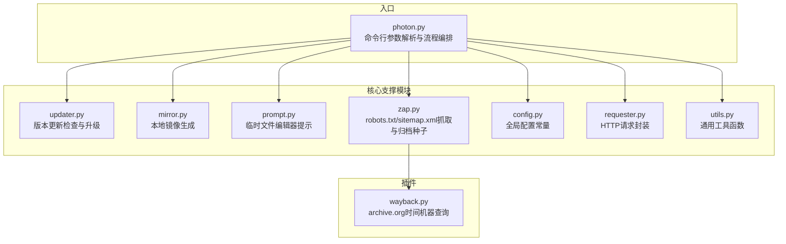
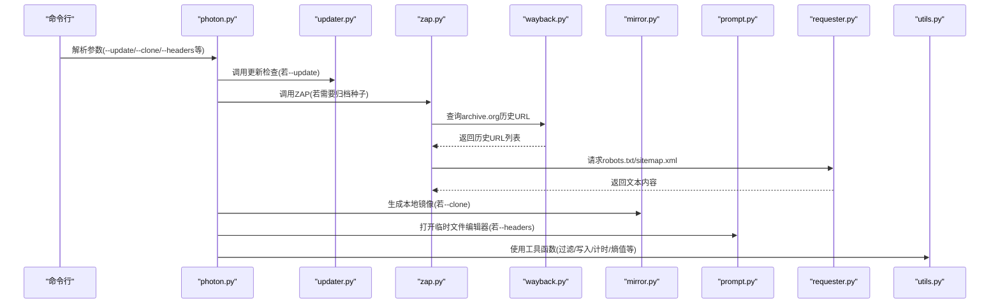
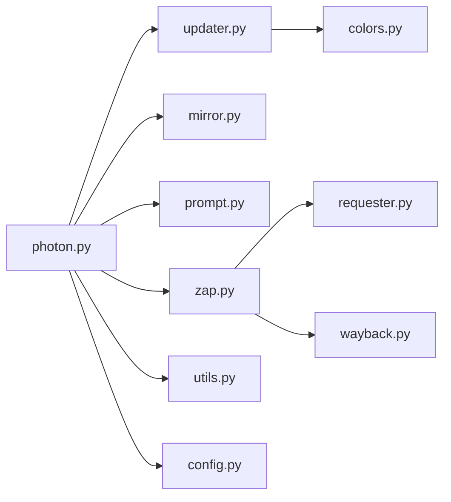

# 支撑模块

<cite>
**本文引用的文件**
- [photon.py](file://photon.py)
- [core/updater.py](file://core/updater.py)
- [core/mirror.py](file://core/mirror.py)
- [core/prompt.py](file://core/prompt.py)
- [core/zap.py](file://core/zap.py)
- [core/config.py](file://core/config.py)
- [core/requester.py](file://core/requester.py)
- [core/utils.py](file://core/utils.py)
- [plugins/wayback.py](file://plugins/wayback.py)
- [core/colors.py](file://core/colors.py)
- [README.md](file://README.md)
</cite>

## 目录
1. [简介](#简介)
2. [项目结构](#项目结构)
3. [核心组件](#核心组件)
4. [架构总览](#架构总览)
5. [详细组件分析](#详细组件分析)
6. [依赖关系分析](#依赖关系分析)
7. [性能考量](#性能考量)
8. [故障排查指南](#故障排查指南)
9. [结论](#结论)
10. [附录](#附录)

## 简介
本文件聚焦于Photon项目中的支撑模块，涵盖版本更新检查、网站镜像、用户交互提示与ZAP集成等辅助能力。文档从职责边界、接口定义、使用场景、配置项与集成方式等方面进行系统化说明，并提供实际应用示例与最佳实践建议，帮助读者在不同环境下高效利用这些模块提升爬取与信息收集的效率与稳定性。

## 项目结构
支撑模块位于core目录下，围绕更新、镜像、提示、ZAP集成与通用工具展开；同时通过插件扩展（如archive.org抓取）增强种子URL生成能力。主程序入口在根目录的photon.py中，负责解析命令行参数并调度各支撑模块。

图表来源
- [photon.py:102-105](file://photon.py#L102-L105)
- [core/updater.py:8-41](file://core/updater.py#L8-L41)
- [core/mirror.py:4-40](file://core/mirror.py#L4-L40)
- [core/prompt.py:6-23](file://core/prompt.py#L6-L23)
- [core/zap.py:10-58](file://core/zap.py#L10-L58)
- [core/requester.py:11-73](file://core/requester.py#L11-L73)
- [core/utils.py:15-207](file://core/utils.py#L15-L207)
- [plugins/wayback.py:8-23](file://plugins/wayback.py#L8-L23)

章节来源
- [photon.py:56-99](file://photon.py#L56-L99)
- [core/config.py:1-28](file://core/config.py#L1-L28)

## 核心组件
- 版本更新检查：通过对比远端最新变更记录判断是否需要升级，并支持交互式确认与自动复制覆盖。
- 网站镜像：根据目标URL生成本地目录结构与文件名，保存响应内容为HTML或原文件。
- 用户交互提示：基于临时文件与外部编辑器（默认nano）实现交互式输入。
- ZAP集成：从robots.txt与sitemap.xml提取内链，结合archive.org历史快照作为种子，提升爬取覆盖面。
- 通用工具：包括正则抽取、链接过滤、输出写入、计时统计、熵值计算、XML解析、代理校验与头部解析等。

章节来源
- [core/updater.py:8-41](file://core/updater.py#L8-L41)
- [core/mirror.py:4-40](file://core/mirror.py#L4-L40)
- [core/prompt.py:6-23](file://core/prompt.py#L6-L23)
- [core/zap.py:10-58](file://core/zap.py#L10-L58)
- [core/utils.py:15-207](file://core/utils.py#L15-L207)

## 架构总览
支撑模块在主程序中以“按需调用”的方式集成，命令行参数驱动模块启用与行为切换。ZAP模块可选地拉取archive.org历史URL作为种子集合，提升覆盖率；镜像模块用于离线复现站点；提示模块用于交互式输入；更新模块提供无缝升级能力。

图表来源
- [photon.py:102-105](file://photon.py#L102-L105)
- [core/zap.py:10-58](file://core/zap.py#L10-L58)
- [plugins/wayback.py:8-23](file://plugins/wayback.py#L8-L23)
- [core/requester.py:11-73](file://core/requester.py#L11-L73)
- [core/mirror.py:4-40](file://core/mirror.py#L4-L40)
- [core/prompt.py:6-23](file://core/prompt.py#L6-L23)
- [core/utils.py:15-207](file://core/utils.py#L15-L207)

## 详细组件分析

### 版本更新检查模块（updater）
- 职责范围
  - 检测当前安装是否为最新版本。
  - 若有新版本，打印变更清单并提示用户确认后执行升级。
  - 升级过程采用git克隆与文件复制的方式，避免丢失数据。
- 接口定义
  - 函数：updater()
  - 输入：无显式参数，内部读取远端最新变更记录并比对本地已知变更。
  - 输出：控制台提示与可能的系统命令执行（git clone与文件复制）。
- 使用场景
  - 需要保持工具版本最新且不丢失历史结果时。
  - 在CI/CD或自动化环境中可配合命令行参数触发。
- 配置与集成
  - 命令行参数：--update
  - 主程序入口在解析到该参数后直接调用updater()。
- 实际应用示例
  - 运行命令：photon.py --update
  - 交互确认后自动完成升级。
- 最佳实践
  - 建议在非生产环境或离线状态下执行升级，确保网络稳定。
  - 升级前备份重要数据目录，以防意外覆盖。

章节来源
- [core/updater.py:8-41](file://core/updater.py#L8-L41)
- [photon.py:102-105](file://photon.py#L102-L105)

### 网站镜像模块（mirror）
- 职责范围
  - 将目标URL映射到本地目录树，生成对应文件名与路径，保存响应内容。
  - 自动处理无扩展名页面补全.html，以及根路径index.html命名。
- 接口定义
  - 函数：mirror(url, response)
  - 输入：
    - url：待镜像的目标URL。
    - response：HTTP响应文本（编码为UTF-8）。
  - 输出：在当前工作目录下创建镜像目录并写入文件。
- 使用场景
  - 需要离线复现站点结构与内容时。
  - 与--clone参数配合使用。
- 集成方式
  - 主程序在需要时调用mirror()，并将响应内容传入。
- 实际应用示例
  - 运行命令：photon.py -u example.com --clone
  - 自动生成example.com_mirror目录与文件。
- 最佳实践
  - 注意磁盘空间与文件数量，建议限制爬取层级与排除静态资源类型。
  - 对大站点建议分批镜像，避免一次性写入造成I/O压力。

章节来源
- [core/mirror.py:4-40](file://core/mirror.py#L4-L40)
- [photon.py:186-188](file://photon.py#L186-L188)

### 用户交互提示模块（prompt）
- 职责范围
  - 提供交互式输入能力，通过临时文件与外部编辑器（默认nano）收集用户输入。
- 接口定义
  - 函数：prompt(default=None)
  - 输入：default（可选，默认内容）。
  - 输出：返回编辑器中保存的内容字符串。
- 使用场景
  - 需要用户手动输入复杂头部或自定义内容时。
- 集成方式
  - 主程序在解析到--headers参数时调用prompt()，随后解析为有效头部字典。
- 实际应用示例
  - 运行命令：photon.py -u example.com --headers
  - 弹出编辑器窗口，输入完成后返回内容。
- 最佳实践
  - 确保系统已安装默认编辑器（如nano），否则会抛出异常。
  - 编辑器路径可通过系统环境变量或进程替换调整。

章节来源
- [core/prompt.py:6-23](file://core/prompt.py#L6-L23)
- [photon.py:168-174](file://photon.py#L168-L174)

### ZAP集成模块（zap）
- 职责范围
  - 从robots.txt与sitemap.xml提取内链，作为后续爬取的种子。
  - 可选地从archive.org获取历史URL作为种子，扩大覆盖面。
- 接口定义
  - 函数：zap(input_url, archive, domain, host, internal, robots, proxies)
  - 输入：
    - input_url：目标站点根URL。
    - archive：布尔标志，决定是否拉取archive.org历史URL。
    - domain/host：域名或主机信息，用于archive.org查询。
    - internal/robots：集合对象，分别存储内链与robots条目。
    - proxies：代理列表，随机选择使用。
  - 输出：向internal与robots集合添加URL。
- 使用场景
  - 需要快速获取站点内链与历史快照URL作为种子时。
- 集成方式
  - 主程序在启动爬取前调用zap()，传入必要的上下文集合。
- 实际应用示例
  - 运行命令：photon.py -u example.com --wayback
  - 自动抓取archive.org历史URL并加入internal集合。
- 最佳实践
  - 合理设置代理池，避免被robots.txt或sitemap.xml的服务器限流。
  - 对archive.org查询的时间窗口可根据需求调整（当前代码固定为最近半年）。

章节来源
- [core/zap.py:10-58](file://core/zap.py#L10-L58)
- [plugins/wayback.py:8-23](file://plugins/wayback.py#L8-L23)
- [core/utils.py:112-115](file://core/utils.py#L112-L115)

### 通用工具模块（utils）
- 职责范围
  - 提供正则抽取、链接过滤、输出写入、计时统计、熵值计算、XML解析、代理校验、头部解析等通用能力。
- 关键函数与用途
  - 正则抽取：regxy(pattern, response, supress_regex, custom)
  - 链接过滤：is_link(url, processed, files)
  - 输出写入：writer(datasets, dataset_names, output_dir)
  - 计时统计：timer(diff, processed)
  - 熵值计算：entropy(string)
  - XML解析：xml_parser(response)
  - 头部解析：extract_headers(headers)
  - 顶级域提取：top_level(url, fix_protocol)
  - 代理校验与格式：proxy_type(v)、is_good_proxy(pip)
- 使用场景
  - 在爬取流程中进行数据清洗、统计与导出。
- 集成方式
  - 主程序与各模块按需导入并调用相应函数。
- 最佳实践
  - 在大规模数据处理时注意内存占用，必要时分批写入。
  - 使用熵值检测高价值敏感信息时，建议结合业务规则过滤误报。

章节来源
- [core/utils.py:15-207](file://core/utils.py#L15-L207)
- [photon.py:39-48](file://photon.py#L39-L48)

### 请求封装模块（requester）
- 职责范围
  - 统一封装HTTP请求逻辑，支持延迟、超时、随机User-Agent、代理轮换、重定向处理与内容类型过滤。
- 接口定义
  - 函数：requester(url, main_url=None, delay=0, cook=None, headers=None, timeout=10, host=None, proxies=[None], user_agents=[None], failed=None, processed=None)
  - 输入：多种可配置参数。
  - 输出：响应文本或“dummy”标记。
- 使用场景
  - 作为爬虫底层请求层，统一处理网络异常与内容过滤。
- 集成方式
  - 主程序与ZAP模块均调用requester()发起HTTP请求。
- 最佳实践
  - 合理设置延迟与超时，避免触发目标站点反爬机制。
  - 使用代理池时注意可用性验证与异常捕获。

章节来源
- [core/requester.py:11-73](file://core/requester.py#L11-L73)

### 配置模块（config）
- 职责范围
  - 定义全局配置常量，如是否开启详细输出、情报站点白名单、需要忽略的文件类型等。
- 关键配置
  - VERBOSE：是否启用详细输出。
  - INTELS：情报站点白名单列表。
  - BAD_TYPES：需要忽略的文件类型元组。
- 使用场景
  - 在工具函数中作为默认策略依据。
- 集成方式
  - 通过导入config模块使用常量。
- 最佳实践
  - 根据任务需求调整INTELS与BAD_TYPES，减少无关数据干扰。

章节来源
- [core/config.py:1-28](file://core/config.py#L1-28)

## 依赖关系分析
- 模块耦合
  - photon.py是编排中心，按需导入并调用各支撑模块。
  - zap依赖requester进行HTTP请求，依赖wayback进行历史URL抓取。
  - utils提供跨模块通用能力，被多个模块复用。
  - colors提供终端输出样式，被updater等模块使用。
- 外部依赖
  - requests、tld、argparse等标准库与第三方库。
- 潜在循环依赖
  - 当前模块间无明显循环依赖，结构清晰。

图表来源
- [photon.py:32-51](file://photon.py#L32-L51)
- [core/zap.py:10-58](file://core/zap.py#L10-L58)
- [core/requester.py:11-73](file://core/requester.py#L11-L73)
- [plugins/wayback.py:8-23](file://plugins/wayback.py#L8-L23)
- [core/updater.py:8-41](file://core/updater.py#L8-L41)
- [core/colors.py:1-19](file://core/colors.py#L1-L19)

## 性能考量
- 请求层优化
  - 使用requests.Session减少连接开销，合理设置超时与延迟。
  - 代理轮换与随机User-Agent降低被封风险。
- 数据处理优化
  - 使用集合（set）去重，提高查找与插入效率。
  - 分批写入输出，避免大文件一次性写入导致内存压力。
- 爬取策略
  - 合理设置层级与线程数，避免过度并发引发目标站点限流。
  - 利用archive.org历史快照作为种子，减少无效请求。

## 故障排查指南
- 更新失败
  - 现象：升级过程中出现错误或无法覆盖文件。
  - 排查：确认网络连通性、Git权限与当前工作目录权限。
  - 参考：[core/updater.py:32-38](file://core/updater.py#L32-L38)
- 镜像生成异常
  - 现象：目录创建失败或文件写入失败。
  - 排查：检查磁盘空间、路径权限与URL合法性。
  - 参考：[core/mirror.py:16-27](file://core/mirror.py#L16-L27)
- 交互提示不可用
  - 现象：编辑器未找到或无法弹出。
  - 排查：确认默认编辑器安装与PATH配置。
  - 参考：[core/prompt.py:17-18](file://core/prompt.py#L17-L18)
- ZAP抓取无效
  - 现象：robots.txt或sitemap.xml为空或包含非HTML内容。
  - 排查：检查目标站点robots.txt与sitemap.xml有效性，确认代理可用。
  - 参考：[core/zap.py:24-27](file://core/zap.py#L24-L27)、[core/zap.py:44-48](file://core/zap.py#L44-L48)
- 请求异常
  - 现象：TooManyRedirects或404错误。
  - 排查：调整重定向上限、超时与代理，检查URL格式。
  - 参考：[core/requester.py:57-67](file://core/requester.py#L57-L67)

章节来源
- [core/updater.py:32-38](file://core/updater.py#L32-L38)
- [core/mirror.py:16-27](file://core/mirror.py#L16-L27)
- [core/prompt.py:17-18](file://core/prompt.py#L17-L18)
- [core/zap.py:24-27](file://core/zap.py#L24-L27)
- [core/zap.py:44-48](file://core/zap.py#L44-L48)
- [core/requester.py:57-67](file://core/requester.py#L57-L67)

## 结论
支撑模块为Photon提供了完善的更新、镜像、交互与集成能力，既保证了工具的易用性，也提升了爬取与信息收集的覆盖面与稳定性。通过合理的参数配置与最佳实践，可在不同场景下高效利用这些模块，实现从种子生成、数据提取到结果导出的完整闭环。

## 附录
- 命令行参数与支撑模块关联
  - --update：触发updater()。
  - --clone：触发mirror()。
  - --headers：触发prompt()。
  - --wayback：触发zap()并调用wayback()。
- 参考文档
  - 项目Wiki与使用说明可参考README中的相关章节。

章节来源
- [photon.py:56-99](file://photon.py#L56-L99)
- [README.md:85-90](file://README.md#L85-L90)