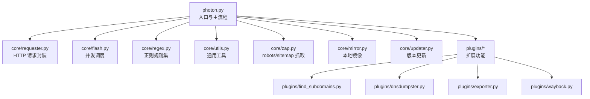
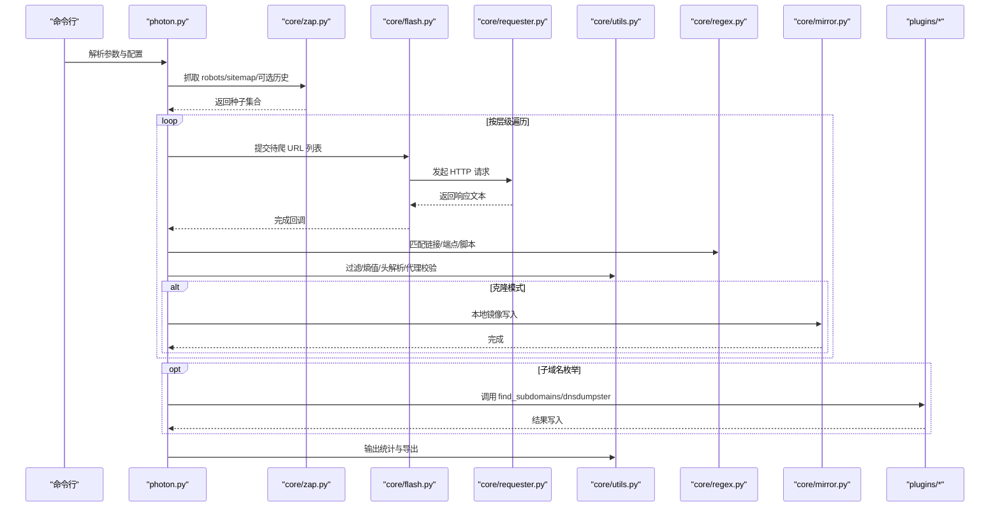
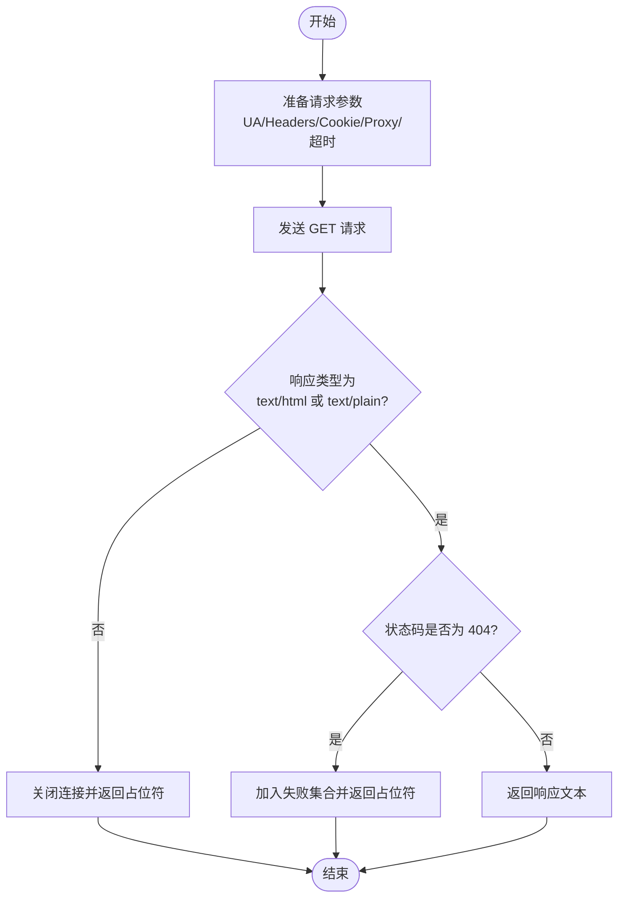
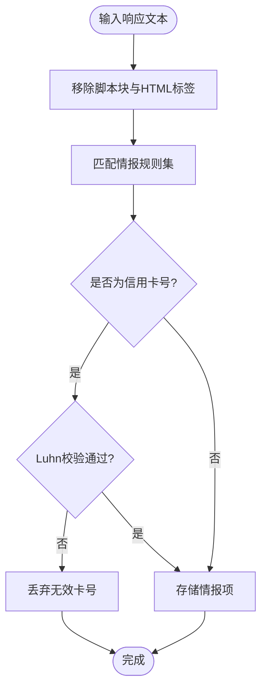
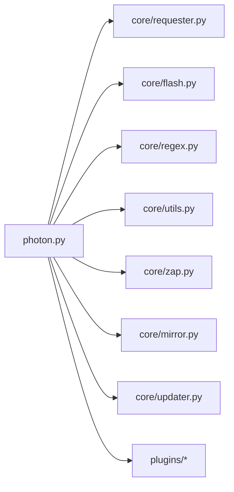

# 核心模块架构

<cite>
**本文档引用的文件**
- [photon.py](file://photon.py)
- [core/__init__.py](file://core/__init__.py)
- [core/colors.py](file://core/colors.py)
- [core/config.py](file://core/config.py)
- [core/flash.py](file://core/flash.py)
- [core/mirror.py](file://core/mirror.py)
- [core/prompt.py](file://core/prompt.py)
- [core/regex.py](file://core/regex.py)
- [core/requester.py](file://core/requester.py)
- [core/updater.py](file://core/updater.py)
- [core/utils.py](file://core/utils.py)
- [core/zap.py](file://core/zap.py)
- [plugins/__init__.py](file://plugins/__init__.py)
- [plugins/dnsdumpster.py](file://plugins/dnsdumpster.py)
- [plugins/exporter.py](file://plugins/exporter.py)
- [plugins/find_subdomains.py](file://plugins/find_subdomains.py)
- [plugins/wayback.py](file://plugins/wayback.py)
</cite>

## 目录
1. [简介](#简介)
2. [项目结构](#项目结构)
3. [核心组件](#核心组件)
4. [架构总览](#架构总览)
5. [详细组件分析](#详细组件分析)
6. [依赖关系分析](#依赖关系分析)
7. [性能考虑](#性能考虑)
8. [故障排除指南](#故障排除指南)
9. [结论](#结论)
10. [附录](#附录)

## 简介
本文件面向开发者与安全研究人员，系统性梳理 Photon 的核心模块架构与模块间协作方式。内容涵盖请求处理、并发控制、正则表达式引擎、工具函数库、静态资源镜像与导出插件等关键组件的设计理念与技术实现，并通过图示展示数据流与调用链路，帮助读者快速理解系统的整体设计与扩展点。

## 项目结构
项目采用“入口脚本 + 核心模块 + 插件”分层组织：
- 入口脚本：负责参数解析、初始化配置、调度主流程与结果输出。
- 核心模块：封装网络请求、并发执行、正则提取、通用工具、颜色输出、提示交互、更新器、站点地图抓取等基础能力。
- 插件：扩展功能（子域名枚举、DNS 地图生成、结果导出、历史快照）。

图表来源
- [photon.py](file://photon.py)
- [core/requester.py](file://core/requester.py)
- [core/flash.py](file://core/flash.py)
- [core/regex.py](file://core/regex.py)
- [core/utils.py](file://core/utils.py)
- [core/zap.py](file://core/zap.py)
- [core/mirror.py](file://core/mirror.py)
- [core/updater.py](file://core/updater.py)
- [plugins/find_subdomains.py](file://plugins/find_subdomains.py)
- [plugins/dnsdumpster.py](file://plugins/dnsdumpster.py)
- [plugins/exporter.py](file://plugins/exporter.py)
- [plugins/wayback.py](file://plugins/wayback.py)

章节来源
- [photon.py](file://photon.py)
- [core/__init__.py](file://core/__init__.py)
- [plugins/__init__.py](file://plugins/__init__.py)

## 核心组件
- 颜色输出与终端提示：统一日志样式与平台兼容处理。
- 配置常量：全局开关与类型白名单。
- 请求器：会话复用、超时与重定向限制、随机 UA、代理选择、响应过滤。
- 并发调度：线程池执行器，进度反馈。
- 正则引擎：多类情报识别规则与链接/端点/脚本匹配。
- 工具函数：自定义正则抽取、URL 过滤、熵值检测、头信息解析、顶级域提取、代理校验、Luhn 校验等。
- 站点抓取：从 robots.txt、sitemap.xml 与可选的历史归档中收集种子。
- 镜像保存：按目录结构写回 HTML 内容。
- 更新器：在线检查变更并提示升级。
- 插件：子域名枚举、DNS 地图生成、CSV/JSON 导出、历史快照。

章节来源
- [core/colors.py](file://core/colors.py)
- [core/config.py](file://core/config.py)
- [core/requester.py](file://core/requester.py)
- [core/flash.py](file://core/flash.py)
- [core/regex.py](file://core/regex.py)
- [core/utils.py](file://core/utils.py)
- [core/zap.py](file://core/zap.py)
- [core/mirror.py](file://core/mirror.py)
- [core/updater.py](file://core/updater.py)

## 架构总览
下图展示了从入口到各核心模块与插件的调用关系与数据流向：

图表来源
- [photon.py](file://photon.py)
- [core/zap.py](file://core/zap.py)
- [core/flash.py](file://core/flash.py)
- [core/requester.py](file://core/requester.py)
- [core/regex.py](file://core/regex.py)
- [core/utils.py](file://core/utils.py)
- [core/mirror.py](file://core/mirror.py)
- [plugins/find_subdomains.py](file://plugins/find_subdomains.py)
- [plugins/dnsdumpster.py](file://plugins/dnsdumpster.py)

## 详细组件分析

### 请求处理与并发控制
- 请求器封装
  - 使用持久化会话，限制最大重定向次数，避免资源浪费。
  - 默认头包含随机 User-Agent、语言、编码与 DNT；支持自定义 Cookie、Headers、超时、代理。
  - 响应过滤：仅接受 text/html 或 text/plain，非文本或 404 将被记录失败。
- 并发调度
  - 基于 ThreadPoolExecutor，按线程数提交任务，实时打印进度。
  - 支持延迟参数，降低对目标服务器的压力。

图表来源
- [core/requester.py](file://core/requester.py)

章节来源
- [core/requester.py](file://core/requester.py)
- [core/flash.py](file://core/flash.py)

### 正则表达式引擎与情报提取
- 规则集
  - URL 类型：通用、括号、反斜杠、十六进制、URL 编码、Base64 编码、IPv4/IPv6。
  - 身份信息：邮箱、MD5/SHA 系列、YARA 规则片段、信用卡号。
  - 辅助匹配：脚本标签 src、页面链接 href、JavaScript 中的端点、高熵字符串。
- 提取流程
  - 页面正文先剔除脚本块与 HTML 标签，再进行正则匹配。
  - 对匹配结果进行二次校验（如 Luhn 校验信用卡号），并分类存储。

图表来源
- [core/regex.py](file://core/regex.py)
- [core/utils.py](file://core/utils.py)

章节来源
- [core/regex.py](file://core/regex.py)
- [core/utils.py](file://core/utils.py)

### 工具函数库
- 自定义正则抽取：用户提供的正则在指定范围内匹配并去重。
- URL 过滤：排除已爬取、锚点、javascript 协议与文件类型（根据 BAD_TYPES 白名单）。
- 排除规则：支持正则排除不希望访问的 URL。
- 输出统计：计算总耗时、平均每次请求耗时。
- 熵值检测：用于识别高熵字符串（如密钥）。
- 头部解析：从交互式输入中解析键值对。
- 顶级域提取：基于 tld 库解析主域。
- 代理校验：验证代理连通性与格式。
- Luhn 校验：信用卡号校验。

章节来源
- [core/utils.py](file://core/utils.py)

### 站点抓取与种子生成
- 抓取 robots.txt 与 sitemap.xml，解析允许路径并加入内部集合。
- 可选从历史归档（archive.org）拉取历史 URL 作为种子。
- 支持可选的自定义种子列表。

章节来源
- [core/zap.py](file://core/zap.py)

### 静态资源镜像
- 将响应内容按原始 URL 的目录结构写入本地镜像目录，保留查询参数与默认 index.html 命名规则。

章节来源
- [core/mirror.py](file://core/mirror.py)

### 版本更新器
- 在线比对远端更新脚本中的变更摘要，提示用户是否升级，并执行覆盖更新。

章节来源
- [core/updater.py](file://core/updater.py)

### 插件生态
- 子域名枚举：调用第三方服务获取子域名列表。
- DNS 地图生成：提交域名获取可视化图片并保存。
- 结果导出：支持 CSV/JSON 两种格式。
- 历史快照：通过插件接口获取历史归档 URL。

章节来源
- [plugins/find_subdomains.py](file://plugins/find_subdomains.py)
- [plugins/dnsdumpster.py](file://plugins/dnsdumpster.py)
- [plugins/exporter.py](file://plugins/exporter.py)
- [plugins/wayback.py](file://plugins/wayback.py)

## 依赖关系分析
- 入口脚本依赖核心模块与插件，形成清晰的单向依赖。
- 核心模块之间低耦合：请求器独立、并发调度独立、正则规则集中管理、工具函数提供横切能力。
- 插件以可选方式接入，不影响主流程。

图表来源
- [photon.py](file://photon.py)
- [core/requester.py](file://core/requester.py)
- [core/flash.py](file://core/flash.py)
- [core/regex.py](file://core/regex.py)
- [core/utils.py](file://core/utils.py)
- [core/zap.py](file://core/zap.py)
- [core/mirror.py](file://core/mirror.py)
- [core/updater.py](file://core/updater.py)
- [plugins/find_subdomains.py](file://plugins/find_subdomains.py)
- [plugins/dnsdumpster.py](file://plugins/dnsdumpster.py)
- [plugins/exporter.py](file://plugins/exporter.py)
- [plugins/wayback.py](file://plugins/wayback.py)

## 性能考虑
- 并发策略：使用线程池并发请求，合理设置线程数与请求延迟，避免触发目标限速或封禁。
- 会话优化：复用会话减少握手开销，限制重定向避免死循环。
- 响应过滤：仅处理文本类响应，减少无关资源下载。
- I/O 写入：镜像写入与导出采用批量写入，注意磁盘空间与权限。
- 正则匹配：规则集较大时建议预编译并避免重复编译，减少 CPU 开销。

## 故障排除指南
- 代理不可用
  - 现象：无法建立连接或超时。
  - 处理：使用代理校验函数确认可用性，检查格式与网络可达性。
- 404 或非文本响应
  - 现象：失败集合增加。
  - 处理：检查目标路径与认证信息，确认响应类型是否符合预期。
- 正则报错
  - 现象：自定义正则导致异常。
  - 处理：捕获异常并抑制后续自定义正则处理，检查正则语法。
- 证书与 SSL
  - 现象：SSL 相关警告或错误。
  - 处理：请求器已关闭证书验证，若需严格校验可在部署环境调整策略。
- 导出失败
  - 现象：CSV/JSON 写入异常。
  - 处理：检查输出目录权限与磁盘空间。

章节来源
- [core/utils.py](file://core/utils.py)
- [core/requester.py](file://core/requester.py)
- [core/updater.py](file://core/updater.py)

## 结论
Photon 的核心模块围绕“请求—并发—提取—输出”的主线构建，具备良好的扩展性与可维护性。通过集中化的正则规则、灵活的并发调度与可选插件，既能满足常规爬取与情报提取需求，又便于二次开发与定制。建议在生产环境中结合代理、限速与合规策略，确保稳定与安全。

## 附录
- 关键接口与职责
  - 请求器：发起 HTTP 请求并返回文本内容。
  - 并发调度：提交任务并汇总进度。
  - 正则引擎：提供多类情报识别规则。
  - 工具函数：提供过滤、统计、解析与校验能力。
  - 站点抓取：补充种子 URL。
  - 镜像保存：本地静态资源备份。
  - 更新器：在线版本管理。
  - 插件：扩展子域名、DNS 地图、导出与历史快照。