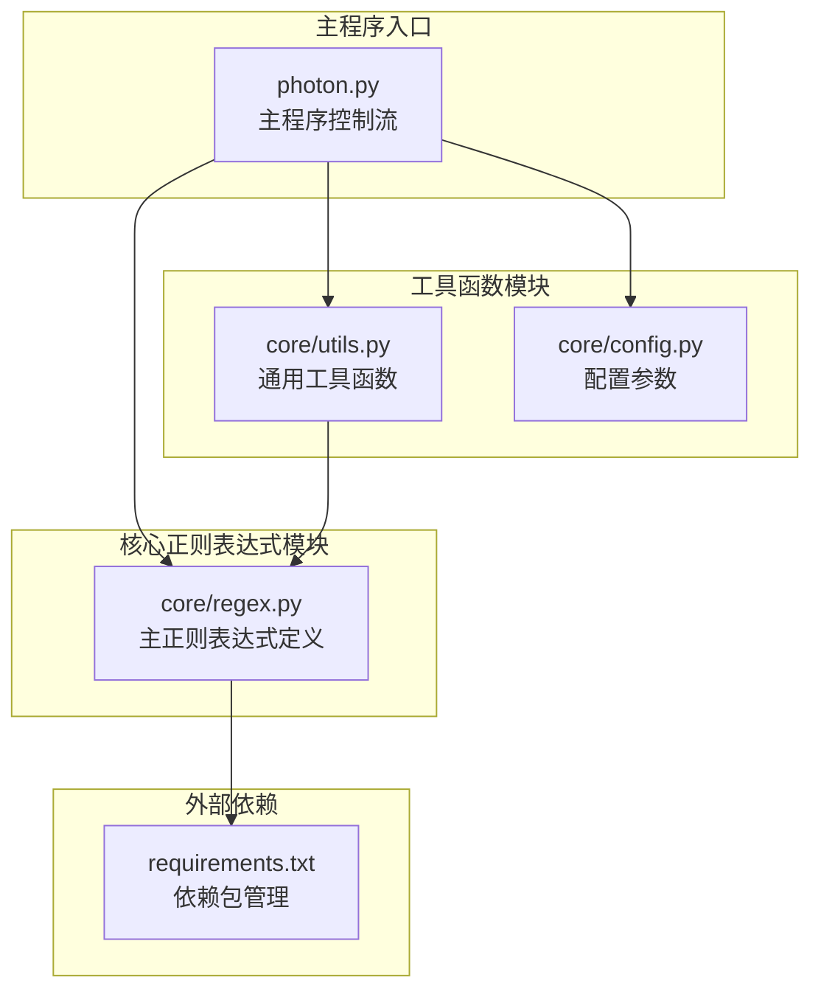
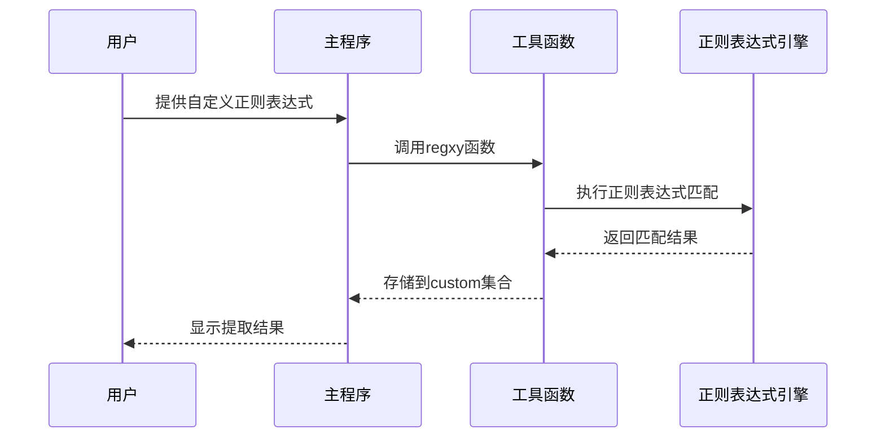
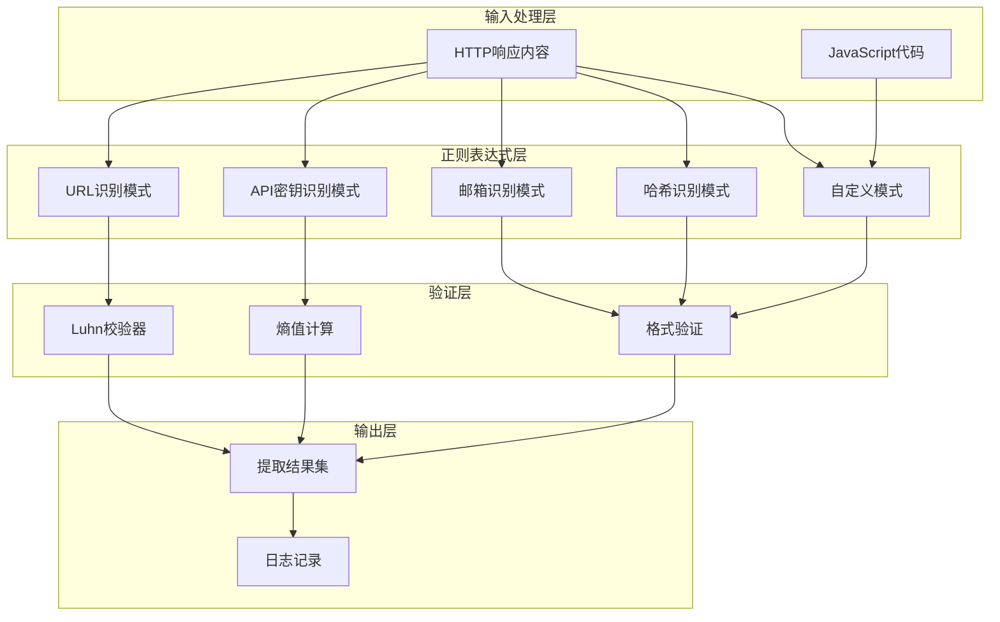
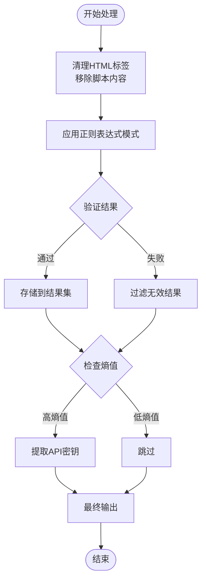
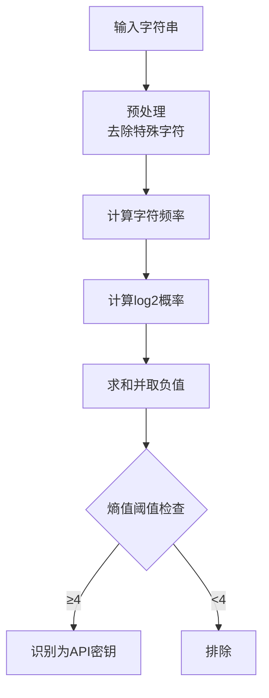
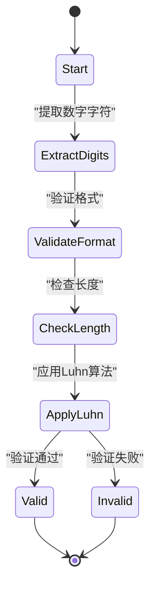
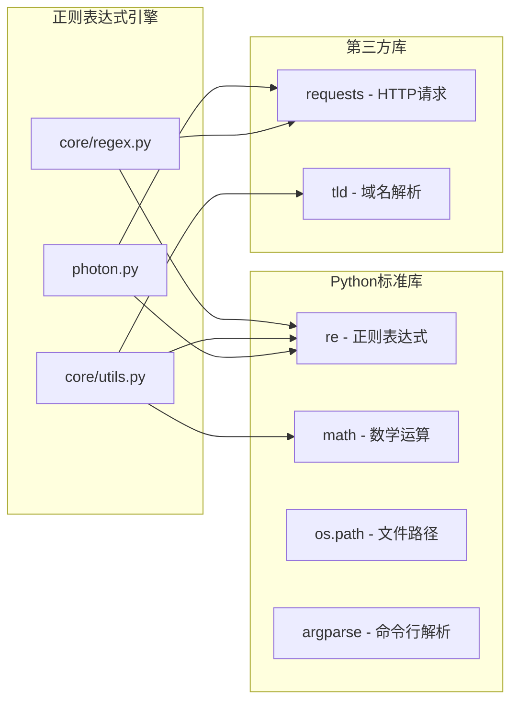
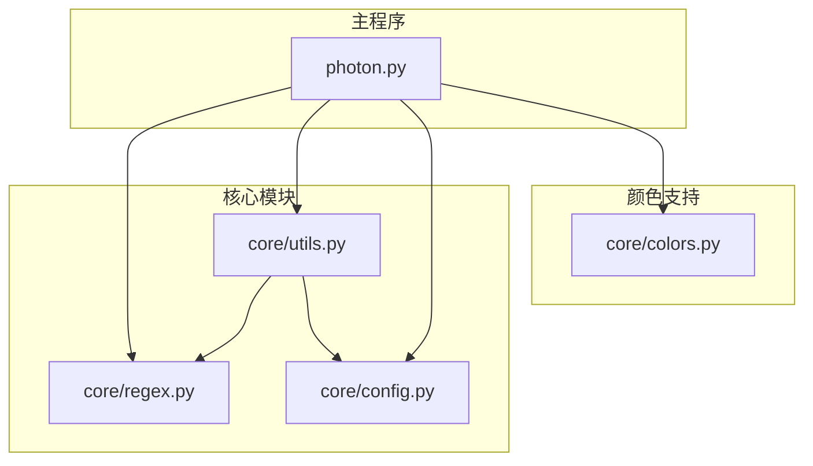
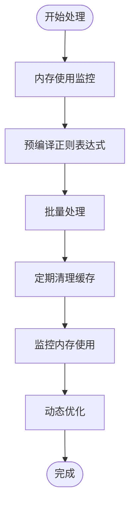
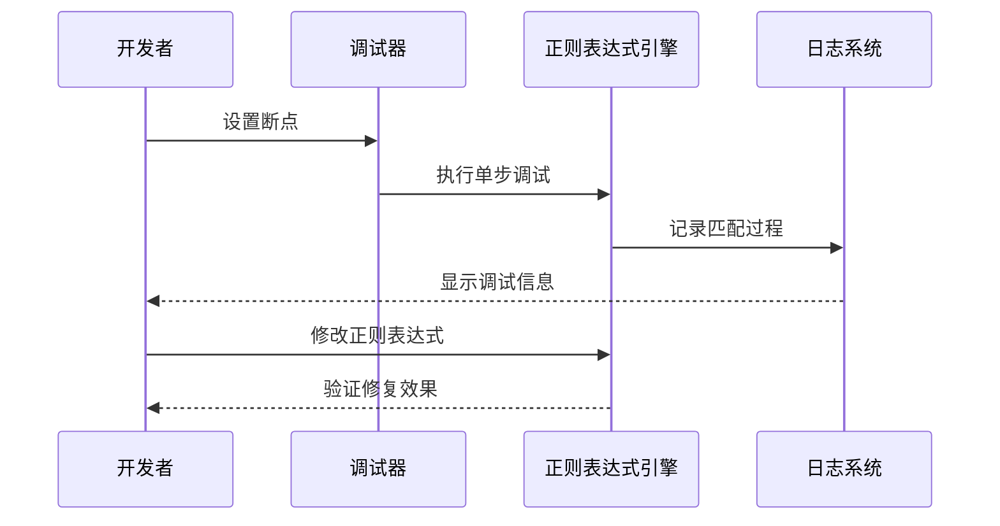

# 正则表达式引擎

<cite>
**本文档引用的文件**
- [core/regex.py](file://core/regex.py)
- [core/utils.py](file://core/utils.py)
- [photon.py](file://photon.py)
- [core/config.py](file://core/config.py)
- [README.md](file://README.md)
- [requirements.txt](file://requirements.txt)
</cite>

## 目录
1. [简介](#简介)
2. [项目结构](#项目结构)
3. [核心组件](#核心组件)
4. [架构概览](#架构概览)
5. [详细组件分析](#详细组件分析)
6. [依赖关系分析](#依赖关系分析)
7. [性能考虑](#性能考虑)
8. [故障排除指南](#故障排除指南)
9. [结论](#结论)

## 简介

Photon 是一个专为开源情报(OSINT)设计的超快速爬虫工具，其核心正则表达式引擎负责从网页内容中提取各种敏感信息和数据。该引擎实现了多种复杂的正则表达式模式，能够识别邮箱地址、API密钥、信用卡号、哈希值、URL等多种信息类型，并提供了强大的自定义正则表达式支持。

本技术文档深入解析了正则表达式引擎的设计原理、匹配逻辑和实现细节，为开发者提供了完整的参考指南。

## 项目结构

Photon 项目的正则表达式相关组件主要分布在以下文件中：



**图表来源**
- [core/regex.py:1-235](file://core/regex.py#L1-L235)
- [core/utils.py:1-207](file://core/utils.py#L1-L207)
- [photon.py:1-426](file://photon.py#L1-L426)

**章节来源**
- [core/regex.py:1-235](file://core/regex.py#L1-L235)
- [core/utils.py:1-207](file://core/utils.py#L1-L207)
- [photon.py:1-426](file://photon.py#L1-L426)

## 核心组件

### 主要正则表达式集合

正则表达式引擎的核心是 `rintels` 列表，它包含了所有预定义的信息提取模式：

| 模式名称 | 类型 | 功能描述 | 复杂度 |
|---------|------|----------|--------|
| GENERIC_URL | URL | 基础URL识别，支持多种混淆技术 | O(n) |
| BRACKET_URL | URL | 方括号包围的点号URL | O(n) |
| BACKSLASH_URL | URL | 反斜杠前缀的点号URL | O(n) |
| HEXENCODED_URL | URL | 十六进制编码URL | O(n) |
| URLENCODED_URL | URL | URL编码URL | O(n) |
| B64ENCODED_URL | URL | Base64编码URL | O(n) |
| IPV4 | IP地址 | IPv4地址识别 | O(n) |
| IPV6 | IP地址 | IPv6地址识别 | O(n) |
| EMAIL | 邮箱 | 邮箱地址识别，支持混淆 | O(n) |
| MD5/SHA1/SHA256/SHA512 | 哈希 | 各种哈希值识别 | O(n) |
| YARA_PARSE | YARA规则 | YARA恶意软件规则解析 | O(n) |
| CREDIT_CARD | 信用卡 | 信用卡号码识别 | O(n) |

**章节来源**
- [core/regex.py:214-228](file://core/regex.py#L214-L228)

### 自定义正则表达式支持

系统提供了灵活的自定义正则表达式功能，允许用户根据特定需求添加新的模式：



**图表来源**
- [photon.py:280-282](file://photon.py#L280-L282)
- [core/utils.py:15-24](file://core/utils.py#L15-L24)

**章节来源**
- [core/utils.py:15-24](file://core/utils.py#L15-L24)
- [photon.py:280-282](file://photon.py#L280-L282)

## 架构概览

### 正则表达式引擎架构



**图表来源**
- [core/regex.py:14-235](file://core/regex.py#L14-L235)
- [core/utils.py:101-194](file://core/utils.py#L101-L194)

### 数据流处理流程



**图表来源**
- [photon.py:208-218](file://photon.py#L208-L218)
- [photon.py:282-287](file://photon.py#L282-L287)

**章节来源**
- [photon.py:208-218](file://photon.py#L208-L218)
- [photon.py:282-287](file://photon.py#L282-L287)

## 详细组件分析

### URL识别引擎

URL识别是正则表达式引擎中最复杂的部分，需要处理多种混淆技术和编码方式：

#### URL混淆技术处理

| 技术类型 | 描述 | 正则表达式示例 | 处理策略 |
|---------|------|----------------|----------|
| 基础URL | 标准HTTP/HTTPS协议 | `https?://` | 直接匹配 |
| 方括号混淆 | 使用方括号替换点号 | `\[dot\]` | 替换为点号 |
| 反斜杠混淆 | 使用反斜杠替换点号 | `\\.` | 替换为点号 |
| 十六进制编码 | URL十六进制编码 | `%68%74%74%70` | 解码后匹配 |
| URL编码 | 标准URL编码 | `%3A%2F%2F` | 解码后匹配 |
| Base64编码 | Base64编码URL | `aHR0cHM6Ly9` | 解码后匹配 |

**章节来源**
- [core/regex.py:14-127](file://core/regex.py#L14-L127)

### 邮箱地址识别

邮箱地址识别模式支持多种常见的混淆技术：

```mermaid
classDiagram
class EmailPattern {
+用户名部分 : [a-z0-9_.+-]+
+@符号 : @|at|@w@
+域名部分 : [a-z0-9-]+
+域名扩展 : (\.|\[dot\])+[a-z0-9-]+
+结束标点 : END_PUNCTUATION
}
class DefangSupport {
+括号混淆 : [\(\[{\x20]*
+方括号混淆 : [\)\]}\x20]*
+反斜杠混淆 : SEPARATOR_DEFANGS
}
EmailPattern --> DefangSupport : "支持"
```

**图表来源**
- [core/regex.py:148-176](file://core/regex.py#L148-L176)

**章节来源**
- [core/regex.py:148-176](file://core/regex.py#L148-L176)

### 哈希值识别

系统支持多种长度的哈希值识别，每种都有特定的长度要求：

| 哈希类型 | 十六进制字符数 | 正则表达式模式 | 应用场景 |
|---------|---------------|----------------|----------|
| MD5 | 32位 | `[a-fA-F]{32}` | 文件完整性校验 |
| SHA1 | 40位 | `[a-fA-F]{40}` | 安全认证 |
| SHA256 | 64位 | `[a-fA-F]{64}` | 加密算法 |
| SHA512 | 128位 | `[a-fA-F]{128}` | 高强度加密 |

**章节来源**
- [core/regex.py:178-182](file://core/regex.py#L178-L182)

### API密钥识别

API密钥识别基于熵值计算，使用香农熵公式评估字符串的随机性：



**图表来源**
- [core/utils.py:101-109](file://core/utils.py#L101-L109)

**章节来源**
- [core/utils.py:101-109](file://core/utils.py#L101-L109)

### 信用卡号码识别

信用卡号码识别使用Luhn算法进行有效性验证：



**图表来源**
- [core/utils.py:182-194](file://core/utils.py#L182-L194)

**章节来源**
- [core/utils.py:182-194](file://core/utils.py#L182-L194)

## 依赖关系分析

### 外部依赖

正则表达式引擎主要依赖以下Python标准库：



**图表来源**
- [requirements.txt:1-4](file://requirements.txt#L1-L4)
- [core/regex.py:1](file://core/regex.py#L1)
- [core/utils.py:1-12](file://core/utils.py#L1-L12)

### 内部模块依赖



**图表来源**
- [photon.py:32-49](file://photon.py#L32-L49)
- [core/utils.py:9-12](file://core/utils.py#L9-L12)

**章节来源**
- [requirements.txt:1-4](file://requirements.txt#L1-L4)
- [photon.py:32-49](file://photon.py#L32-L49)

## 性能考虑

### 正则表达式优化策略

1. **编译优化**: 所有正则表达式在模块导入时编译，避免重复编译开销
2. **贪婪匹配优化**: 使用非贪婪量词减少回溯
3. **字符类优化**: 使用更精确的字符类替代通配符
4. **锚点使用**: 使用单词边界和行首行尾锚点提高准确性

### 内存使用优化



### 并发处理

系统采用多线程并发处理多个URL，每个线程独立执行正则表达式匹配：

| 组件 | 线程安全 | 内存影响 | 性能影响 |
|------|----------|----------|----------|
| 正则表达式编译 | 是 | 低 | 无 |
| 匹配操作 | 是 | 中等 | 高 |
| 结果存储 | 需要锁 | 高 | 低 |
| 日志输出 | 需要锁 | 低 | 低 |

**章节来源**
- [photon.py:327](file://photon.py#L327)

## 故障排除指南

### 常见问题及解决方案

#### 正则表达式匹配失败

**问题**: 自定义正则表达式无法匹配预期内容

**解决方案**:
1. 检查正则表达式语法正确性
2. 验证输入内容是否包含目标模式
3. 使用正则表达式调试工具验证模式

#### 性能问题

**问题**: 处理大量内容时性能下降

**解决方案**:
1. 优化正则表达式复杂度
2. 减少不必要的全局匹配
3. 实施分块处理策略

#### 内存泄漏

**问题**: 长时间运行后内存使用持续增长

**解决方案**:
1. 定期清理临时变量
2. 使用弱引用避免循环引用
3. 实施内存使用监控

### 调试最佳实践



**章节来源**
- [core/utils.py:15-24](file://core/utils.py#L15-L24)
- [photon.py:208-218](file://photon.py#L208-L218)

## 结论

Photon 的正则表达式引擎是一个高度优化的敏感信息识别系统，具有以下特点：

1. **全面性**: 支持多种信息类型的识别，包括URL、邮箱、哈希、API密钥等
2. **鲁棒性**: 能够处理各种混淆技术和编码方式
3. **可扩展性**: 提供自定义正则表达式支持
4. **性能优化**: 采用多种优化策略确保高效运行

该引擎为OSINT任务提供了强大的技术支持，能够帮助安全研究人员和开发人员快速识别和提取网络中的敏感信息。通过合理的配置和优化，可以进一步提升系统的性能和准确性。