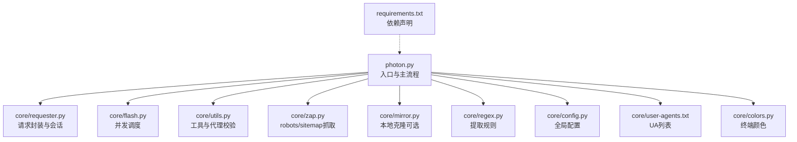
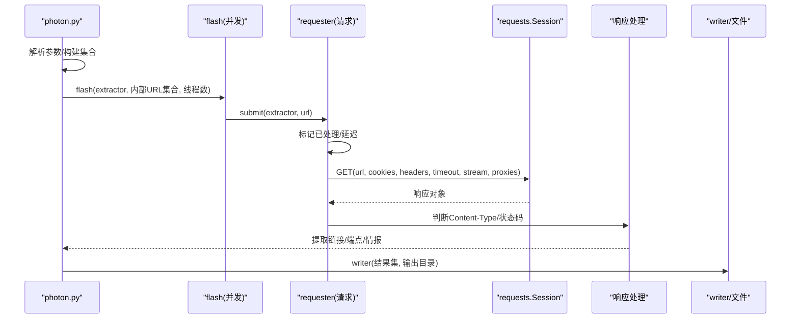
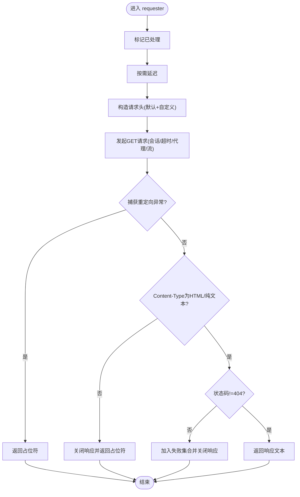
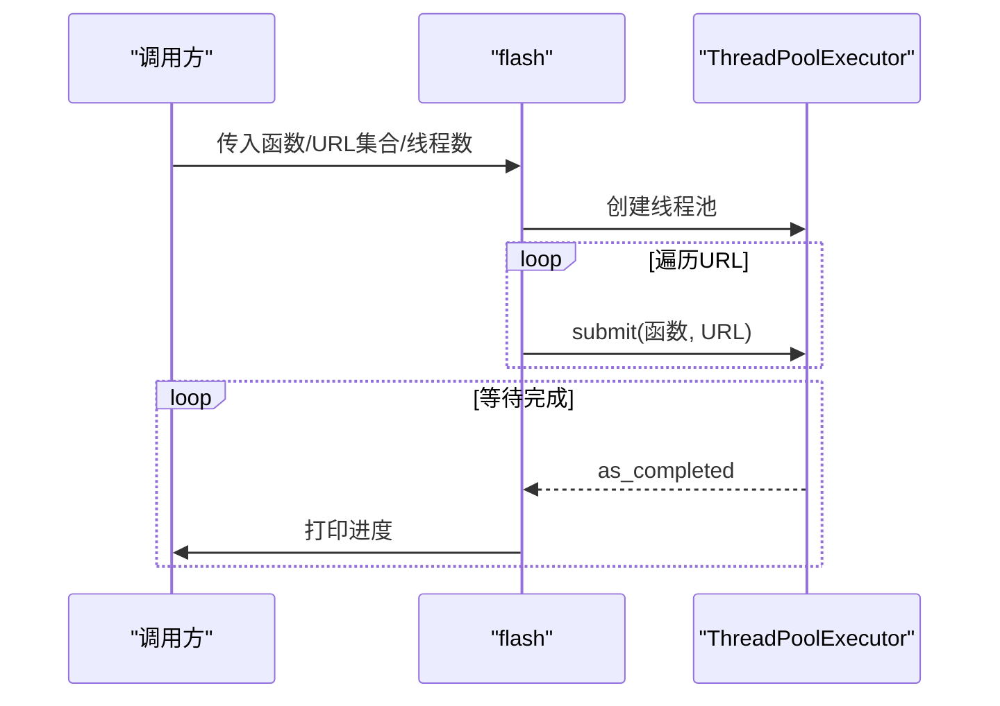
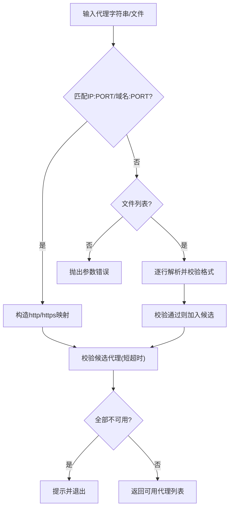
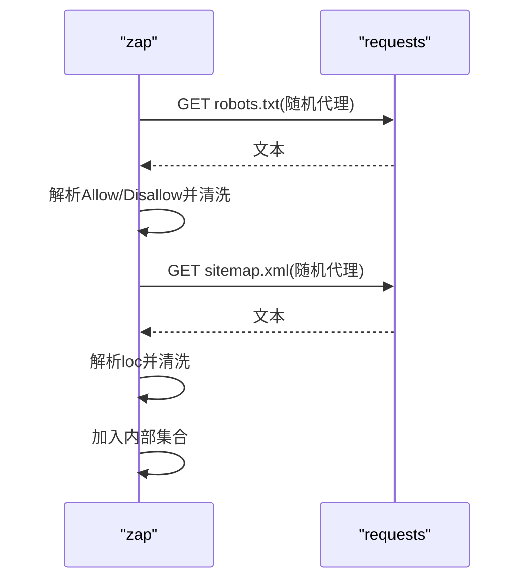
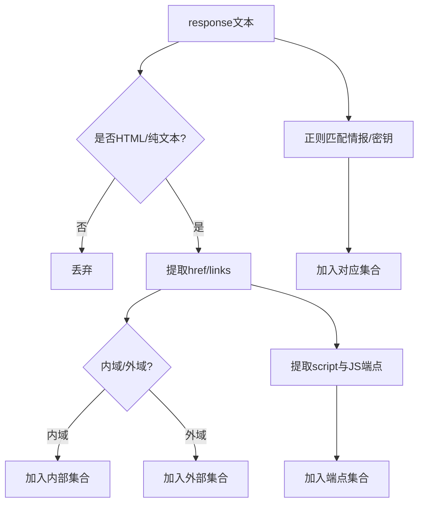
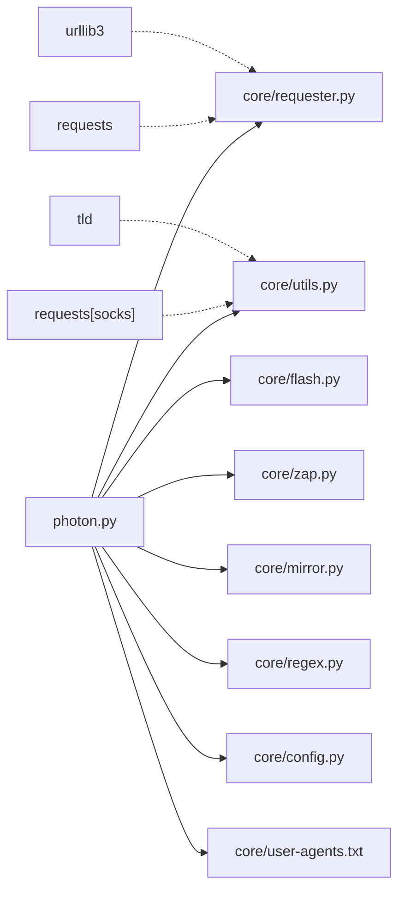

# 请求处理系统

<cite>
**本文引用的文件**
- [photon.py](file://photon.py)
- [core/requester.py](file://core/requester.py)
- [core/utils.py](file://core/utils.py)
- [core/flash.py](file://core/flash.py)
- [core/mirror.py](file://core/mirror.py)
- [core/zap.py](file://core/zap.py)
- [core/config.py](file://core/config.py)
- [core/regex.py](file://core/regex.py)
- [core/colors.py](file://core/colors.py)
- [core/user-agents.txt](file://core/user-agents.txt)
- [requirements.txt](file://requirements.txt)
</cite>

## 目录
1. [简介](#简介)
2. [项目结构](#项目结构)
3. [核心组件](#核心组件)
4. [架构总览](#架构总览)
5. [详细组件分析](#详细组件分析)
6. [依赖分析](#依赖分析)
7. [性能考量](#性能考量)
8. [故障排查指南](#故障排查指南)
9. [结论](#结论)
10. [附录](#附录)

## 简介
本文件为“请求处理系统”的技术文档，聚焦于HTTP请求管理、会话处理、代理支持与超时控制的实现机制；详述请求发送流程、响应处理逻辑、错误与重试策略、连接池管理现状与建议；并提供配置参数说明、代理设置方法、性能优化技巧以及与并发系统的集成方式与线程安全注意事项。文档同时给出基于仓库源码的可视化图示与来源标注，帮助读者快速理解与实践。

## 项目结构
该系统以命令行工具为主，核心请求处理集中在单模块中，通过工具函数与并发执行器协同工作，形成“主流程-请求-解析-输出”的清晰分层。

图表来源
- [photon.py:100-160](file://photon.py#L100-L160)
- [core/requester.py:11-72](file://core/requester.py#L11-L72)
- [core/flash.py:6-17](file://core/flash.py#L6-L17)
- [core/utils.py:164-180](file://core/utils.py#L164-L180)
- [core/zap.py:10-58](file://core/zap.py#L10-L58)
- [core/mirror.py:4-40](file://core/mirror.py#L4-L40)
- [core/regex.py:1-235](file://core/regex.py#L1-L235)
- [core/config.py:1-28](file://core/config.py#L1-L28)
- [core/user-agents.txt:1-19](file://core/user-agents.txt#L1-L19)
- [core/colors.py:1-19](file://core/colors.py#L1-L19)
- [requirements.txt:1-4](file://requirements.txt#L1-L4)

章节来源
- [photon.py:100-160](file://photon.py#L100-L160)
- [core/requester.py:11-72](file://core/requester.py#L11-L72)
- [core/flash.py:6-17](file://core/flash.py#L6-L17)
- [core/utils.py:164-180](file://core/utils.py#L164-L180)
- [core/zap.py:10-58](file://core/zap.py#L10-L58)
- [core/mirror.py:4-40](file://core/mirror.py#L4-L40)
- [core/regex.py:1-235](file://core/regex.py#L1-L235)
- [core/config.py:1-28](file://core/config.py#L1-L28)
- [core/user-agents.txt:1-19](file://core/user-agents.txt#L1-L19)
- [core/colors.py:1-19](file://core/colors.py#L1-L19)
- [requirements.txt:1-4](file://requirements.txt#L1-L4)

## 核心组件
- 请求封装与会话：统一的请求函数负责构造请求头、选择随机UA、应用Cookie、超时与代理、处理重定向异常与内容类型过滤。
- 并发调度：ThreadPoolExecutor驱动批量URL处理，按完成顺序打印进度。
- 工具与代理：代理格式解析、可用性校验、UA加载、正则抽取等。
- 资源抓取：从robots.txt与sitemap.xml抓取种子URL，必要时结合归档站点数据。
- 响应解析：HTML/纯文本内容提取链接、端点、密钥、情报等。
- 输出与镜像：结果写入文件或可选地生成本地镜像。

章节来源
- [core/requester.py:11-72](file://core/requester.py#L11-L72)
- [core/flash.py:6-17](file://core/flash.py#L6-L17)
- [core/utils.py:164-180](file://core/utils.py#L164-L180)
- [core/zap.py:10-58](file://core/zap.py#L10-L58)
- [core/mirror.py:4-40](file://core/mirror.py#L4-L40)
- [core/regex.py:1-235](file://core/regex.py#L1-L235)

## 架构总览
下图展示了从入口到请求、解析与输出的整体调用链路。

图表来源
- [photon.py:305-320](file://photon.py#L305-L320)
- [core/flash.py:6-17](file://core/flash.py#L6-L17)
- [core/requester.py:35-72](file://core/requester.py#L35-L72)

## 详细组件分析

### 组件A：请求封装与会话处理（requester）
- 会话复用：使用全局Session实例，限制最大重定向次数，避免重复握手开销。
- 请求头构造：默认Host、随机User-Agent、Accept、语言、编码、DNT与连接策略；支持外部传入自定义头。
- Cookie与代理：支持传入Cookie集合与代理列表，每次请求随机选择一个代理。
- 超时与流式读取：设置timeout，启用stream以降低内存峰值。
- 错误处理：捕获重定向过多异常，返回占位符；根据Content-Type与状态码决定是否返回正文。
- 返回值：仅在HTML/纯文本且非404时返回文本，否则关闭响应并返回占位符。

图表来源
- [core/requester.py:11-72](file://core/requester.py#L11-L72)

章节来源
- [core/requester.py:11-72](file://core/requester.py#L11-L72)

### 组件B：并发调度与进度反馈（flash）
- 使用ThreadPoolExecutor，最大并发由用户指定。
- 将待处理URL转为列表并提交任务，按完成顺序打印进度。
- 支持键盘中断优雅退出。

图表来源
- [core/flash.py:6-17](file://core/flash.py#L6-L17)

章节来源
- [core/flash.py:6-17](file://core/flash.py#L6-L17)

### 组件C：代理支持与校验（utils）
- 代理格式解析：支持IP:PORT、域名:PORT、SOCKS5与文件列表形式。
- 可用性校验：对候选代理发起短超时连接测试，过滤不可用代理。
- 代理选择：在请求阶段随机从可用代理列表中挑选一个。

图表来源
- [core/utils.py:164-180](file://core/utils.py#L164-L180)
- [core/utils.py:197-205](file://core/utils.py#L197-L205)

章节来源
- [core/utils.py:164-180](file://core/utils.py#L164-L180)
- [core/utils.py:197-205](file://core/utils.py#L197-L205)

### 组件D：资源抓取与种子扩展（zap）
- 从robots.txt与sitemap.xml抓取URL，清洗后加入内部集合。
- 可选从归档站点拉取历史URL作为种子。
- 对robots.txt内容进行简单解析，避免伪装成404的页面。

图表来源
- [core/zap.py:10-58](file://core/zap.py#L10-L58)

章节来源
- [core/zap.py:10-58](file://core/zap.py#L10-L58)

### 组件E：响应解析与情报提取（photon）
- 链接提取：从HTML中提取href与script标签，拼接相对路径，区分内外域。
- 情报提取：基于多组正则匹配邮箱、URL、哈希、证书等。
- JS端点扫描：从JS文本中提取潜在端点。
- 密钥检测：基于熵值阈值识别高熵字符串。
- 克隆模式：可选将响应写成本地镜像文件。

图表来源
- [photon.py:239-288](file://photon.py#L239-L288)
- [core/regex.py:1-235](file://core/regex.py#L1-L235)

章节来源
- [photon.py:239-288](file://photon.py#L239-L288)
- [core/regex.py:1-235](file://core/regex.py#L1-L235)

### 组件F：输出与镜像（writer/mirror）
- writer：将各集合写入独立文件，UTF-8编码保存。
- mirror：按原始URL层级结构在本地重建目录并写入响应内容，支持查询参数追加。

章节来源
- [core/utils.py:78-87](file://core/utils.py#L78-L87)
- [core/mirror.py:4-40](file://core/mirror.py#L4-L40)

## 依赖分析
- 外部依赖：requests、requests[socks]、urllib3、tld。
- 内部耦合：photon主流程依赖requester、flash、utils、zap、regex、config、colors与UA列表；requester依赖requests.Session与随机选择器；utils提供代理与正则工具；flash提供并发能力；zap提供种子扩展；mirror提供可选本地镜像。

图表来源
- [requirements.txt:1-4](file://requirements.txt#L1-L4)
- [photon.py:32-51](file://photon.py#L32-L51)
- [core/requester.py:4-6](file://core/requester.py#L4-L6)
- [core/utils.py:1-12](file://core/utils.py#L1-L12)

章节来源
- [requirements.txt:1-4](file://requirements.txt#L1-L4)
- [photon.py:32-51](file://photon.py#L32-L51)
- [core/requester.py:4-6](file://core/requester.py#L4-L6)
- [core/utils.py:1-12](file://core/utils.py#L1-L12)

## 性能考量
- 连接池与会话复用：使用全局Session减少TCP/TLS握手与连接建立开销，适合高并发场景。
- 流式响应：启用stream可降低内存占用，但需注意及时关闭非文本响应以释放资源。
- 代理随机化：在可用代理列表中随机选择，有助于分散目标服务器压力与规避限速。
- 超时与重定向：合理设置timeout与max_redirects，避免长时间阻塞；对重定向异常进行兜底处理。
- 并发度：通过线程数平衡吞吐与资源消耗；在受限环境中适当降低并发。
- 延迟策略：在请求间增加固定延迟，缓解目标服务器压力并提高稳定性。
- I/O与编码：writer采用UTF-8编码写入，避免乱码；镜像模式按层级重建目录，便于后续离线分析。

[本节为通用性能建议，不直接分析具体文件]

## 故障排查指南
- 代理不可用
  - 现象：连接超时或被拒绝。
  - 排查：确认代理格式正确、网络可达；使用代理校验函数验证连通性。
  - 参考
    - [core/utils.py:164-180](file://core/utils.py#L164-L180)
    - [core/utils.py:197-205](file://core/utils.py#L197-L205)
- 重定向过多
  - 现象：请求被大量跳转导致耗时过长。
  - 处理：requester已捕获重定向异常并返回占位符；可调整max_redirects或更换代理。
  - 参考
    - [core/requester.py:8-9](file://core/requester.py#L8-L9)
    - [core/requester.py:57-58](file://core/requester.py#L57-L58)
- SSL验证问题
  - 现象：证书校验失败。
  - 处理：当前requester关闭SSL验证；生产环境建议修复证书或使用受信CA。
  - 参考
    - [core/requester.py:52](file://core/requester.py#L52)
- 响应类型不符
  - 现象：非HTML/纯文本内容被忽略。
  - 处理：检查Content-Type与业务需求；必要时扩展过滤条件。
  - 参考
    - [core/requester.py:60-70](file://core/requester.py#L60-L70)
- 并发冲突
  - 现象：共享集合未加锁导致竞态。
  - 处理：当前代码在主线程中维护集合，建议在并发回调中避免直接修改共享集合，或引入线程安全容器与锁。
  - 参考
    - [core/flash.py:6-17](file://core/flash.py#L6-L17)
    - [photon.py:146-165](file://photon.py#L146-L165)

章节来源
- [core/utils.py:164-180](file://core/utils.py#L164-L180)
- [core/utils.py:197-205](file://core/utils.py#L197-L205)
- [core/requester.py:8-9](file://core/requester.py#L8-L9)
- [core/requester.py:57-58](file://core/requester.py#L57-L58)
- [core/requester.py:52](file://core/requester.py#L52)
- [core/requester.py:60-70](file://core/requester.py#L60-L70)
- [core/flash.py:6-17](file://core/flash.py#L6-L17)
- [photon.py:146-165](file://photon.py#L146-L165)

## 结论
该请求处理系统以简洁的请求封装为核心，配合并发调度、代理校验与资源抓取，实现了面向OSINT的高效爬取流程。当前实现具备会话复用、流式响应与随机代理等性能特性，但在错误重试、连接池参数化与线程安全方面仍有优化空间。建议在生产环境中引入指数退避重试、连接池参数调优与线程安全的数据结构，以进一步提升稳定性与吞吐量。

[本节为总结性内容，不直接分析具体文件]

## 附录

### 配置参数与使用要点
- 基础参数
  - URL：根URL，自动补全协议与主机。
  - 线程数：并发度，默认较小，可根据机器与目标调整。
  - 延迟：请求间隔秒数，缓解目标压力。
  - 超时：HTTP请求超时秒数，默认较短，建议按网络状况调整。
  - Cookie：可选传入。
  - 用户代理：可从文件加载或传入多个UA以随机使用。
  - 代理：支持IP:PORT、域名:PORT、SOCKS5与文件列表，启动时会校验可用性。
  - 正则导出：自定义正则匹配结果。
  - 仅URL模式：仅提取链接，不进行情报/端点扫描。
  - 种子：额外种子URL集合。
  - 排除：按正则排除URL。
  - 输出：结果保存目录。
  - 克隆：可选生成本地镜像。
  - 头部：交互式输入头部键值。
  - DNS/归档：可选枚举子域与从归档站点拉取历史URL。
  - 更新：内置更新功能。
- 关键来源
  - [photon.py:57-99](file://photon.py#L57-L99)
  - [photon.py:118-144](file://photon.py#L118-L144)
  - [photon.py:199-203](file://photon.py#L199-L203)
  - [core/utils.py:164-180](file://core/utils.py#L164-L180)

### 代理设置方法
- 单个代理：IP:PORT或域名:PORT，自动映射http/https。
- 文件列表：每行一个代理，支持IP/域名与端口格式。
- 校验：启动时对每个代理发起短超时连接测试，过滤不可用代理。
- 使用：在请求阶段随机从可用代理列表中选择一个。

章节来源
- [core/utils.py:164-180](file://core/utils.py#L164-L180)
- [core/utils.py:197-205](file://core/utils.py#L197-L205)
- [core/requester.py:55](file://core/requester.py#L55)

### 代码示例（路径指引）
- 使用请求处理器进行网络通信
  - 在自定义函数中调用请求处理器，传入URL与相关参数
  - 示例路径
    - [photon.py:239-288](file://photon.py#L239-L288)
    - [core/requester.py:11-72](file://core/requester.py#L11-L72)
- 设置代理并验证
  - 解析代理格式并校验连通性
  - 示例路径
    - [core/utils.py:164-180](file://core/utils.py#L164-L180)
    - [core/utils.py:197-205](file://core/utils.py#L197-L205)
- 并发集成与进度反馈
  - 使用并发调度器提交任务并打印进度
  - 示例路径
    - [core/flash.py:6-17](file://core/flash.py#L6-L17)
    - [photon.py:327](file://photon.py#L327)

### 线程安全性与并发集成
- 当前并发模型：主线程维护共享集合，回调中直接修改集合，存在竞态风险。
- 建议改进：
  - 使用线程安全容器（如队列）收集结果，主线程统一写入。
  - 对共享集合使用锁保护。
  - 将requester改为无状态函数，避免依赖全局会话的副作用。
- 参考
  - [core/flash.py:6-17](file://core/flash.py#L6-L17)
  - [photon.py:146-165](file://photon.py#L146-L165)
  - [core/requester.py:8-9](file://core/requester.py#L8-L9)