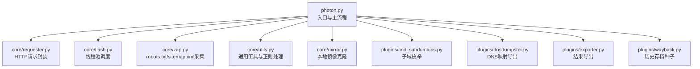
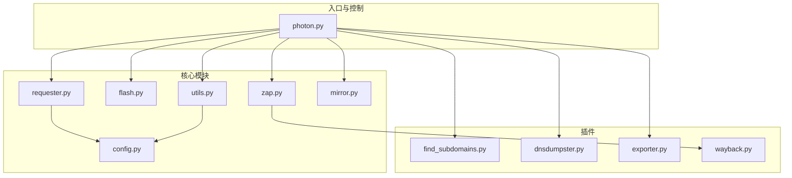
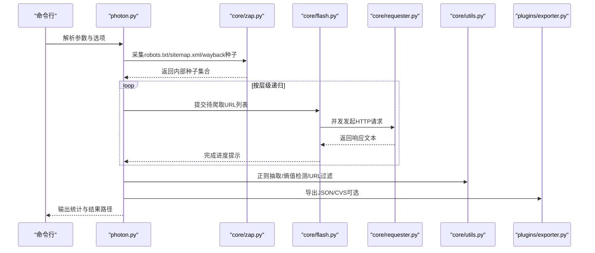
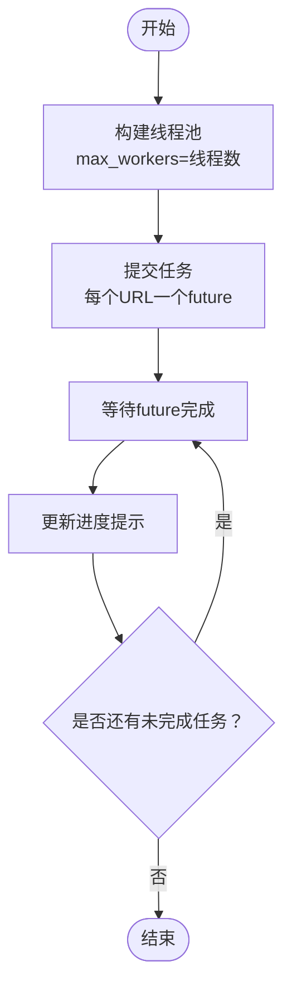
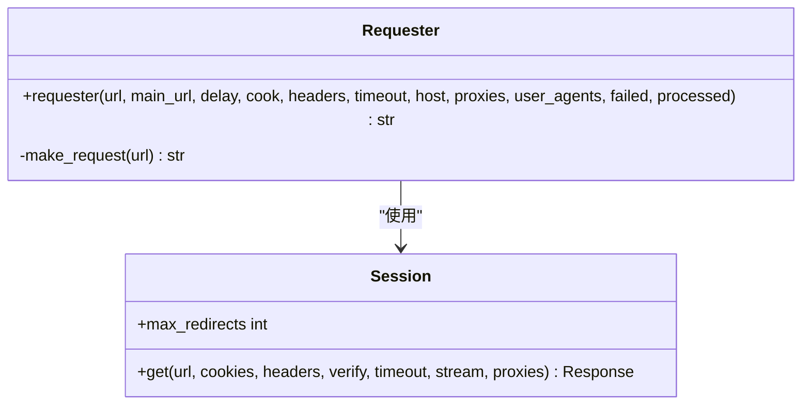
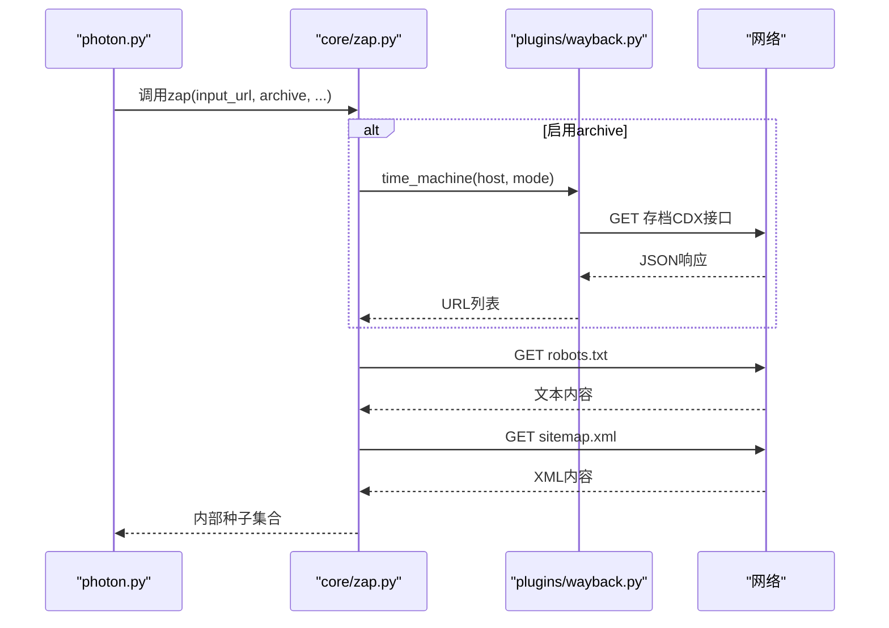
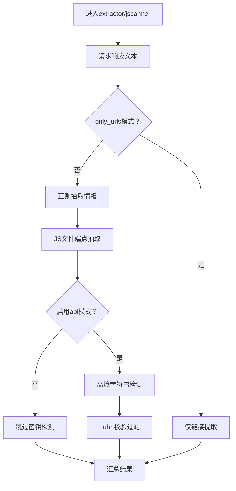
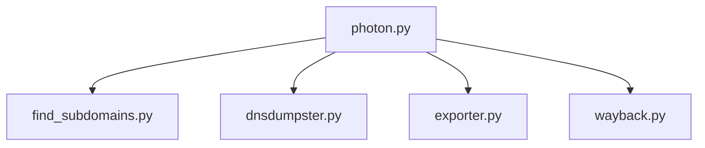
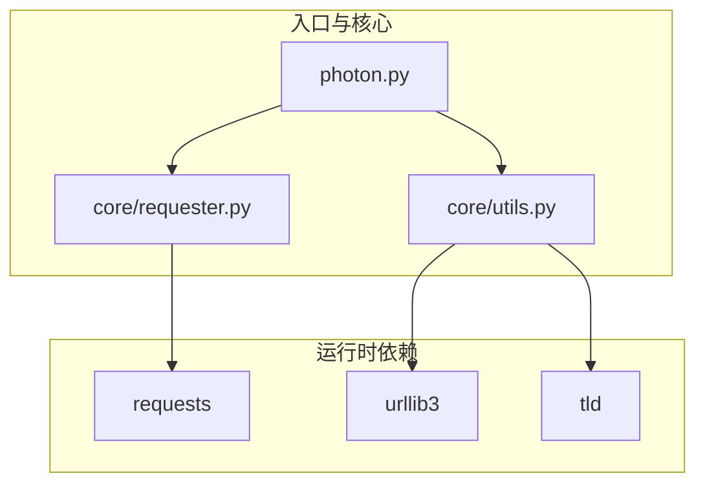

# 项目概述

<cite>
**本文引用的文件**
- [README.md](file://README.md)
- [photon.py](file://photon.py)
- [requirements.txt](file://requirements.txt)
- [core/__init__.py](file://core/__init__.py)
- [plugins/__init__.py](file://plugins/__init__.py)
- [core/config.py](file://core/config.py)
- [core/requester.py](file://core/requester.py)
- [core/utils.py](file://core/utils.py)
- [core/flash.py](file://core/flash.py)
- [core/zap.py](file://core/zap.py)
- [core/mirror.py](file://core/mirror.py)
- [plugins/find_subdomains.py](file://plugins/find_subdomains.py)
- [plugins/dnsdumpster.py](file://plugins/dnsdumpster.py)
- [plugins/exporter.py](file://plugins/exporter.py)
- [plugins/wayback.py](file://plugins/wayback.py)
</cite>

## 目录
1. [引言](#引言)
2. [项目结构](#项目结构)
3. [核心组件](#核心组件)
4. [架构总览](#架构总览)
5. [详细组件分析](#详细组件分析)
6. [依赖分析](#依赖分析)
7. [性能考量](#性能考量)
8. [故障排查指南](#故障排查指南)
9. [结论](#结论)
10. [附录](#附录)

## 引言
Photon 是一款面向开源情报（OSINT）的高速网络爬虫工具，旨在帮助安全研究人员与渗透测试人员从目标网站中系统性地提取各类敏感信息与资产线索。其核心目标包括：
- 高效抓取与解析网页链接、参数化URL、JavaScript文件与端点
- 提取邮件、社交媒体账号、云存储桶等情报（Intel）
- 检测高熵字符串（如密钥、哈希）以发现潜在泄露
- 支持子域名枚举与DNS相关数据导出
- 提供灵活的配置项与插件扩展机制，便于定制化采集策略

在网络安全研究与渗透测试场景中，Photon 可用于：
- 资产发现与归档：通过站点地图与历史存档（Wayback Machine）补充种子URL
- 敏感信息收集：从HTML与JS中抽取邮箱、社交账号、云资源等
- 参数化URL识别：辅助模糊测试与注入检测
- 子域枚举与DNS映射：构建目标域的网络拓扑图谱

项目采用模块化设计与插件系统，既适合初学者快速上手，也为高级用户提供可扩展的技术架构。

## 项目结构
项目采用“入口脚本 + 核心模块 + 插件模块”的分层组织方式：
- 入口脚本：photon.py 负责命令行参数解析、主流程编排与结果输出
- 核心模块：位于 core/ 下，提供请求、并发、正则、工具函数、镜像克隆、初始种子采集等功能
- 插件模块：位于 plugins/ 下，提供子域枚举、DNS映射、导出、历史存档等扩展能力

图表来源
- [photon.py:1-426](file://photon.py#L1-L426)
- [core/requester.py:1-73](file://core/requester.py#L1-L73)
- [core/flash.py:1-18](file://core/flash.py#L1-L18)
- [core/zap.py:1-58](file://core/zap.py#L1-L58)
- [core/utils.py:1-207](file://core/utils.py#L1-L207)
- [core/mirror.py:1-40](file://core/mirror.py#L1-L40)
- [plugins/find_subdomains.py:1-15](file://plugins/find_subdomains.py#L1-L15)
- [plugins/dnsdumpster.py:1-23](file://plugins/dnsdumpster.py#L1-L23)
- [plugins/exporter.py:1-25](file://plugins/exporter.py#L1-L25)
- [plugins/wayback.py:1-23](file://plugins/wayback.py#L1-L23)

章节来源
- [photon.py:1-426](file://photon.py#L1-L426)
- [core/__init__.py:1-2](file://core/__init__.py#L1-L2)
- [plugins/__init__.py:1-2](file://plugins/__init__.py#L1-L2)

## 核心组件
- 命令行与主流程：负责参数解析、初始化变量、控制爬取层级与线程数、编排各阶段任务与结果落盘
- 请求器：统一管理会话、超时、代理、随机UA、响应类型过滤与流式读取
- 并发调度：基于线程池对链接进行批量处理，支持进度提示
- 初始种子采集：从 robots.txt、sitemap.xml 以及 Wayback Machine 获取种子URL
- 工具与正则：提供自定义正则抽取、URL过滤、熵值计算、Luhn校验、头部解析、时间统计等
- 结果写入与导出：按类别保存文本文件，并支持JSON/CSS导出
- 镜像克隆：可选地将页面内容本地镜像化，便于离线分析
- 插件体系：子域枚举、DNS映射、结果导出、历史存档等

章节来源
- [photon.py:56-117](file://photon.py#L56-L117)
- [core/requester.py:11-73](file://core/requester.py#L11-L73)
- [core/flash.py:6-18](file://core/flash.py#L6-L18)
- [core/zap.py:10-58](file://core/zap.py#L10-L58)
- [core/utils.py:78-87](file://core/utils.py#L78-L87)
- [core/mirror.py:4-40](file://core/mirror.py#L4-L40)
- [plugins/exporter.py:6-25](file://plugins/exporter.py#L6-L25)

## 架构总览
下图展示了从入口到各核心模块与插件的交互关系，体现模块化与插件化的扩展特性。

图表来源
- [photon.py:1-426](file://photon.py#L1-L426)
- [core/requester.py:1-73](file://core/requester.py#L1-L73)
- [core/flash.py:1-18](file://core/flash.py#L1-L18)
- [core/zap.py:1-58](file://core/zap.py#L1-L58)
- [core/utils.py:1-207](file://core/utils.py#L1-L207)
- [core/mirror.py:1-40](file://core/mirror.py#L1-L40)
- [core/config.py:1-28](file://core/config.py#L1-L28)
- [plugins/find_subdomains.py:1-15](file://plugins/find_subdomains.py#L1-L15)
- [plugins/dnsdumpster.py:1-23](file://plugins/dnsdumpster.py#L1-L23)
- [plugins/exporter.py:1-25](file://plugins/exporter.py#L1-L25)
- [plugins/wayback.py:1-23](file://plugins/wayback.py#L1-L23)

## 详细组件分析

### 主流程与数据流
主流程围绕“采集种子 → 递归爬取 → JS端点扫描 → 情报提取 → 结果落盘”的闭环展开。流程要点：
- 解析命令行参数，设置线程数、延迟、超时、代理、输出目录等
- 从 robots.txt、sitemap.xml 与 Wayback Machine 获取种子URL
- 使用线程池并发处理待爬取URL，按层级递归扩展
- 对HTML进行链接提取与范围判定；对JS进行端点抽取
- 基于内置或自定义正则抽取情报，计算高熵字符串以发现密钥
- 将结果按类别写入文本文件，必要时导出为JSON/CVS

图表来源
- [photon.py:308-342](file://photon.py#L308-L342)
- [core/zap.py:10-58](file://core/zap.py#L10-L58)
- [core/flash.py:6-18](file://core/flash.py#L6-L18)
- [core/requester.py:11-73](file://core/requester.py#L11-L73)
- [core/utils.py:15-24](file://core/utils.py#L15-L24)
- [plugins/exporter.py:6-25](file://plugins/exporter.py#L6-L25)

章节来源
- [photon.py:308-426](file://photon.py#L308-L426)
- [core/zap.py:10-58](file://core/zap.py#L10-L58)
- [core/flash.py:6-18](file://core/flash.py#L6-L18)
- [core/requester.py:11-73](file://core/requester.py#L11-L73)
- [core/utils.py:15-24](file://core/utils.py#L15-L24)
- [plugins/exporter.py:6-25](file://plugins/exporter.py#L6-L25)

### 线程池调度与并发控制
- 使用线程池对链接进行异步处理，减少I/O等待时间
- 进度打印基于完成的任务数量，便于监控执行状态
- 可通过参数调整线程数与请求延迟，平衡吞吐与稳定性

图表来源
- [core/flash.py:6-18](file://core/flash.py#L6-L18)

章节来源
- [core/flash.py:6-18](file://core/flash.py#L6-L18)

### 请求器与会话管理
- 统一使用会话对象，限制最大重定向次数，避免死循环
- 自动选择随机User-Agent，支持自定义Cookie与Headers
- 根据Content-Type过滤响应，仅对HTML/纯文本进行解析
- 支持代理池与超时控制，增强鲁棒性

图表来源
- [core/requester.py:11-73](file://core/requester.py#L11-L73)

章节来源
- [core/requester.py:11-73](file://core/requester.py#L11-L73)

### 初始种子采集（robots.txt/sitemap.xml/wayback）
- 从 robots.txt 中解析允许/禁止路径，拼接为内部种子
- 从 sitemap.xml 中解析XML格式的URL列表
- 可选地从 Wayback Machine 获取历史页面URL作为种子，提升覆盖面

图表来源
- [core/zap.py:10-58](file://core/zap.py#L10-L58)
- [plugins/wayback.py:8-23](file://plugins/wayback.py#L8-L23)

章节来源
- [core/zap.py:10-58](file://core/zap.py#L10-L58)
- [plugins/wayback.py:8-23](file://plugins/wayback.py#L8-L23)

### 智能情报提取与高熵检测
- HTML正文去标签后匹配多类情报正则（邮箱、社交账号、云存储等）
- JS文件中抽取端点与路径片段，过滤无效字符
- 对响应体进行高熵字符串检测，结合Luhn算法过滤伪阳性
- 支持自定义正则抽取特定模式字符串

图表来源
- [photon.py:208-303](file://photon.py#L208-L303)
- [core/utils.py:101-109](file://core/utils.py#L101-L109)
- [core/utils.py:182-194](file://core/utils.py#L182-L194)

章节来源
- [photon.py:208-303](file://photon.py#L208-L303)
- [core/utils.py:101-109](file://core/utils.py#L101-L109)
- [core/utils.py:182-194](file://core/utils.py#L182-L194)

### 插件系统与扩展性
- 子域枚举：调用第三方服务获取子域列表
- DNS映射：生成并保存DNS映射图片
- 导出：支持JSON与CSV两种导出格式
- 历史存档：从Wayback获取历史URL作为种子

图表来源
- [photon.py:405-420](file://photon.py#L405-L420)
- [plugins/find_subdomains.py:7-15](file://plugins/find_subdomains.py#L7-L15)
- [plugins/dnsdumpster.py:7-23](file://plugins/dnsdumpster.py#L7-L23)
- [plugins/exporter.py:6-25](file://plugins/exporter.py#L6-L25)
- [plugins/wayback.py:8-23](file://plugins/wayback.py#L8-L23)

章节来源
- [photon.py:405-420](file://photon.py#L405-L420)
- [plugins/find_subdomains.py:7-15](file://plugins/find_subdomains.py#L7-L15)
- [plugins/dnsdumpster.py:7-23](file://plugins/dnsdumpster.py#L7-L23)
- [plugins/exporter.py:6-25](file://plugins/exporter.py#L6-L25)
- [plugins/wayback.py:8-23](file://plugins/wayback.py#L8-L23)

## 依赖分析
- 外部依赖：requests、urllib3、tld，用于HTTP请求、TLS与顶级域名解析
- 插件依赖：部分插件直接使用requests访问外部服务
- 内聚与耦合：核心模块内聚度高，插件通过入口脚本按需导入，降低耦合

图表来源
- [requirements.txt:1-4](file://requirements.txt#L1-L4)
- [photon.py:1-50](file://photon.py#L1-L50)
- [core/requester.py:1-10](file://core/requester.py#L1-L10)
- [core/utils.py:1-12](file://core/utils.py#L1-L12)

章节来源
- [requirements.txt:1-4](file://requirements.txt#L1-L4)
- [photon.py:1-50](file://photon.py#L1-L50)
- [core/requester.py:1-10](file://core/requester.py#L1-L10)
- [core/utils.py:1-12](file://core/utils.py#L1-L12)

## 性能考量
- 并发与限速：通过线程池与请求延迟平衡吞吐与对目标服务器的压力
- 响应过滤：仅解析HTML/纯文本，减少无关文件的解析开销
- 代理与随机UA：提高稳定性与绕过简单防护
- 历史存档：利用Wayback减少实时请求量，提升覆盖率
- 磁盘IO：批量写入与进度提示，避免频繁刷新导致的性能损耗

## 故障排查指南
- 代理不可用：检查代理格式与连通性，确保代理池有效
- 请求超时/重定向过多：适当增大超时或减少并发
- 结果为空：确认目标URL协议（自动尝试https/http），检查排除规则与only_urls模式
- 导出失败：确认导出格式与输出目录权限
- 子域/DNS插件异常：检查网络连通与第三方服务可用性

章节来源
- [photon.py:126-140](file://photon.py#L126-L140)
- [core/requester.py:47-67](file://core/requester.py#L47-L67)
- [core/utils.py:164-180](file://core/utils.py#L164-L180)
- [plugins/exporter.py:6-25](file://plugins/exporter.py#L6-L25)

## 结论
Photon 以模块化与插件化为核心设计理念，结合高效的并发调度与完善的采集流程，在OSINT与渗透测试场景中具备良好的实用性与扩展性。其清晰的职责划分与可配置参数，使得初学者能够快速上手，同时为高级用户提供了深度定制的空间。

## 附录
- 许可证：GPL v3.0
- 社区贡献：欢迎报告问题、开发插件、完善Ninja模式API、提出改进建议与提交PR
- 发展动态：持续迭代，定期发布更新，支持无缝升级

章节来源
- [README.md:162-176](file://README.md#L162-L176)