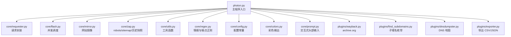
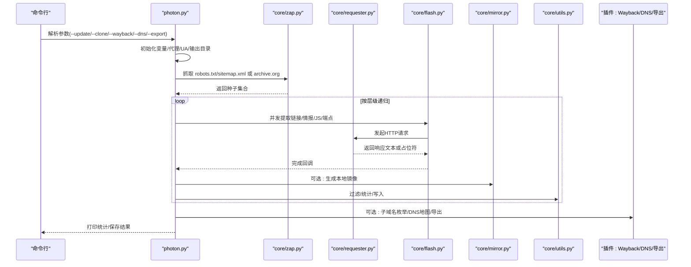
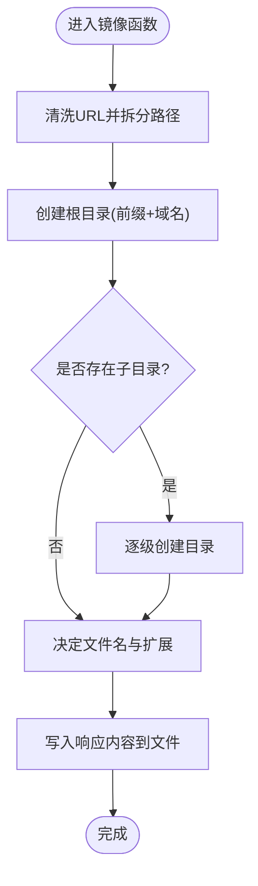
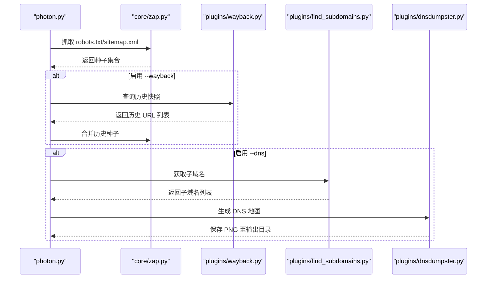
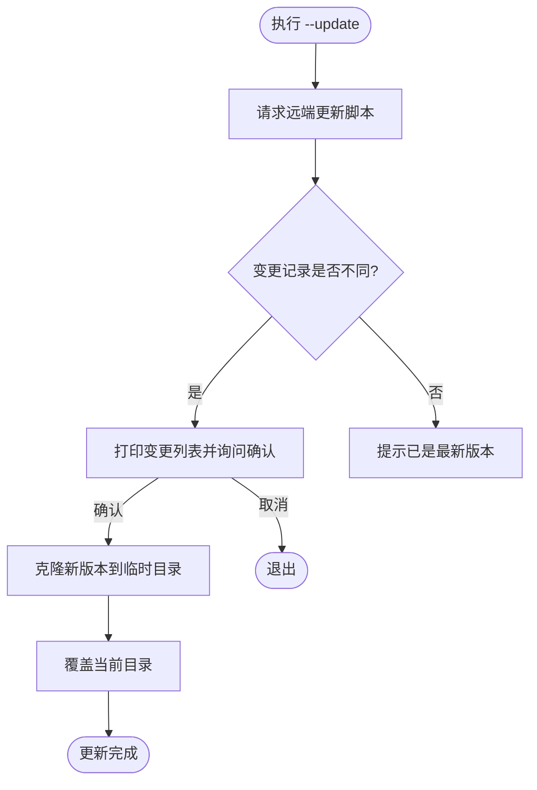
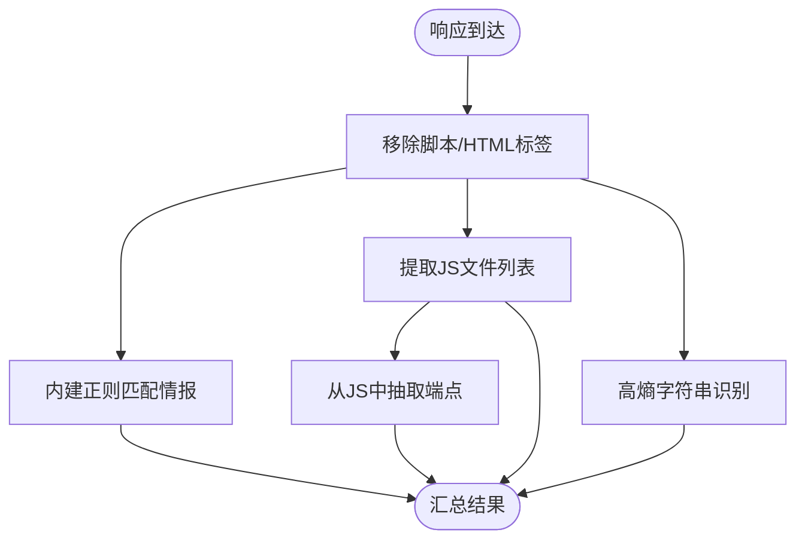
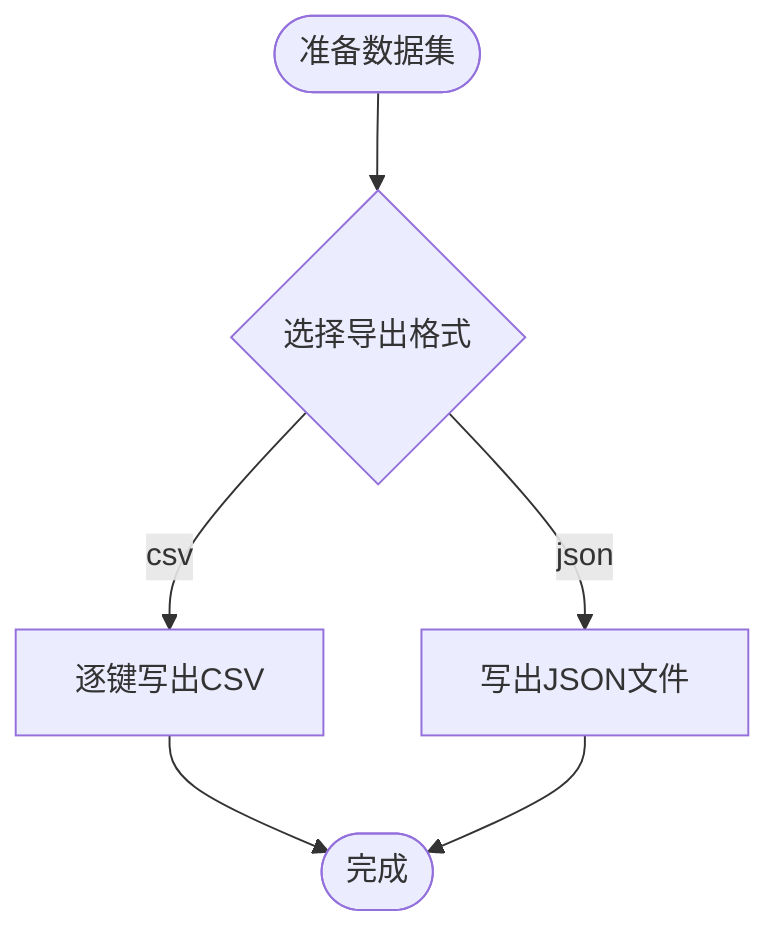
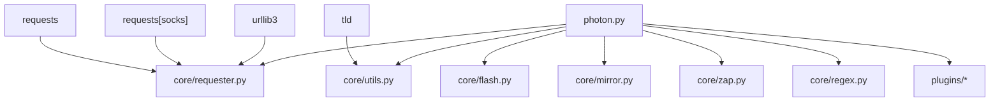

# 高级功能

<cite>
**本文引用的文件**
- [photon.py](file://photon.py)
- [core/mirror.py](file://core/mirror.py)
- [core/updater.py](file://core/updater.py)
- [core/zap.py](file://core/zap.py)
- [plugins/wayback.py](file://plugins/wayback.py)
- [plugins/find_subdomains.py](file://plugins/find_subdomains.py)
- [plugins/dnsdumpster.py](file://plugins/dnsdumpster.py)
- [plugins/exporter.py](file://plugins/exporter.py)
- [core/requester.py](file://core/requester.py)
- [core/utils.py](file://core/utils.py)
- [core/flash.py](file://core/flash.py)
- [core/regex.py](file://core/regex.py)
- [core/config.py](file://core/config.py)
- [core/colors.py](file://core/colors.py)
- [core/prompt.py](file://core/prompt.py)
- [README.md](file://README.md)
- [requirements.txt](file://requirements.txt)
</cite>

## 目录
1. [简介](#简介)
2. [项目结构](#项目结构)
3. [核心组件](#核心组件)
4. [架构总览](#架构总览)
5. [详细组件分析](#详细组件分析)
6. [依赖分析](#依赖分析)
7. [性能考虑](#性能考虑)
8. [故障排除指南](#故障排除指南)
9. [结论](#结论)
10. [附录](#附录)

## 简介
本章节面向具备一定渗透测试与信息收集经验的用户，系统性梳理 Photon 的高级功能与实现原理，重点覆盖以下主题：
- 网站镜像（本地克隆）：将目标站点按目录结构保存到本地，便于离线分析与二次审计。
- 网络分析工具链：通过 robots.txt、sitemap.xml、Wayback Machine 历史快照与第三方 DNS 数据源，扩展种子与上下文。
- 自动更新机制：在不丢失数据的前提下检查并合并最新版本。
- 高级提取能力：基于正则与熵值的敏感信息识别、JavaScript 端点发现、自定义规则抽取。
- 性能优化与并发控制：线程池调度、请求节流、超时与重定向限制、代理支持与轮换。
- 最佳实践与集成：与外部工具（如 Burp Suite、Arjun、Nuclei）协同使用，导出结果与报告。

## 项目结构
项目采用“主程序 + 核心模块 + 插件”的分层组织方式：
- 主程序入口负责参数解析、流程编排与结果输出。
- 核心模块提供网络请求、并发执行、正则规则、工具函数、颜色输出、提示器等基础能力。
- 插件模块提供与外部服务的集成（Wayback、DNSDumpster、子域名枚举、导出）。

图表来源
- [photon.py:100-426](file://photon.py#L100-L426)
- [core/requester.py:11-73](file://core/requester.py#L11-L73)
- [core/flash.py:6-18](file://core/flash.py#L6-L18)
- [core/mirror.py:4-40](file://core/mirror.py#L4-L40)
- [core/zap.py:10-58](file://core/zap.py#L10-L58)
- [core/utils.py:78-87](file://core/utils.py#L78-L87)
- [core/regex.py:231-235](file://core/regex.py#L231-L235)
- [core/config.py:3-28](file://core/config.py#L3-L28)
- [core/colors.py:4-19](file://core/colors.py#L4-L19)
- [core/prompt.py:6-23](file://core/prompt.py#L6-L23)
- [plugins/wayback.py:8-23](file://plugins/wayback.py#L8-L23)
- [plugins/find_subdomains.py:7-15](file://plugins/find_subdomains.py#L7-L15)
- [plugins/dnsdumpster.py:7-23](file://plugins/dnsdumpster.py#L7-L23)
- [plugins/exporter.py:6-25](file://plugins/exporter.py#L6-L25)

章节来源
- [photon.py:57-99](file://photon.py#L57-L99)
- [README.md:36-104](file://README.md#L36-L104)

## 核心组件
- 请求与并发
  - 请求器封装了会话、Cookie、Headers、超时、代理、User-Agent 轮换与最大重定向限制，确保稳定抓取。
  - 并发调度器使用线程池对链接进行异步处理，并打印进度。
- 正则与情报提取
  - 内置多类正则用于识别 URL、邮箱、哈希、YARA 规则、信用卡号等；同时支持 JavaScript 端点抽取与高熵字符串识别。
- 工具与配置
  - 工具函数提供定时统计、熵计算、XML 解析、正则过滤、文件写入、代理校验等。
  - 配置模块定义全局常量（如情报白名单、文件类型黑名单）。
- 输出与展示
  - 彩色输出与交互式头部输入提升用户体验；支持将结果导出为 CSV/JSON 或直接打印统计。

章节来源
- [core/requester.py:11-73](file://core/requester.py#L11-L73)
- [core/flash.py:6-18](file://core/flash.py#L6-L18)
- [core/regex.py:214-235](file://core/regex.py#L214-L235)
- [core/utils.py:101-116](file://core/utils.py#L101-L116)
- [core/config.py:3-28](file://core/config.py#L3-L28)
- [core/colors.py:4-19](file://core/colors.py#L4-L19)
- [core/prompt.py:6-23](file://core/prompt.py#L6-L23)

## 架构总览
下图展示了从命令行参数到数据采集、分析与落盘的整体流程，以及与外部服务的交互点。

图表来源
- [photon.py:102-426](file://photon.py#L102-L426)
- [core/zap.py:10-58](file://core/zap.py#L10-L58)
- [core/requester.py:11-73](file://core/requester.py#L11-L73)
- [core/flash.py:6-18](file://core/flash.py#L6-L18)
- [core/mirror.py:4-40](file://core/mirror.py#L4-L40)
- [core/utils.py:78-87](file://core/utils.py#L78-L87)
- [plugins/wayback.py:8-23](file://plugins/wayback.py#L8-L23)
- [plugins/find_subdomains.py:7-15](file://plugins/find_subdomains.py#L7-L15)
- [plugins/dnsdumpster.py:7-23](file://plugins/dnsdumpster.py#L7-L23)
- [plugins/exporter.py:6-25](file://plugins/exporter.py#L6-L25)

## 详细组件分析

### 网站镜像（Clone）
- 功能概述
  - 将目标站点按原始路径结构保存到本地，保留查询参数与默认首页命名，便于离线审计与二次分析。
- 关键实现
  - 清洗 URL、拆分子路径、逐级创建目录、根据页面名决定文件名（无扩展名时补 .html），并将响应内容写入文件。
- 使用场景
  - 需要离线复现目标站点、对比快照差异、在本地进行静态分析。
- 参数与开关
  - 命令行开关：--clone
  - 行为：在每次提取响应后调用镜像函数。
- 性能与注意事项
  - 仅写入 HTML/纯文本响应体，避免下载二进制大文件；注意磁盘空间与路径长度限制。
  - 与并发抓取并行运行，建议在低线程数下启用以减少磁盘争用。

图表来源
- [core/mirror.py:4-40](file://core/mirror.py#L4-L40)

章节来源
- [core/mirror.py:4-40](file://core/mirror.py#L4-L40)
- [photon.py:242-243](file://photon.py#L242-L243)

### 网络分析工具链
- robots.txt 与 sitemap.xml
  - 从 robots.txt 中解析 Allow/Disallow 条目，构造可访问种子；从 sitemap.xml 提取 XML 中的 loc 列表作为种子。
- Wayback Machine 历史快照
  - 通过 archive.org 的 CDX 接口按时间窗口检索历史页面，作为额外种子注入爬取队列。
- 子域名枚举与 DNS 地图
  - 从第三方接口获取子域名列表；生成 DNS 地图图片并保存至输出目录。
- 使用场景
  - 扩展种子集、发现被删除或隐藏的页面、构建资产边界图谱。
- 参数与开关
  - --wayback：启用历史快照种子注入
  - --dns：启用子域名枚举与 DNS 地图
- 性能与注意事项
  - 历史快照接口存在速率限制，建议配合延迟参数使用；DNS 地图仅保存 PNG 图片，注意输出目录权限。

图表来源
- [core/zap.py:10-58](file://core/zap.py#L10-L58)
- [plugins/wayback.py:8-23](file://plugins/wayback.py#L8-L23)
- [plugins/find_subdomains.py:7-15](file://plugins/find_subdomains.py#L7-L15)
- [plugins/dnsdumpster.py:7-23](file://plugins/dnsdumpster.py#L7-L23)

章节来源
- [core/zap.py:10-58](file://core/zap.py#L10-L58)
- [plugins/wayback.py:8-23](file://plugins/wayback.py#L8-L23)
- [plugins/find_subdomains.py:7-15](file://plugins/find_subdomains.py#L7-L15)
- [plugins/dnsdumpster.py:7-23](file://plugins/dnsdumpster.py#L7-L23)
- [photon.py:405-415](file://photon.py#L405-L415)

### 自动更新机制
- 功能概述
  - 对比当前安装与远端最新版本变更记录，提示用户是否更新；若确认，则以静默方式克隆新版本并覆盖当前目录，保证数据不丢失。
- 关键实现
  - 通过请求远端更新脚本获取变更列表；若检测到新版本，询问用户并执行覆盖操作。
- 使用场景
  - 在不中断工作流的情况下保持工具最新，修复已知问题与性能瓶颈。
- 参数与开关
  - --update：触发更新流程
- 性能与注意事项
  - 更新过程涉及网络克隆与文件复制，建议在空闲时段执行；更新前建议备份重要输出目录。

图表来源
- [core/updater.py:8-41](file://core/updater.py#L8-L41)

章节来源
- [core/updater.py:8-41](file://core/updater.py#L8-L41)
- [photon.py:103-105](file://photon.py#L103-L105)

### 高级提取与情报识别
- 情报提取（内建正则）
  - 支持识别通用 URL、括号/反斜杠混淆 URL、十六进制/URL/Base64 编码 URL、IPv4/IPv6、邮箱、哈希、YARA 规则、信用卡号等。
- JavaScript 端点发现
  - 从页面中提取 JS 文件列表，再从 JS 文本中抽取可能的端点路径。
- 高熵密钥识别
  - 通过最小熵阈值筛选潜在的 API Key、Token、密码等敏感字符串。
- 自定义正则
  - 用户可通过命令行传入自定义模式，提取特定业务字段。
- 使用场景
  - 快速发现敏感信息、构建 API 端点清单、辅助漏洞挖掘。
- 参数与开关
  - --regex：自定义正则模式
  - --keys：启用高熵字符串识别
  - --only-urls：仅提取 URL，跳过情报与端点扫描
- 性能与注意事项
  - 大型页面的正则匹配与 JS 端点扫描会增加 CPU 占用，建议在低并发下启用。

图表来源
- [photon.py:208-288](file://photon.py#L208-L288)
- [core/regex.py:214-235](file://core/regex.py#L214-L235)
- [core/utils.py:101-116](file://core/utils.py#L101-L116)

章节来源
- [photon.py:208-303](file://photon.py#L208-L303)
- [core/regex.py:214-235](file://core/regex.py#L214-L235)
- [core/utils.py:101-116](file://core/utils.py#L101-L116)

### 导出与报告
- 功能概述
  - 将内部数据集导出为 CSV 或 JSON，便于后续分析与自动化处理。
- 关键实现
  - CSV：每行一个键，后跟对应值列表；JSON：结构化字典。
- 使用场景
  - 与 SIEM/威胁情报平台对接、生成自动化报告。
- 参数与开关
  - --export：指定格式（csv/json）

图表来源
- [plugins/exporter.py:6-25](file://plugins/exporter.py#L6-L25)
- [photon.py:416-419](file://photon.py#L416-L419)

章节来源
- [plugins/exporter.py:6-25](file://plugins/exporter.py#L6-L25)
- [photon.py:416-419](file://photon.py#L416-L419)

## 依赖分析
- 外部依赖
  - requests、requests[socks]、urllib3、tld：用于 HTTP 请求、SOCKS 代理、URL 解析与顶级域提取。
- 内部模块耦合
  - 主程序高度依赖核心模块（请求、并发、正则、工具、配置、颜色、提示器），并通过插件扩展外部能力。
  - 插件之间无直接耦合，通过主程序统一调度。

图表来源
- [requirements.txt:1-4](file://requirements.txt#L1-L4)
- [photon.py:32-51](file://photon.py#L32-L51)

章节来源
- [requirements.txt:1-4](file://requirements.txt#L1-L4)
- [photon.py:32-51](file://photon.py#L32-L51)

## 性能考虑
- 并发与线程
  - 使用线程池并发处理链接，线程数由命令行参数控制；建议根据目标站点的带宽与服务器限流策略调整。
- 请求节流与超时
  - 支持延迟与超时参数，避免对目标造成过大压力；请求器限制最大重定向次数，防止资源浪费。
- 代理与 UA
  - 支持代理列表校验与随机选择；UA 来源于本地文件或命令行，有助于降低被封禁概率。
- 输出与 I/O
  - 结果写入磁盘前先去重与过滤，镜像功能仅写入文本类响应，减少磁盘 IO。
- 正则与端点扫描
  - 大型页面的正则匹配与 JS 端点扫描会增加 CPU 占用，建议在低并发下启用相关功能。

章节来源
- [core/flash.py:6-18](file://core/flash.py#L6-L18)
- [core/requester.py:11-73](file://core/requester.py#L11-L73)
- [core/utils.py:148-206](file://core/utils.py#L148-L206)
- [core/mirror.py:4-40](file://core/mirror.py#L4-L40)
- [core/regex.py:214-235](file://core/regex.py#L214-L235)

## 故障排除指南
- 无法连接或频繁重定向
  - 检查代理可用性与超时设置；适当提高超时与延迟，减少并发。
- 代理无效或超时
  - 使用内置代理校验函数验证格式与连通性；优先使用稳定代理池。
- 输出为空或结果异常
  - 确认目标协议（自动尝试 https/http）；检查 robots.txt/sitemap.xml 是否返回正常内容。
- 镜像文件缺失
  - 确认响应类型为文本类；检查输出目录权限与磁盘空间。
- 更新失败
  - 确保网络可达 GitHub；必要时手动克隆并覆盖；更新前备份输出目录。

章节来源
- [core/utils.py:197-206](file://core/utils.py#L197-L206)
- [core/requester.py:57-68](file://core/requester.py#L57-L68)
- [core/mirror.py:4-40](file://core/mirror.py#L4-L40)
- [core/updater.py:32-38](file://core/updater.py#L32-L38)

## 结论
Photon 的高级功能围绕“可扩展、高性能、易集成”设计：通过网站镜像满足离线审计需求，借助历史快照与 DNS 数据增强资产画像，利用自动更新保障工具迭代，结合正则与熵值识别实现高价值情报提取。配合合理的并发与节流策略，可在复杂目标上取得稳定高效的产出。

## 附录
- 专家级使用技巧
  - 使用 --wayback 扩展种子，显著提升覆盖率；结合 --exclude 排除无关路径，减少噪音。
  - 启用 --keys 与自定义 --regex 组合，快速定位业务敏感字段。
  - 在高并发场景下关闭镜像与 JS 端点扫描，优先保证稳定性。
- 最佳实践
  - 为每个目标建立独立输出目录，开启导出以便自动化处理。
  - 与 Burp Suite、Arjun、Nuclei 等工具联动：先用 Photon 收集端点与资产，再交由专业工具深入探测。
- 与其他工具的集成
  - 导出 CSV/JSON 后接入 SIEM 或威胁情报平台；将镜像目录挂载到容器中进行本地分析。

章节来源
- [README.md:68-104](file://README.md#L68-L104)
- [photon.py:416-419](file://photon.py#L416-L419)