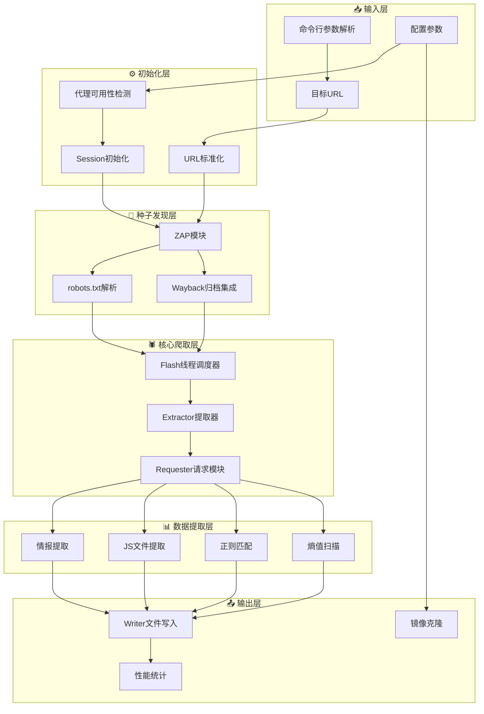

# PRD - Photon OSINT 爬虫系统产品需求文档

## 1. 文档信息

| 项目 | 内容 |
|------|------|
| 产品名称 | Photon OSINT Crawler |
| 版本 | v1.3.2 |
| 提交日期 | 2026-04-13 |
| 提交人 | Group-A |
| 文档状态 | Draft |

---

## 2. 产品概述

### 2.1 产品定位
Photon 是一款面向 **OSINT（开源情报收集）** 场景的超高速网络爬虫系统，专为安全研究人员、渗透测试人员和威胁情报分析师设计。

### 2.2 核心价值
- **多维度数据提取**：URL、情报数据（Intel）、JS端点、API密钥
- **智能爬取策略**：线程池加速、TCP连接复用、熵值去重
- **模块化架构**：插件化设计，支持 DNS 枚举、数据导出等扩展

---

## 3. 业务流程架构



---

## 4. 功能需求

### 4.1 核心功能模块

| 模块 | 功能描述 | 技术实现 |
|------|----------|----------|
| **输入解析** | 命令行参数解析与验证 | `argparse` 模块 |
| **代理管理** | 多代理配置与可用性检测 | `is_good_proxy()` |
| **URL标准化** | HTTP/HTTPS协议自动探测 | `requests` 探测 |
| **种子发现** | robots/sitemap/Wayback集成 | `core/zap.py` |
| **并发爬取** | 多线程递归爬取 | `ThreadPoolExecutor` |
| **数据提取** | 情报/JS/端点/密钥提取 | 正则匹配 + 熵值分析 |
| **结果输出** | 多格式文件写入 | `core/utils.py` |

### 4.2 数据提取类型

| 数据类型 | 说明 | 示例 |
|----------|------|------|
| `internal` | 目标域内URL | `https://target.com/page` |
| `external` | 外部链接 | 第三方域名链接 |
| `intel` | 情报数据 | 邮箱、子域名、云存储桶 |
| `scripts` | JavaScript文件 | `.js` 文件URL |
| `endpoints` | API端点 | `/api/v1/users` |
| `keys` | 高熵字符串 | API密钥、Token |
| `fuzzable` | 可测试URL | 含参数的URL |

---

## 5. 非功能需求

### 5.1 性能指标

| 指标 | 目标值 | 说明 |
|------|--------|------|
| 并发线程 | 可配置 (默认2) | `--threads` 参数 |
| 请求延迟 | 可配置 (默认0s) | `--delay` 参数 |
| 超时时间 | 可配置 (默认6s) | `--timeout` 参数 |
| TCP连接复用 | Session级别 | `requests.Session()` |

### 5.2 可靠性

- **失败重试**：失败URL记录到 `failed` 集合
- **优雅降级**：代理不可用时自动切换
- **断点续爬**：基于 `processed` 集合去重

---

## 6. 技术架构

### 6.1 核心模块依赖

```
photon.py (主入口)
    ├── core/
    │   ├── requester.py    # 网络请求
    │   ├── mirror.py       # 镜像克隆
    │   ├── flash.py        # 线程调度
    │   ├── zap.py          # 种子发现
    │   ├── utils.py        # 工具函数
    │   └── regex.py        # 正则规则
    └── plugins/
        ├── dnsdumpster.py  # DNS地图
        ├── find_subdomains.py # 子域名枚举
        └── exporter.py     # 数据导出
```

### 6.2 关键设计模式

| 模式 | 应用场景 |
|------|----------|
| **线程池模式** | `flash()` 函数实现并发爬取 |
| **单例模式** | `SESSION` 全局复用 |
| **策略模式** | 插件化扩展（DNS/导出） |
| **正则引擎** | 多模式匹配（URL/Intel/JS） |

---

## 7. 使用场景

### 7.1 典型使用案例

```bash
# 基础爬取
python photon.py -u https://example.com

# 深度爬取 + 子域名枚举
python photon.py -u https://example.com -l 3 --dns

# 使用代理 + 导出JSON
python photon.py -u https://example.com -p http://proxy:8080 --export json

# 镜像克隆
python photon.py -u https://example.com --clone
```

---

## 8. 风险与限制

| 风险 | 影响 | 缓解措施 |
|------|------|----------|
| 反爬机制 | 被封禁IP | 代理轮换、延迟控制 |
| 数据量大 | 内存占用高 | 流式处理、分批写入 |
| 法律合规 | 未授权扫描 | 仅用于授权测试 |

---

## 9. 附录

### 9.1 业务流程图文件
- 文件路径：`业务流程图.mmd`
- 格式：Mermaid 流程图

### 9.2 参考文档
- 项目地址：https://github.com/s0md3v/Photon
- Python 版本：3.2+

---

*文档结束*
